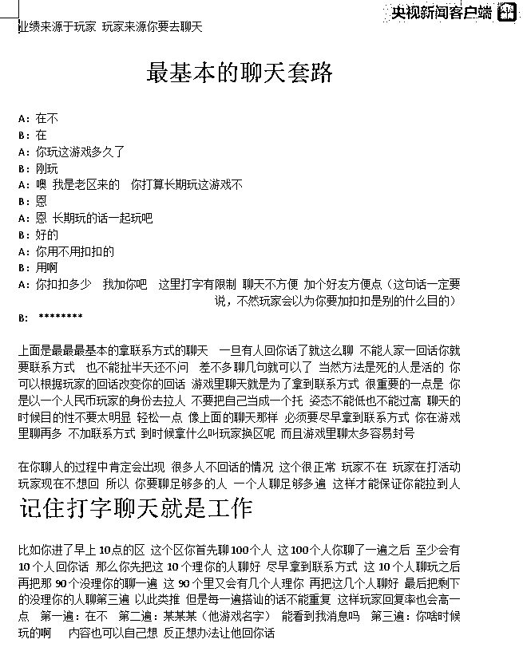

# 揭秘“游戏杀猪盘”：玩家攀比充值，诈骗平台月入百万

> 原文：[`mp.weixin.qq.com/s?__biz=MzIyMDYwMTk0Mw==&mid=2247496112&idx=1&sn=74e0769d9fedc142150348eabc5498a5&chksm=97cb3a88a0bcb39e6ab9c6fb95c47d45b45551503faf489513d1b0b5c7795ff45a66b36aafdd&scene=27#wechat_redirect`](http://mp.weixin.qq.com/s?__biz=MzIyMDYwMTk0Mw==&mid=2247496112&idx=1&sn=74e0769d9fedc142150348eabc5498a5&chksm=97cb3a88a0bcb39e6ab9c6fb95c47d45b45551503faf489513d1b0b5c7795ff45a66b36aafdd&scene=27#wechat_redirect)

**点击上方蓝色字体免费订阅“灰产圈”**

都说人生如戏，全靠演技，很多骗子上班靠的则是复制粘贴、逢场作戏。

今天我们来讲讲游戏诈骗里的一种戏精职业——**游戏推广员**，以及其背后堪称“**游戏杀猪盘**”的诈骗套路。

**小哥哥小哥哥，在吗？**

**我们一起下副本啊，加我 VX XXXXX**

**闺蜜说，有个超级有意思的游戏明天开区，陪我一起玩好嘛？**

**想在网上真心找个男友，在游戏里结婚，慢慢走到现实。**

**……**

这些看似来自“青春年轻女性”的留言，也许不少游戏玩家都收到过。

然而这些让人蠢蠢欲动的话术，并没有这么简单。

抠脚大汉在社交平台里冒充卖茶女、创业独立女性、美女支教老师等等，属于直接骗钱的套路。

如今在我们平常玩游戏的时候，也有可能遇上抠脚大汉扮演的网恋骗局。

**这些团伙在业内被称为“游戏推广员”，也就是网络诈骗手法更加狡猾的“托”。**

**戏精推广员的业绩：****让受骗玩家充值**

根据媒体报道，这些公司化运营的黑产团伙在招聘员工时，是这样写的：

> **手机游戏推广员，年薪 15 万，学历只需中专以上，会电脑基本操作即可，工作内容是：****接待客户。**

当然没有这么简单。

在这些黑产眼里，一个能够达到业绩的推广员，**需要出没在各种网络游戏、游戏论坛、游戏贴吧等玩家聚集的社交平台里，再以预设的身份“交朋友”，在与玩家成为“好友”后，慢慢引导玩家进入指定的游戏进行消费**。

在一些男性玩家为主的游戏里，推广员从加好友开始，就会**使用年轻女性的头像，伪造出“女玩家”的角色**。

没法想象一个个**抠脚大汉**在社交网络里，用软萌妹子的口吻撒娇、生气、聊天？

不要太惊讶，**每一个骗子的电脑里，都会有多个装满聊天诈骗话术的文件夹，只需要根据相应的步骤和情节，复制粘贴，点击发送即可**。

推广员往往会把有意向的玩家拉到公会，公会里还会有带队玩家。

这个带队玩家属于“**虚假陪练**”，是让受骗者氪金充钱的关键之一。无论受骗玩家充值多少钱，带队玩家都会让游戏公司为其充值与之相当的金额。

带队玩家还会与推广员配合，**充分调动、利用玩家的攀比心理**，让受骗玩家可以持续不断地充值。

其中**游戏内结婚、冲榜、做活动、刷副本**等，都是推广员冒充的“女玩家”让受骗玩家充钱的伎俩。

而由推广员冒充的“女玩家”，还会在社交媒体上与受骗玩家保持“暧昧”、“网恋”的关系。

这个鲜活的“女玩家”人设，随着时间深入，还会通过“**确定关系、闹别扭、戴绿帽、线下见面**”等手段，让玩家在游戏中不断充值。

毕竟“恋爱”中的玩家往往智商为零，很容易被这些手握好几 GB 恋爱话术的“戏精推广员”，玩弄于鼓掌之间。

**公司化运营，分工明确**

从去年开始，警方已经破获了多起男性员工冒充女性，利用网上交友婚恋的方式，诱导玩家去游戏平台进行消费的案件。

2019 年 4 月，广州、阳江警方调动近 800 名警力，抓获了 202 名涉案人员，涉案金额 1000 多万元。

上海警方破获网络交友诈骗案现场 

2019 年 8 月，上海警方破获一起新型的特大网络交友诈骗案。200 多名涉案人员，在社交软件上伪装成女性身份与他人聊天，通过话术拉人玩网络游戏和充值，再从游戏平台收取回扣，从而实现每月牟利近百万元。

据鹅师傅了解，这些公司化运营的犯罪团伙，主要是 80、90 后。

这些游戏推广人员分工明确，所组成的公会有**组长、团长、初级推广员**三层结构。

图表来自游戏新知

初级推广员负责在各个渠道找玩家，其中不仅包括各类社交平台，还会在同类竞品游戏中拉人。

推广员把人拉到聊天群里后，由团长负责跟这些玩家聊天、陪玩，但最终的目的依然是：引导他们在游戏里氪金充值，买买买。

其中让推广员冒充“女玩家”陪充陪玩，就是这些团伙盈利的主要方式。

随着推广员在竞品游戏中拉人的伎俩，被竞品游戏运营者发现，他们就**开始将拉人的目光投向网上婚恋交友平台**。

**法律分析**

在今年的同类案件中，警方以诈骗罪的名义对这类新型网络犯罪进行了打击：

根据《刑法》第 226 条：

**诈骗罪：**

**数额巨大或者有其他严重情节的，处三年以上十年以下有期徒刑，并处罚金；数额特别巨大或者有其他特别严重情节的，处十年以上有期徒刑或者无期徒刑，并处罚金或者没收财产。**

对于大多数而言，玩游戏就是为了在业余时间开心一下，放松心情，最好能交几个队友一起战斗。

鹅师傅想说的是，即使是在虚拟的游戏世界里，也需要保持警惕，提防五花八门的骗局，更不要轻易相信陌生人的“花言巧语”。

参考资料：1.《“游戏推广员”自曝：像个“演员”，要靠诱骗“网恋”冲业绩》，长沙电视台政法频道，2018-07-182.《游戏推广遭查处，法律专业人士：新型网络诈骗，应予以积极打击》，游戏干线，2019-04-29

3.《美女拉你玩充值游戏？都是“抠脚大汉”！——上海警方起底 200 多人交友诈骗团伙》，央视新闻，2019–08-18

4.作者：守护者计划

← 向右滑动与灰产圈互动交流 →

**阅读原文加入灰产圈高端社群**