# 19 岁女大学生在微博公开写“卖淫日记”，那些用肉体换钱的女生...

> 原文：[`mp.weixin.qq.com/s?__biz=MzIyMDYwMTk0Mw==&mid=2247496071&idx=1&sn=c0571127e2d467ec5d9cd9baa5bb2fab&chksm=97cb3abfa0bcb3a9d4c7a3719e305adaca28a2ff1861a0a567e11e6c7a3c7a5ad05aae61958f&scene=27#wechat_redirect`](http://mp.weixin.qq.com/s?__biz=MzIyMDYwMTk0Mw==&mid=2247496071&idx=1&sn=c0571127e2d467ec5d9cd9baa5bb2fab&chksm=97cb3abfa0bcb3a9d4c7a3719e305adaca28a2ff1861a0a567e11e6c7a3c7a5ad05aae61958f&scene=27#wechat_redirect)

**点击上方蓝色字体免费订阅“灰产圈”**

01

前不久，有网友曝光了一个用户名为@-YiYii-的微博帐号，竟然每天在自己微博写自己的“卖淫日记”！从微博内容上来看，这位“-YiYii-”似乎还是一名年纪尚小的在校大学生。然而，和一般会在微博上分享自己日常生活的学生群体不同，“-YiYii-”似乎把微博当成了自己的“日记本”。而她每次记录的，竟然是自己卖淫的全过程。有晒“嫖客”给自己的转账记录的：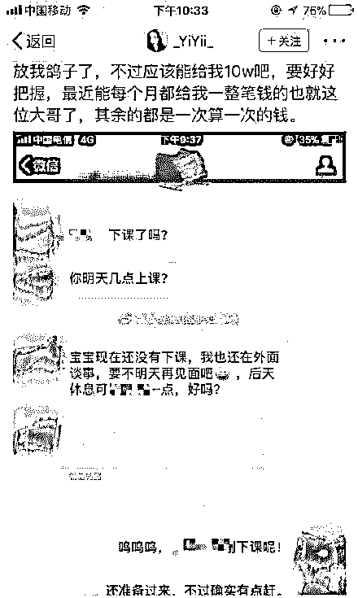有抱怨自己太累，但是“看在他给我那么多钱的份上忍一忍吧”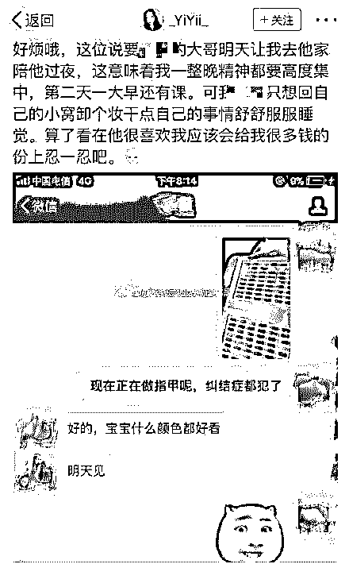当然少不了各种吐槽“嫖客”行为举止的：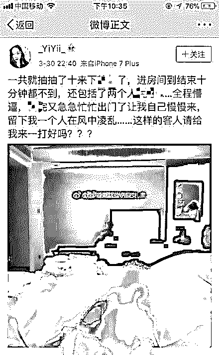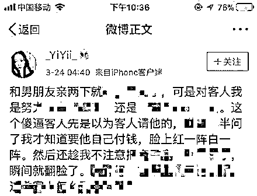除了详细记录自己的卖淫细节之外，从“-YiYii-”的微博内容中也不难看出，她还是一名在校大学生……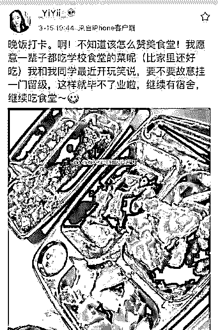
由于大家众所周知的原因，“-YiYii-”的微博帐号已被新浪封禁，但是这可难不倒有才的网友们。他们“顺藤摸瓜”，从她的微博关注列表中，又挖掘了一大批和“-YiYii-”年龄相仿、性质相同，同样在微博上记录自己卖淫过程的女孩们。由于“从业人员”实在太多，这些女孩甚至形成了一个固定的“X 圈”……真心细思极恐啊！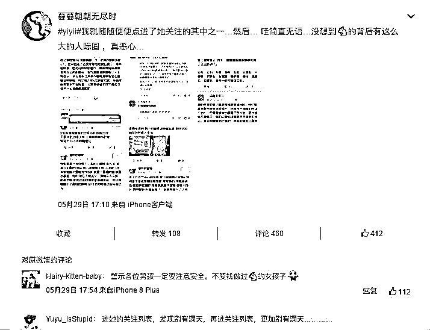“饥渴”的网友甚至还跑错了会场，误伤了和“-YiYii-”微博名相仿的普通用户……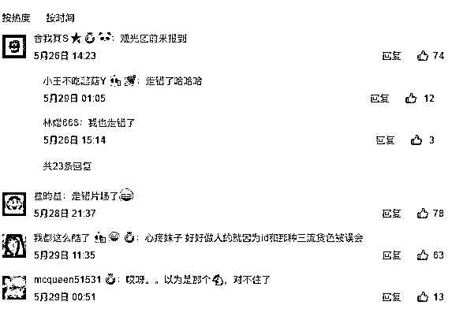看完这些微博，不知道你们内心作何感想，反正我是觉得：且不说“-YiYii-”的卖淫行为本身就已经违法，单说她微博字里行间所表现出的**“理直气壮”和“毫不顾忌”**，就让我心底一凉。**在她们眼中，出卖身体赚钱是“有本事”。****纸醉金迷的背后，她们早已将人生迷失。**事情发酵后，@-YiYii-等用户被微博官方封了号。但可以肯定的是，她绝不是“以卖为荣”的最后一个。

02

有些女生在随机“接客”，而有些女生选择被人“包养”。根据近年来媒体曝光的包养案例来看，大学女生选择被包养的例子早已见怪不怪了。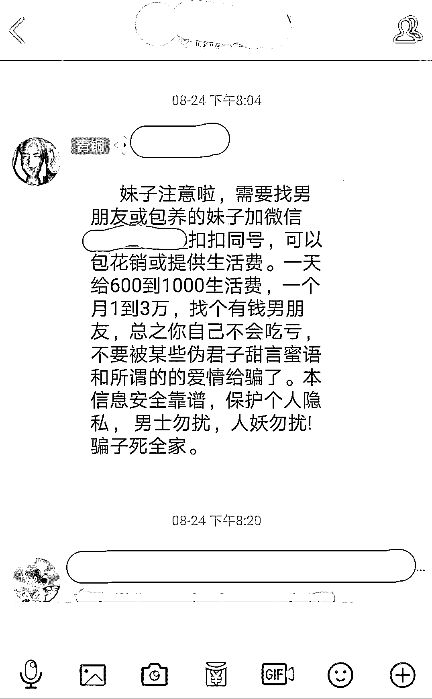**某高校群内的“包养”信息**前几天在知乎上看到一个女生分享自己如何从一个好学生变成自己最讨厌的“包养女”的故事：“我父母都是农村人，每个月给我的生活费少得可怜，都不到室友的一半。可我生性好强，不想比别人差。”人一旦觉得心虚，在描述这件事情的时候，第一时间就会开始为自己辩白。聊天中我甚至都能感受到她的纠结，不忍将自己的堕落怪罪到原生家庭上，又实在没办法扯下这块遮羞布，承认自己的欲望。苦衷谁都有，可选择永远不只有一个。一个人要走什么样的路，最终还是要看自己。
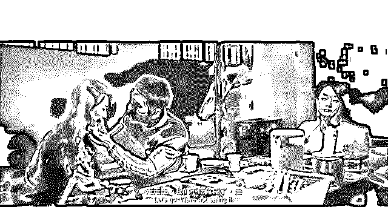大二那年她跑去找兼职，一天 80 块钱，辛辛苦苦劳动一天，当晚一秒钟花掉还要倒贴。看着同伴随便跟父母撒个娇，一件件奢侈品就到了手，她羡慕、她也想要。其实她能理解父母的难处。但正因为这种理解和自身欲望的冲突，她选择了走捷径。那个大叔找到她的时候，她的心情复杂难以言说，但是她去了。**“短短一个小时，我就拿到了我一个月的生活费。”**  一方面她享受着金钱带来的质感生活，一方面她又意识到自己的价值观开始变得扭曲。但前者占了上风，她觉得，被包养也是一种很不错的选择，小三也是一种正当行业。**“我有钱，就可以买我想买的东西，不用考虑不用心疼，也不用缩衣节食辛辛苦苦省钱。”**

03

经济学理论认为，人是有着自利动机的理性人，都会努力用最小的成本去获取最大的收益。每个阶层、每个群体都不例外。所以，有的人选择做投资股票，有人选择去豪赌，有人选择被包养，也同样是一种选择。女生选择了这场包养交易，女生用自己的身体转化为经济价值，乍一看，付出的成本小，收获大，貌似是女生赚到了，但其实不然。包养是性价比最低、风险最大的理财产品，比那些跑路的 P2P 可怕多了。不仅血本无归，老男人许诺的都是屁话，还要赔进去尊严、名声、身体、技能、青春。这是一个人与人之间无法互相理解的时代。一群人不了解另一群人，正如同去年曾经沸沸扬扬的“裸条”泄露事件，不少人表示很惊讶，怎么会有人去“裸贷”？然而，裸贷的确发生了。而包养也的确存在，在你的身边，或许就有人正在进行长期的身体和金钱的交换。**而她们为之付出的代价，将是心里一辈子洗不去的污点。**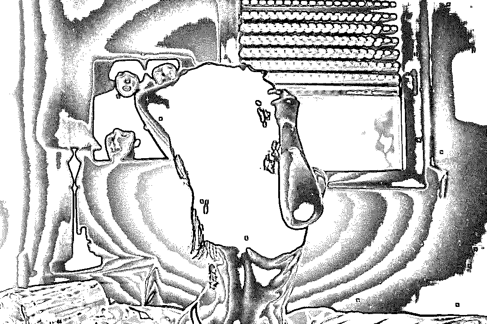

04

在这个笑贫不笑娼的年代，肯定有人会说：**这有什么？无非就是一个图鲜嫩好看，一个图钱图吃饱，互取所需，一场交易而已，不用太认真。**和穷小子谈恋爱也是谈，和有钱人谈恋爱也是谈，和穷小子谈恋爱伤心伤身，和有钱人谈恋爱不伤心只伤身。这笔买卖合得来。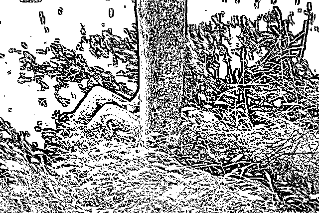
恩格斯在《家庭、私有制和国家的起源》里说：“妻子和普通娼妓的不同之处，只在于她不是像雇佣女工做计件工作那样出租自己的身体，而是把身体一次永远出卖为奴隶。”  想想有一点点道理，好像这两种人，真的没有本质上的区别。所以很多女孩子的价值观变成了这样，她们能为了唾手可得的大量物质与金钱，毫不犹豫地脱掉自己的底裤。

但是，她们有考虑过这其中的成本和后果吗？

最好的年华享有了本不该有的东西，却妄图继续以人生为标的物在未来进行赌注，承受了不该有的风险，却没有任何保险来买单。

**女人，如果不能抗拒这些诱惑，注定是悲哀的一生。**

**人的一生很长，她那时候还太年轻，不知道所有命运赠送的礼物，早已在暗中标好了价格。**

**老天永远都是公平的，当你拥有一样东西的时候就会失去一样，甚至有时候会失去更多。**

作者：于成

来源：于成文摘

← 向右滑动与灰产圈互动交流 →

**阅读原文加入灰产圈高端社群**