# 菠菜很猖狂，中国很生气，后果很严重！

> 原文：[`mp.weixin.qq.com/s?__biz=MzIyMDYwMTk0Mw==&mid=2247496050&idx=1&sn=18a442d37695ab78a4f8df6813b6c7a4&chksm=97cb3a4aa0bcb35cf982d34028c1ad1eb74d0ce0f5a0c9cd6954ad2ff84f891f76a79a31e45b&scene=27#wechat_redirect`](http://mp.weixin.qq.com/s?__biz=MzIyMDYwMTk0Mw==&mid=2247496050&idx=1&sn=18a442d37695ab78a4f8df6813b6c7a4&chksm=97cb3a4aa0bcb35cf982d34028c1ad1eb74d0ce0f5a0c9cd6954ad2ff84f891f76a79a31e45b&scene=27#wechat_redirect)

**点击上方蓝色字体免费订阅“灰产圈”**

前几天灰产圈发布文章《[“牌照”停发了？“网赌”凉凉了？](http://mp.weixin.qq.com/s?__biz=MzIyMDYwMTk0Mw==&mid=2247496026&idx=1&sn=0f6f8c2605fc234e262cb3203eb65d6b&chksm=97cb3a62a0bcb3747c819103633976e430ccae017eb58c1133d53852a12ea6a964eb20023d2e&scene=21#wechat_redirect)》，柬埔寨首相

 洪森 18 日签发了通告，即日起停止颁发各种形式的“网络赌博”（Internet Online）牌照。
政令发出后顿时掀起了轩然大波，西港能不能呆，柬埔寨能不能呆？恐慌、疑惑、焦虑的情绪迅速传染。

一波未平，一波又起。

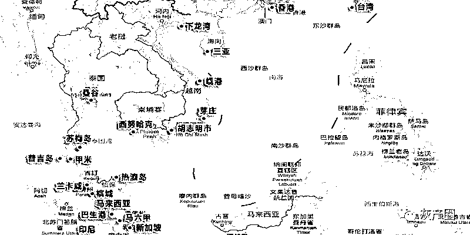

近期柬埔寨及东南亚各国菠菜行业地动山摇来形容不为过。

以往的行动都是抓了一些然后又恢复平静，而这次无论是柬埔寨还是其他一些东南亚国家，貌似都动了真格了。

一波未平，一波又起。

今天不是越南抓人，就是缅甸抓人，明天可能柬埔寨抓，也可能菲律宾抓，想大本营迁到其他国家，又觉得哪里都不安全。

目前，搞的人心惶惶，菜也种的不安心，自己觉得做坏事的人，也都纷纷逃离。

据了解，最近一段时间来，大量同胞在金边中国大使馆办理旅行证！准备回国，每天人都非常多。

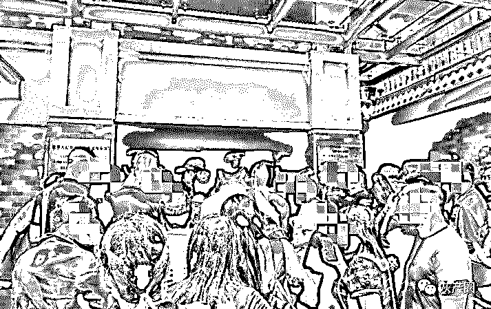

中国高层刚到西港第二天便抓了 127 人，其他小大小闹也抓了好几波。

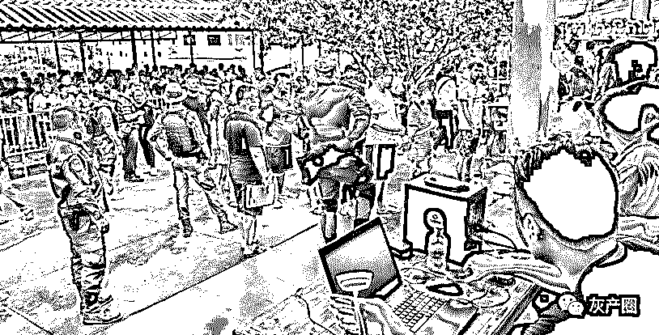

西港 127 名中国人被抓捕

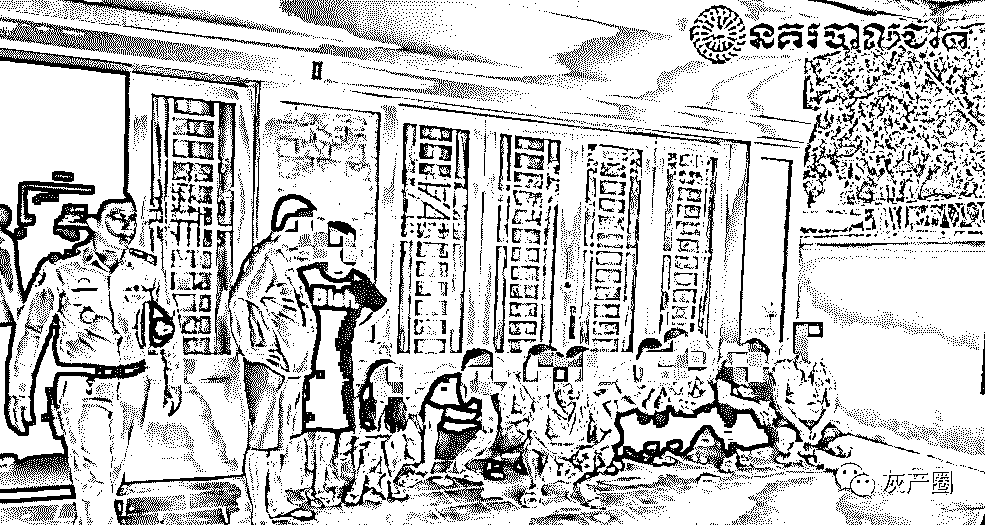

**8 月 15 日金边逮捕了 11 名涉嫌电信诈骗的中国人**

相比于西港、波贝一向风平浪静的木牌，昨天木牌也慌了。 

21 日上午，移民总局副总监高万通亲自带队，突查柴桢省巴域市一处大楼。

据了解当天上午，木牌步行街附近有多辆警车和大巴车集结，并从一大楼内陆续带出几波人，低着头被押上了大巴和警车。

据了解，此次行动是为柬中警方联合行动，总共抓走 365 名中国人，1 名越南人，其中 27 名是外逃通缉犯。 

27 名通缉犯昨晚已被送至金边，扣留在移民总局。

其余 339 名中国人和越南人将被扣留 7 天，等待相关负责人出示相关合法文件。

有人表示，木牌至少也有小几万，此次以检查劳工证的名义进行突击检查是下马威，杀鸡儆猴。

**柬埔寨的形式严峻，东南亚其他国家的形势也不容乐观。** 

缅甸

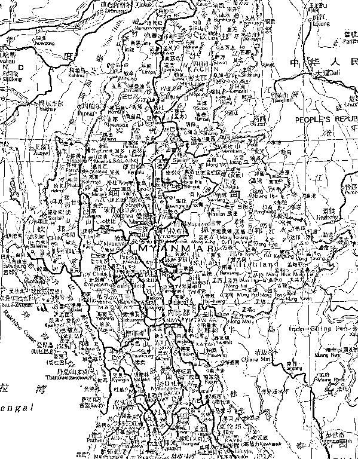

8 月 16 日晚上 10 时许至次日凌晨，缅甸佤邦司法委警察局及相关部门在勐冒县永冷区端掉一个电信诈骗窝点。

抓获电信诈骗嫌疑人 157 人及作案工具等，除了 4 名为佤邦当地人之外，其他 153 人均为中国籍。

8 月 21 日，在边境口岸，缅甸佤邦警方将中国籍电信诈骗嫌疑人移交给中国警方带回。

****8 月 1 日****中国警方与缅甸警方前往小勐腊地区成功捣毁 4 个犯罪窝点，抓获涉嫌诈骗的犯罪嫌疑人 17 人。

**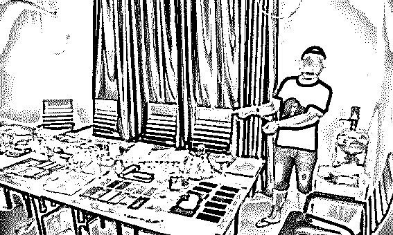**

**越南**

****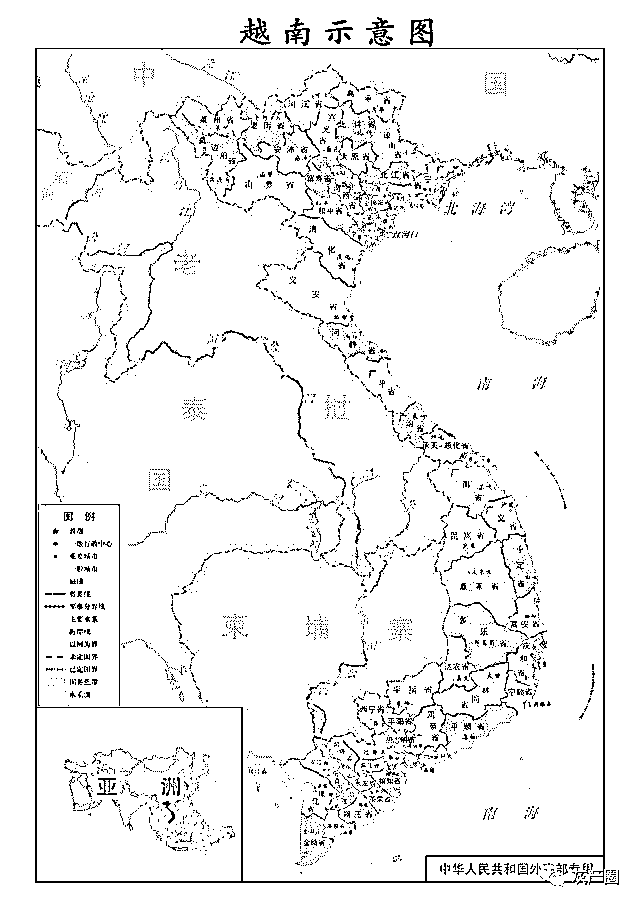****

******7 月 29 日**，越南警方就向中国警方移交了超过 380 名嫌疑犯，涉案金额高达 30 亿。****

****这起案件被认为是有史以来规模最大的案件，涉及在越南领土上违法的外国人数量也最多。****

****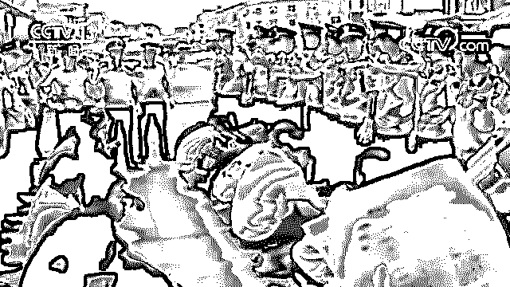****

******8 月 9 号，**中国警方从越南押解回的 7 名电信诈骗嫌疑人回国审判。****

****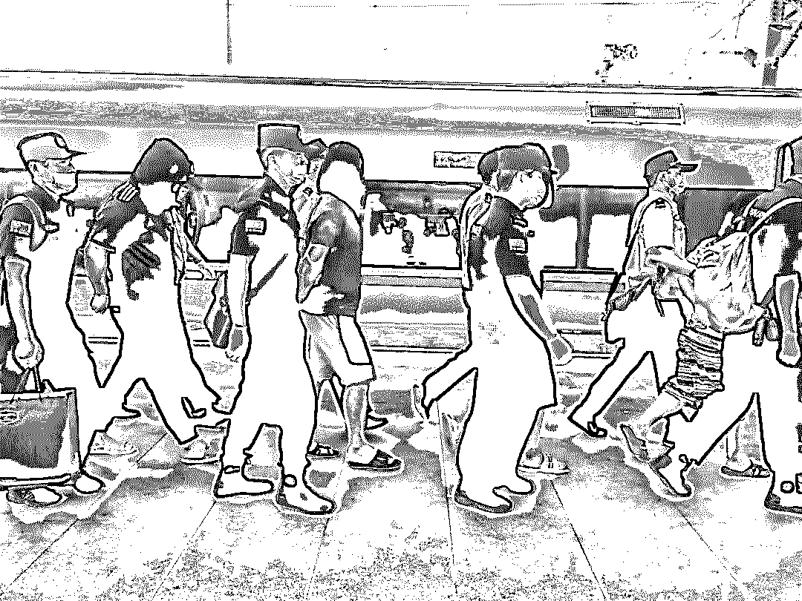****

******8 月 16 日**，越南遣回近日在胡志明市抓获 11 名跨国网络诈骗嫌疑人。****

****菲律宾****

********

****菲律宾娱乐博彩公司（PAGCOR）最近已停止为新的网络博彩公司（POGO）发放赌牌。**** 

****8 月 20 日，中国外交部发言人耿爽在北京举行的新闻发布会上敦促菲律宾禁止一切形式的网络赌博。****

****耿爽说：“我们也注意到菲律宾政府的宣布，并对此表示赞赏。我们希望菲律宾能进一步全面取缔网络赌博。”****

****他还表示，**希望菲方能进一步加强与中方的执法合作，共同打击包括网络赌博和网络欺诈在内的犯罪活动**。****

****菲律宾的情况比柬埔寨更严重，近期中方是否也会对菲律宾进行大行动，还未知，但从目前的态势来看，可能性也是极大的。****

****菲律宾的菠菜不打压，也真没有天理。****

********

******8 月 8 日中国驻菲律宾大使馆 8 日发表声明**，敦促菲律宾政府有关部门切实加强同中方的执法合作，共同打击各类涉及中国公民的涉赌犯罪活动，切实保护中国公民合法权益。****

****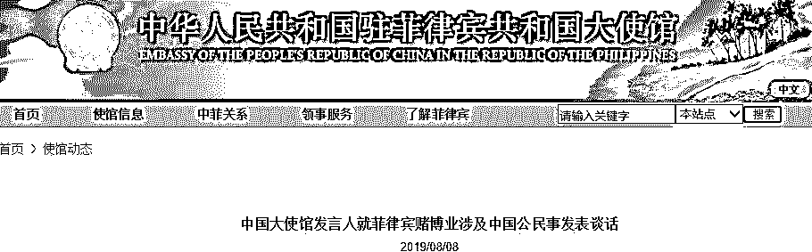****

******老挝******

******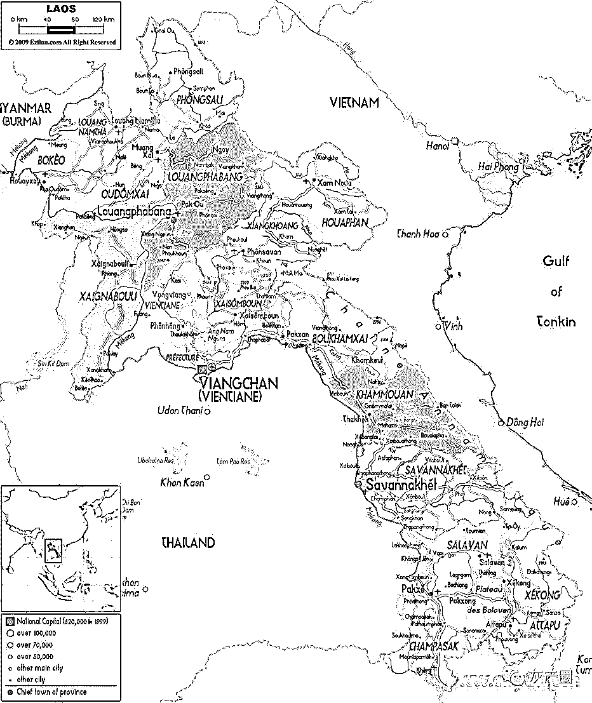******

******8 月 6 日，公安部部长赵克志在京与老挝公安部部长威莱举行会谈中提到，要进一步**深化在维护国家安全和打击电信诈骗、网络赌博等跨国犯罪及禁毒**、执法能力建设等方面的合作。******

****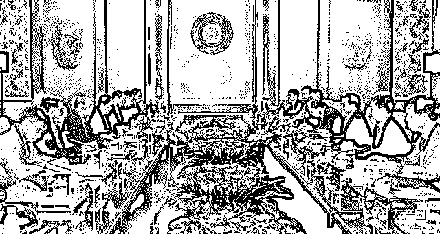****

****从目前的行动看，东南亚的抓捕工作，最多也还只是算拔了几根毛，虽造成了一定程度的恐慌，但想进一步抓捕还需要等待时机，也并不那么容易。****

****国外的抓捕工作，受到多方势力的干扰，一直都是困难重重，对中国方面也是个严峻的考验。****

******中国大使馆******

******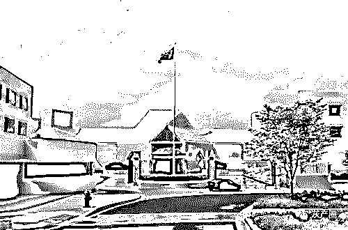******

******8 月 8 日，中国大使馆发言人就菲律宾赌博业涉及中国公民事发表谈话，强烈敦促菲政府切实保障在菲中国公民的基本合法权利。******

******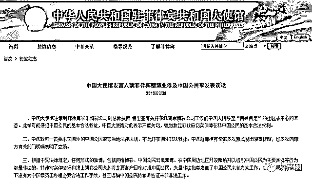******

********来源：中国驻菲大使馆官网********

****中国驻菲大使馆发言人表示，中国大使馆注意到菲律宾娱乐博彩公司副总裁扶西·特里亚有关将在菲离岸博彩公司工作的中国人转移至“自给自足”的社区或中心的表态。此举可能侵犯中国公民的基本合法权益，中国大使馆对此表示严重关切，强烈敦促菲政府切实保障在菲中国公民的基本合法权利。****

****中国驻菲大使馆发言人称，中国政府一贯要求在国外的中国公民遵守当地法律法规，不允许在国外非法就业。中国驻菲律宾使馆多次就此发出领事提醒，也多次向菲方有关部门明确表明了立场。****

****中国驻菲大使馆发言人指出，根据中国法律规定，任何形式的赌博，包括网络博彩、中国公民出境赌博、在中国周边地区开设赌场并以吸引中国公民为主要客源等行为都是非法的。菲律宾实体赌场和线上博彩公司大多将主要客户目标对准中国公民，大量非法招募雇佣了中国公民来菲为其工作，菲方公司多数情况下没有为中国籍员工办理必要合法工作手续，甚至诱骗中国公民持旅游签证来菲非法工作。****

****中国驻菲大使馆发言人表示，菲律宾实体赌场和线上博彩公司对中方造成了如下严重不利影响：****

****一是菲实体赌场和线上博彩公司使大量资金流出中国，非法流入菲律宾，涉及通过“地下钱庄”跨境洗钱等一系列犯罪，对中国金融监管和金融安全造成负面影响。据保守估计，每年因此非法流入菲律宾的中国资金数以亿人民币计。有关分析人员认为，部分非法涉赌博资金已被用于购买菲当地房地产和进行其他投资。****

****二是大量中国公民被菲线上博彩公司诱惑参与非法赌博，在中国国内引发了大量违法犯罪案件，特别是一些赌博犯罪和电信诈骗相勾连，给当事人自身及其家庭带来巨大伤害，导致一系列社会问题。****

****三是许多中国公民被菲线上博彩公司或实体赌场雇佣在菲非法工作，其中一些人的人身自由受到极大限制，被媒体形容为“现代奴隶”。他们的护照被菲方雇主没收，被强迫在固定地方居住，一些人还遭到勒索，甚至体罚和虐待。同时，还发生了数十起绑架在菲参赌和在菲赌场非法工作的中国公民案件，一些中国公民甚至被造成伤残乃至被杀害。****

****中国驻菲大使馆发言人指出，中国政府高度重视打击整治跨境赌博违反犯罪活动。中国公安部已多次做出部署，将持续深入开展“断链”专项行动，严厉防范打击跨境网络赌博活动。中方将集中侦办一批组织出境赌博、利用互联网开设赌场等大案要案，摧毁一批境外赌场在中国国内揽客招赌和利用网络开设赌场的犯罪组织网络，打击一批为跨境网络赌博等犯罪提供资金结算的“地下钱庄”和网络支付平台，打掉一批为跨境网络赌博犯罪提供技术支撑的国内网络运营商及公司。****

****中国驻菲大使馆发言人还称，中国最高人民法院、最高人民检察院联合发布的《关于办理网络赌博犯罪案件适用法律若干问题的司法解释》明确规定，中国公民在周边国家聚众赌博、开设赌场并以吸引中国公民为主要客源，构成赌博罪的，可以依照刑法规定追究刑事责任。中国大使馆郑重警告在菲有关中国企业或个人立即停止有关违法犯罪行为，否则中国政府将依法严惩不贷。****

****中国驻菲大使馆发言人强调，中国政府希望和敦促菲律宾政府有关部门高度重视中方关切，采取切实有效措施，取缔和处罚相关赌博公司非法雇佣中国公民的行为，打击针对中国公民的犯罪活动。中方同时敦促菲方切实加强同中方有关执法合作，共同打击洗钱、非法雇佣、绑架、勒索、伤害和谋杀等涉赌犯罪活动，切实保护中国公民的合法权益，共同维护中菲友好与合作。****

****结尾****

********

****无论是东南亚“杀猪盘”还是“爱情陷阱”，博彩让多少国人家财散尽，妻离子散，举个例子：   金立宣布破产，原因就是董事长刘立荣参与豪赌输掉百亿，一个民族品牌就此终结！****

****最后，借用澳门赌王何鸿燊的书名结尾：**不赌就是赢！******

****更多推荐********[“牌照”停发了？“网赌”凉凉了？](https://mp.weixin.qq.com/s?__biz=MzIyMDYwMTk0Mw==&mid=2247496026&idx=1&sn=0f6f8c2605fc234e262cb3203eb65d6b&chksm=97cb3a62a0bcb3747c819103633976e430ccae017eb58c1133d53852a12ea6a964eb20023d2e&scene=21#wechat_redirect)[她沦陷于甜言蜜语，被骗到柬埔寨当“毒骡”](https://mp.weixin.qq.com/s?__biz=MzIyMDYwMTk0Mw==&mid=2247496016&idx=2&sn=28407ffbd8c0168698358f2535c1eea9&chksm=97cb3a68a0bcb37e9868cb1a31ea9211a47ae6dc7e010d986b739139527d7ff159fb41cf766c&scene=21#wechat_redirect)[一个视频让你看懂世界杯网络赌球的黑色产业链](https://mp.weixin.qq.com/s?__biz=MzIyMDYwMTk0Mw==&mid=2247496016&idx=3&sn=beab5b938f341d7506064f76fa12b51b&chksm=97cb3a68a0bcb37e11d9d10aaa40cf2fabe4ade12b283fb7b7b41e66fa534f64c9cd185c8a01&scene=21#wechat_redirect)[你的收款码正在沦为黑产洗钱的工具！“赚呗”跑分平台 103 人被抓！](https://mp.weixin.qq.com/s?__biz=MzIyMDYwMTk0Mw==&mid=2247495989&idx=1&sn=fc6ea5d4b5d2fa8ac76a281a8dde166e&chksm=97cb3a0da0bcb31bd7fc7db722b9f6f3ead98251ffbc017d3725195581326adf68b986c94950&scene=21#wechat_redirect)

← 向右滑动与灰产圈互动交流 →

**阅读原文加入灰产圈高端社群******