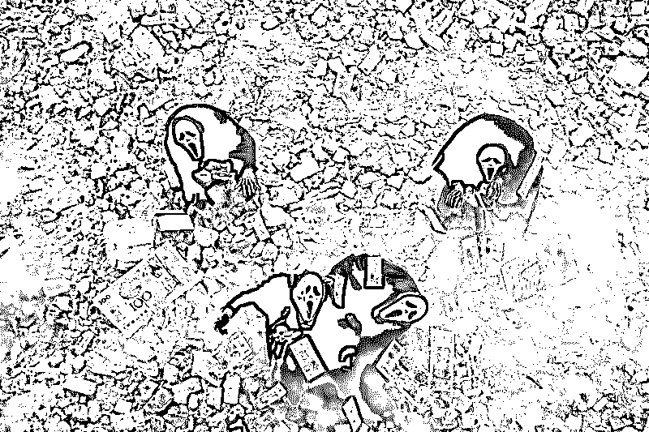
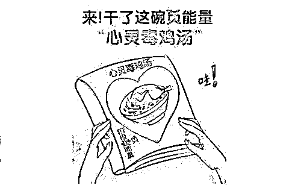
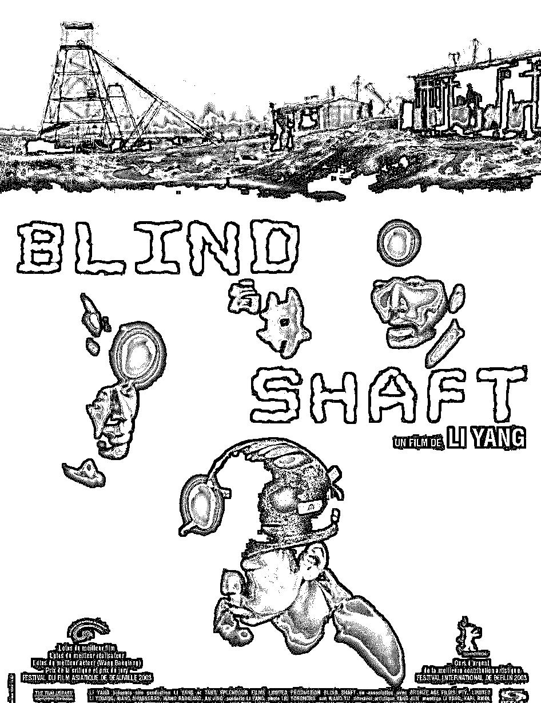
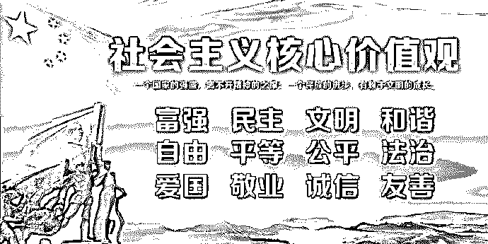
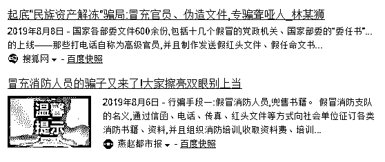
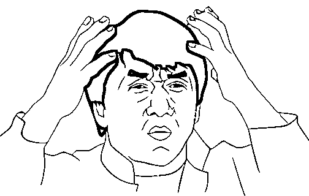
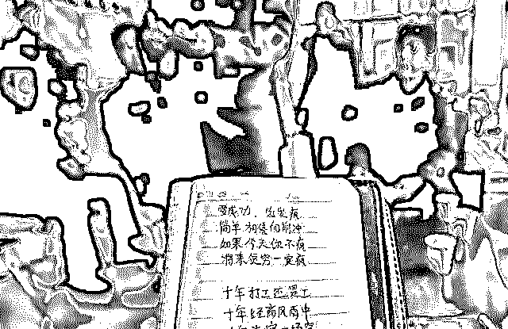

# 羞耻感丧失、价值观混乱、礼崩乐坏...传销贼到底有多渣滓？

> 原文：[`mp.weixin.qq.com/s?__biz=MzIyMDYwMTk0Mw==&mid=2247496040&idx=1&sn=5fbf86085e03622cb473d889dc6ae8ec&chksm=97cb3a50a0bcb346dccf3118f6591c1adf3557eb2658022915ec5cc157c2c565d29dafc1750c&scene=27#wechat_redirect`](http://mp.weixin.qq.com/s?__biz=MzIyMDYwMTk0Mw==&mid=2247496040&idx=1&sn=5fbf86085e03622cb473d889dc6ae8ec&chksm=97cb3a50a0bcb346dccf3118f6591c1adf3557eb2658022915ec5cc157c2c565d29dafc1750c&scene=27#wechat_redirect)

**点击上方蓝色字体免费订阅“灰产圈”**

“羞耻感丧失，价值观混乱、潜规则横行”这是当今社会不容忽视的一个层面。具体点来说，它就是传销诈骗横行现象最好的社会土壤！为什么这么说呢？先来一点点分析！

****************

现在社会里很多人都有不劳而获的想法。比方说去泰国旅游，国人去泰国做什么的多？告诉你，到烟花柳巷的最多，到那嫖娼有不少；还有到那直接去买补药的，说什么泰国补药好使；还有进赌场赌博的...都是想不劳而获！

这是个什么概念呢？进赌场是不想付出劳动，就直接获得金钱；买补药是不想付出锻炼的代价，直接获得健康；嫖娼是什么？不想感情付出直接获得性的满足。总想隔着锅台上炕，国人基因里有不劳而获的想法的人非常多，这个必须得承认！

传销到底是什么？花点钱进去，再拉几个人头，凭着人头一夜暴富。一下子上升几星了，上升经理老总后就挣钱了...

首先说的是，现在社会中存在不劳而获的思想特别严重！总想着一夜富起来，包括网络上想当网红的、上电视想当明星的、那些彩票难民、那些直销难民。都梦想着突然就发财了、暴富了，就成为社会精英了...

这种现象在当今社会，在改革开放后，由于物质欲望的刺激，贫富差距的悬殊拉大。这种想法的人越来越多，这就是第一个社会土壤。

现在社会由于贫富差距拉大后，很多人成了社会竞争当中的失意者被淘汰掉。这些人特别渴望翻身，像传销早期的时候有那些人群，他们是大学毕业生、转业兵(复员军人)、个体商户、农民工等。

比如：很多农民工到城里来一看，眼花缭乱的世界跟我原来不一样。于是心浮气躁了起来，就想着我得当人上人，农村那生活不想再回去了，太没有意思了。（本文转自防骗大数据：FPData）

然而，这些人迫切改变自己命运，却又缺乏一技之长。比如说大学生和复原军人，在大学里头怀揣壮志，在部队里头认为自己已经历过军队磨练。人家都说“当了兵一辈子后悔，不当兵后悔一辈子”都军人了都千锤百炼了！

真走向社会发现，基本上没什么技能...那怎么办呢？他还觉得比平常人多锻炼了，是名军人高人一头，受过高等教育岂是你们这些凡夫俗子可相比？他们特别渴望迅速的获得荣耀获得金钱。所以转业兵、大学生、个体商户干小买卖干的这个费劲吶，人家大老板怎么整的？看来是没找对路子！

翻阅成功学的书，马云说什么了什么了...有人说马云说：哪有功夫跟你们这些，思想落后的人说话呀，我有功夫我还得挣钱呢。在这个时代，马云讲改变观念是最难的。一看传销！这不就马云说的改变观念吗？他把它用这了！所以这些人就是传销非常扎实的土壤！

现在又多了新的一种人，他们是高智商的，有金融理财知识的这些人。他发现传销里这东西，往往就是跟理财上本质的东西特别接近，而且它又比那个快，更容易糊弄二傻子。所以又有这些人参与进来，形成了传销庞大的一个社会基础。

羞耻感丧失、价值观混乱，毋庸讳言。改革开放之后，很多人比过去不要脸了！比方说一个小县城，小的时候感觉周围的人很实在、很淳朴，人比较厚道实诚。可是这些年越来越感到，越是县城包括农村，这个礼崩乐坏的素质越快！他们学了大城市很多乌七八糟的东西，却把原来该有的东西丢掉了！

他们得到了一些短暂的物质实惠，却把长久的忠厚传家久诗书济世长的传统丢得一干二净！罗大佑《鹿港小镇》唱的非常好：“家乡人们得到他们想要的，却失去他们拥有的...”（本文转自防骗大数据：FPData）

二十一世纪初期，很多农村、很多县城大面积存在礼崩乐坏。人们变的比过去缺德多了！他不觉得为了点利益我坑你是个耻辱。

传销里面有很多人明白这个事实。很多人拉了自己的亲戚、自己的朋友进去，根本不管坑不坑他拉的人，坑完他钱是我的了。我又没从他兜硬掏，他愿意拿出来，反正是他给组织了，组织给我回扣了，我也不直接从他兜骗钱...

很多人就觉得没有啥负罪感，这种缺德的事很多人觉得无所谓，只要我挣着钱就行了，其他的我管那个呢？能来钱就行！

所以现在，大家想一想，很多人把这个事归结到贫穷。那再贫穷能贫穷出缺德来，我们穷多少年了？怎么没见过这么缺德的事呢！

就像云南的某个村子，整个村子都干盲井式的犯罪。把盲聋哑痴呆傻的人，说他是他们的亲戚，是哥哥、舅舅，骗到矿井底下杀死，然后直接找矿主索赔要钱，王宝强当年出演的《盲井》就是在说这样的事。

有的人说这都是贫穷造成的，可是，穷了那么多年，过去那么穷，怎么没听说过有这个事？

市场开放之后，贫富差距拉大了，人的心态也变得大大的坏！很多人心理不平衡了，所以说羞耻感丧失、价值观混乱，不以为耻反以为荣！很多人现在坑身边人钱，坑完了心安理得，“谁让你傻了？我骗你你活该！”

就说我们那些非常淳朴的，在道德上受到约束的，现在已经绝迹了！不是有句老话嘛：“淳朴是建立在没有任何利益的情况下。”所以这方面是非常严重的社会现象！好好想想其中缘故，一定深受感触！你身边是否有这样道德水平的人？（本文转自防骗大数据：FPData）

为什么我们现在社会大力提倡二十四个字社会主义核心价值观呢？你记住提倡什么，恰恰严重缺失的就是什么！

所以羞耻感丧失、价值观混乱是传销存在的重要社会土壤！当他坑你也不认为坑你了，先圈到钱再说！所以传销屡禁不绝和这种心理。贫富拉大之后的这种羞耻感丧失价值观混乱是有关的！

潜规则横行又是什么？你有没发现很多传销团伙洗脑过程当中，经常把他的理念简单的简化成了一些口号。然后这个口号反复教你、让你念、让你跟他学。这就是模拟的一种政治形态，就如文化革命时，无论什么玩意都变成了口号，一个口号打遍天下！

变成口号有什么好处？便于你简单容易记住，容易记住就容易洗脑。而且口号那么简单，它解释也多种多样的，解释权归什么什么领导所有，什么事在他那解释，只要用口号把你洗完脑，让你不知不觉接受这个。其实大家都知道口号是啥，是对某种思想的简单化和庸俗化。就说传销它好多形式，它和政治生活形态是密切相关的。

很多传销诈骗团伙里拿出来的所谓下发文件，第一条都是对党和国家的政策一定要贯彻执行，先把大帽子给你扣上，然后下面就是他的一些口号理念以及要洗脑的一些内容。咱们传销组织上级的精神，一定要层层落实层层传达，要扎扎实实的落实好...

他们为什么要伪造红头文件呢？因为我们的政治生活形态就是这样。他用这种方式模拟政治生活形态，获得一种假模假样的合法性。这是传销团伙通过自己的行为，跟社会比照之后得出的经验结论，然而可悲的是民众就吃这一套。因为自从改革开放以来在这种意识形态之下生活的时间太长了，很多国人自觉不自觉的接受了这个东西的洗礼。

除了这一点还有特别重要的就是，很多媒体都报了打击传销之类的报道。可是传销里头好多人他们又信什么呢？你别听媒体那样报道，其实那是故意那么说的！你想想这传销是啥呀？WTO 这美国多强势啊？咱中国为了让普通民众发财要是都听 WTO 的，那钱不都让外国人弄去了么？这是给民众最后一个发财机会！（本文转自防骗大数据：FPData）

那又问了发财机会怎么政府还反对呢？传销贼们又会说：这也不能人人都进来啊！人人都进来不乱套了吗？就得通过这种冲击，撑死胆大的饿死胆小的，把高素质的你们挑出来，让那些盲聋哑痴呆傻的都撤出去！让你们挣钱，国家让高素质的人挣钱，避免让美国人把咱钱给骗去。

还有说央视《新闻联播》里打击传销的新闻实际上是暗地里支持的，是让你们发财，是国家支持！

其实这个咱们有正常思维的人一琢磨这能信吗？这不胡说八道吗？可为什么还有人信呢？结果这在传销团伙里边可把这种说辞当回事了！告诉你别看《新闻联播》那么说其实它是支持你的。甚至传销团伙编造说国家政策就是暗中支持、鼓励发展、规范运行、试点操作说这是传销十六字方针国务院出台的。

这不胡说八道吗？可现实就还真就有人信，为什么他们这么相信呢？解释多样化，有为了西部大开发、为了振兴老东北工业基地、为了中国不让美国把钱弄去，编造一些看似合法性的荒唐理由。然后很多人在想国家打击到底是什么意思呢？这就像淘汰过程，把有些不合格的人淘汰出去。要不然你看，派出所把你抓起来了吧？回头怎么把你放了？

当然，你要真是犯罪，不早把你抓起来关进大狱，十年二十年你都出不来！对付一些普通传销参与者，肯定是教育教育就放了，可为啥放了呢？传销团伙的解释就是做个样子把你抓起来让大家看，政府不提倡这个！为什么把你放了呢？暗地里是支持的！你明白吗？

越说越像，越描越像，让人摸不准...如果在政治形态里边，政府没有公信力的话。那这个社会最可怕的事情就是，没有什么话语是具备公信力的，那就是说什么你都能信，说什么你都可以不信。

所以传销这么长时间，有些骗人的东西还能够被很多人相信。这和这种政治生活形态，文化土壤是密切相关的。所以说中国跟西方一比，西方传销诈骗盛行过挺长时间，现在很难死灰复燃。为什么中国就屡打不禁呢？和上文所述有直接关系。

归根到底就是：我们怎么样能从社会风气上，能从政府层面，能从整个社会层面，我们现在中央政府高度提倡，要建设物质文明、精神文明、政治文明、社会文明、生态文明等五个项目！就是从各个方面把一种正能量的东西，能够贯穿到社会形态。（本文转自防骗大数据：FPData）

它的归根结底就是解决！就是刚才说的三方面：羞耻感丧失，价值观混乱、潜规则横行。这是传销之根，这三点解决不了，传销是打不净的！

← 向右滑动与灰产圈互动交流 →

**阅读原文加入灰产圈高端社群**