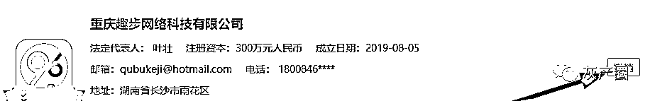

# 走路也能赚钱的趣步：终于走进了死胡同！

> 原文：[`mp.weixin.qq.com/s?__biz=MzIyMDYwMTk0Mw==&mid=2247495950&idx=1&sn=543b85277878ca32dbab5f526f377423&chksm=97cb3a36a0bcb320c5dcf25e6b3a1111dda24b97abe76d1f977f00fe3891c2edc76606ba709e&scene=27#wechat_redirect`](http://mp.weixin.qq.com/s?__biz=MzIyMDYwMTk0Mw==&mid=2247495950&idx=1&sn=543b85277878ca32dbab5f526f377423&chksm=97cb3a36a0bcb320c5dcf25e6b3a1111dda24b97abe76d1f977f00fe3891c2edc76606ba709e&scene=27#wechat_redirect)

**点击上方蓝色字体免费订阅“灰产圈”**

数月之前，灰产圈发布了一篇揭露趣步传销骗局的文章

《[趣步：“骗局”永不止步！“传销”不走寻常路！](http://mp.weixin.qq.com/s?__biz=MzIyMDYwMTk0Mw==&mid=2247495204&idx=1&sn=4b87e6bab52fdaddb1c8c2017125380c&chksm=97cb251ca0bcac0aee310d6aeb28749274f948a89a2098a8fdf18a62bb1ce59cafe3b20bfb27&scene=21#wechat_redirect)》

随后竟然遭到了趣步官方公司的投诉和威胁？！

《[我们被“趣步”投诉了！披着区块链外衣的“趣步”还能走多远？](http://mp.weixin.qq.com/s?__biz=MzIyMDYwMTk0Mw==&mid=2247495261&idx=1&sn=9e5d5ddc2843202d172ea17ca439b537&chksm=97cb2565a0bcac73821265a7f6de8496bbaa0c2ac81042d1cb2129074e412bc5d4090e4f7ddc&scene=21#wechat_redirect)》

之后各大媒体开始抨击“趣步骗局”，正如我们所料，走路也能赚钱的趣步终于走进了死胡同！

“趣步”近段时间动作不少，建立趣步糖果交易网站，迁出湖南变更重庆趣步。现在又发出公告取消俱乐部活跃度、卷轴时间限制。

一系列的操作感觉趣步在向好的方向发展，其实都是在躲避监管，想让自己合法化。最近还在筹划趣步网上商城，可不巧的是趣步一系列动作终于让自己栽了个大跟头，趣步公司的营业执照被吊销，这个骗局也终将会被揭露。

最近，我们注意到湖南趣步网络科技变为重庆趣步网络科技有限公司的同时，趣步公司的“营业执照”被吊销，经营状态变为了撤销状态，公司的经营状态“撤销”不是公司的行为，而是市场监督管理局的行政行为。

出现这种结果原因就是趣步公司有虚假信息以及提供不实证件注册公司。还有就是迁出湖南在重庆成立公司还用湖南公司 ICP 备案。

企查查截图

天眼查趣步截图

公司经营状态撤销不懂啥意思的，可以看下图，我们给大家找了关于公司撤销的解释：通俗来讲，撤销就是对已经完成的登记行为的否定，或者说是一种纠错行为，错误的登记丧失法律效力。

也就是说趣步公司已经不复存在，丧失法人资格，不能再与他人合作了。不存在合法的备案了。很多人会说这是公司迁址造成的，注意：注销公司自己申请，撤销是行政手段。两者别混了。

公司状态撤销解释 

之前给大家解释过，为什么湖南趣步要迁出湖南，去重庆办公，而且还不公布在什么具体位置办公，长沙是中国传销重点地区，“趣步”位于长沙市经济开发区，长沙进行的打击传销专项行动的任务包含长沙的各个区县，那么经济开发区当然也不会例外。

原因就是趣步迁出只是为了躲避监管。因为自己知道自己做的什么事情。 

趣步公司经营状态变为撤销，很多人也都意识到了什么问题，现在大家都抢着去套现，大多数人 GHT 网站登录提示 IP 登录人数过多，无法登陆，好不容易登陆进去，有投资者一个单子挂了 16 个小时都卖不出。

曾经不是说只有买单，没卖单吗？即使卖也会立马成交，如今怎么了呢？

挂单 10 多个小时 

有投资者挂卖单，超时被强制取消。其实这就是以后崩盘的征兆，玩趣步都是为了赚糖果，当这个骗局被揭穿了糖果谁还会收，谁收谁接盘。 

取消单截图 

“趣步”就是用“0 投资”的噱头吸引用户，然后再诱惑用户花钱购买糖果，发展下线。增加活跃度，根本没有什么所谓的实体支撑，一个注册公司没有任何产品，老板还整天活跃在 V 信群整天讲课。

请问，钱来自哪里，还不是来自用户买糖果买卷轴。这些对于趣步公司都是 0 成本。

有些人说“趣步”的收益来自线上商铺，广告收益，还有一些商户入驻费，明眼人一看就明白，所谓的商铺都是没有什么实用价值，迷惑下投资人而已。趣步公司的“糖果”可以用来兑换商品，也可以兑换所谓的 GHT 进而转换为现金，可以说趣步公司赋予了糖果等价物的属性，因此可以将其界定为一种虚拟币。

在国内发行虚拟货币就是违法的，以为自己建立个第三方交易网站，声称只是合作就能摆脱这个违法事实，那是不可能的。

“趣步”经营状态变为撤销，营业执照就是吊销，没有什么公司主体法律的依托。不存在合法的备案，在以趣步公司去宣传，那就是诈骗？趣步从去年成立走过一年，依然摆脱不了拉人头传销的经营模式。

最后一句，“趣步”模式不合法，这是不争的事实，想进入趣步的投资者还需谨慎，局内人很多人都是摆着明白装糊涂，因为你叫不醒一个装睡的人。

← 向右滑动与灰产圈互动交流 →

**阅读原文加入灰产圈高端社群**