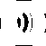
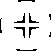

# 一人赊债，举众还钱：众筹还贷真的能把我从老赖边缘拽回来吗？

> 原文：[`mp.weixin.qq.com/s?__biz=MzIyMDYwMTk0Mw==&mid=2247495930&idx=1&sn=d3e9b5796c82f8f6069fc067965bb2e2&chksm=97cb3bc2a0bcb2d48e8e6f62b4421a895ae310c0dbcbdd29a724bb4e864ddb411e2f7091a318&scene=27#wechat_redirect`](http://mp.weixin.qq.com/s?__biz=MzIyMDYwMTk0Mw==&mid=2247495930&idx=1&sn=d3e9b5796c82f8f6069fc067965bb2e2&chksm=97cb3bc2a0bcb2d48e8e6f62b4421a895ae310c0dbcbdd29a724bb4e864ddb411e2f7091a318&scene=27#wechat_redirect)

**点击上方蓝色字体免费订阅“灰产圈”**

**作者：微信 110**

花明日钱，享眼前福

这种消费观念被越来越多人接受

为了满足自己种种欲望

很多人早已身负重债，欠贷成疾

身上的债务就像无底洞

拆东墙补西墙

始终都有堵不上的缺口

那如果把债务平摊

  让大家帮我一起还呢？

众人拾柴火焰高，一起还钱压力小

几万、几十万对我个人来说是 **巨额**

但是如果分摊给 **几十人、几百人**

那么对每个人来说都不过是笔 **小数目**

**众筹集资，互助还贷**

这似乎是个不错的主意

还款

流程

Step 1

拆分债务

由平台对债务进行拆分，分阶段进行还款

Step 2

众筹集资

找到其他负债者加入平台，获得众筹资金

Step 3

清还贷款

晋升高阶后，利用所筹集的资金还清所有债务

按照介绍人的说法

只要 **400 块** 就可以获得众筹资格

**之后无需再花  一分一毫**

只要动动嘴皮子让更多的人参加

我的还债之路就可以一劳永逸

**让别人出钱替我还贷**

照这个玩法，不出一年

我就能清还以前所有的 **烂账**

重获**「零负债」**的自由身

啪

你清醒一点！

半只脚踏进传销的大门了知不知道

**撕开****众筹还款**** 的假面**

先交 **入会费**，再发展下线 **拉人头**

**用 后来者的钱 补前面人的 债**

  这不就是 **传销** 典型的「三板斧」吗？

不过换了张皮，大家没认出来而已

你说这是传销的骗局

可就是有人通过这种方式

拿到了钱，还清了债

  人生赢家

暂时收到 8 笔 200 元众筹款

  人生赢家

下面的人一旦升级，势不可挡

  人生赢家

没错，而且这样的成功案例还不止一个

或者准确点说

要多少有多少

只要你想看，每天都有新个案

同样的截图、同样的话术

你有我也有

赌债、房贷、车贷、信用卡

同一个的故事

换身皮就能有 N 个版本

在这些人的朋友圈和微信群里

每天都上演着**「一夜暴富」**的戏码

仿佛这样的奇迹

下一秒就会发生在你身上

但是，相信这种神话故事的你

  可能不知道有一个字，念：

**tuō**

这种**「群+托」**的推广模式 

早就是人尽皆知的老套路了

但为什么还有如此多受害者上当受骗

原因是骗徒捏准了负债者

经济条件 **长期入不敷出** 的窘迫现状

以及渴望通过 **不劳而获** 的方式

一夜清债的 **侥幸心理**

于是对症下药，哄你乖乖入局

为了让你信服

这些狡猾的骗徒除了打感情牌

还学会了使**「法律武器」**

搬出三年前两会上

人大法工委讲“慈善法”时的话做文章

胡乱套用，故意误导受害人

降低他们的防备之心

每天营业，又 P 图又做托

为了让你上钩

这些骗徒已经很努力了

美其名曰是抱团取暖，众筹还款

其实里面多的是你不知道的套路

**只需要 400 元就可以清偿所有债务**

按照群里 “负责人” 的说辞

付 400 块，就能还清 400 万的债

的费用即可

然后就可以拉人还债

可他没说的是，如果 **众筹失败**

不但你 自己拿不到钱

后面被你拉入局的 **其他受害者**

**他们的入会费也退不了**

那什么原因会导致 **众筹失败** 呢？

依据他们制定的规则，团队扩增采取的是

**三三复制进阶** 的模式

也就是说，获得众筹资格后

你需要马上去拉 **3 个** 冤大头 负债人

作为你的下线

  那还不容易？

这年头人人负债，找三个不难吧

NO，这只是 **第一阶段**

在这一阶段你只能从这三个人手上

拿到 200×3=600 块的众筹款项

想拿到更多的钱还债

就得继续 **拉人、进阶**

而如果要晋升到 **二阶**，你就必须去

找 **3×3=****9 个** 冤大头  负债人

以此类推，**第三阶段** 要拉 **3×3×3=**  **27 人**

**第四阶段** 要拉 **3×3×3×3=****81 人**

…… ……

按照这个算法

他们设置的最高阶是 **第九阶**

那么从  八戒 八阶升到九阶

就要拉 3×3×3×3×3×3×3×3×3= **19683 人**

算上前面八次进阶拉的所有人

**3+9+27+81+243+729+2178+6561**

总共是  **29523 人**

真是拉个三生三世都拉不完了

每次进阶，还要额外交 200 块的升阶费

你以为光是上街找人就完事了吗

你还要说服他们

像你一样 **交 400 块** 的激活费

只有当所有的下线都交了钱

并且成功注册激活为众筹的一员

你的筹款才能到账

**拉不够人，或者有人中途退出、没交钱**

**这一阶段的众筹也就失败了**

那些被你拉进来的冤大头

他们交的钱也一分钱落不到你口袋

全打水漂了

换言之，当你的 **级别越高**

完成任务 **拿钱的难度越大**

而被你拉入局 **受骗的人也就越多**

以第三级为例，假如这时候的你

已经找到了 26 个倒霉鬼

但第 27 个却不知道在哪个平行世界游荡

那么这时候，你的众筹失败了

拿不到这一阶段的筹款

前面 26 个人所交的钱

也就全部落到了平台的手上

图片来自网络

看到这里，也许你会想

我身上没背债，又有点人脉

何不利用这个机会

  进群捞一笔，赚点外快？

况且难的是后面的步骤

我混个两三阶，浅尝辄止

拿钱就溜也没有坏处

有这种想法的朋友

推荐阅读 2010 年颁布施行的

**《最高人民检察院、公安部关于公安机关管辖的刑事案件立案追诉标准的规定（二）》**

里面的第七十八条规定：

涉嫌组织、领导的传销活动

人员在 **三十人以上**且层级在 **三级以上**

对组织者、领导者，应予 **立案追诉**

也就是说，当你晋级到第三阶段

被你拉入伙的一共 3+9+27=39 人

你可以拿到 7800 元 的众筹款项

那么祝贺你喜提「3 级＋30 人」的追诉标准

成功触及法律底线，可以追究刑事责任了

OK，聪明如我进群发现是传销骗局

也不抱什么投机之心了

这钱我不挣

债我也自己还总行了吧

  但是想全身而退？

**难** 

▼

帮你日进斗金秒还房贷之人

退钱！！！

每个身负重债的人都希望

早日脱苦海，成功上岸

但是把希望寄托在这些众筹平台上

可能不知不觉

就长成了别人盆里茂盛的韭菜

← 向右滑动与灰产圈互动交流 →

**阅读原文加入灰产圈高端社群**