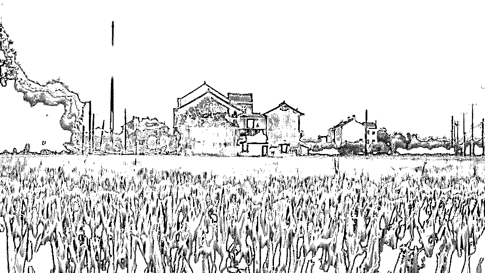

# “黑化”的农村：村头开撸贷培训班，一头死猪多次骗保

> 原文：[`mp.weixin.qq.com/s?__biz=MzIyMDYwMTk0Mw==&mid=2247495924&idx=1&sn=9fae80dfb6b5dece05ba1532400e5e3b&chksm=97cb3bcca0bcb2dabb8a573c979f10f215536c7b26ebf82a6570fcb7f5fe7207178f7298d2ee&scene=27#wechat_redirect`](http://mp.weixin.qq.com/s?__biz=MzIyMDYwMTk0Mw==&mid=2247495924&idx=1&sn=9fae80dfb6b5dece05ba1532400e5e3b&chksm=97cb3bcca0bcb2dabb8a573c979f10f215536c7b26ebf82a6570fcb7f5fe7207178f7298d2ee&scene=27#wechat_redirect)

**点击上方蓝色字体免费订阅“灰产圈”**

文 | 罗素

整个金融，从 2018 年就全面开启了下沉之路。  

下沉的重点，除了三四线城市的小镇青年之外，还包括分布在中国广袤农村的农民。

2017 年，国家统计局发布消息称，全中国农村人口数量为 5.7 亿，占中国人口的 40%。

对于这个 5.7 亿人口的巨大市场，金融曾经用过无数方式渗透。

贷款、理财、保险、消费金融，无所不用其极。

但农村，绝不是一个温驯的市场。

“农民淳朴吗？”

这是每一个进入农村市场的金融从业者，首先需要思考的问题。

答案可能是：“不一定。”

农民也存在分层。在农村，有为数不少的钻营之徒，他们此前从未感受过普惠金融，一旦一个口子被撕开，他们就会蜂拥而至。

集体骗贷、内外勾结骗保，他们几乎不会放过任何一个薅羊毛的机会……

01 **骗贷大军**

中介杨泉，曾经去河北、河南的农村，拉一个大巴车的农妇，来到北京的整形医院申请医美贷款。

“我给每个农妇几百元，说拉她们来北京免费旅游。”杨泉称。每个农妇能贷款 3 到 5 万，他直接拿走 70%。

一个大巴车拉一次，能净赚 30 到 50 万。

后来，杨泉转行，没有再做这个。

去年年底，他去这些村谈别的业务。然后他发现，经过他的“点化”，这些村庄的农民居然自己“开悟”了。

“中间有几个聪明的小伙子，居然组织村民一起撸网贷。”杨泉看到，他们聚在村头的活动中心，一起学习如何撸网贷。

“怎么填资料，怎么养通讯录，带头的小伙在黑板上一一写出来。”杨泉当时大吃一惊。他已经离开行业有点久，很多套路都是他不知道的。

多家金融机构都发现，农民组织起来一起撸网贷，并不是什么新鲜事了。

“我曾经发现，平台上集中涌入一批申请者，他们的职业和工作地址都不一样，但是身份证地址都是一样的。”一家金融平台的 CRO 裴音称。

结果，这个群体的还款率都很低。

“催收打电话过去，他们都特别狠，说你们有本事就来我们村里催收，让你竖着进来，横着出去。”裴音称，这就是一个村组织来撸贷的。

每当遇到拆迁和棚改，农民的骗贷率，就会出现一个高峰。

农民知道自己的村子即将拆迁，就到处贷款，然后拿着钱玩失踪。

拆迁户一般都会被安置到新的地方，并重新落户，“原户籍地址用来骗贷，再合适不过”。

数年前，一个长江的半岛被拆迁了。

****催收员小河去找人，一看就崩溃了，“不但整个村子没了，整个区都没了”。根本找不到人。****

“现在每个星期，我们都会遇到一两个这样的分案。”小河苦恼不已。

****除了网贷之外，农民也不会放过传统的金融机构。****

****一个“刁民”，成了华北某家农商行的噩梦。****

他在村里做农销商，经常请农商行的一个客户经理吃饭，逢年过节还主动送羊肉。

第二年，这家农商行政策调整，这个农民的贷款额度被砍了很多。

他不干了。

“你们的人吃拿卡要，还逼我送羊腿。”农民大吵大闹，威胁要去监管部门投诉。

最后，客户经理被开除了，农民得到了全额续贷。

“如果他不还钱，我们也没办法。”该农商行员工华良称，后来他们才知道，好多银行都踩过这个农民的“雷”，都很怕他。

****在农村，很多银行都有任务指标，一年必须给农村放贷多少。****

而这些优惠政策的果实，有很多都被一些“能人”捞走了。

他们往往离开农村多年，在外地包工程、做生意。但因为在农村的根基深、人脉广，和村干部熟络，他们经常能骗走贷款。

因此，很多支农资金，实际上都流向了非农领域。

****“现在农民知道你最怕谁，银行成了弱势群体。”华良称。****

****“我要去银监局和金融办告你！”他第一次听到农民说出这样的话时，曾经震惊不已。****

****慢慢的，他习惯了——在当地，很多城市周边的农民，都发现了银行的这个软肋，“我要去告你！”****

02 **集体骗保**

****信贷如此，保险也是如此。****

目前，农村最主要的保险，是农业险。

而农业险主要是国家补贴，并有一系列的优惠政策。

以 2019 年为例。

政策规定，2019 年每头母猪每年保费 60 元，财政会承担 48 元，养殖户自己出 12 元，保额是 1000 元。

而在种植险方面，政策规定，省级财政至少补贴 25%，在此基础上，中央财政还会对中西部和东部地区，分别补贴 40%和 35%。

****但是，因为目前活体的检测技术并不完善，很多农民开始钻空子。****

不久之前，一条新闻被爆出：在四川德阳，有生猪养殖户在猪场摆了一台冰箱，专门存放死猪。

理赔时，死猪就被拿出来，反复从多角度拍照，以便向保险公司重复申请赔偿。

而这样的事件，在农村并不新鲜。

南方沿海某省的农村保险理赔员张俊峰就发现，非洲猪瘟出现之后，当地农民的骗保行为有所增加。

比如说，一个村子有三家养殖户，只有一家上了保险。

猪瘟发生后，没买保险的那两家，就会搭“便车”，把自家的死猪运到买了保险的那家，一起申请理赔。

“死猪都堆在一起，保险公司的查勘员没法分辨。”张俊峰说。

还有一些农民，会与小保险公司或者保险公司员工勾结骗保。

“如果一个农民家里有 100 头猪，且都投了保，当这些猪出现猪瘟前兆之后，农民就可能紧急增加 50 头猪的保险。”东北一家保险公司的员工安心表示。

而这 50 头猪，在现实中并不存在。

此后，如果这 100 头猪都病死了，农民就可能拿到 150 头猪的赔付，联合骗保的保险公司员工会从中分一杯羹。

****此外，农民还有一些“日常操********作”。****

比如，有 100 亩地，只保 80 亩。“谁能去量？”安心问。

同理，如果农民有 1000 头猪，他可能就只保 100 头——所有死的猪，都算在这 100 头里。

很多保险公司不愿接受不足额保险。此时，就需要联合保险公司验标员造假，显示 100 头就是全部。

牛的价格很贵，死了损失更大。如果牛在运输途中死了，牛贩子就会把牛运到附近的养牛场，说是养牛场的牛，两方联合骗保。

农村金融从业者王正帆表示，在黑龙江，政府曾经对一些型号的农机提供 60%的补贴。看到其中的巨大利益，一些农机销售厂家也会和农民联合骗补。

“如果一台拖拉机售价 3 万，厂家会标 8 万，政府补 60%就是 4.8 万。最后厂家收回拖拉机，中间的 1.8 万差价，几个骗补方一起分。”王正帆说。

****“骗政府补贴，农民不认为这是骗，农村的干部也不认为这是骗。”他表示。****

****农村的骗保窟窿能堵住吗？保险从业者发现，在技术上，就困难重重。****

打耳标？太容易掉，而且打耳标会惊吓动物，影响其生长。

电子围栏？定位不准。“有农民在一头牛身上绑 8 个芯片，然后说自己有 8 头牛。”王正帆说。

猪脸识别？谁来出钱？农民不愿意，保险公司不愿意，电信运营商觉得不划算，也不愿意。

一些公司现在的技术能做到的，就是识别死猪照片，防止一头猪被重复理赔。

****在制度层面，也困难重重。****

保险公司人手不足，有时会委托兽医站兽医等第三方查勘。

而后者年年向农民卖兽药，接触频繁，与农民是利益共同体。

如果一头猪因为猪瘟死掉了，兽医查勘称重时，就可能造假。此时，一头猪是赔 300 元、450 元，还是 600 元、800 元，操作空间巨大。

“光看死猪照片，保险公司理赔员很难判断它有多重。”张俊峰说。

****“农村保险的水太深了。”多位农村保险从业者如是感叹。****

他们希望，在未来，5G 和物联网，能够改变这一点。

03 **谁的责任**

传统中国农民的形象，是面朝黄土背朝天，勤劳淳朴，任劳任怨。

罗中立的油画《父亲》，就被认为刻画出了中国农民的典型形象。

油画《父亲》，来源：360 百科

****“但农民就真的那么淳朴吗？”一位资深保险从业者问。****

他觉得，给农民打“淳朴”标签的人，可能并不了解农村社会——在农村，哪怕有些人的地种得比较好，都会引来嫉妒，地可能在夜里被偷偷践踏。

世上没有桃花源。真实的农村，远比人们想象的复杂。农民亦然。

“农民的‘淳朴’与‘贪图小便宜’，可能是一体两面。两者同时共存，并不矛盾。”他说。

“淳朴”，可能是因为还没有经受利益考验。

****现在的农民，和以前的农民早就不一样了。****

实际上，随着互联网和智能手机的普及，农村和城市之间的信息差和信息壁垒，早就被打破了。

一部手机在手，世界就在眼前。

****“网红的那些东西，农民都知道。在田间地头，他们经常聊这些。”华良称。****

****同时，金融的强势进入，早已打破了农村的利益平衡。****

河北的很多村镇，都已经“信贷泛滥”。

因为临近北京，很多金融机构都将它们作为发力点。

从去年开始，村民黄杨觉得村里的氛围变了。

“现在整个村贴满了贷款的广告，村里的小卖部夫妻店老板，都变成了信贷员，去买个东西，都要给我推荐贷款。”黄杨称。

在利益的强大诱惑下，村里的很多人都陷入了网贷漩涡，“现在都不干活，靠着网贷就能活得很好”。

****就连华良也觉得，不能把“骗贷”的板子都打到农民身上。****

实际上，农民的信贷需求并不旺盛。他们做过调查，发现大部分农户的存款需求，都是大于贷款需求的。

但一些农商行和农信社有政治任务，必须放款。

监管要求，农商行和农信社“支农支小”贷款增速不低于全行贷款平均增速，也不低于去年同期。

但北京周边的一些地区，可能已经没有太多农业了。

在监管施压下，它们“只能硬投”，动作可能变形。

****传统金融机构这样做是因为要完成政治任务，而金融科技公司则是为了跑马圈地，这样才能打败对手，融到下一轮钱。****

“圈下更多的农村土地，拿到更多的业务量，我们才能融到下一轮，不然就是死。”一家农村金融平台的创始人叶舟透露。

去年年底，整个市场的环境不好，很多农民逾期。

因为觉得放得越多，亏得越多，不少玩家退出了市场。

但叶舟还不得不继续扩张业务量，因为不进则死，毫无选择。

蜂拥的玩家，过量的渗透，让一些村镇陷入了过度授信之中。

金融的一体两面性也开始体现出来。

金融带来了普惠，也带来了诱惑。

需要讨论的，或许不是农民淳朴与否，而是金融机构能否为农村金融打造一个良好的生态环境，激发人性的善，遏制人性的恶。

*文中部分受访者为化名。

← 向右滑动与灰产圈互动交流 →

**阅读原文加入灰产圈高端社群**