# 两个女人的赌城一夜，看看真实的赌徒心态！

> 原文：[`mp.weixin.qq.com/s?__biz=MzIyMDYwMTk0Mw==&mid=2247495901&idx=1&sn=54443bd9e5a394567213267278f1c56a&chksm=97cb3be5a0bcb2f3acfe25f637ecca9fd56e43fbe23ad9e6b5e2cd86cbb8927e142cd0a73ffe&scene=27#wechat_redirect`](http://mp.weixin.qq.com/s?__biz=MzIyMDYwMTk0Mw==&mid=2247495901&idx=1&sn=54443bd9e5a394567213267278f1c56a&chksm=97cb3be5a0bcb2f3acfe25f637ecca9fd56e43fbe23ad9e6b5e2cd86cbb8927e142cd0a73ffe&scene=27#wechat_redirect)

**点击上方蓝色字体免费订阅“灰产圈”**

本来去澳门旅游，却不曾想陷入赌博困局，仿佛像梦一样，这是一个赌徒的真实故事，请耐心看完，为你讲述一个女赌徒的心路历程，先说明一句：不赌为赢——来自戒赌吧的口号。

回想起在澳门的一夜，我至今仍然有点恍惚。

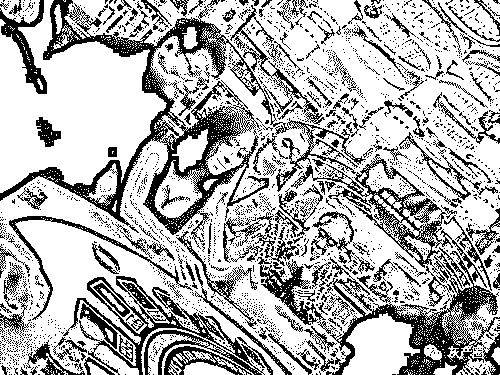

澳门之行本不在计划之列，那天上午，我还是一名普通的香港游客，在旺角逛街，然后去添好运茶餐厅吃肠粉和虾饺。好朋友临时送了我一张附有往返港澳船票的演唱会门票，就这样，我登上了去澳门的船。

到了澳门氹仔码头，我才发现根本用不到任何旅行攻略——“威尼斯人”酒店的免费穿梭巴士就停在码头闸口对面，非常显眼，不会有人问你是谁，也没有人查票，巴士一坐满，就会载着一车彼此陌生的人向酒店开去。

在那里，所有眼睛能看见的地方都是一片金色，长长的走廊和穹顶上的壁画连成一整片金色的长河。道路宽阔、门廊高大，似乎永没有尽头。我有一种醉生梦死的错觉。

我在辗转问清楚上网、打印等细节后，狂奔着处理演唱会换票等事宜。当我按照巨大的酒店地图穿越大堂、娱乐场，在西翼套房、西翼大堂、南翼套房、南翼大堂的标牌中迷失方向时，突然见到了大运河街。

那是一条在室内的二楼的巨大的“河”，河里有客船可以载客，头顶上会动的蓝天白云是一张巨大绵延的屏幕。旁边的高墙适时地建成假的楼房和阳台，我仿佛真的置身于艳阳天里的威尼斯。两边“河岸”上是鳞次栉比的店铺，Prada、Gucci 等应有尽有。

明明已经是晚上，却仍是一派白昼明媚的景象，真正的时间消失了，空气里流动的好像都是物欲，我像电影的主人公一样，掉进了一场巨大的幻觉！

在威尼斯人，我像是掉进了一场巨大的幻觉

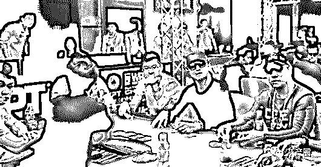

按照地图，我找到了皇雀餐厅。

餐厅右转就是举行这次演唱会的金光综艺馆的入口，穿过去则是娱乐场。确认离演唱会开始还有两个多小时，我踏进了娱乐场。

我问门口的一位女保安：“我从来没进过赌场，进去之后的步骤是什么

啊？”她用一口不太流利的国语回答我说：“如果你是人民币或者澳币，就去出纳处换筹码；如果你是港币，就可以直接坐在喇边（那边）下了。你可以跟别人一起下，也可以自己下，看你自己咯！”

我去出纳处拿着 500 港币换来的 5 个筹码入场了，转了一圈，挑了一个只有发牌人坐着的空桌子坐下。

发牌的大姐指着身旁显示“$1000”的显示器、和蔼地对我说：“这一桌一注最少也要 1000，后面很多人玩百家乐，你去喇边（那边）吧。”

那是一张一注最少可押 100 元港币的赌桌，桌子是一个椭圆形的吧台形状，桌面写着“速战百家乐”的字样，三十个高脚凳座位围着桌子，每个座位都挨得很近。

座位前有一排供客人下注的地方，分别写着 “庄、闲、和、庄对子、闲对子”；下注完开牌后，会有透明塑料挡板从客人的手臂处伸出来，阻挡客人继续下注或者改变下注；

牌开完，整个桌子会根据牌局结果发动机关，输了的字样下的方块会抽开，筹码从桌面上掉落；赢了的筹码会继续摆在桌子上，随后工作人员会过来赔相应的筹码，待挡板收起，客人就可以拿回赢来的筹码了。　

每一局都是这样重复。

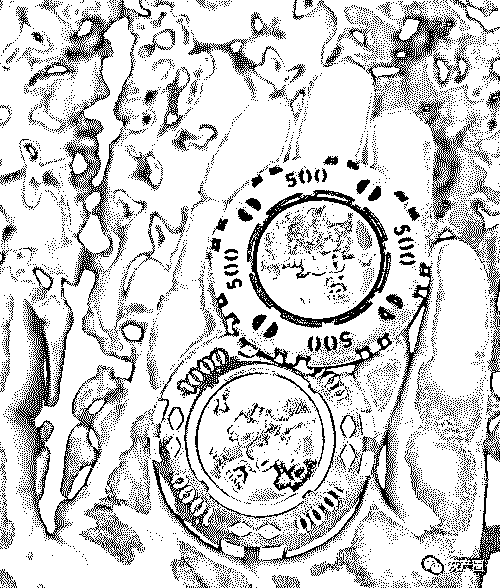

我告诉自己，这些筹码，输完了我就走。

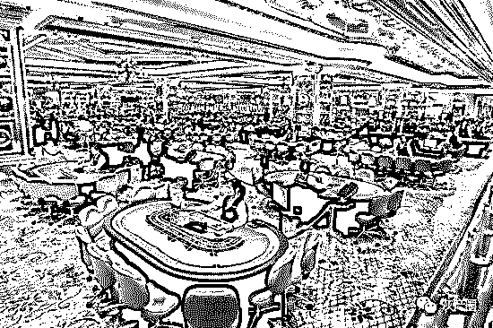

我坐下来的时候，只想清楚了几件事：

> 第一，我只有 500 块钱可以输，输完了我就走；
> 
> 第二，我只有一个小时可以玩，到点我就要去弄点吃的以及看演唱会；
> 
> 第三，我必须保管好我的行李，也绝对不要和赌场里的任何人说话；
> 
> 此外，还有第四件有点天真的想法：第一次来赌场一定会让我赢的，我要相信大数据的故事。

只有 5 个筹码，运气背一点的话，五把就输完了。

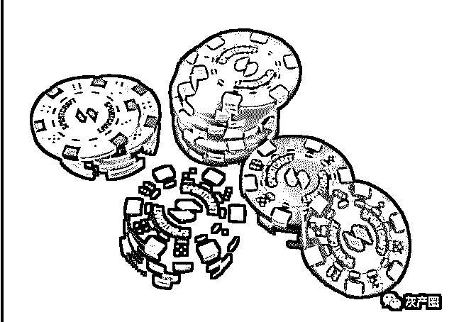

牌局开始，我偷学了隔壁先生的下注方法，把 100 块的筹码换成四个 25 块的筹码，然后赌对子，这样可以延长输光的时间，很快，我就输的只有 125 块了，随后又开始一路赢。我对自己说，“不要贪心，赢到 2000 就可以收了，开开心心去看演唱会。”

眼看着慢慢赢到 1975 块，突然一路开始输……输到只赢 1000 块的时候，演唱会马上就要开始，我决定离开。

走出赌场，我连上 WiFi，和好朋友们汇报了情况。突然赢得了一千块，大家都觉得很惊喜，也让我讶异而清醒：“是啊，已经很好了！”可是，在走出赌场的前一秒，我还不太甘心，“明明 2000 块也很容易，为什么不继续？”

我暗自骂自己：“你还不知足？你看，已经很好了，刚才的 1975 根本就不属于你！”那一刻，第四个天真的想法也似乎得到了确认：“果然，对于第一次来赌场的我，赌场是会让我赢的！”

我渐渐恢复到看演唱会的状态，可脑袋依旧不受控制地、一直在想赌场里的事情：这钱来的太容易了！按照这个节奏，要是赌一晚上，一千、五千、一万、两万……那一刻，我觉得这些都是可能的：“就算两万不可能，五千也是可能的；五千不可能，两千至少是可能的！”“不行，我现在就要去赌场，再拿 500 去博一下！我要去赌场！”

煎熬着等到演唱会结束，我第一时间又去了赌场。

这一次，我轻车熟路地换了筹码，坐定桌前。

开始有人找我搭话，坐我旁边的一位女士，对自己的注漫不经心，对我的注却非常关心。

每次我刚要下注，她就会在一旁“提前预测”，说对了就非常得意：“你看，我厉害吧？”我没理她，自己下了“和”，她赶紧阻止：“不要下和啦，下对子，对子赔率高啊，而且和那么难出”。

碍于是一位女士，我就按她的意思调了一下，但仍旧没有开口。开牌，“和”旁边的灯亮了，意味着我刚才要是没听她的可以赢 8 倍。

她没看见，还在眉飞色舞指手画脚，我忍不住开口说了第一句话：“和赢了。”她一看，立刻道歉：“哎呀，不好意思，这下挡人财路了，真对不起啊！”我回过头继续看自己的筹码和桌面，说：“没关系呀，都是来玩而已。”她就悻悻地离开了。

很快，500 元就输完了。我有些懊恼，决定再追了 200 元，打破了进赌场前给自己定的额度。看了看表，心想就这两百了，等到 11 点半我就走。

换了一桌，很快又收回了 700。这时，要翻台了，翻成最低 200 元一注，风险高了一倍，我也打算试试。十几局后，一桌的人都开始有些疯狂了——太顺了，几乎开五次闲之后就开庄，然后会再连开五次庄，很有规律。就这样，我慢慢“博”到了 2050。

眼看快到 11 点半了，我拿出 250 元，对自己说：“输掉，我赢来的钱还剩 1800，赢了，这一次我就会赢到 2500，无论如何，最后一搏！”

开牌，我押的三个字下的小方块都抽开了，筹码全部掉了进去。

我整理了衣服，把一直放在脚边的背包（其中一个带子缠在腿上）拎起来，向出纳处走去。加上之前赢来的 1000，我一共赢了 2800 元。

我又朝皇雀餐厅走去，这时已是深夜。我又饿又渴，坐到椅子上立刻就蔫了。

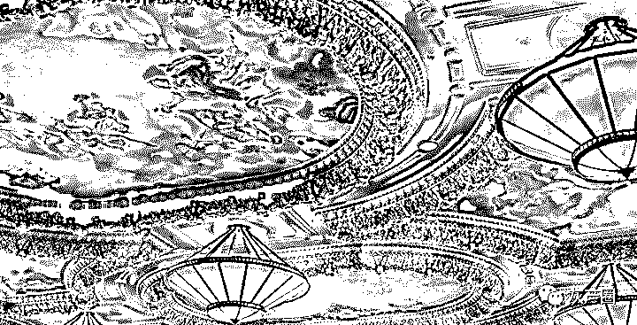

威尼斯人的巨大穹顶

其实那时候，我应该出门打车去码头，赶最后一班船回香港。

但我太累了，只想静静地坐着。

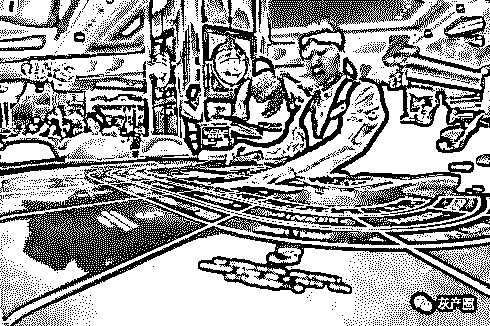

缓过神来已是凌晨一点，只能重新找酒店。

威尼斯人我绝对不考虑，且不说贵，光是有再进赌场的可能，就让我感觉害怕。查完了所有澳门旅馆，除了一家有 2400 元一晚的套房外，其它竟然全部客满，就连威尼斯人也是。

要把赢来的钱花出去住一晚高级套房？不要。这些钱本来就是我的，是很辛苦地和自己战斗挣回来的，绝对不要在这里花掉！我这么告诉自己。

在皇雀餐厅，我看了看四周，有位年纪大一些的女士睡在我左手边，右手边也坐着两个年轻的女孩。看样子她们似乎就打算这样过夜了。的确，这里有 WiFi，有卫生间，温暖明亮，到处都是保安，比起现在一个人去大街上找旅店，显然更安全。

“只要撑到 5 点，我就可以出去坐船回香港或者去市区逛大三巴了。”我正如此想着，那位年纪稍大些的女士忽然和我说起话来：“我上个月在这里输掉了五万，今晚又输掉了三万，我已经快在这里输掉十万了。我现在身上只剩 200 块不到。”她直愣愣就说出这些话，对我毫不设防。

我惊呆了。本来我以往她是在这里等人的澳门本地人。

她接着说：“我只是想把输的钱赢回来，就不再回来了。”

“真的能控制自己把输的钱赢回来就走的人，绝对不会让自己输到这么多。在赢 1000 的时候就停手了，所以也不可能赢到那么多，因为她早就会停了。”我也直愣愣地回她这么一句。

“我觉得我躺在这里，很落魄。”她说。

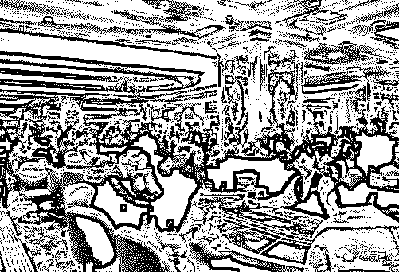

那一刻，我突然想让她明白，不要为了十万块就觉得自己什么都没有了，下意识地调整了坐姿，转向她，开始了一场漫长的聊天。

我从听来的故事说起，告诉她最顶端的数学家和科学家都在赌场工作，赌场里布满了无尽的摄像头、录音器、传感器；高级赌场的客人一进门，赌场就知道这个人是不是第一次来，是什么来历、个性，能输多少钱，赢多少会上钩……我说得信誓旦旦。

我倾尽我所有的知识，给她讲我所知道的“黄金储备和地缘政治”，告诉她我对信仰的看法，告诉她我曾在旅行中不同的地方见到的、让我印象深刻的人和事。

整整两个多小时，我滔滔不绝地说着，也在这个过程里渐渐清醒。

“你有没有想过，下一次再来，其实是重复上一次的可能性更大。你什么都没变化，性格没变，想法没变，赌场也没变，为什么你觉得下一次的结果会改变而不是继续重复呢？而且你每次再进去的时候，都带着要把之前输的赢回来的巨大压力，不如就忘掉这一切，十万块顶多不过就是工作三年的事。”她怔住了。

她也和我讲在赌场里见到的事：借钱的人怎么出门就被打死，来你边上故意帮你的人和别人暗中勾结，赌桌的工作人员到了一定时间点就性情大变，不同国家来这里做小姐的人怎么生存……我睁大眼睛，将信将疑，再联想到自己刚才赌场的经历，不禁后背一凉。

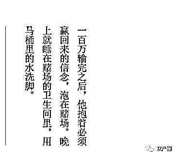

三点多，突然有一位男士加入了我们的聊天。“你那样是赢不了的，心态一定要好。”他对着那位女士说道，“不好意思，刚才一直在听你们说话。”

他说自己十年前就来澳门赌钱，拿着当时自己做生意赚来的一百多万，“几个晚上就输光了，和你一样，一开始也是赢了不少，后来就一直输，越着急就越输。”输完之后，他找了几位战友凑了几十万，之后就拿着钱躲在澳门，不敢回去，只和他妻子说在这里做生意，自此开始了职业赌徒的生涯。

一百万输完之后，他抱着必须赢回来的信念，泡在赌场，到处“学习”、“总结”。晚上就睡在赌场的卫生间里，用马桶里的水洗脚。

除了住在卫生间，在澳门赌博还有很多事情要解决，比如，港澳通行证只能在澳门逗留七天。“所以要飞的，在澳门赌没有不飞的。最方便就是飞越南，有一趟是可以当天来回的。你看到那些在赌场里当小姐的，她们也要飞的，不飞不行。”他朝路过的穿着惹火的小姐们笑了笑。

“想要赢，就要心态好。像我现在每天赢到四五千，就出去逛街买东西，让头脑冷静冷静，逛完回来再玩。每天三把，绝对不多打。赢多少都会走，输也定个数，今天运气不好怎么办呢？输就输掉了，不要想着我上次输这次就要赢，没有这样的事情。”

“想要赢，懒也是不行的。像我才开始的时候，一晚上跑的腿都断了。脚上全是水泡，现在脱掉鞋子，脚上的老茧都是那时候走的。赖在一个桌子上，肯定是不行的。开始的时候没有本钱，就要这样一点点赢，勤跑、心态好才行。”

“如果有一天赢太多，也不要太贪，要赶快花掉。像我昨晚赢了四万，我就出去买了这条皮带，这个衬衫，这个包。”他指了指腰上的爱马仕皮带。

“澳门这个地方，内地富豪来这里赌的，到现在回不去的太多了。

身无分文，回去也全是债，就只能躲在这里了，除非有一天被抓回去。现在我每次出关都帮他们带东西进来。我给他们说，像我自己的衬衫，也都是几千块钱买的，我不穿了，就从家里带过来给你们，好吧？他们都说好啊好啊。”他长长地叹了一口气。　

“我老婆到现在都不知道我的职业是干这个，我一直跟她讲我在澳门做生意，实际上生意早都没有了。”

说完没多久，他和我们摆摆手走了。我和女士陷入一阵沉默。

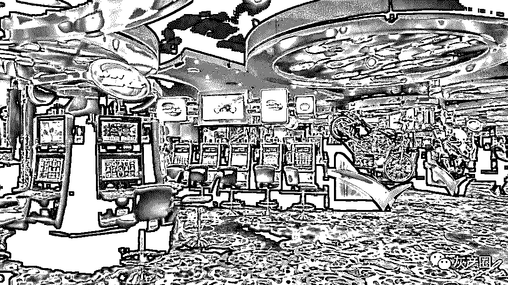

我们迟迟无法入睡。站起来到处走动，发现了一家还在营业的点心店，我跑回皇雀餐厅，叫上大姐。

吃着东西，我们的话题也开始轻松起来，互换了名字和联系方式。我叫她萍姐。

“东东，嫁到马来西亚你愿不愿意啊，想把你介绍给我一个朋友的儿子啊。”她问我。

“哈哈哈，没想过嫁那么远哦！”

吃完，我提议干脆逛一逛大运河街吧。我挽着萍姐，用脚丈量了大运河街的巨大，我想起白天路过这里的熙攘人群，能在这个凌晨“独占”空无一人的大运河街，应该也是极少有的体验吧。我开心地边跑边跳。

“你真快乐啊！”看着我萍姐又想起来自己的女儿，“下次，我也带她来玩，纯玩！”

我想找卫生间。“走，我带你去一个地方，特别漂亮！”萍姐拉着我的手就走。我们俩一起又进了赌场。那一瞬间，我突然觉得周遭特别静默，我们静静看着依旧灯火通明、人来人往的赌桌，脚步不停，没有说话。

当我们从那个惊人的富丽堂皇的卫生间走出来，再次穿过赌场、穿过赌桌、穿过人群，袒胸露乳的小姐们越来越多，在赌客之间穿梭着，老虎机上的小霓虹灯也跟着不停闪烁。

“我都想去再玩一把了。”我脱口而出。

“不能玩，再玩你一定要输的！”萍姐拉着我的手迅速往外走。

就这样，我们又回到了皇雀餐厅。

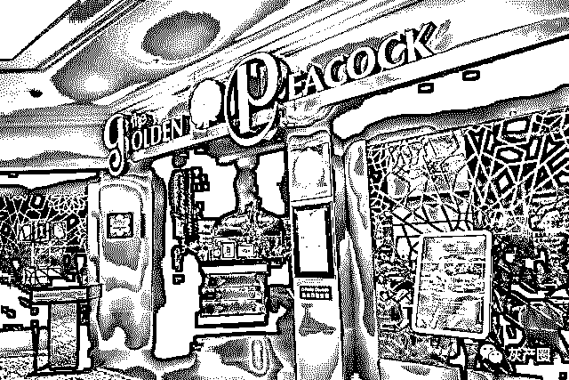

我们真的累了，无论如何也能睡得着了。

选了一个好睡的椅子，躲在柱子后面，试图避开工作人员和保安，然后，沉沉地睡了过去。

**文章作者：辰阳说**

← 向右滑动与灰产圈互动交流 →

**阅读原文加入灰产圈高端社群**