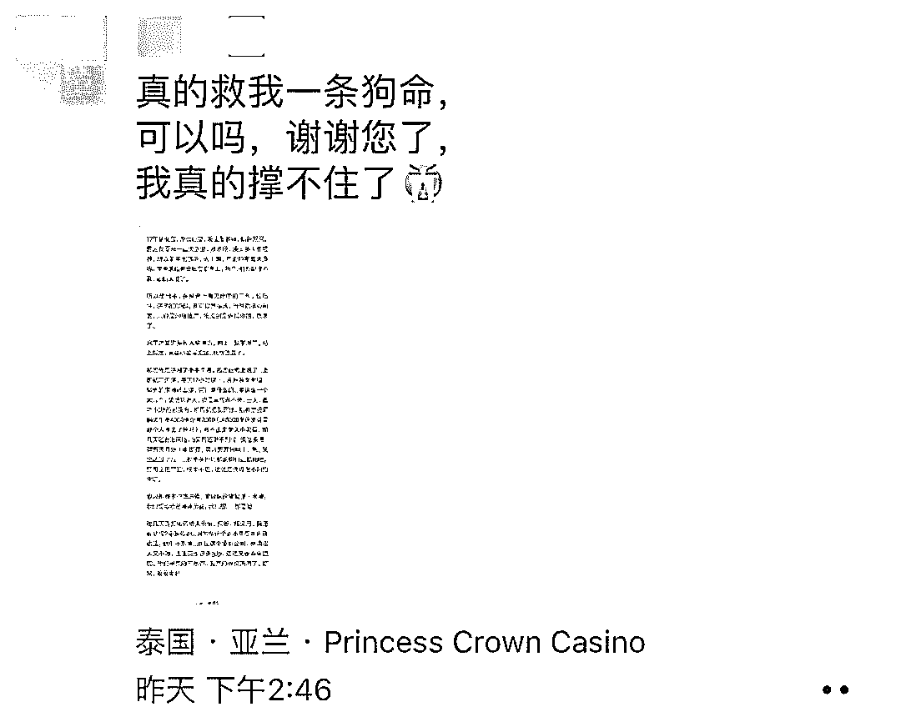
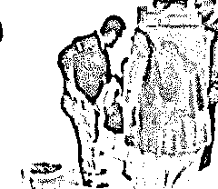
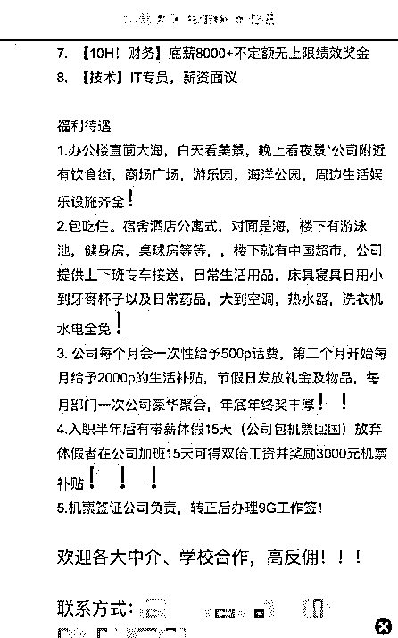
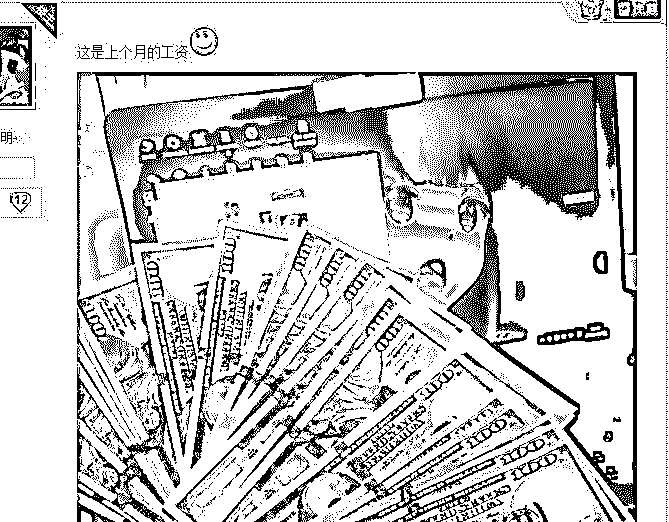
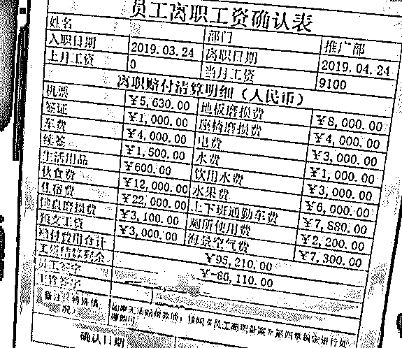
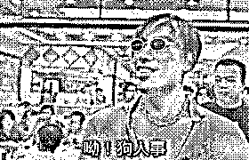
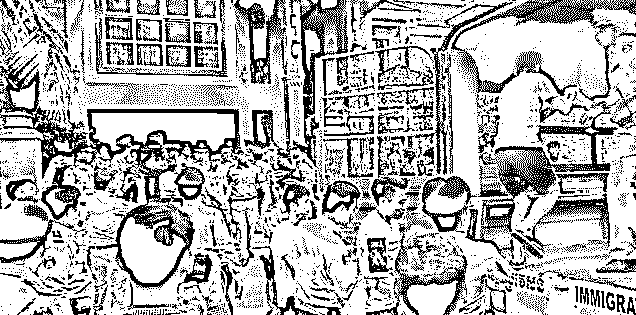

# 遭毒打、被囚禁、背高债，直击狗推生不如死的诈骗生活

> 原文：[`mp.weixin.qq.com/s?__biz=MzIyMDYwMTk0Mw==&mid=2247495891&idx=1&sn=3831c2f245f1dd48f9a8c1e2c8fda77d&chksm=97cb3beba0bcb2fd6c3b671c77c26fa79533a3003a1dd3091794022433cc84d3efc40351fbc1&scene=27#wechat_redirect`](http://mp.weixin.qq.com/s?__biz=MzIyMDYwMTk0Mw==&mid=2247495891&idx=1&sn=3831c2f245f1dd48f9a8c1e2c8fda77d&chksm=97cb3beba0bcb2fd6c3b671c77c26fa79533a3003a1dd3091794022433cc84d3efc40351fbc1&scene=27#wechat_redirect)

**点击上方蓝色字体免费订阅“灰产圈”**

到这大家一定会问守哥
“你是来搞笑的吧，这种活也有人干？”有，但是是被骗去的其实上面这些片段是最近在网络上流传的东南亚“狗推”日常狗推是网络博彩行业推广业务员的简称，让受害者人才两空的“杀猪盘”就是他们的杰作之一。
作为“杀猪盘”骗局的重要一环，狗推扮演着十分重要的角色。上要对老板负责（也被称为“狗庄”），服从管理，为老板赚钱，拿微薄的提成；下要寻找作案对象，把那些期待爱情、期待激情、期待志同道合的人，发展为待宰的“大肥猪”。
在外人面前他们留给大家印象大多是光鲜亮丽，过着糜烂的生活，一个个非富即贵。但实际上，却过着猪狗不如的生活。所以在称呼中，他们都要加上一个“狗”字，用以自嘲。狗推到底过着怎样的生活？守哥分享一段狗推的真实经历，大家感受一下。来源：纯洁的微笑，图上定位实际是柬埔寨波贝，紧邻泰国亚兰，定位偏差

图上的这位求助者原是一个富二代，父亲入狱、母亲重病，身负几百万债。一次偶尔在某短视频平台上看到了一个出国工作的机会：包去时机票与签证，月薪 8000，高提成，环境好，包吃住。工作地点在柬埔寨波贝，消费低，能存下钱。

他心动了，而当那一刻，也是他付出代价的开始。到了当地他发现，原来工作就是骗人进来网络赌博，在拒绝工作后，被关小黑屋 3 天，他妥协了。接下来的工作就是在网络上各种加人聊骚聊汉聊妹。

半个月时间他一个人也没骗到，公司马上就黑了脸，并要求他赔偿公司的损失。赔付机票签证保关车费 4000 元+中介费 8000 元才能走人。没钱？关小黑屋 3 天，断水断粮，给手机去借钱。5 天后没借来，开始用电线抽，一顿痛打。6 天后还没有钱，开始电击。痛苦之下，他曾绝望的撞墙寻死。终于这位求助者找遍亲朋好友，凑齐了钱，才得以重见天日。

如今，不知有多少这样的青年，被诱骗到异国他乡，诸如菲律宾、柬埔寨、泰国、越南等地，签下卖身契约。被迫或自愿，直接或间接，去诱骗国内的同胞。狗推待遇如此，为什么还会让人前赴后继的受骗？这一切都得“归功”于负责招募的“狗人事”。他们将自己的日常工作，称为“打渔、修路、种树”，打渔就是撒网，修路就是拓宽渠道，种树就是忽悠人过来上班，也是狗推的主要渠道来源。
国内某论坛上的招聘广告  狗人事惯用招人手法之一，就是在网络上广泛扩散招人信息，有文字、有图片、有视频。通常以自己为主角，讲述一个自己在国内走投无路，后来到东南亚工作后赚钱赚到手软，天天快活无边的故事。 1/ 讲故事 这些故事关键词就是一个字——“晒”，晒工资、晒伙食、晒工作环境、晒休息日、晒花天酒地。因为是自述故事，许多人看了以后很有带入感，仿佛与屏幕后的美好生活，就差一张机票了。随后，就会联系上这些发故事的狗人事，然后乖乖被骗出国。晒工资 2/ 送机票 当决定跟着狗人事，一起在国外干出一片属于自己的新天地时，狗人事就会贴心的为你安排免费机票和免费接送，让你还没踏出国门，就感受到大洋彼岸的求贤若渴和自己即将拥有的崇高待遇。 3/ 卖身契 下了飞机后，你会被带到公司所在的大楼，安排在一个小黑房间里签工作协议，也就是“卖身契”。这时你会发现曾经的甜蜜承诺都不见了，8 小时工作制变成 12 小时工作制，月休 8 天变成月休两天，7000 底薪变成 5000，每月还要押 1000，到手 4000，除此之外，最要命的是还有一笔“赔付款”。 4/ 赔付 所谓“赔付”，是指你到了东南亚后如果不满意工作想走或者工作后想离职时要支付的费用。“赔付”是东南亚诈骗业内一个公开的秘密，少则几千，多则数万。这些赔付的内容不仅非常详尽，某些方面还特别体现出想象力，比如：地板磨损费、键盘磨损费、座椅磨损费、厕所使用费、海景空气费等...文章开头出现的“背债”图正是网络上流传的狗推赔付单
但这时候你想要“走”已经迟了，因为你的护照、手机、随身的行李等等，都会被以各种理由拿走。除非你干到幕后老板认为可以榨干你的那天，否则你根本无法脱身。一个“在东南亚工作需注意事项”的回复  守哥观察到，在大多数狗推骗局的受害者中，背景都有些相似，要么是负债累累、要么就是有着一夜暴富想法。所以狗人事这样的骗术，很容易让人中招。但这样的骗局，也十分容易识破，通常只要受害人多留一个心眼，想想若是这份工作真如狗人事所说，待遇如此优厚，还会缺人么？至于如何鉴别这样的骗局，守哥也总结了几种骗局的特征:①工作地点位于国外（东南亚国家居多），不透露详细工作地址；②待遇优厚脱离实际；③以旅游签证出境，包办机票；④过度包装（在诱惑你上当的过程中，骗子往往会不断向你讲述自己过得有多好）；⑤招聘过程声称高度保密，没有工作图片与视频展示。当你找的工作符合以上几种特征时，请务必提高警惕，十有八九就是骗局。狗人事欺骗狗推，狗推欺骗受害者。狗推的骗局，从外面看每一个人都是坏人，从里面看每一个人都是受害者。事到如今，即使狗推非人一般待遇被曝光，却依然有很多人抱着“搏一搏”的心态入伙，去欺骗更多的人，一个血淋淋的骗局也就此形成。6 月 12 日，中国与柬埔寨警方联合抓捕，68 名参与博彩公司的中国人，随后将遣返回国，等待他们的，不会是衣锦还乡的荣誉，而是法律严厉的审判。同时，多家网络博彩公司怕受到牵连，也开始连续放假停工。
今年是中柬联合执法年，接下来警方必定将继续重拳出击，让跨境犯罪无处可藏。  

参与其中，出国诈骗，回国坐牢，只会是最终宿命。守哥希望大家都能够脚踏实地，有梦可以，但想着通过不法途径实现的梦，最终也只是“做梦”而已。

← 向右滑动与灰产圈互动交流 →

**阅读原文加入灰产圈高端社群**