# 虚假流量、恶意 SDK、多开外挂、网络赌博....腾讯为你揭秘网络黑产

> 原文：[`mp.weixin.qq.com/s?__biz=MzIyMDYwMTk0Mw==&mid=2247495842&idx=1&sn=62b2b57be4e1102d84adf0cddad915d0&chksm=97cb3b9aa0bcb28c181183ffa7d498d7827d3d8f4cb2e59eaaf7889a4a311da5e9e25d6ad401&scene=27#wechat_redirect`](http://mp.weixin.qq.com/s?__biz=MzIyMDYwMTk0Mw==&mid=2247495842&idx=1&sn=62b2b57be4e1102d84adf0cddad915d0&chksm=97cb3b9aa0bcb28c181183ffa7d498d7827d3d8f4cb2e59eaaf7889a4a311da5e9e25d6ad401&scene=27#wechat_redirect)

**点击上方蓝色字体免费订阅“灰产圈”**

导语

腾讯研究发现，目前的网络黑产已经规模化、链条化，上下游依赖严重，虚假流量、恶意 SDK 和网络赌博等黑产形式越来越多样，治理起来难度非常大，网络黑产已成为人们日常生活中的威胁之一。腾讯解密网络黑产，流量造假、恶意 SDK 问题频发，治理难题显现。

这是腾讯在 7 月 25 日北京召开的“守护者计划”腾讯安全媒体分享会上揭露的。会上，相关领域负责人介绍了腾讯守护者计划自 2019 年以来，对网络黑产形式的观察研究与对抗治理。

本次会议主要关注了六种形式的网络黑产，包括虚假流量、涉未成年人犯罪、非法支付资金结算、APP 外挂、网络赌博、恶意 SDK 等话题和最新的打击案例。

腾讯研究发现，目前的网络黑产已经规模化、链条化，上下游依赖严重，虚假流量、恶意 SDK 和网络赌博等黑产形式越来越多样，治理起来难度非常大，网络黑产已经成为人们日常生活中的威胁之一。

“守护者计划”发起于 2016 年，是腾讯推出的反网络犯罪平台。平台依托腾讯在安全大数据、底层技术和用户规模方面的积累，旨在构建网络安全治理模式。

一、虚假流量站点超 1000 家

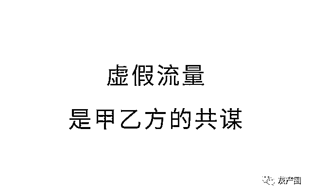

虚假流量也称为非正常流量，通过自动化和人工等方法，制造虚假流量数字，通过刷量造就流量神话，目的是为了通过劣质流量引爆眼球经济。

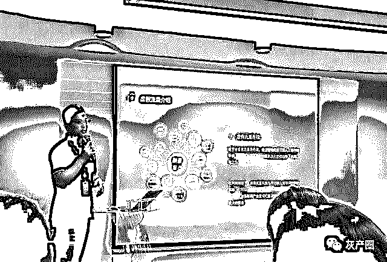

虚假流量最初是人工刷量，以流量劳工为主的接单派单模式，但是人工刷量也有天然弱点，即效率低等。现在出现了自动刷量，还出现人工+机器刷量，即可以实现挂机刷量。

腾讯相关负责人在接受媒体采访时表示，目前机器刷量比较好识别，但是人工刷量难以识别，因为不知道刷量的是否是真的粉丝。

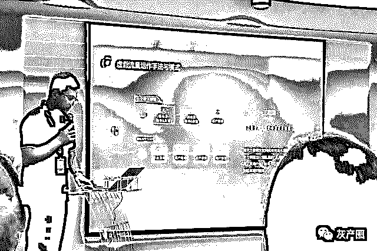

黑公关长期驻扎资讯平台，也助推了虚假流量。近几年短视频流量博弈愈演愈烈，相关领域黑产链条已经规模化。据透露，目前各种流量造假站点超 1000 家，头部刷量平台月流水超过百万，国内刷量产业人员规模达百万级别。

虚假流量的危害是助长谣言、容易被利用和涉政引流。最后会导致劣币驱逐良币、互联网信用体系崩溃和用户薅羊毛导致平台利益受损。

虚假流量治理难度大，因为虚假流量游走在法律边缘，各环节已经产生了上瘾式的依赖，且目前政府多头监管。目前可行的措施主要是进一步落实通信实名制、增强技术识别技术、加强法律保护和倡导多方共治。

二、恶意 SDK 影响 2000 多万用户手机

SDK 为软件开发工具包，可以理解为一种组装模块，主要是为了帮助软件开发人员节省开发软件的时间。

据腾讯相关负责人透露，目前恶意 SDK 主要发生在安卓系统，恶意 SDK 通过软件更新进入时有发生。苹果 iOS 系统比较安全，因为苹果每次更新都要重新下载。物联网也不能例外，一些小组件也可能被安装恶意 SDK。

例如 2018 年发现一款名为 XX 推的恶意 SDK，影响了 2000 多万用户手机，涉及 300 多款应用，几十万用户已经感染。

恶意 SDK 实现的主要方式是将恶意 SDK 集成进正规 App，其伪装方法十分高明，有时候软件开发者也难以识别某个 SDK 是否是恶意 SDK。

恶意 SDK 也是发展的结果。开发恶意 SDK 的违法分子最开始其实是开发恶意 APP，后来才演变成开发恶意 SDK，因为安全检测比较难以发现恶意 SDK。

其留存方式也从最开始 Root 用户手机到后来接入知名 APP，这样用户就难以发现。据腾讯相关负责人透露透露，有一些正规厂家也会开发恶意 SDK，但没有透露是那些厂家。

恶意 SDK 的特点是安全风险隐匿化，影响范围广，所以治理起来比较困难，需要政府规制、社会监督和企业履责三方共同努力。

三、外挂实现同时开 50 个微信不掉线

移动端外挂也是网络黑产的形式之一，包括山寨客户端、群控、模块注入和协议封装。

山寨客户端外挂，例如一些山寨微信客户端可以用来刷步数、群发消息、语音转发等，其可能会带来网络诈骗、泄露隐私、广告骚扰、破坏计算机系统等危害。

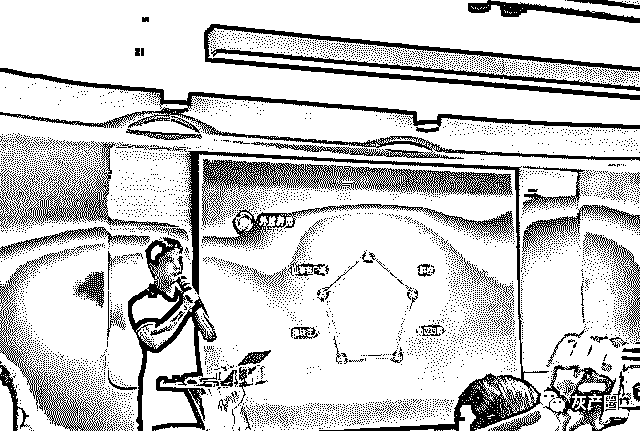

群控类外挂，例如云控机器人，本地并无硬件，可以通过网页进行微信群营销、群发消息等。还有箱式群控外挂宣称不改变微信规则，特点是犯罪工具小型化，一个小箱子相当于 120 台手机。

协议封装类外挂，协议指通信协议，现在有人整体提取微信通信协议，封装成客户端，包括功能机协议挂和 iPad、Mac 外挂，可以进行刷量、撞库等操作。

模块注入类外挂，包括恶意注册类外挂，会伪装 GPS 定位欺骗客户端，还有 windows 客户端注入外挂，可实现十八般武艺，例如开 50 个微信不掉线。

四、网络赌博黑产向东南亚转移

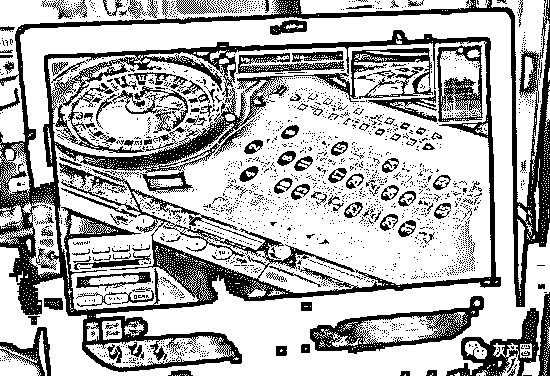

网络赌博黑产实现形式多样，包括棋牌类 APP、捕鱼类 APP、赌球类 APP 和小游戏等。

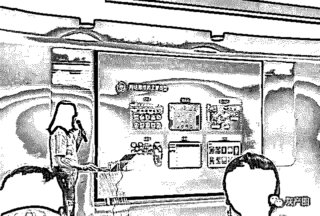

目前网络赌博黑产呈现三个新趋势，包括全链条向境外主要是东南亚国家转移、资金分散到各个平台流转更加复杂化和赌博与其他犯罪形式结合，例如赌博+色情、赌博+盗版、赌博+诈骗等。

腾讯近期加强了网络赌博黑产的打击，主要是将主动线上策略对抗和线下刑事打击相结合，同时还加强安全能力输出和用户宣传教育。

五、第四方支付为黄赌毒提供支付渠道

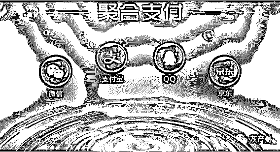

非法支付也叫第四方支付，主要为网络赌博、涉黄等提供支付渠道。第四方支付利用第二方、第三方支付接口，未经国家支付许可，通过技术手段搭建非法结算平台。

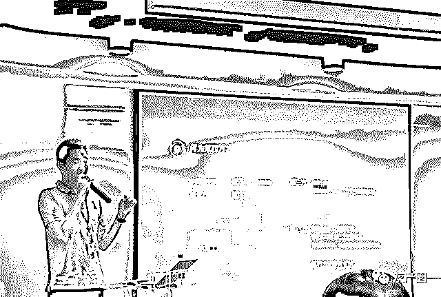

目前第四方支付呈现专业化、团队化、技术化三大趋势。第四方支付一般有两步，第一步虚开账户，第二步虚假交易。主要手法是通过银行卡、网银和扫码支付，例如收购大量工商资料，然后开微信商户收钱，还有把商户包装成真实店铺等。

目前发展最快的还是个人码支付，非法网站招募大量的个人用户做帮凶，通过个人账户收款，之后个人用户可以收到一定返点，目前发现的最大的非法支付网站招募了上万人。

非法支付最大的危害是扰论金融市场秩序、助长网络黑产和衍生其他犯罪。腾讯通过大数据+AI 识别，通过构建大数据模型根据用户习惯、网络异常等进行防范治理。其他手段包括社会共治、加大对信息泄露管控、强化刑事打击力度、增强风控平台风控能力及加强用户教育。

六、文爱、磕炮、诈骗，未成年人黑产泛滥

未成年人黑产包括未成年人色情黑产和未成人年诈骗等。

未成年人色情即儿童色情，目前全世界已经严格治理。目前的形式主要包括文爱、磕炮，Cosplay、援助援交，色情直播和童星招募。

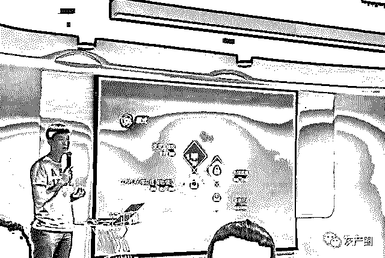

不过由于未成年人色情黑产形式多样，加上圈子小比较隐蔽、法律不够完善和家长传统观念限制，治理起来难度比较大。

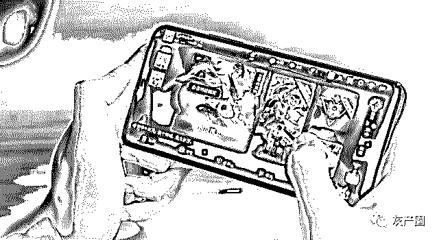

未成年人诈骗主要是依存于网络游戏，例如在防沉迷系统出来后，网络搜索“解锁防沉迷系统”关键词激增。

黑产分子利用这个现象进行诈骗，伪装成可以解锁防沉迷系统的人，受骗的主要是广东、江浙等经济发达地区的未成年人，且以小额诈骗为主，例如 38 元、200 元等。

结语

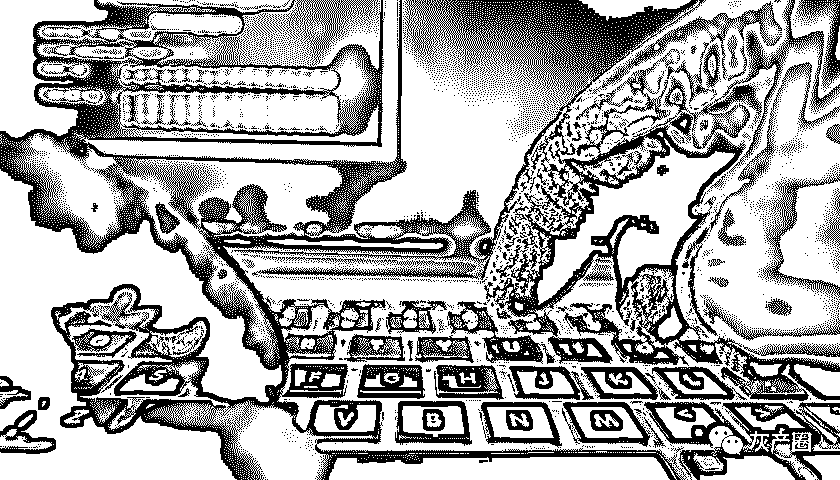

新形式层出不穷，网络黑产难治理

网络黑产是依托于网络尤其是移动互联网的一种新型黑产模式，比较知名的有流量造假，恶意 SDK 劫持手机等形式。

网络黑产随着互联网的不断发展也进行形式上、技术山的迭代，例如从之前的 Root 用户手机到现在植入知名 APP，让用户防不胜防。

而这也给网络黑产的治理提出了难题，面对层出不穷的网络黑产形式，如何有效的进行前期识别、中期拦截和后期整治是所有从业者需要考虑的问题。

← 向右滑动与灰产圈互动交流 →

**阅读原文加入灰产圈高端社群**