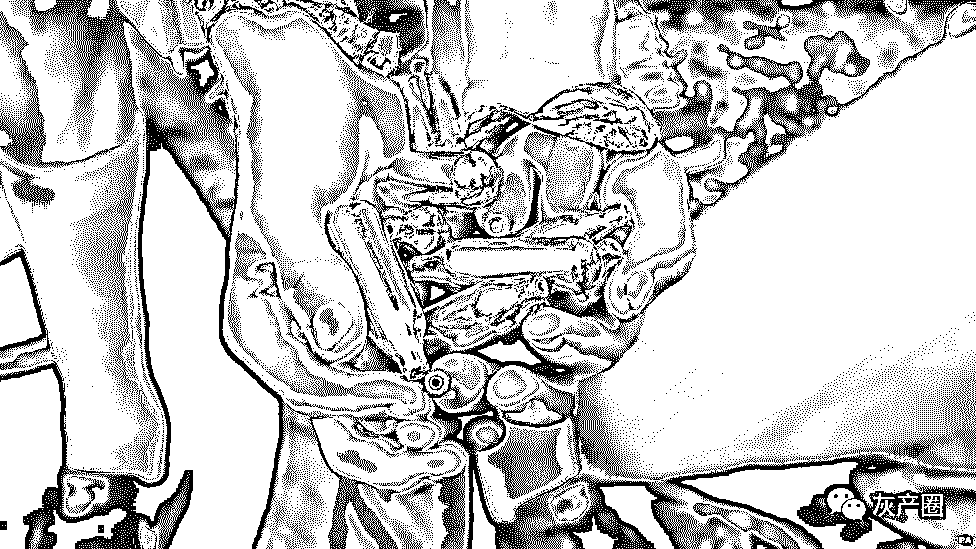
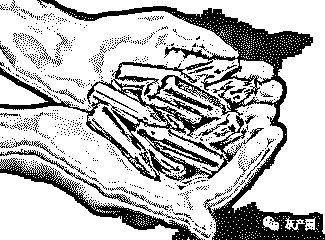
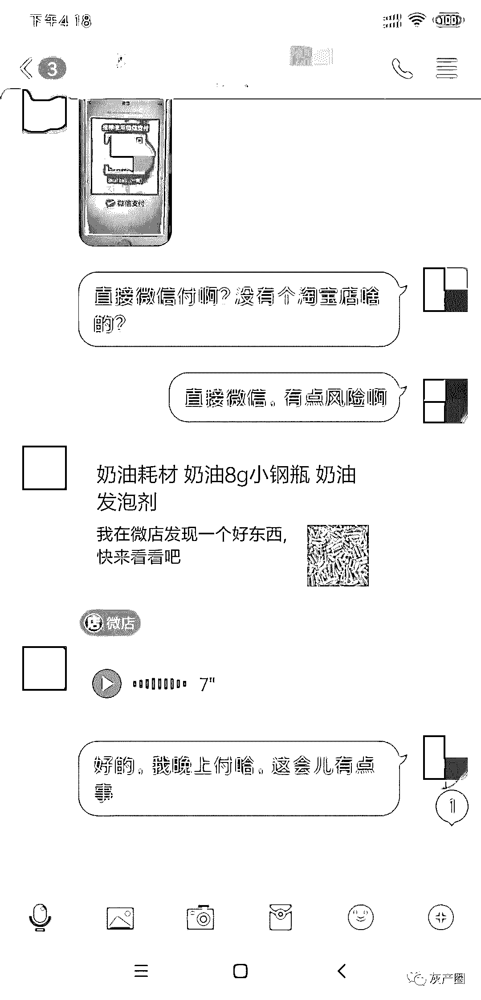

# 1 小瓶“笑气”毒杀老鼠，有人 1 天吸千瓶！网上公开售卖，最快半小时送达……

> 原文：[`mp.weixin.qq.com/s?__biz=MzIyMDYwMTk0Mw==&mid=2247495827&idx=1&sn=41ef01bf31939d0e923d327c3318ec95&chksm=97cb3baba0bcb2bd6b6f09823d93aea641f5ee3c67386af427be441fe7e18a12671243e333d7&scene=27#wechat_redirect`](http://mp.weixin.qq.com/s?__biz=MzIyMDYwMTk0Mw==&mid=2247495827&idx=1&sn=41ef01bf31939d0e923d327c3318ec95&chksm=97cb3baba0bcb2bd6b6f09823d93aea641f5ee3c67386af427be441fe7e18a12671243e333d7&scene=27#wechat_redirect)

**点击上方蓝色字体免费订阅“灰产圈”**

导语

“每次都 10 箱、8 箱的往回买，不到一周就吸完了。吸得连路都走不稳。”在北京高新医院候诊室，朱鹏（化名）的父亲满脸无奈地向我们描述自己儿子来医院戒毒前的惨痛经历。

让 95 后青年朱鹏成瘾的，不是常见的海洛因、可卡因或者冰毒，而是一种在我国虽未被纳入毒品范围，却与毒品有着极其相似功能的工业气体——**笑气**。

笑气“毒品“泛滥成灾

作为一种麻醉剂，笑气最早运用于医疗领域，目前也部分使用在食品加工业上。但这些都不能否认一个重要认识——笑气可能对人体产生强烈的损害。央视新闻直播间播出的一个实验过程曾显示：**一罐 10ml 的笑气，在 2 分 30 秒内，即可杀死一只实验鼠**。

可怕的是，尽管笑气对人体具有很强的破坏性，也被国家列入危险化学品目录，却有大量商家潜伏在贴吧、QQ 群甚至淘宝等平台，公开进行售卖。

更令人匪夷所思的是，经过近 1 个月的深入调查和暗访后发现，不仅那些熟客可以轻松地拿货，就像我们这样毫无经验的新手，竟然也能从下单到收货，无障碍地“一路通关”，也显示出这一从生产到流通的黑色产业链仍游离于监管之外。

笑气对人体到底有多大伤害？目前有哪些群体正非法经营这样的买卖？如何能够对这一产业链加强监管？我们试图通过调查为您一一呈现。

案例还原：一天吸掉近万元笑气

两年前，一篇名为《最终我坐着轮椅被推出了首都国际机场》的文章引起社会热议。中国女留学生林娜用亲身经历讲述了自己的故事——**她在留学期间大量吸食笑气，导致下半身瘫痪，留学多年不仅没能拿到学位，反而只能坐着轮椅回国**。这一事件也让原本籍籍无名的笑气走入了公众的视野。

公开资料显示，笑气的主要化学成分是**一氧化二氮**，是一种无色有甜味的气体，被广泛运用于医学、食品、工业领域。可用作麻醉剂、奶油发泡剂和助燃剂等。

北京高新医院医务处主任兼戒毒科主任徐杰表示，笑气极具成瘾性，却容易被人们所忽视。

吸食高纯度笑气能在不到 1 秒内让全身肌肉瞬间放松并产生性快感，患者脸上肌肉也会放松并出现所谓的“诡异笑容”。但由于这种感觉只能持续很短时间，所以许多成瘾患者会不停吸食。

“笑气带来爽感的同时，其实是‘笑里藏刀’。

一方面，吸食笑气会导致血液缺氧，类似于煤气中毒，时间太久可能导致猝死。另一方面，笑气会抑制人体维生素 B12 的吸收，B12 缺乏会导致脊髓神经不可逆的受损。所以，长期吸食笑气的人会走路不稳、失去平衡甚至瘫痪。”徐杰说。

那么，笑气到底是不是毒品呢？

根据《中华人民共和国刑法》第 357 条规定，**毒品是指鸦片、海洛因、甲基苯丙胺（冰毒）、吗啡、大麻、可卡因以及国家规定管制的其他能够使人形成瘾癖的麻醉药品和精神药品**。从这个角度上来说，笑气（一氧化二氮）似乎不属于条文中列举的毒品，也没有纳入麻醉药品和精神药品范畴。

尽管如此，笑气对社会和人体构成的危害却不逊色于毒品。

朱鹏与林娜有着非常相似的经历。尽管目前他对笑气的危害已经有所认知，但想要凭借自己的意志戒除心瘾却非常困难。

“我接触笑气已经有 4 年时间了，最初是在美国的一个 party 上吹了一次‘气球’，当时觉得头特别晕。回家后又吸了几次，很快就上瘾了。”谈及对笑气的依赖和成瘾，朱鹏向我们表示，自己从来没想到会依赖到这个程度。“刚开始也就是尝几口，但后来每天不吹个几百瓶就会特别烦躁，感觉生活已经没有意义了。”

根据朱鹏父亲的描述，朱鹏最多时一天可吸食 2000~3000 瓶笑气，费用接近万元。

据我们了解，通常一盒笑气有 10 支，一箱有 30 盒，也就是 300 支。每支笑气的价格约为 3 元，2000~3000 支笑气的售价高达 6000~9000 元。

“家里不让他吸，他就会躲到足疗店、KTV 这类场所‘吹气球’。有一次我们发现他时已经睡着了，怎么叫都叫不醒，睡了好几个小时才醒过来。其实，他当时已经处于昏迷中了。”朱鹏父亲告诉我们。

徐杰在高新医院实验室向我们模拟了“吹气球”的过程——将一支 10ML 的液态一氧化二氮金属气瓶插在奶油枪的一端，另一端对准嘴巴并扣动奶油枪的扳机，气体瞬间喷进嘴里，便完成了一次所谓的“吹气球”。而一支气瓶最多只能喷射两次便需要换装下一支。

徐杰表示，由于一支笑气气弹（气瓶）对人体作用的时间只能持续几秒钟，所以，成瘾患者需要通过不间断的吸食来延长所谓的爽感。“在我们这边治疗的笑气成瘾患者中，不少人食指上都磨出了老茧，可以想象他们吸食的频率有多么高。”

他进一步表示，普通毒品成瘾患者对毒品都有一个饱和度，每天只要吸食到一定的量便会停止。笑气则不同，患者很难出现饱和感，所以会不停吸食，直至血液里缺氧导致昏迷。

“笑气虽然没有被定义成毒品，但它能导致生理和心理双重成瘾，和毒品的作用机理十分相似。患者一旦被阻断，就会出现烦躁、焦虑、沮丧等生理特征。有研究表明，笑气成瘾患者中，有 50%的人最终会患上抑郁症。”徐杰说。

我们与卖家对话的截图

调查：卖家藏匿于淘宝、贴吧、QQ 群中

可是，对人体伤害如此显而易见的笑气，竟然能在网上公开售卖。

朱鹏的父亲向我们透露，尽管自己儿子是在美国留学时沾染上笑气的，但回国以后不仅没有收敛，反而变本加厉。“购买实在是太方便了，淘宝、贴吧到处都是，最快下单后不到半个小时居然就把成箱的笑气送来了。”

我们注意到，吸食笑气至少需要具备两个条件：**奶油枪和一氧化二氮气弹**。首先，奶油枪并非禁卖品，在淘宝、京东等网购平台均有售卖。淘宝平台上销售奶油枪的商铺甚至多达上百家。

那么，能否吸食的关键就在于气弹，只要能买到气弹，就可以实现所谓的“吹气球”。

朱鹏本人向我们表示，前两年，购买气弹十分方便，许多网购平台和贴吧上直接公开销售。但现在控制得比较严格，网购平台上几乎很难找到商家了。

但是，消费者找不到商家并不意味着这个行业的消失。朱鹏向我们透露，在网上输入一些特殊的字符，仍然能搜索到相关的商家。

“可以尝试在 QQ 群、淘宝输入**MOSA、KAYSER、BestWhip**等特殊字符，或者在贴吧上搜索‘气球’等关键词，可能会有新的发现。”

按照朱鹏的提示，我们在搜索 QQ 群一栏输入上述关键词后，果然出现多个类似的 QQ 群，一些群的成员数量超过百人。

我们随后加入了群成员人数较多的“**MOSA,KAYSER,BestWhip**美食群”。刚刚进群后便看见群主在群里发布了“气弹批发、只做高质量、可以试气再决定拿货，需要的找群主”等信息。群主向我们表示：“可零售也可批发一氧化二氮气弹，下单数量越多，价格越便宜。”

随后，我们在淘宝、闲鱼等网购平台输入**mosa、kayser**等隐秘的关键词后，同样出现不止一家销售奶油枪或者一氧化二碳气弹的店铺。尽管这些店铺看似和笑气之间关系不大，但我们点进卖家的店铺后，却很快发现一些与笑气气弹相关的蛛丝马迹。

我们随机进入一家叫“**九龙 vans 白菜店**”的店铺，发现店铺首页标注：“需要耗材，点击立即购买即可”，并留下了微信号。

我们与卖家对话的截图

该店的客服人员向我们表示：“**购买气弹需加微信，淘宝已经下架**。”当我们按照客服提示添加微信后，对方立马通过微信向我们发来氧化亚氮气弹零售和批发的价格表。

该价格表显示，5 盒起售，28 元一盒包邮；十盒起售 27 元一盒包邮；20 盒起售 23 元一盒包邮。

而在批发价格表一栏则显示，一箱 30 盒，两箱起售，660 元一箱包邮；5 箱起售，580 元一箱包邮；10 箱起售，560 元一箱包邮。此外，该价格表还标注，一次 20 箱之上，价格可具体聊。

一位微信上的卖家向我们表示，所有气弹从安徽发货，可直接快递。“包装盒是进口品牌，但并不是原装进口气，都是国产气。”

淘宝上另一家销售制作苏打水耗材的店铺首页同样也挂上类似气弹的耗材。但文字标注的是一氧化二碳。该店客服向我们表示，自己只销售用于制作苏打水的一氧化二碳气弹和奶油枪。

但当我们表示可大量购买笑气气弹后，对方客服并未直接答复，而是给我们发来了一个微信号，并要求我们添加。

我们添加对方提供的微信号后发现，该微信朋友圈公开晒出多张氧化亚氮（笑气）气弹的宣传文字和图片。比如“爱淘气放价批发”、“只做正品，假货勿扰”等。

这位卖家询问我们有没有营业执照，我们表示没有。对方称，没有营业执照也可以发货。一盒 35 元，有 10 支气弹。“我只做正品，不和假工业气体比，假货没有可比性。”

我们在其朋友圈发现，该卖家出售的氧化亚氮气弹主要来自广东华特气体股份有限公司，其在朋友圈晒出的一张清单显示，该气弹氧化亚氮的纯度超过 99.9%。

交易简便：同城闪送最快半小时即可到货

除了 QQ 群以外，贴吧同样藏匿着销售笑气的卖家。

针对近期有媒体报道“**百度贴吧售卖笑气**”一事，5 月 6 日，百度通过“百度贴吧”官方微博发表声明称，百度贴吧已在第一时间清理了报道中涉及的违规信息，并将报送公安机关。

另就事件所涉及的**“笑气”、“嗨气球”、“一氧化二氮”**等关键词进行了全面排查，凡有涉及违法违规情况，已封存相关证据，将积极配合有关部门进行调查惩处。

通过测试，我们发现，如今在百度贴吧里搜索**笑气、氧化亚氮，甚至 MOSA、Kayser**等关键词，均会出现“**根据相关法律法规和政策，暂不开放** ”的显示。

然而，一位不愿透露姓名的笑气成瘾患者却向我们透露，目前，国内许多笑气卖家已经偷偷转向一个叫“**气球吧**”的贴吧中。“这个吧以前是卖拱门气球、婚礼装饰的，但现在好多笑气卖家都藏匿在里面。”

根据这名患者的提示，我们在百度贴吧搜索栏中输入“**气球**”关键词，果然出现了一个帖子数量达到 38430 个 ，会员数量超过 7000 人的“**气球吧**”。

我们进入贴吧后发现，许多帖子公开讨论与笑气有关的话题。发帖标题包括：“北京 上海，闪送到家，24 小时不合眼接货”；“实力厂家，批发可到付，江浙沪，京津冀，珠三角闪送”；“ks，bw 奶油味、草莓味，接闪送”等。而帖子下面的留言栏也十分活跃，有些卖家直接在留言栏留下自己的微信号或者手机号码。

此外，我们在该贴吧中还发现，有一些吧主甚至发起**“组团气球派对”、“招线下代理，江浙沪接批发”**等帖子，内容十分丰富。

我们随机添加一位将微信号留在贴吧的卖家，仅仅 10 分钟后，这位微信上的卖家便接受了好友申请，并开始向我们兜售氧化亚氮气弹。

既然能够在网络上公开售卖，就牵涉到发货的问题。从这些卖家手上购买到的笑气气弹又通过怎样的渠道送到买家手中呢？

我们在调查过程中发现，多位贩卖笑气的商家竟然都通过同城闪送、快递、物流等方式进行配送，一些商家甚至在朋友圈里晒出各种品牌“气弹”的包裹。

一名通过 QQ 与我们联系的卖家向我们表示，笑气气弹可批发也可零售，批发 10 箱起售，零售可按盒下单。“**零售带喷码的是 2.8 元一支，不带喷码的是 2.1 元一支。一盒 10 支，一箱有 10 盒**。”这意味着，按照商家的规定，如果走批发，卖家一次性发货的数量至少达到 1000 支。

当我们向这位卖家询问如何发货时，对方表示，闪送、快递、物流均可发货。“**你要是着急，我可以闪送给你，半个小时就能送到，但是不带喷码的。如果不着急，我可以从深圳发货，是带喷码的**。”

所谓的喷码就是在每一支气弹上印有生产日期、品牌名称、产地等信息。有无喷码又有哪些区别呢？这名卖家向我们透露，无论是有喷码还有没有喷码，都不影响品质，里面的气体完全是一样的。“带喷码显得更加正规，安检也容易过。不带喷码，有时候会被‘卡住’。但闪送肯定不会有问题。”

但一名业内人士向我们透露，如果卖家询问是否带喷码，很大可能是商家自己通过工业气体充装的，并非正品。“**这种气弹价格比较便宜，因为无法保证纯度，也可能含有其他杂质**。”

为了进一步呈现笑气灰色产业链，还原从筛选客户、下单到发货的整个流程，我们以对笑气有需求为名，准备与商家购买少量一氧化二氮气弹。

上述 QQ 卖家在确认了我们的意图后表示，想要批发需等一段时间，建议零售购买。“**你如果在北京，我可以按照 2.1 元一瓶直接闪送给你，最快半个小时就能送到。我们在昌平有点的**。”

当我们表示希望能够拿到带喷码的气瓶后，对方又表示，带喷码的 2.8 元一瓶，4 盒起送，从深圳发货，需要等 2~3 天才能送到。

这名卖家随后在 QQ 上给我们发送了一个微店的链接，并要求我们在微店上下单。微店上显示的商品名称为：“**奶油耗材，奶油 8g 小钢瓶，奶油发泡剂**”。

当我们表达笑气属危险化学品，快递会不会被截获甚至没收的担忧时，对方却信心满满地表示，自己是靠这个吃饭的，怎么会连货都发不出去。“你的量很少，我们有伪装方法的。如果大量批发，就会走物流或者闪送。”

付款 2~3 天后，我们如期收到了商家寄来的 4 盒笑气。运单上的信息显示，该快递由上海韵达货运有限公司配送，发货地址为广东省深圳市龙华新区高坳新村 157 号。 

我们一共收到 40 支氧化亚氮气弹，分装在 4 个盒子当中。包装盒正面印有“奶油气囊”字样，并印有奶油的图案。而在包装盒背面，则印有食品添加剂（不可直接食用）。使用范围则是，淡奶油发泡之食品加工助剂。原产国显示为捷克，进口商为上海娜鲁娃实业有限公司。

天眼查信息显示，**上海娜鲁娃实业有限公司**成立于 2010 年，注册资本 50 万元，经营范围包括电气设备、食品添加剂、环保设备、化工原料及产品（除危险化学品、烟花炮竹、监控化学品、易制毒化学品）批发等。

不过，根据《危险化学品目录（2015 版）》收录的目录清单，氧化亚氮（笑气）被列入危险化学品清单当中。

困局：暂时未能纳入毒品范畴

徐杰医生向我们透露，截至目前，他所在的北京高新医院已经接收了 100 多名笑气成瘾患者，90%以上都是年轻人。

“尤其是近几年，来医院寻求帮助的笑气成瘾患者呈迅速上升的趋势，患者家属普遍反映的问题是，购买笑气太方便，国家应该加强这方面的管制。”

朱鹏父亲也向我们抱怨说，自己曾在接到闪送员送到的笑气后立马报警，但处理的结果很难令人满意。“警察来了以后只是没收了闪送员送来的笑气，并没有立案。他们甚至建议我去淘宝投诉卖家。”

我们注意到，一氧化二氮（笑气）不仅被纳入 2015 年版的危险化学品目录，而且还被纳入到新颁布的《危险化学品目录（2018 版）》当中。

在《危险化学品目录（2018 版）》中，对危险化学品的定义为，具有毒害、腐蚀、爆炸、燃烧、助燃等性质，对人体、设施、环境具有危害的剧毒化学品和其他化学品。

而在《危险化学品目录（2018 版）》目录序号 2561 处显示，品名为：一氧化二氮（压缩的或液化的），别名为：氧化亚氮，笑气。

由此可见，笑气尽管可以作为食品添加剂或者是助燃剂，但已经被列入国家认定的危险化学品气体当中。

即便如此，由于缺乏对成瘾性、耐受性、身体危害和非法性的界定，我国法律对笑气并未作出明确定性。这导致目前笑气并不属于《刑法》和《麻醉药品急精神药品品种目录》中的毒品范畴。

说法：还应“入刑”以加大打击力度

北京盈科律师事务所高级合伙人、中国卫生法学会理事王良钢接受我们采访时表示，对笑气加强监管首先有必要将其纳入更高级别的限制类清单当中，只有这样法律才能对违法经营的人给予更重惩罚。

“由于笑气目前只被列入到危险化学品名单中，由安监、质监等部门监管其生产、运输、储存等环节的安全。因此，违规买卖笑气可能还没有上升到触犯刑法的量级。如果将其纳入精神类药品或者麻醉类药品当中，这类违法犯罪成本就会迅速提升。当然，是否将笑气界定为毒品是一个复杂的过程，需要严格、精准的评估论证。”王良钢说。

与此同时，我们注意到，随着全国首例非法经营“笑气”案的宣判，国家对违规生产、经营笑气的监管力度和惩罚措施已经开始加码。

2018 年 4 月 4 日，全国首例非法经营“笑气”案在浙江省云和县人民法院开庭审理，被告人因非法经营“笑气”被判处有期徒刑两年，并处罚金人民币 5 万元。

根据法院判决，被告人殷某某违反国家规定，在未取得危险化学品经营许可证的情况下，非法经营一氧化二氮，根据《中华人民共和国刑法》第二百二十五条第一项之规定，其行为构成非法经营罪。

王良钢向我们表示，以非法经营罪定罪，表明国家在处理违法经营笑气的一类案件中，努力朝着刑法的方向去靠拢，说明笑气的社会危害已经引起国家重视。“当然从以往的实践来看，非法经营罪是一个‘大箩筐’，任何经营国家管制类商品的行为都可以纳入非法经营，从处罚和量刑来看，也比贩卖毒品要低很多。”

根据 2002 年国务院颁布的《危险化学品安全管理条例》七十七条第三款规定，未取得危险化学品经营许可证从事危险化学品经营的，由安监部门责令停止经营活动，没收违法经营的危险化学品以及违法所得，并处 10 万元以上 20 万元以下的罚款；构成犯罪的，依法追究刑事责任。

在生产经营方面，根据《危险化学品安全管理条例》第三十三条规定，国家对危险化学品经营（包括仓储经营）实行许可制度。未经许可，任何单位和个人不得经营危险化学品。

在运输方面，《危险化学品安全管理条例》明确指出，从事危险化学品道路运输、水路运输的，应当分别依照有关道路运输、水路运输的法律、行政法规的规定，取得危险货物道路运输许可、危险货物水路运输许可，并向工商行政部门办理登记手续。

此外，该管理条例第 46 条还规定，通过道路运输危险化学品的，托运人应当委托依法取得危险货物道路运输许可的企业承运。

律师表示，根据《中华人民共和国治安管理处罚法》第三十条规定：违法国家规定，制造、买卖、储存、运输、邮寄、携带、使用、提供、处置爆炸性、毒害性、放射性、腐蚀性物质或者传染病病原体等危险物质的，处 10 日以上 15 日以下拘留；情节较轻的，处 5 日以上 10 日以下拘留。

[`v.qq.com/iframe/preview.html?width=500&height=375&auto=0&vid=j0904etb74m`](https://v.qq.com/iframe/preview.html?width=500&height=375&auto=0&vid=j0904etb74m)

《1 小瓶笑气能毒杀老鼠 竟有一 95 后 1 天吸 2000 瓶笑气》

**来源：每日经济新闻；华民**

**编辑：****吴桂兴**

← 向右滑动与灰产圈互动交流 →

**阅读原文加入灰产圈高端社群**