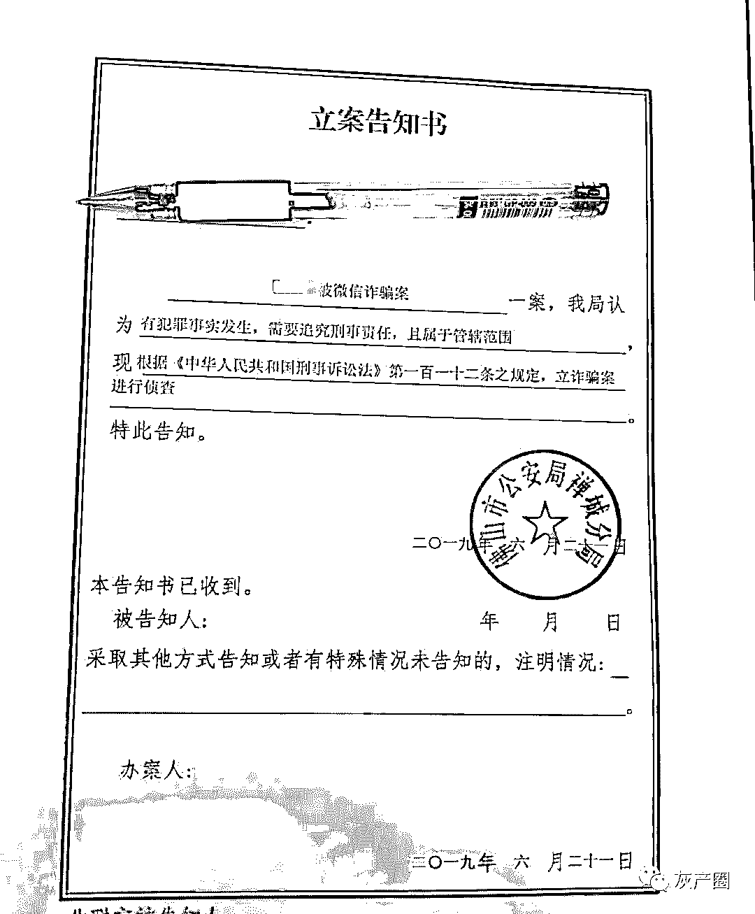
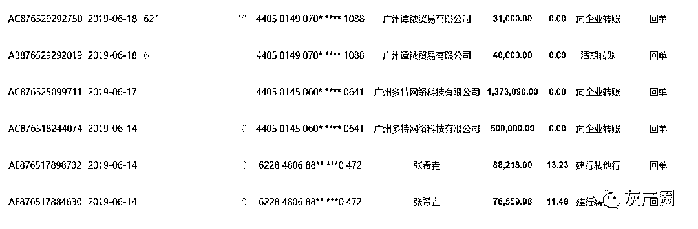
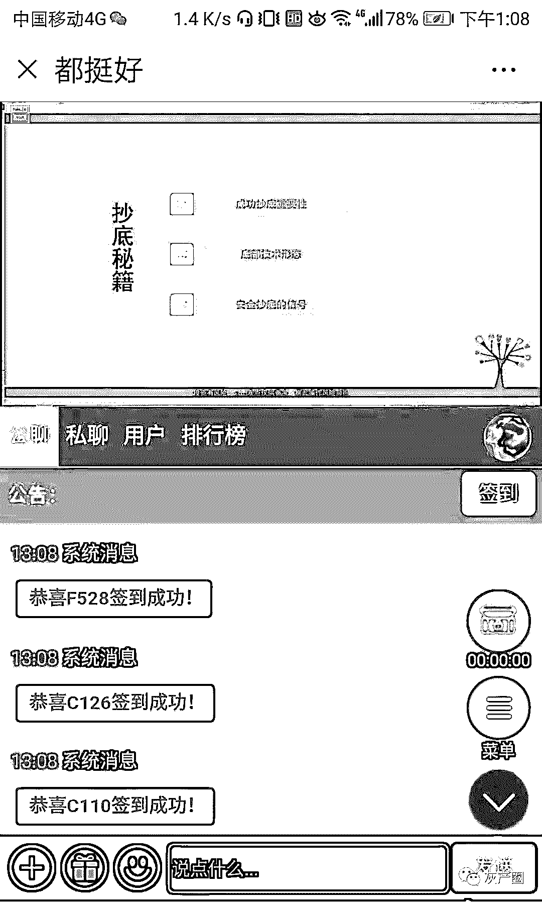
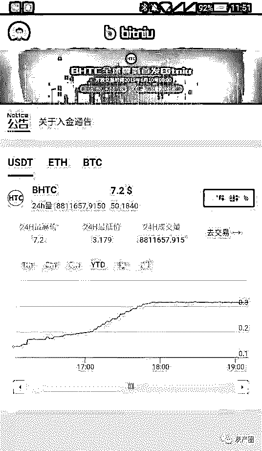
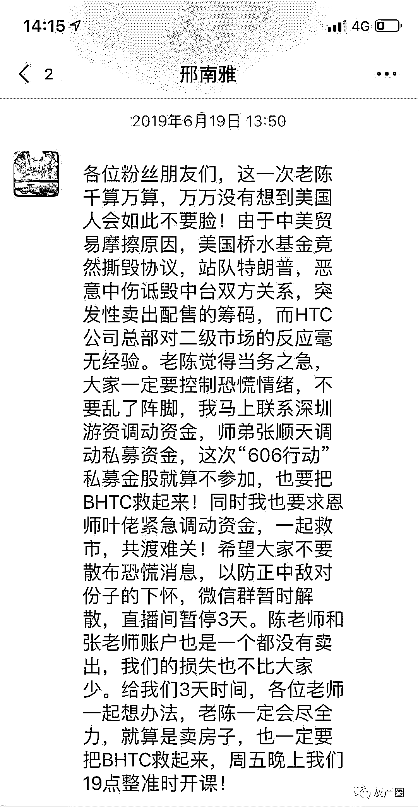
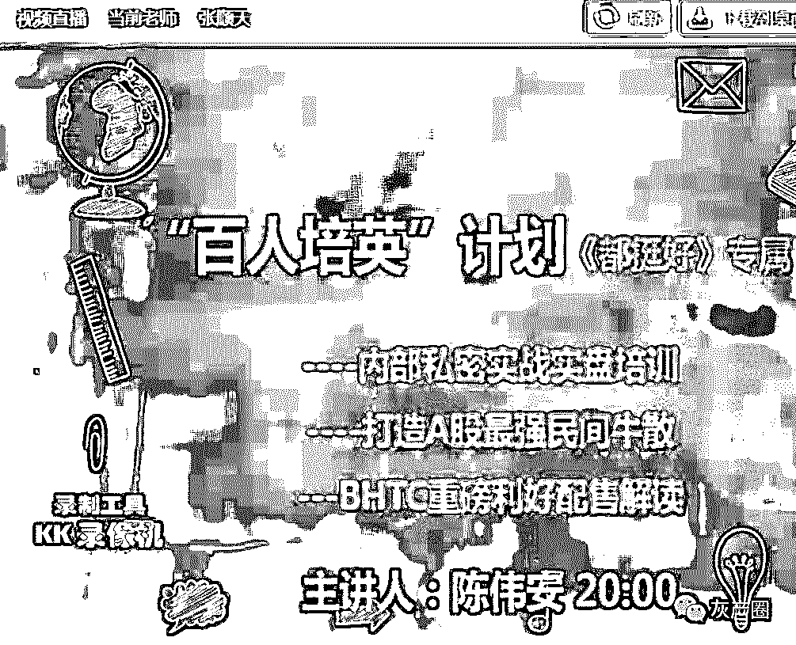

# 我，撒币！韭菜，打钱！

> 原文：[`mp.weixin.qq.com/s?__biz=MzIyMDYwMTk0Mw==&mid=2247495788&idx=1&sn=5e528ff7a725e19d2193c448ec433953&chksm=97cb3b54a0bcb242fb604fd673635cdecd67497359683a296da9da6c28cba5b75b6186f06a3b&scene=27#wechat_redirect`](http://mp.weixin.qq.com/s?__biz=MzIyMDYwMTk0Mw==&mid=2247495788&idx=1&sn=5e528ff7a725e19d2193c448ec433953&chksm=97cb3b54a0bcb242fb604fd673635cdecd67497359683a296da9da6c28cba5b75b6186f06a3b&scene=27#wechat_redirect)

**点击上方蓝色字体免费订阅“灰产圈”**

“我不炒股了，别再打电话过来！”挂掉骚扰电话，在广州家中的 cc 显得有些激动，说：“现在这些电话我是一个都不想听！”

早前，cc 就因为听信了一个推荐股票的电话，一步步被拉入虚拟货币骗局的深渊，不仅拿出积蓄，甚至跟多年未联系的朋友借钱，只想着博一把可以赚点养老费，却没想到在上个月底，十几万元一下子就消失殆尽。

赚钱美梦同时破灭的，还有文森特、李先生等 200 多人，他们分散在全国各地，经历却都如出一辙：先是被陌生人拉到投资微信群里，在长达一个月的时间内，不断观看炒股教学直播，与“老师”们建立信任，再被拉入投资“私盘”中。

在“老师”循循诱导下，他们的股票资金和借款被投入虚拟货币，最终跟着“老师”们一起失踪……

幡然醒悟的被骗者们，才发现原来“老师”们从来未露过脸，除了微信外未留下任何联系方式。信任，成了这个骗局里最美好的笑话。

近日，cc 等人已经向警方报案，广州、佛山等地警方已经立案侦查。

针对近期频发的虚拟货币诈骗案，全国多地警方在网络上发布提醒：

网友加好友拉你进入股票、虚拟货币投资群推荐你转账投资的都是诈骗！

“导师”免费直播荐股

今年 4 月底的某天，cc 突然接到一通电话，自称可以免费推荐股票、教授炒股技巧。炒股 4 年多，却因为行情问题亏了一些钱的 cc，抱着试一试的想法，加上了对方的微信。

cc 先是被拉到一个微信群里，又很快被“分流”到一个微信小群。群里的管理员给了他一个链接，点开后只要输入自己的手机号和管理员提供的密码，就能进入一个叫“都挺好”的直播间。

在股票开市时段和每天晚上 19：30-21：30，直播间都会开启。直播虽然有“老师”的声音，但是却一直看不到人，只有教学 PPT 和老师自己的投资记录。观众可以通过直播间里的对话框跟老师交流。

直播群里的老师会推荐当天的优质股票，并直接指导股民要在哪个时段进行购买，什么时候抛售。“他给的‘指令’非常直接。”同样被拉到直播间里的肇庆人陆先生，一开始并不相信这些所谓的推荐。但是在观察几天之后，陆先生却发现直播间里推荐的股票确实有一定“价值”。

“跟着他们买每次虽然赚得不多，但基本都能有两三个点收益，有时候不准会跌一点，但整体还是赚的。”陆先生说。

而湖南长沙的李先生还告诉我们，直播间个别推荐的股票还出现过涨停的情况，所以吸引到越来越多的散户加入，最多时人数达 15000 人。

很快，cc、陆先生、李先生等人都成了直播间的忠实“粉丝”。

直播间的两个“投资老师”陈伟安、kk，自称是上海私募公司的，主要做游资控盘，分别讲授“游资九诀”和“丈天尺”的炒股技巧，让他们感觉很专业、有帮助。

**神秘的“私盘”**

原本以为可以一直跟着直播间赚钱，但从 5 月底到 6 月初股市的一波连续下调，开始打击着投资者。正在 cc 等人感到焦虑时，直播间的老师们称当前股市行情不好，但是不会放弃他们，会给他们提供新的赚钱“途径”。

6 月 9 日，kk 告诉 cc 等人，其在台湾考察期间，从一家大企业手里拿到内部资料——BHTC 发展计划。

BHTC 是一种“类比特币”的虚拟货币，将于６月 10 日上市全球发放 8000 万枚，发行价 0.14 美元（1 元人民币），其已拿到私募战略配售，之后会有美国桥水基金等多轮资本注入。

6 月 12 日，kk 在直播平台现场演示交易平台 Bitniu（手机 APP）买入的流程，并以 500 万个人资金大量买入。12 日上午 9 点 25 分，BHTC 已经涨到 0.58 美元，相当于两天时间涨了 4 倍以上。

cc 告诉我们，购买 BHTC 所使用的交易平台 APP，要通过微信群里的投资助理才能拿到，注入资金后就能在里面进行购买和交易，但每次注资却要转账给私人账户或公司的账户。

就在一些投资者还将信将疑的时候，陈伟安先是出来“质疑”，告诉投资者们先别急着买太多，并称自己打了 30 多个电话求证，周末要去贵州考察虚拟货币的生产成本。几天后，他就在直播间告诉投资者，“生产成本都要两百多块，你们现在几块钱买入，还有什么需要考虑的？我是全仓买了。”他还晒出了他在平台里的购买记录。

妻子突然提出要购买虚拟货币，引起了白云区从事技术工作的文森特的警惕。文森特在网络上搜索了很久，都没有任何关于 BHTC 币的信息。“而且还是跟私人第三方账号直接转钱，这会不会是骗局？”文森特告诉妻子。

BHTC 币的疯涨，以及一月来建立的信任，最终还是打动了文森特的妻子，小规模地买了 1500 个 BHTC 币。

**一朝崩盘**

根据陈伟安他们的建议，投资者把股票里的钱拿出来，逐步投入到 BHTC 里。不断上涨的 BHTC，让很多人都以为拿到了资本的入场券。李先生就把股票里全仓 267 万全部转投到 BHTC 中。

文森特还记得，在投资了 BHTC 币的那几天里，妻子经常和他说的话是“又涨了”。送完孩子上学，账号多了几千元，做顿饭，又涨了几千……如果投资多点是否能赚更多？这样的冲动，让原本谨慎的他们还是多次增补了购买资金。

8 天时间，从 0.58 美元拉到 7 美元多，很多投资者的资本都直接翻了几倍。更让他们觉得放心的是，几位“老师”告诉他们，“不翻 10 倍、100 倍，达不到 25 到 30 美元坚决不要卖。”

但是，好梦很快就醒了。

6 月 19 日上午 10 时，BHTC 币已经涨到快接近 8 美元，陆先生又注入了 12.8 万元。到了中午 12 时，BHTC 币从 7.9 美元，突然“跳水”暴跌到 0.12 美元，陆先生前后投入的 54 万资金所剩无几。

13 时，直播间如期开播，投资者不断给陈伟安留言，询问 BHTC 暴跌的事情。这时，陈伟安才开始在直播间里询问 kk，然后他们说因为美国的桥水资金撕毁协议撤资，大机构砸盘，所以才会暴跌。

陈伟安在直播间和微信群说，他们要用 3 天时间，联系游资基金、调动私募资金“救市”。“就算卖房子也要把价格拉回来。”他们还称，为了防止敌对分子攻击，要解散微信群，暂停直播，等到 21 日晚上再开直播“开课”。

很快，cc 他们都被清出了直播间。他们突然醒悟：原来他们一直信任的人，从头到尾都没露过脸，也没留电话。

过了一天后，微信里那些投资老师和助理，再也没有回复他们的信息。

6 月 21 日晚上 7 时，cc 抱着些许期望，准时守在手机前。只是直播间里熟悉的画面，却再也没有出现过……

**梦醒：投资者四处报案**

文森特把 BHTC 币的骗局从头到尾梳理了一遍，发到了网络上。很快，各地被骗的网友纷纷联系他。当大家不断把信息汇聚到一起的时候，骗局的全貌才逐渐浮出水面。

他们发现，受害者有来自哈尔滨的，也有来自海南的，可统计的人数超过 200 人。而在前期，他们都被刻意地分散到各个微信群里。每个群里跟他们对接的老师、助理，虽然名字一样，但微信号却不同。仅陈伟安一个人，就至少有 15 个微信号。

之前投资使用的交易平台 APP，已经打不开。文森特猜测，这或许是诈骗者自己设计的一款软件，里面的数据都是他们编造出来的，而他们的资金，也从未进入过这个平台。

现在每天晚上，李先生已经习惯靠酒麻醉自己才能睡着，而即使这样，每天早上四五点依然会醒过来。白头发、体重下降、家庭矛盾随之而来。投资的 266 万元，本来是计划用在自己公司的，但现在李先生只能寻找别的渠道进行融资。

cc 开始躲避各种电话。在他投资的 10 多万元里，除了自己的积蓄外，还有部分是跟亲戚朋友借的。“当初为了能筹集多点资金，连多年没有联系的朋友都打了电话。父亲节儿子给了我 1500 元，我也直接投了进去。”接下来，cc 只能想办法去把这些钱慢慢还上。

目前，受害者已陆续在广东、上海、山东、湖北等地报案并拿到回执，部分人从广州、深圳、佛山、平度、荆州等多地公安部门处拿到了立案告知书。据不完全统计，他们涉及的金额总数接近 3500 万元。

【说法】

**警方**：网友推荐转账投资虚拟货币的都是诈骗

针对这种骗局，近期包括广州、石家庄、抚顺等多地警方均在网络上发布“紧急通报”。广州越秀公安、石家庄警方在微博上明确表示：网友加好友拉你进入股票、虚拟货币投资群推荐你转账投资的都是诈骗！

在今年 3 月，浙江金华警方也通报了一个类似案件——“PCE”虚似货币平台交易。据金华日报报道，去年 10 月份，受害者在接到自称证券客服电话后，被拉入一个股票交流群，进入直播间学习选股知识。随着课程的进一步深入，直播间的老师逐步推出区块链概念，指导学员在该平台上购买“PCE 币”进行虚拟数字货币交易。

在虚拟币成倍增值、“老师”们接二连三的攻势下，受害人投资越来越多。之后在去年 12 月 25 日，“PCE 币”在短短两分钟内暴跌 94%，“老师”们也消失不见。

据金华警方侦查，“PCE”的数字货币只是虚构的“山寨币”，并未在公有区块链上发行。投资者看似在平台上进行真金白银的交易，其实是幕后操纵者在平台后台数据库随意添加的一串数字。实际上，投资者投入的资金早已被幕后操纵者收入囊中。

**专家：“BHTC”币是为诈骗而生的山寨币**

对于这次案件，从事区块链行业的佛山市功夫天下文化发展有限公司 CEO 麦献农认为，这是一个连基本区块链技术都不需要的骗局。

麦献农告诉我们，虚拟币是区块链技术的衍生物，是为区块链应用过程中作出过贡献的一种报酬。正规的虚拟货币应该建立在公链之上，公链有以下特点：共识机制、源码公开、去中心化。

据麦献农分析，这次的“BHTC”币，只是虚构的“山寨币”，并未在公有区块链上发行。设局者先是借口国内不能直接购买到 BHTC 虚拟币，让投资者把钱转到他们的私人账号，再给投资者假的资产去购买。然而投资者看到的行情，其实都是对方通过软件后台进行虚拟操盘，并不是真实存在的。

华商律所高级合伙人律师王艺认为，从犯罪动机上来看，不法分子一开始便以非法占有投资者财产为目的，设计骗局骗取投资者的钱财，属于诈骗行为的可能性较大，涉嫌集资诈骗罪。虽然本案中不法分子是以证券公司等名义进行诈骗活动，但实际上是属于自然人组成的团伙作案，认定为个人犯罪行为的可能性较大。

**律师：通过境外交易所炒币不受法律保护**

对于比特币交易，我国有哪些规定呢？

据了解，2013 年中国人民银行等五部委联合印发的《关于防范比特币风险的通知》和 2017 年中国人民银行等七部委发布的《关于防范代币发行融资风险的公告》（以下简称《公告》）都明确了，比特币是一种特定的虚拟商品；各金融机构和支付机构不得开展与比特币相关的业务；任何组织和个人不得非法从事代币发行融资活动。

《公告》中还指出，任何所谓的代币融资交易平台不得从事法定货币与代币、“虚拟货币”相互之间的兑换业务，不得买卖或作为中央对手方买卖代币或“虚拟货币”，不得为代币或“虚拟货币”提供定价、信息中介等服务。

律师表示，“虚拟货币交易所”在国内进行虚拟货币买卖行为、个人以买卖虚拟货币为业、个人和组织从事代币融资发行活动都是国家所禁止的，而个人通过境外的“虚拟货币交易所”进行炒币、投资 ICO 项目的行为也是不被国家所支持，如果投资者因此遭受财产损失也只能风险自负。

【作者】 陈彧

【来源】 南方报业传媒集团

← 向右滑动与灰产圈互动交流 →

**阅读原文加入灰产圈高端社群**