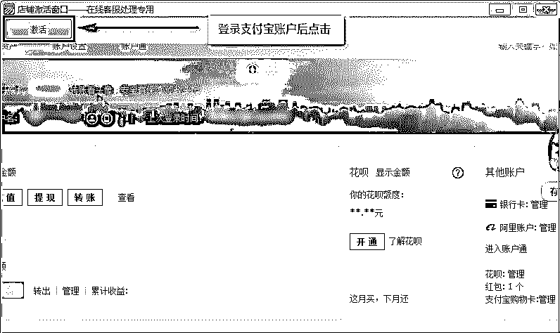
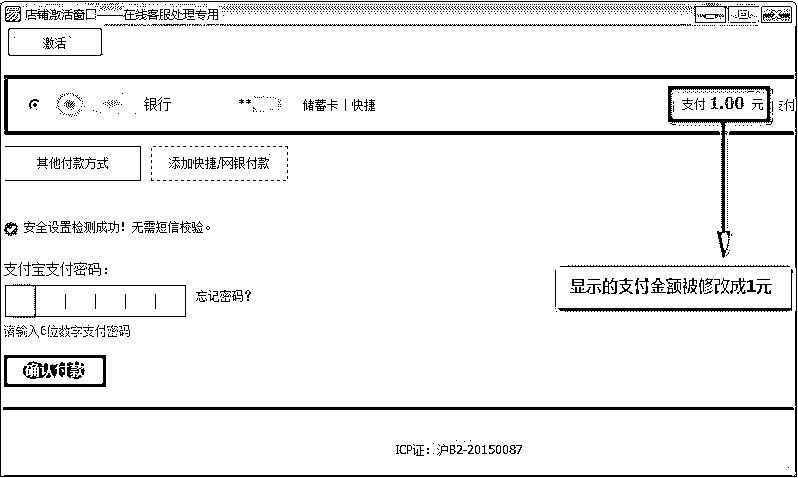
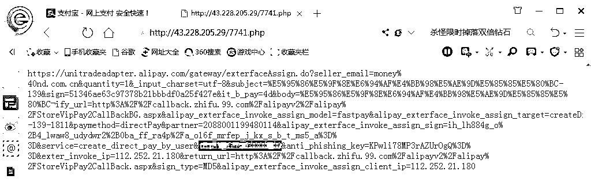

# 揭秘“支付木马”：巨额黑产背后的操盘手

> 原文：[`mp.weixin.qq.com/s?__biz=MzIyMDYwMTk0Mw==&mid=2247495713&idx=1&sn=12261cfa4848080e13771b726a4f0855&chksm=97cb3b19a0bcb20f27df50a166d116f06b55c2e35ad159e4e383ece41646688f946ce3d390ca&scene=27#wechat_redirect`](http://mp.weixin.qq.com/s?__biz=MzIyMDYwMTk0Mw==&mid=2247495713&idx=1&sn=12261cfa4848080e13771b726a4f0855&chksm=97cb3b19a0bcb20f27df50a166d116f06b55c2e35ad159e4e383ece41646688f946ce3d390ca&scene=27#wechat_redirect)

**点击上方蓝色字体免费订阅“灰产圈”**

作者：360 安全卫士，安全客

近日，360 安全大脑收到 1688 电商平台卖家反馈，称有人伪装成平台客服，打着交易的幌子盗取资金，短短几分钟内被盗金额就高达 49000 元，经过排查，幕后黑手竟是一款伪装成“激活工具”的木马。

一般我们网上购物时，一旦填错地址或购买数量，会跟卖家沟通要求更换新地址或者取消之后重新下单。这原本只是一个正常的交易往来过程，但却正是本次支付木马事件的源头。

**盘踞在买卖交易中间的“官方客服”** 

在上述买卖交易过程中，拍错商品的买家在二次下单时，会联系卖家说下单失败，显示错误。同时，黑产团伙的另一个账号伪装成 1688 电商平台的“客服人员”来联系卖家，并欺骗卖家其关闭交易的行为导致店铺账户和买家账户均被锁定，需要添加“客服人员”的 QQ 来处理。

**“关闭交易的行为导致店铺账户和买家账户均被锁定，请自行添加工作人员进行解除”** 

前脚关闭了顾客交易订单，并且还收到了来自用户的“无法下单“反馈，“客服人员“后脚就来通知账号锁定情况，经过这样一番里应外合的”钓鱼操作“，卖家自然信以为真，接下来便一步一步的落入了圈套。

添加“客服”QQ 号后，“客服”一般会要求卖家通过 QQ 语音电话交流，这样就可以不留下任何文字性的聊天证据，之后“客服”再提出通过 QQ 远程协助的方式，“帮助”卖家解锁账号。

“客服”在 QQ 发来一个所谓的“激活工具”，告诉卖家需要通过“激活工具”来解锁账户，事实上这个激活工具就是导致受害者上当被盗超额资产的关键木马。 

**②驻守在虚假网站上的“支付木马”**

当信以为真的卖家在电脑上运行该“激活工具”之后，首先会显示支付宝登录页面，黑产团伙引导卖家退出已登录账号并用手机扫码重新登录。

登录支付宝账户后，“激活工具”会显示账户信息，黑产团伙则会引导受害卖家点击工具左上角的激活按钮开始进行支付跳转。 

点击完激活后，“激活工具”会弹出一个提示，催促卖家尽快完成支付进行账户激活：

接着“激活工具”会跳转到一个付款界面，该界面的支付订单链接实际上是程序刚启动时就从远程服务器生成并获取得到的，此时由于窗口大小的限制无法看到具体付款产品的信息，只能看到待支付金额 1 元，此金额并不是实际订单金额，而是“激活工具”的障眼法，通过显示虚假的小额支付信息迷惑受害者，使其放松警惕进行支付，实际上受害者支付的订单金额可以上千甚至上万。

从下面的支付链接我们就能看到该订单的实际支付金额为“20000.00”（2 万）元。

**③迷失在钓鱼诈骗中的受害者**

就在我们对“激活工具”分析的期间，该黑产团伙仍然还在实施诈骗，并且不断有新的受害者出现。如下所示是两例从“激活工具”访问的远程服务器发现的已支付交易链接。

黑产团伙屡屡得手，并非没有缘由。从假意购买到伪装客服，受害者上钩之后，明修栈道、暗度陈仓，利用虚假网页诱骗卖家主动支付巨额费用，整个诈骗过程可谓环环相扣，几乎毫无破绽。 

为了掩人耳目预防万一，黑产团伙并不会直接向自己的支付宝进行转账，而是会购买各大购物平台的虚拟储值卡（如当当、网易严选等）和网络游戏货币（如网龙游戏币、光宇币等），并生成随机的大金额支付宝订单。下图是“激活工具”远程生成的其中一个当当礼品卡付款链接，该交易订单实际上需要用户付款 9000.00（9 千）元。

此外，平台卖家缺乏安全意识也是黑产团伙屡骗屡胜的一个重要原因。其实，若受害卖家在输入密码前更加慎重一些，比如查看一下手机支付宝的账单，也能够发现此交易订单背后的陷阱，下图为上述订单对应在手机支付宝上的实际账单。 

在此，360 安全大脑提醒广大用户，遇到自称官方人员主动联系自己的时候，首先要通过官方联系方式去确认对方的身份，切勿轻易相信；同时可下载安装 360 安全卫士，拦截各类钓鱼网站病毒木马，保护个人隐私及财产安全。

当下，网络技术激荡全球，世界发展的底层逻辑正在重构，物理世界与网络世界的边界逐渐消失，高速发展的网络在给人们提供无限便捷的同时，也成了新威胁的沃土，网络犯罪、网络诈骗正借此机会野蛮生长，网络安全正在面临全所未有的挑战。360 作为国内最大的安全厂商，凭借过硬的技术实力与数据积累，正在不遗余力为万物智联的大安全时代保驾护航。

← 向右滑动与灰产圈互动交流 →

**阅读原文加入灰产圈高端社群**