# 毒打、性侵、被囚禁 17 年......这不是恐怖片，这是他们的人生

> 原文：[`mp.weixin.qq.com/s?__biz=MzIyMDYwMTk0Mw==&mid=2247495707&idx=1&sn=9a7cf52a35f2227ed6f7948f32c34148&chksm=97cb3b23a0bcb23513647620770cdc3ab66506b7608cae0fdc23409457df086d6f01e2931a09&scene=27#wechat_redirect`](http://mp.weixin.qq.com/s?__biz=MzIyMDYwMTk0Mw==&mid=2247495707&idx=1&sn=9a7cf52a35f2227ed6f7948f32c34148&chksm=97cb3b23a0bcb23513647620770cdc3ab66506b7608cae0fdc23409457df086d6f01e2931a09&scene=27#wechat_redirect)

**点击上方蓝色字体免费订阅“灰产圈”**

我听过这样一个丧心病狂的恐怖故事。

有位年轻的妈妈在楼上晾衣服，透过窗户，她猛然发现陌生男子正与自己 5 岁的女儿在楼下搭话。

她撂下电话跑下楼时，已经空无一人了。

往后十年间，她从未停止过对女儿的寻找。

最后，她竟在大街上看到了被截肢双腿，割掉舌头，沿街乞讨的亲生女儿。

有一种爱叫刻骨铭心，有一种痛叫骨肉分离，有一种恨叫撕心裂肺，有一种思念叫日夜煎熬。

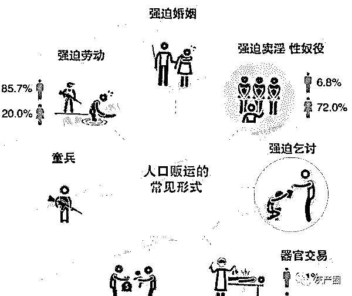

电影《失孤》里有这样一句台词刺痛无数父母：

“孩子来了，缘聚，他走了，缘散；你找他，缘起，你不找了，缘灭。”

对于那些被人贩子拆散的家庭来说，寻找，就成了父母后半生唯一的执念。

有的人到死也无法见上孩子一面，甚至要眼睁睁看着骨肉被恶魔掠夺。

一个寻常的午后，有位穿蓝色短袖的父亲，正牵着孩子散步。

突然，身后走上来一个陌生女人，二话不说就要拉走他的孩子。

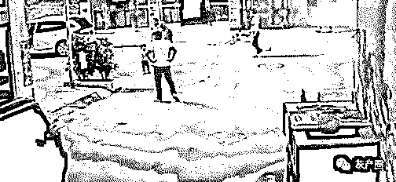

他立马警觉起来，断定这女人就是人贩子。

可是，正当这位父亲拼死从人贩子手中抢回自己的孩子时，令人毛骨悚然的意外发生了。

路人们纷纷涌上来，并不是来帮他，而是帮人贩子抢孩子，他们竟然是同伙。

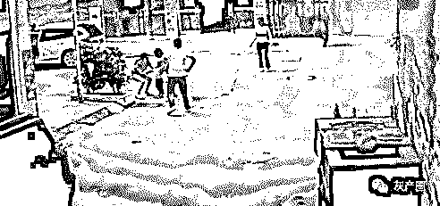

他们对手无寸铁的父亲拳打脚踢，边打还边破脏水：

“快来抓人啊，坏人要抢孩子了！”

他们恶人先告状，栽赃嫁祸，为的就是打消别人来帮这位父亲的念头。

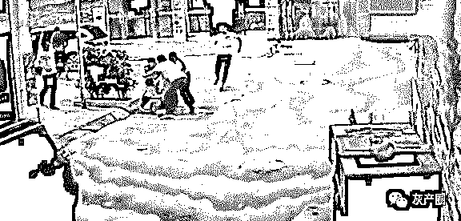

最后，一群人贩子合力将孩子抱上了等候已久的蓝色轿车。

从此音讯全无，不知去向。

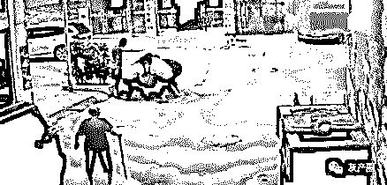

只留下一位可怜的父亲，叫天天不应，叫地地不灵。

只能眼睁睁地看着孩子被拐卖抢走，何其悲哀，又何其无助。

伪装、演戏、暴力、信口雌黄，这不过是罪恶的冰山一角，他们阴险狡诈，丧心病狂。

人贩子最常见的套路，便是顺手牵羊地诱拐。

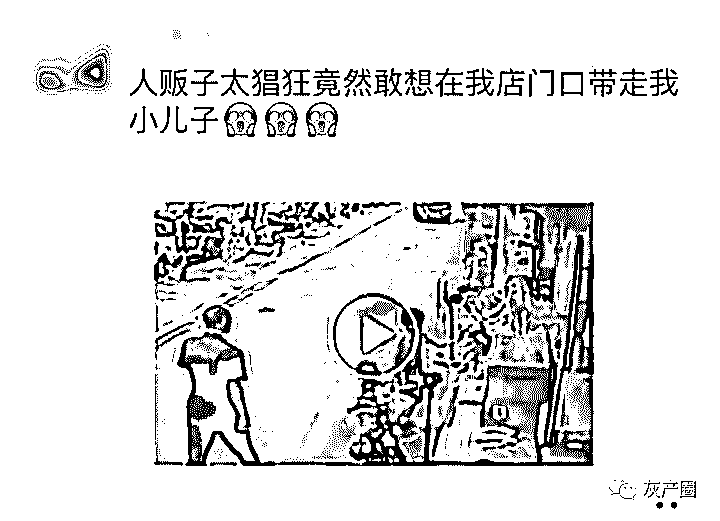

几个小孩在店门口玩耍，路过的人贩子竟然猖狂得顺势牵起一个孩子就要拐走。

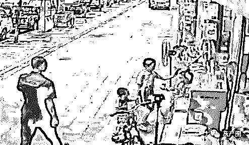

幸好孩子的哥哥反应快，立刻上前拉回了弟弟，否则一个家庭就这么破碎了。

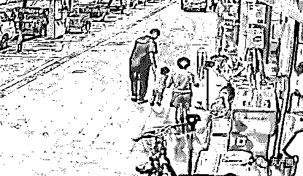

除此之外，人贩子会瞅准没有父母陪同的孩子下手，直接进行暴力抢夺。

有个孩子蹦蹦跳跳买完东西回家，被一双手一把拽进了胡同，没了音讯。

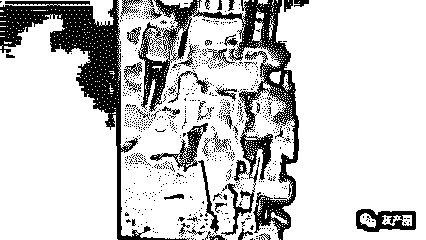

人贩子往往还擅长无缘无故套近乎，让受害者放松警惕，趁机下手。

网上曾有一部剧，有个人贩子装作好心大姐，假意上前要帮刘涛饰演的母亲抱一抱孩子。

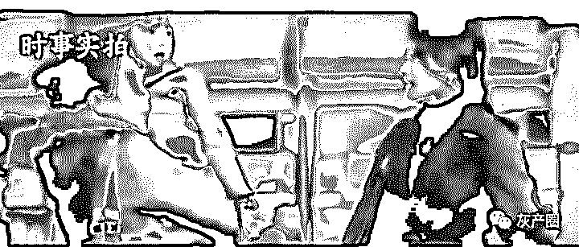

没过一会，人贩子便消失在纷扰的人群之中。

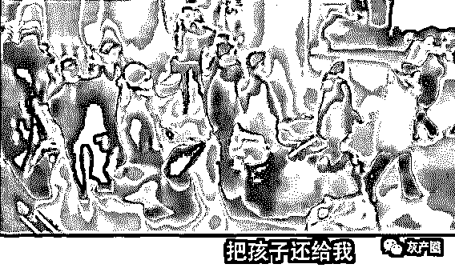

结果，当她想要夺回孩子的时候，却被一个陌生男人拦住。

那人假装成他的丈夫，人贩子假装成他的婆婆，破口大骂：

“你想带着孩子找野男人是吧。”

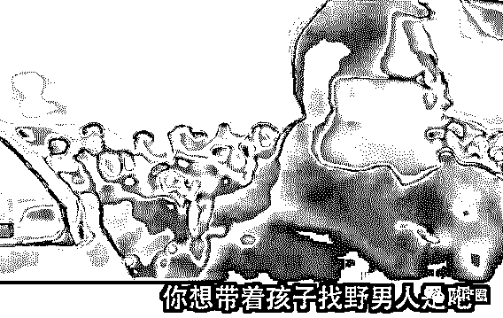

周围没有一个人敢上前劝阻，都以为这只是一场家庭内部争端。

丧心病狂的人贩子不仅仅是在大街上，连医院都成了他们的下黑手的战场。

有位网友曾讲述了一起骇人听闻的医院拐卖事件：

“产房医生查房时嘱咐一定要两个人陪护，一个人护理产妇，一个人看紧孩子，锁好房门。

有对小夫妻，只有公婆在这伺候着。

结果第二天，一位身着白大褂的人来病房说要给孩子打卡介苗。

家人就放心地让他把孩子抱走了，结果就再也没回来。”

世间最残忍的疏忽莫过于，孩子前一秒还在自己眼皮底下，后一秒就被带往魔窟。

人贩子的骗术，升级了一次又一次：

谎称自己遇到了麻烦，需要帮助，利用孩子的善良进行诱拐；

假扮外卖小哥或快递小哥，谎称有个快递落在楼下，骗孩子一同下去取；

尾随带孩子的家长，伺机而动，周围遍布人贩子的同谋；

大喊大嚷故意制造骚动，一个人牵绊住孩子父母，另一个趁乱掳走孩子；

甚至还有人盯上了经常晒娃的家长，通过朋友圈获取孩子信息，以此来骗取家长的信任。

马克思的《资本论》里有这样一段话：

“当利润达到 10%的时候，他们将蠢蠢欲动；

当利润达到 50%的时候，他们将铤而走险；

当利润达到 100%的时候，他们敢于践踏人间的一切法律；

当利润达到 300%的时候，他们敢于冒着绞刑的危险。”

恶鬼横行的乱世不可怕，可怕的是人心坏透，利字当头。

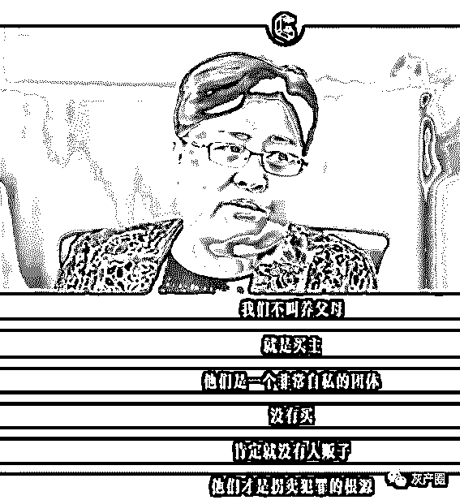

人贩子毁掉的何止是一个家庭，更是成千上万孩童悲惨的一生。

在他们眼里，孩子不是孩子，孩子是商品，是利润，是可以任人宰割的猎物。

他们可以被凌辱，被打骂，被铁链捆绑。

甚至被砍断双手双脚，戳瞎双眼，泼上浓硫酸，把健康的孩子活生生摧残成残废。

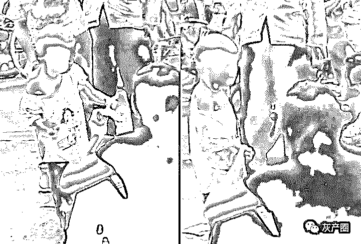

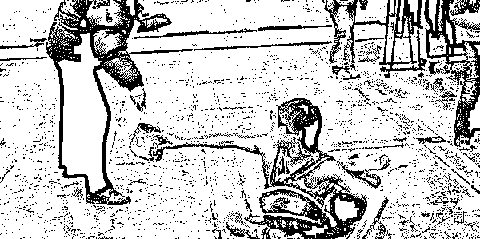

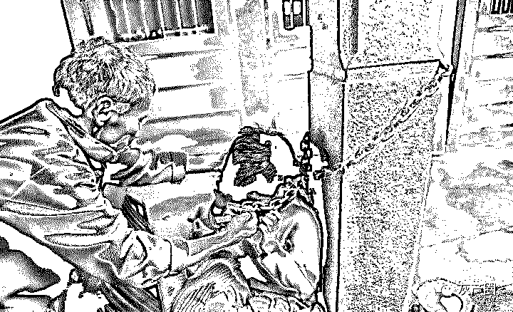

被拐卖的孩子小小年纪，还没发育完全，就被人贩子和买主肆意凌辱，甚至成了雏妓。

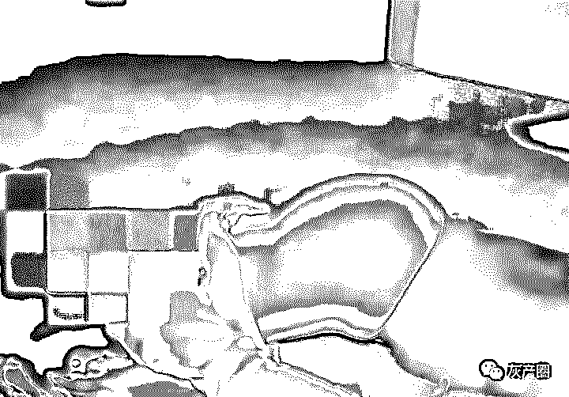

三年前，徐州有一男一女带着一个还未发育的产妇来产检，谎称她 20 岁了。

医生一看就有猫腻，这个产妇一看就是个小孩，大着的肚子与她青涩的样貌完全不相符。

警方调查后发现，这位产妇只有 12 岁，当初以 3 万的价格卖给了一个 30 多岁的男人当老婆。

经历过多次令人发指的强奸后，女孩怀孕 3 个月。

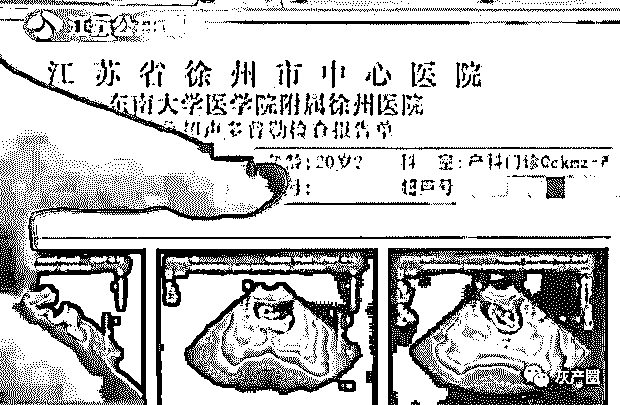

人贩子隐匿于暗处，猖獗地对我们的孩子虎视眈眈，还把魔爪伸向了疏忽大意的年轻女孩。

2000 年时，正在读大一的姑娘何成慧被人贩子拐卖，被一个 55 岁的老头囚禁了 17 年。

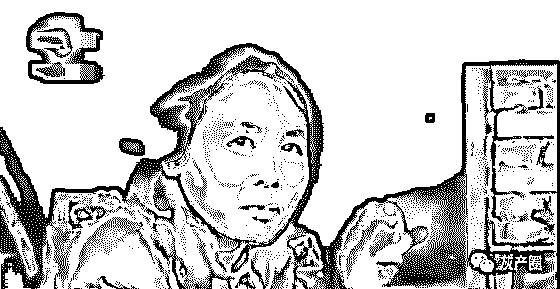

17 年前，这个矮小的老头花了 120 元从人贩子手里买来她当老婆。

一直囚禁她，不仅没有床，连被子都没有，何成慧被折磨得神志不清。

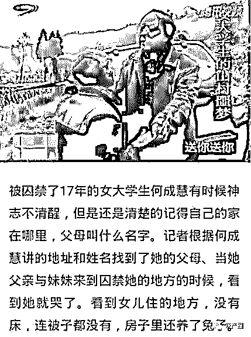

当女孩父亲前来搭救时，老头竟还恬不知耻地叫何成慧的父亲“爸爸”。

被拐卖进大山里的女人如果生不出孩子，可能会被再次卖掉，男人会重新买一个回来。

但倘若买来的女人容易受孕，下场更惨，她们会被无情地当作生育机器。

电影《盲山》中有一个片段让人格外揪心：

女大学生白雪梅，被卖给了偏远山区的 40 岁老光棍当老婆。

有一次，她趁其不备逃了出来，好不容易上了开往城外的大巴车。

结果，老光棍追了上来，白雪梅哭着哀求司机不要开门，救她一条命。

老光棍给司机递了支烟：

“我老婆跑了，我要上去看一下。”

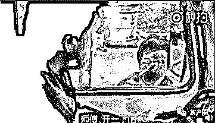

最终，司机打开了门。

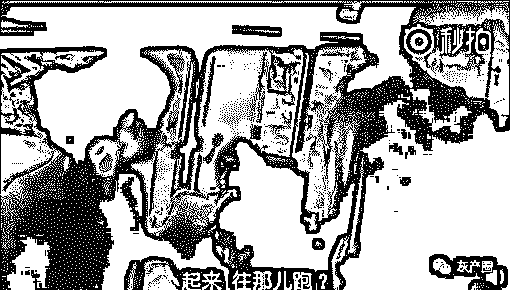

所有人都听见了她死命的哀嚎，可没有一个人救她。

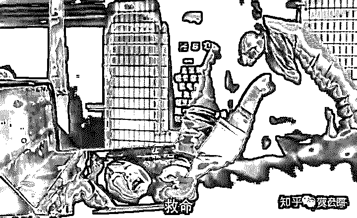

白雪梅被狠狠地拽了回去，等待她的，是日复一日的毒打、性侵和人间炼狱。

“每一天，年轻的女孩都在被买卖着。”

第一次看到这话时，不禁脊背发凉。

总觉得拐卖离我们很遥远，总以为自己不会上当受骗，总侥幸厄运不会降临在自己头上。

可实际上，真正的危险总是戴着虚伪的面具。

“媳妇别闹了，跟我回家。”

如果在大街上听到有人喊了这么一句，大多数人都会置若罔闻，以为又是两口子吵架，不便插手别人家事。

但实际上，这是一场强行拐卖女孩的骗局。

人贩子伪装成女孩的“丈夫”，故意大声叫她“媳妇”，上前强行拉拽，女孩被吓懵了，搞不清楚状况。

惊魂未定的她向周围人求救，用力挣脱：

“救命，我不认识他！”

此时，周围有一波所谓的路人前来解围，女孩像抓住救命稻草一般，疯狂解释自己危险的处境。

于是，一拨人负责驱赶假扮丈夫的人贩子，另一拨人谎称保护女孩，把她带到安全的地方去。

殊不知，解救她的人和人贩子是一伙的。

被带走的女孩，难逃魔爪。

知乎上还有位姑娘走在街上，被一对可怜的老夫妇抓住了衣角。

他们自称很多天没吃饭了，肚子很饿，请求姑娘带他们去吃饭。

她一心软便答应了，准备去麦当劳。

可两位老人谎称不想让姑娘破费，执意要去附近一家破旧的拉面馆。

姑娘有些存疑，准备给他们一点钱，可老人不要。

等姑娘靠近那家店时，发现胡同里门庭冷落，窗帘也虚掩着，灯光黯淡。

她撒腿就想跑，两位老人露出了狰狞的本色，一个劲把她往屋里拖。

其实，那家所谓的拉面馆，就是人贩子团伙的聚集地。

只要姑娘踏进店里一步，直接门一锁，嘴一捂，手一绑，好点的用药弄晕，不讲究的直接给几棍，绑上车，卖出去。

善良有什么错，错的是那些利用善良的恶魔，一旦上钩，善良就变成了刺向胸膛的利刃。

世事险恶，人心难测，被人贩子盯上时，他们有他们的套路，我们也一定要有自救的能力。

倘若人贩子假装成家庭矛盾让你百口莫辩，没有造成路人围观时，你可以找准一个路人，试图损害他的财物，他一定会驻足索赔，制造更大围观；

倘若遇到暴力抢夺孩子的不法分子，不要说“我不认识你”，而是要简洁地告诉路人“人贩子，快报警”，让群众帮忙拦下人贩子；

倘若遇到强硬棘手的人贩子，试图用暴力制服拖走你，不要大喊“救我”，而是要大喊“着火了”“地震了”来引起恐慌和围观。

人口拐卖绝不亚于杀人，甚至那就是在杀人，它不仅仅是犯罪，更是在践踏人性。

他们之所以日渐猖獗，不痛不痒的惩罚成了他们铤而走险的理由。

根据我国现行法律，拐卖妇女儿童仅仅处五年以上，十年以下有期徒刑。

但在我看来，人贩子判死刑都不为过。

人要是死了，痛苦可能也随之消逝，但人要是活着，整天活在思念之中，那叫生不如死。

没有人一辈子生活在象牙塔，我们走的每一步都踏在人间和地狱的缝隙处。

永远别高估人性，永远别低估危难，杀不死肮脏，但我们可以尽力自保，不再重演悲伤。

转发给你爱的人，让他们无论身在何处，都要警惕风险，平安回家。

← 向右滑动与灰产圈互动交流 →

**阅读原文加入灰产圈高端社群**