# 微信《将军令》：严打之下，“灰色流量”，去往何方？

> 原文：[`mp.weixin.qq.com/s?__biz=MzIyMDYwMTk0Mw==&mid=2247495676&idx=1&sn=fd0f050a1e12f54cb090d377cebaafb8&chksm=97cb24c4a0bcadd2b0e4346a9163fd1390bdd14e0f18076c815b9459e23f1ecbf88d51176340&scene=27#wechat_redirect`](http://mp.weixin.qq.com/s?__biz=MzIyMDYwMTk0Mw==&mid=2247495676&idx=1&sn=fd0f050a1e12f54cb090d377cebaafb8&chksm=97cb24c4a0bcadd2b0e4346a9163fd1390bdd14e0f18076c815b9459e23f1ecbf88d51176340&scene=27#wechat_redirect)

**点击上方蓝色字体免费订阅“灰产圈”**

我知道对有什么不对  我知道将军说话不一定对

我知道对或错我自己能分辨  请你安静点 请你安静点

歌名：《将军令》

导语

对于微信流量圈人来说，7 月 2 日这一天可能是个很特别日子。 

下午四点半左右，微信疑似进行了一次大规模微信号清理打查行动，很多微信个人号主辛苦经营十多个外挂账号一瞬间全凉了，朋友圈里哀嚎一片。

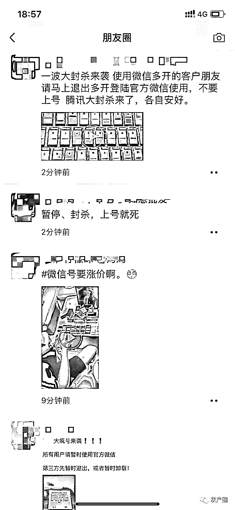

晚上六点，微信官方又发布声明[《到此为止吧，小黄文》](http://mp.weixin.qq.com/s?__biz=MzIyMDYwMTk0Mw==&mid=2247495665&idx=1&sn=ad1ebfdc75c555a845f5abd87f31bf09&chksm=97cb24c9a0bcaddf228c205dbc2a33c1476508e139f01d844fec31f711f14cea8979038c8b2d&scene=21#wechat_redirect)，坚决打击利用公举号能力推广“小黄文”行为，靠色俗内容赚钱路被堵死。

微信个人外挂和“小黄文”，都是灰色产业、灰色流量典型。微信对灰色流量连出重拳，并不是要置自媒体于死地，但这也意味着，自媒体草莽阶段赚快钱时代终结。

一、“暂停、封杀、上号就死”

[《焦点访谈》](http://mp.weixin.qq.com/s?__biz=MzIyMDYwMTk0Mw==&mid=2247495601&idx=1&sn=4457099e69b889cf8b1c8802e7ede49a&chksm=97cb2489a0bcad9f8e96956f62de42cd38dc2ed6d637243ef39739c2dbba7aabbff9ed176cc0&scene=21#wechat_redirect)前脚点名微信个人号外挂，微信马上响应号召封杀非官方微信个人号外挂行为。 

某些使用外挂工具进行裂变个人号被判了死刑，只要用第三方软件多开账号，就极有可能被封号。

发了多个公告声明后，这次微信是动了真本事。

“严打灰色流量”是这次行动潜台词，微信无法对个人号外挂、色情小说视而不见，想要保证用户不被骚扰，就要大力整顿平台秩序。

不过，微信打击只是灰色产业链，并不是对所有微信号赶紧杀绝。

二、“小黄文”到此为止

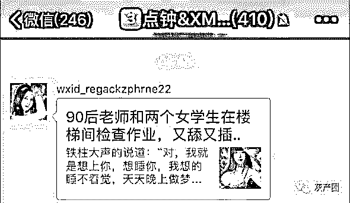

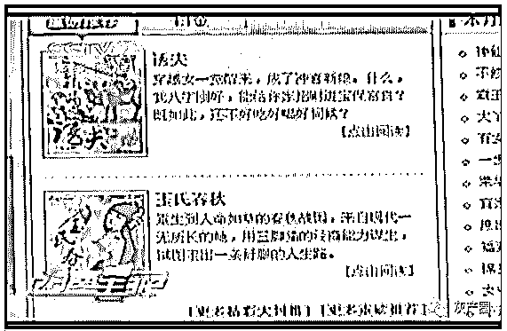

微信官方通告介绍说，2019 年以来，微信对违规内容打击力度不断加大，处置了 6.6W＋个违规小说账号。这也体现了平台肃清阅读环境决心。 

APP 主页、微博推荐、网页广告、短信链接……“小黄文”无处不在，甚至某些公众人物也围观了一些色俗话题。

这些“小黄文”低俗不堪，被用户诟病已久，能始终能存活一个重要因素就是，这类文章背后有完整产业链。

以某奇艺和微博为例，用户在主页浏览信息时会被推荐色俗小说。文章标题大胆露骨，挑逗性强。

用户进入内文后，阅读内容会被限制，需要关注公举号才能继续阅读。

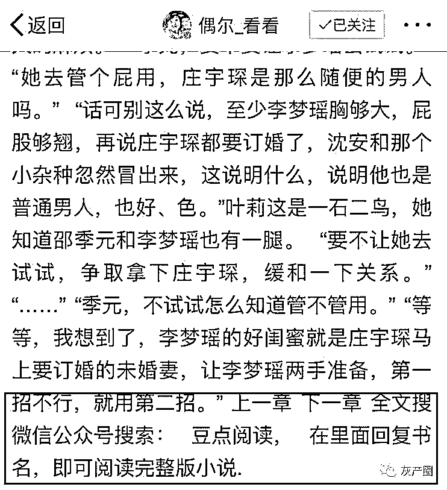

**微博某色俗文章文末导流**

为了降低读者关注成本，有些文章还提供“自动复制公举号 ID”选项，用户只需点击按钮就会自动跳转到微信页面。

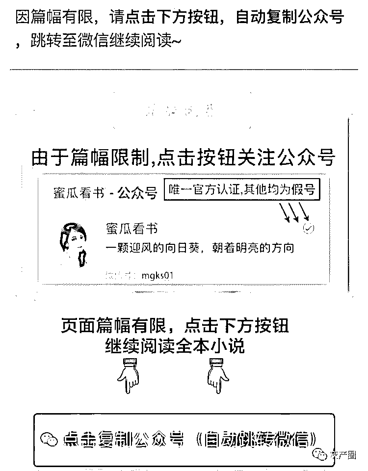

**爱奇艺某色俗小说文末导流**

为了避开平台规则，这类公举号不会直接发布小说内容。用户关注公举号后，回复数字就会得到相关链接，跳转至外部网站。

小说并非免费，阅读到一定章节就需要充值。此外，这类公举号菜单栏都嵌有自己商城，内容也多是色俗小说。

**充值提醒**

为了蒙蔽读者，色俗小说公举号还制作高仿“投诉”页面，并要求读者填写手机号，这很容易泄露用户隐私。

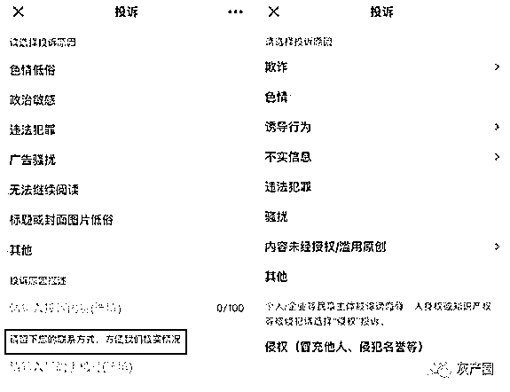

**左为高仿投诉页面，右为微信官方投诉页面**

**高仿页面制作多用到“防红短链接”，以避开微信拦截**

三,大规模封号是假？

7 月 4 号 9：02 微信官方号：微信派 发布文章《这篇你没太看懂，那恭喜你了》，针对近期微信号大封号情况做出了说明。这还是第一次微信官方媒体公开说明微信号封号说明，大概意思就是：我们动真格了！

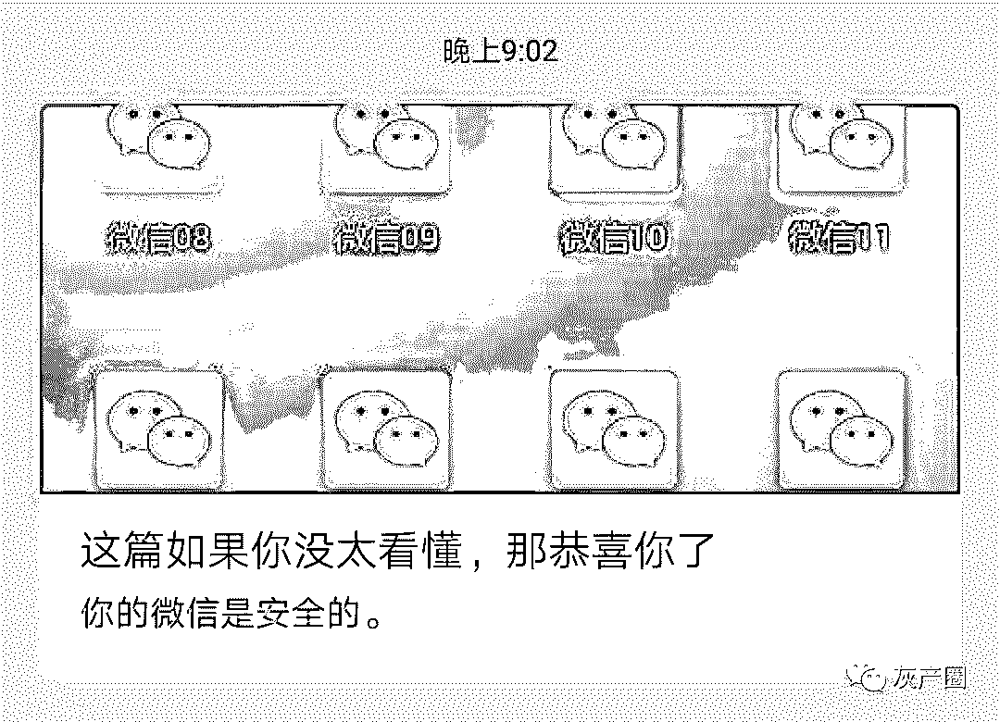

**以下是正文内容：**

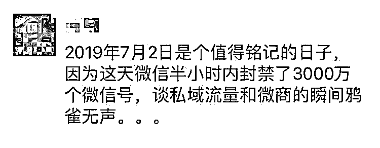

派爷很负责任地告诉大家：大规模封号是假。 

但重拳打击用外挂违规号，是真。

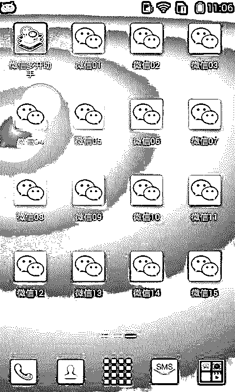

这是外挂一种，叫做“多开微信”，微信也有帐号切换登录功能，只是没办法让这么多微信同时登录。**其实看似功能更丰富“多开微信”，并不是微信官方正版，而是山寨微信**。

**除了“多开微信”，还有这些常见微信外挂类型：** 

**一类是以各种噱头诱导用户直接下载使用，比如：** 

****○**一键转发朋友圈：**可以批量转发朋友圈图文以及好友发送过来小视频；

****○**Android 模拟器：**在电脑上模拟手机端登录微信，实现和微信手机端一样操作；

****○**红包外挂：**当微信收到红包消息之后，自动完成微信抢红包操作；

****○**皮肤微信：**可以更换微信 logo 图标，自定义微信主题；

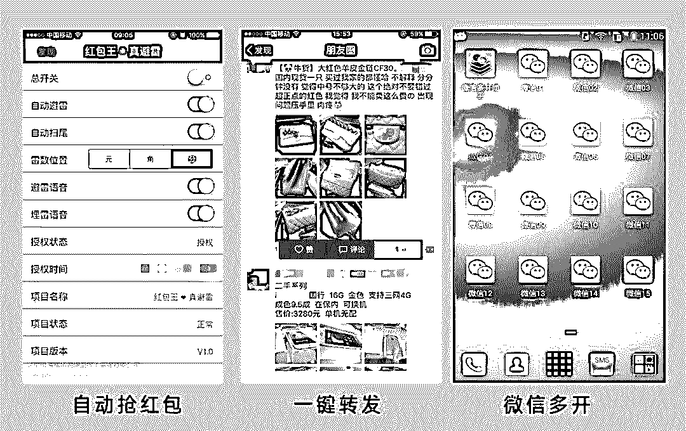

**另一类是利用群控外挂技术开发外挂，通常被包装成“微营销”神器：** 

****○ ****通过虚拟定位、批量打招呼等方式，实现批量添加好友，自动化批量发朋友圈，一键点赞，一键评论等功能； 

****○ ****所谓“微信群营销功能”，如实现定时群发，自动回复，自动聊天等控制功能；

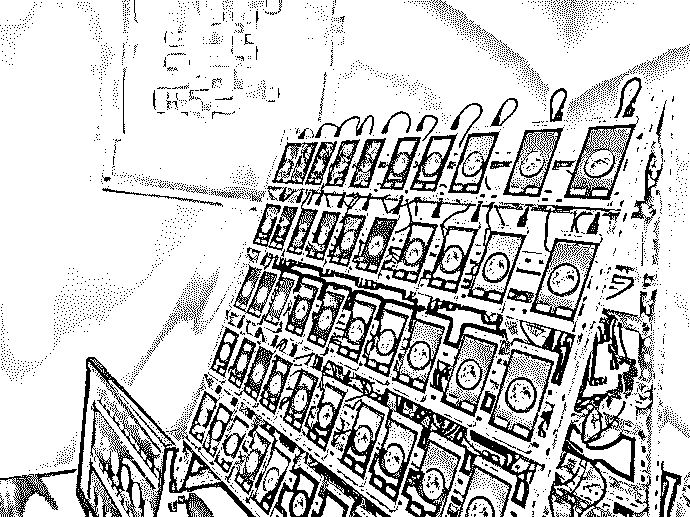

（微信群控技术背后操作场景）

总而言之，微信外挂，就是开发者用来篡改微信正常功能使用工具，目是给微信增加一些乱七八糟"新"功能，比如多开微信、朋友圈一键转发等……其实是为了大规模发送广告或诈骗信息，风险不容小觑。

以上这些，**如果你觉得没看太懂，说明你没有使用过外挂微信。**那么恭喜你，你微信还是安全。

**如果你正在使用微信外挂，这些风险你需要了解：**

**○被利用骚扰别人：**微信外挂常被用于恶意营销，说不定自己帐号就“被变成”每天发小广告工具了； 

**○助长坏人犯罪：**容易被违法犯罪分子利用，用以发布不良信息、实施欺诈，不小心自己就成了帮凶了；

**○有隐私风险：**外挂软件存在收集泄露用户隐私信息、盗取用户帐号密码等风险，实在用不得；

**○威胁财产安全：**使用外挂还可能被坏人利用，威胁自己资金安全；

**○影响使用微信稳定性：**外挂微信不是官方正版，使用起来容易出现各种各样 bug，甚至丢失聊天记录，影响体验。

**对于使用外挂帐号，我们将重拳打击：**

对明确使用外挂功能帐号，我们将根据违规程度按照阶梯性处罚原则，包括但不限于**限制朋友圈、加好友、打招呼等功能，限制登录等形式；****对多次违规帐号，还将加重处罚。**

今年以来，微信已经打击过**上百万个**明确使用外挂帐号。派爷也提醒大家，保护帐号安全，千万别使用外挂。务必从官方渠道下载微信客户端，不要使用具有多开、自动抢红包、一键群发等功能“李鬼”微信，也不要使用其他破坏微信软件协议或具有外挂功能插件及软件。

**重拳打击外挂，我们是认真。但如果只是正常使用微信用户，也不用感到恐慌。**如发现有人使用微信外挂软件，欢迎通过微信客户端、腾讯 110 小程序进行投诉。

come from

微信派

微信封号警告？赶紧查下你的微信号！

7 月 2 日同一时间，我们突然收到了很多粉丝的私信，说微信突然被封了，提示“**涉黑涉暴、色情、非法博彩、诈骗等违反法律法规的内容**”，但自己完全没有这样的行为啊!

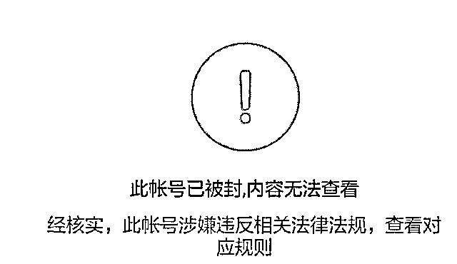

看完粉丝的描述，让我们想起了央视的一条新闻... 

简单来说，**就是不法分子通过买卖微信号，参与各种博彩、诈骗等不法行为**。 

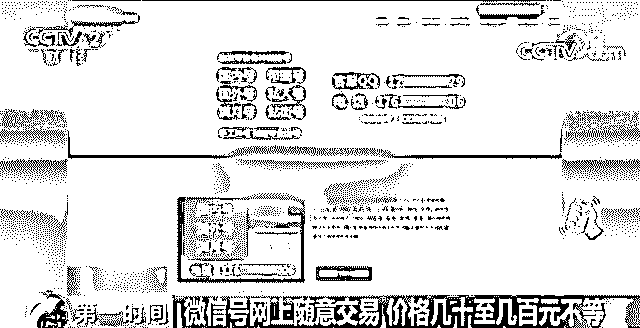

看到这里，大家可能要问了，那上面的情况和自己被封号有什么关系？别急，让我们给大家理一下上面的逻辑。 

如果只是注册微信号，相信大家都知道，只要手机号码就可以了。

但要开通支付功能（废话，不开支付功能诈骗完怎么收钱？），就必须先实名认证。

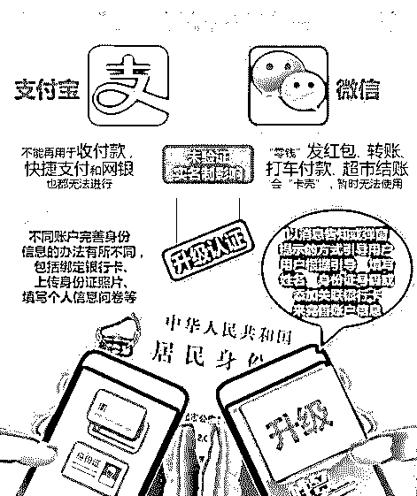

一个身份证只能绑定 5 个微信号，而且不法分子也不会蠢到用自己身份证认证的微信来做坏事，**所以，买身份证信息来注册就成了必然**。 

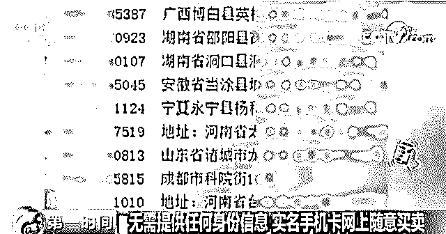

那么身份证一直在自己手上，想被人冒用也不容易吧？错，其实真的很简单！大家不妨看一下对于实名认证客服的回复。

客服人员说：身份信息被冒用绑定微信的情况比较常见。“**对方只要知道你的名字和对应的身份证号码，在绑定微信支付的时候就可冒用**。而如果对方要绑定你的身份信息下的银行卡则比较难，因为需要银行预留手机号码的验证短信。”

所以说，按照我们现在的隐私保护情况...**大家随便寄个快递、住个酒店，你的身份证信息早就可能暴露了**。

如果坏人冒用来搞电话诈骗什么的，**封号可能都是小事，分分钟可能还要被追究刑事责任。** 

当然，微信实名认证的漏洞我们是无能为力了...但是！**查询还有清除非自己认证的微信号，我们千万不能偷懒。** 

其实，方法也很简单，我们先说一下查询方法：

首先点击微信最右边的“我”—“支付”—“钱包”，

在最下方找到“帮助中心”，点击后选择右下角“联系客服”

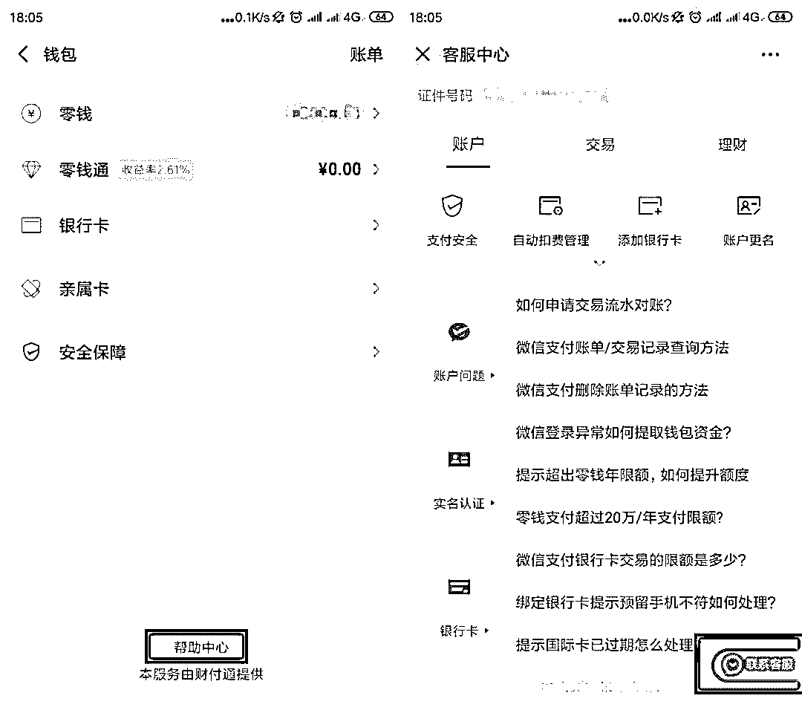

输入“**提示身份证注册超限**”关键词，在跳出的自动回复中选择“点这里”

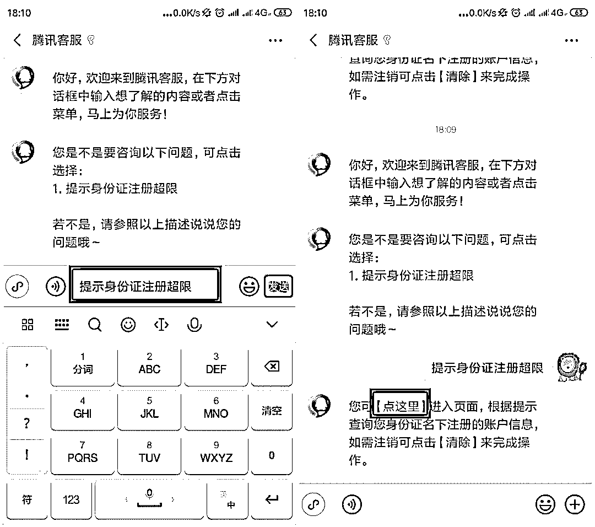

按页面的要求填写身份证并人脸识别并成功后，**我们就可以看到自己身份证到底注册了几个微信**。

现在一个身份证可以绑定 5 个微信，如果下面的账号你都认识，那就可以退出了。

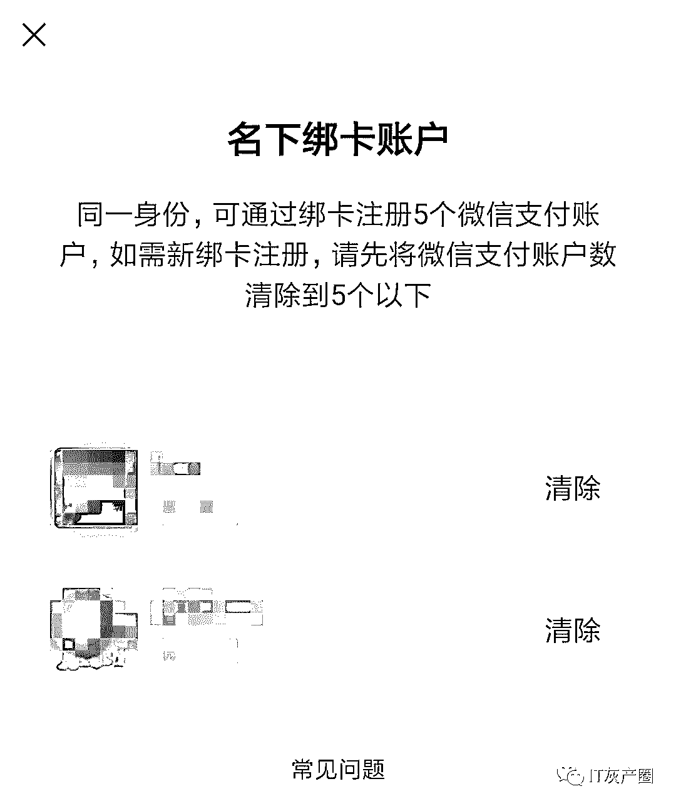

**如果有发现不是自己的微信**，那大家一定要继续往下看，把非自己认证的微信清除掉。

我们先点击“清除”冻结此账号的微信支付功能。

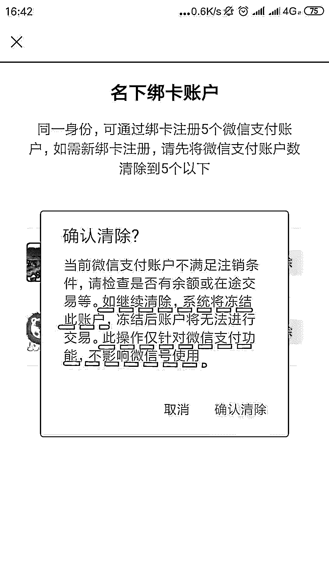

再通过“我—支付—钱包—帮助中心”，重新进入客服中心，这个时候系统会出现“微信绑卡时提示身份超限”的选项，点击后再选择页面“点这里”，进入申述页面。

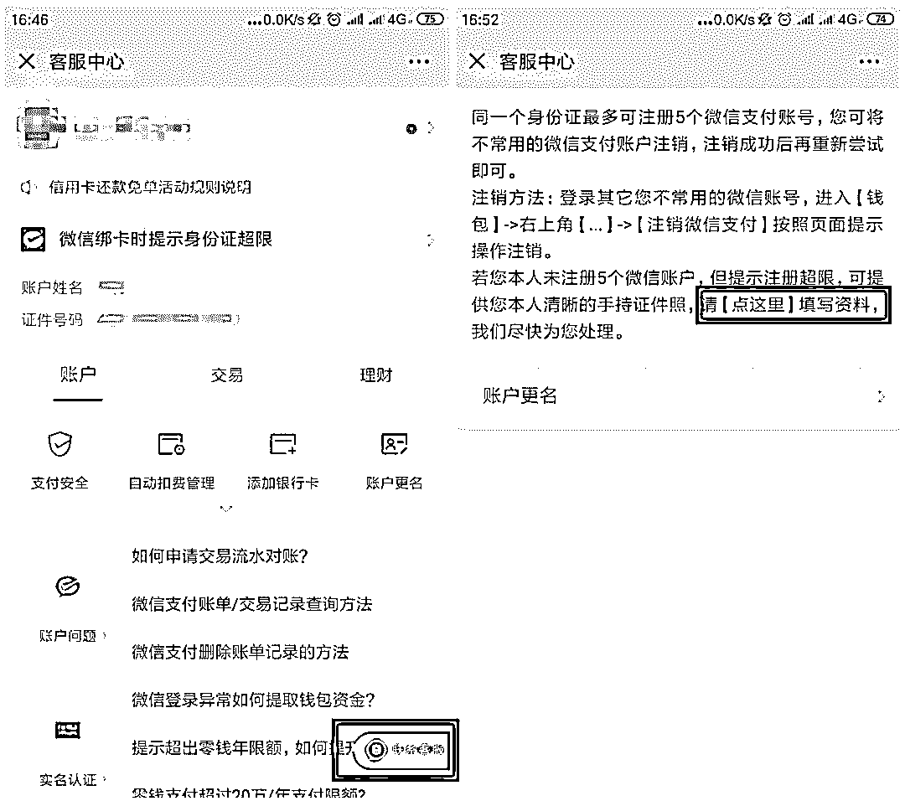

身份证、照片这些大家按提示操作相信不会有什么问题，主要是“问题描述”这里要尽量把事情说清楚，比如：什么什么账号并不是本人注册等等...

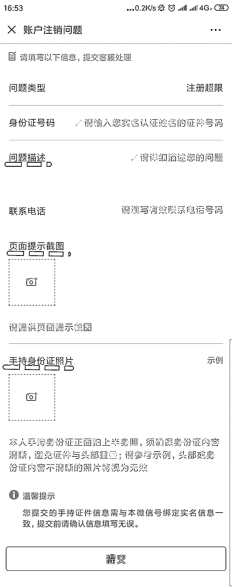

在完成上面的步骤后，微信可以说基本就安全了，千万别偷懒！

结尾

最后，再次回顾下《焦点访谈》在 6 月 25 号关于微信号买卖灰色产业报道，随后微信大封号开始，一前一后顺序，从此可见此次大封杀行动多少跟此有丝丝缕缕关系。

[`v.qq.com/iframe/preview.html?vid=m0893f6b7gq&auto=0&width=500px&height=375px`](https://v.qq.com/iframe/preview.html?vid=m0893f6b7gq&auto=0&width=500px&height=375px)

除了小黄文，还有很多以“欺骗”为由黑灰产，比如红包链接、幸运抽奖。如果微信仍对灰产视而不见，最后生态也会紊乱。

所有红利都是有时限。微信这次针对灰产链条，对流量玩家无疑是个灾难，个人号元气大伤，另一大灰产“羊毛党”依然猖獗。

不过，羊毛党重心不在微信平台，而是在拼团、电商类 APP 上。

微信流量市场洗牌重构，灰产会迅速退场吗？

答案可能并不那么乐观。

流量玩家想要继续立足于微信平台，还需开辟新战场，把流量当做机遇，寻找正确运营之道。

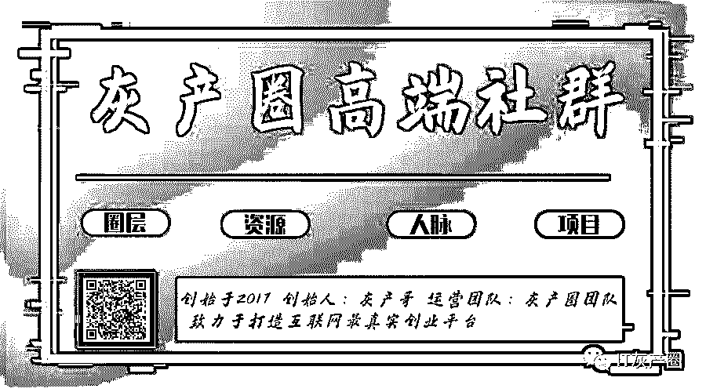

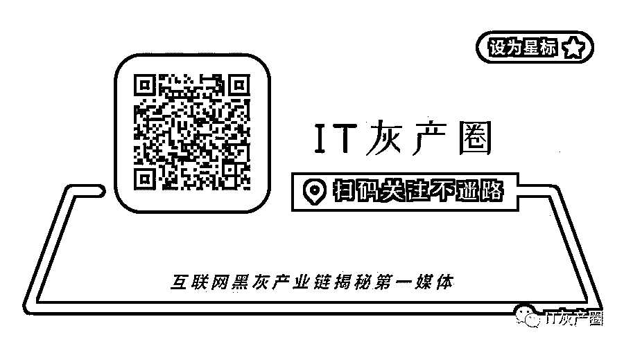

← 向右滑动与灰产圈互动交流 →

**阅读原文加入灰产圈高端社群**