# 互助宝“骗保疑云”：2 万治疗费骗取 30 万互助金？

> 原文：[`mp.weixin.qq.com/s?__biz=MzIyMDYwMTk0Mw==&mid=2247495655&idx=1&sn=70a1cac4f9ee2ae420ea6f0bf5de46d2&chksm=97cb24dfa0bcadc9505ffb880463b3d43ac14d94c83aecfb1ba5c9a563c2e5733162f7104d81&scene=27#wechat_redirect`](http://mp.weixin.qq.com/s?__biz=MzIyMDYwMTk0Mw==&mid=2247495655&idx=1&sn=70a1cac4f9ee2ae420ea6f0bf5de46d2&chksm=97cb24dfa0bcadc9505ffb880463b3d43ac14d94c83aecfb1ba5c9a563c2e5733162f7104d81&scene=27#wechat_redirect)

**点击上方蓝色字体免费订阅“灰产圈”**

导语

6 月 29 日，我们接到粉丝曝光，大概内容就是：**2 万撸走 30 万！**

经历过大场面的我。

也不禁出了一身冷汗，我们曾经深度报道过羊毛党的百万大军，也报道过黑产军团利用漏洞撸垮一家企业，但是他们的作战手法大多数都是靠量取胜，这位粉丝曝光的产业链，极其隐秘，利润极其变态！

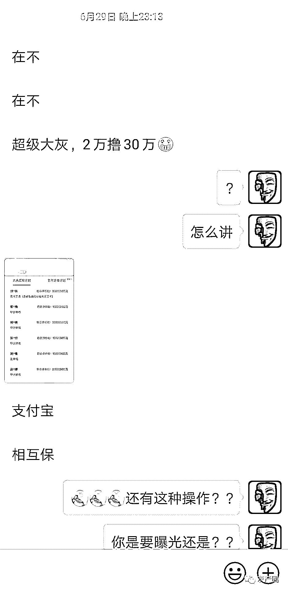

**为保护曝光者隐私，我们把头像和昵称去掉了**

你没有听错，**2 万撸到 30 万！  **

纵观这一整条黑色产业链，需要各部门严密配合，严丝合缝的衔接让我大开眼界，我不禁担忧了起来，如此黑暗的产业竟然会有人参与并神不知鬼不觉的空手套白狼，并销声匿迹，点上一根烟，抽上一口煊赫门，听我一一道来！ 

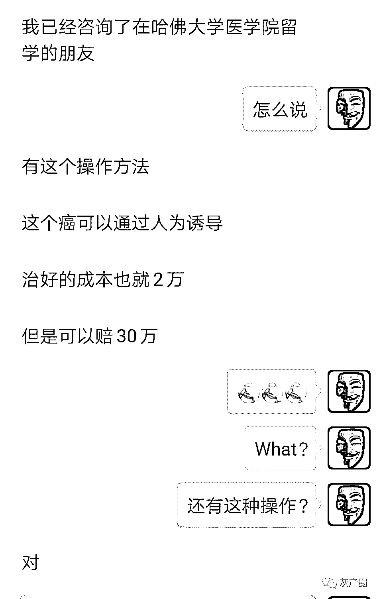

**为保护曝光者隐私，我们把头像和昵称去掉了**

废话不多说，开讲!

成也“互助宝”，败也“互助宝”！

去年 10 月，支付宝正式上线了大病互助业务——**相互宝。**

按照官方的介绍，加入相互宝的成员在遭遇重大疾病时（范围是 100 种），可享有 30 万或 10 万元不等的保障金，费用由所有成员分摊。

在上线大半年的时间内，相互宝确实帮助了不少重疾患者。然而，它的费用分摊模式、背后的审核机制，也引发了不少网友的争议。

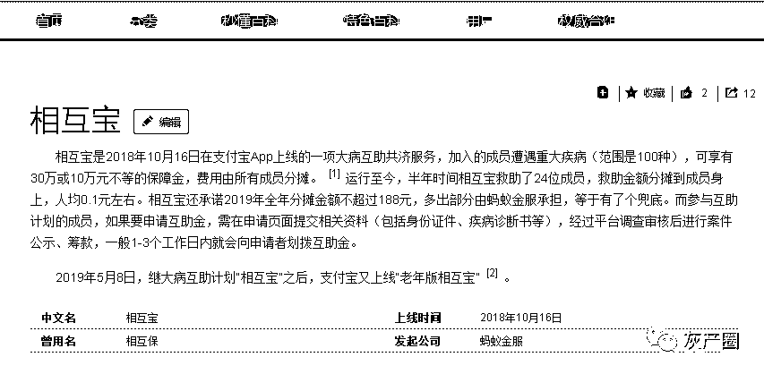

“互助宝”被骗保，什么神仙操作？

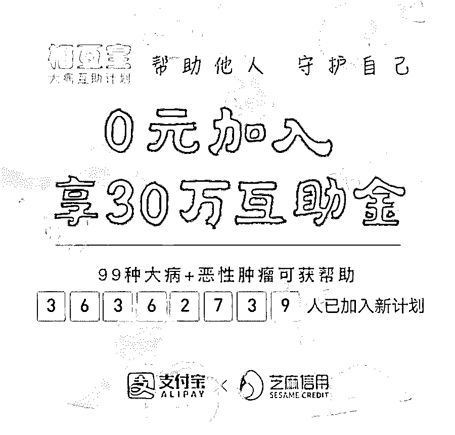

在相互宝公布的 6 月救济名单中，甲状腺癌患者的数量激增。这就是有人钻了相互宝审核不严的空子。

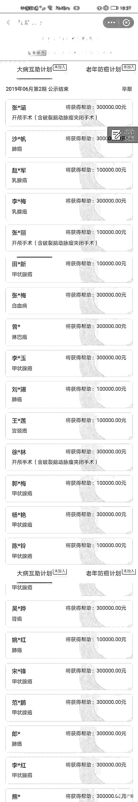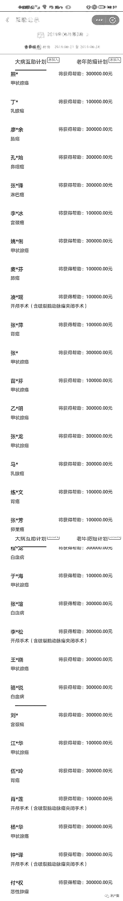

**上图是接受帮助的患者介绍，请仔细看一下病症，是不是甲状腺癌占多数**

甲状腺癌算是癌症中较容易治愈的病种，一般花费 2 万元左右就能彻底治愈。但是，相互宝给以甲状腺癌患者的赔付金额是 30 万元。

在巨大的“差价”面前，就有人开始“铤而走险”。**为了骗取巨额保费，他们不惜利用自己的身体，往身上“植入甲状腺癌细胞”，由此患病骗保。**

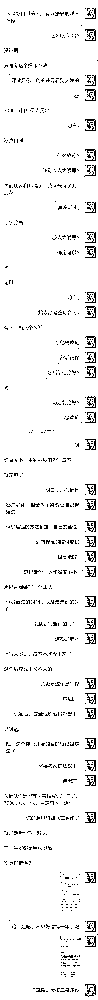

经过调查，之前有网友也提出过类似的疑问。

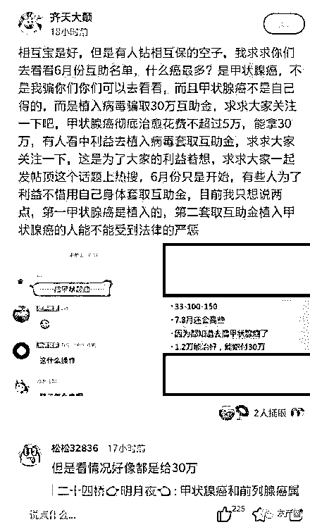

@齐天大巅 发布之后，在微信群和网络迅速传播，现如今参与相互宝业务的人群超过 7000 万人，有很多网友提出质疑：我们出的钱难倒就这么被不法分子骗走了？？？

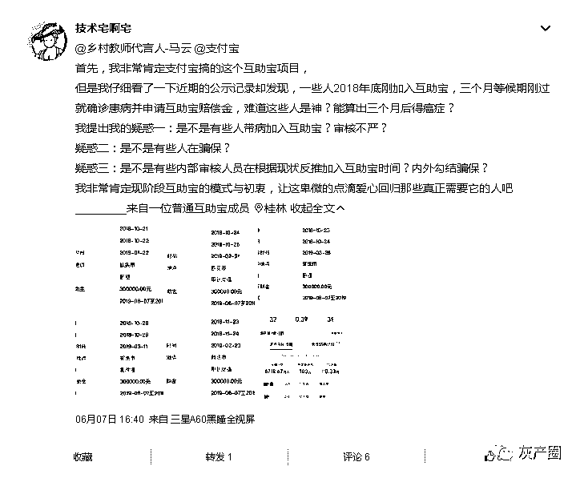

@技术宅啊宅

剧情反转，官方辟谣

就在粉丝爆料之后，剧情再度反转！

相互宝官方 6 月 28 日在其官博上正式回应：

“这两天，微信群里流传着谣言，说可以通过“植入甲状腺癌细胞”来骗取相互宝的互助金。**这是造谣！****大家不要相信！****”**

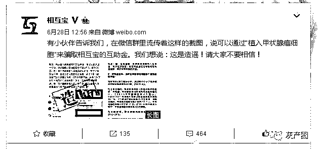

相互宝表示：

**通过“植入癌细胞”让自己得上甲状腺癌纯属无稽之谈。**

如今没有任何医学文献和实例证明甲状腺癌细胞可以在人体内移植。而且，人体自身的免疫系统会将外部植入的癌细胞视为异物，产生强烈的免疫反应并清除类似器官移植后产生强烈的排异反应。

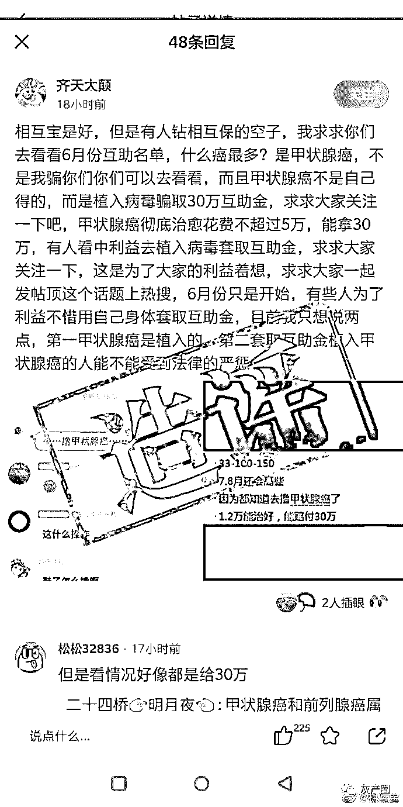

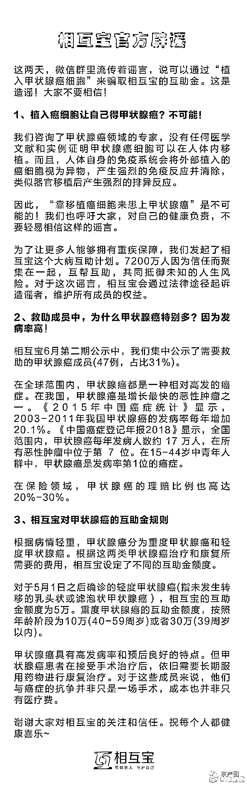

此外，6 月救助名单中甲状腺癌患者多，也并不是因为什么“骗保事件”，**而是因为甲状腺癌的发病率高。**

根据《中国癌症登记年报 2018》显示，全国范围内，甲状腺痘每年发病人薮约 17 万人，在所有恶性肿瘤中位于第 7 位。在 15-44 岁中青年人群中，甲状腺癌是发病率第 1 位的癌症。

在赔付金额方面，相互宝也做出了解释：

对于 2019 年 5 月 1 日之后确诊的轻度甲状腺癌（指未发生转移的乳头状或滤泡状甲状腺癌），相互宝的互助金额度为 5 万。重度甲状腺癌的互助金额度，按照年龄阶段为 10 万（40-59 周岁）或者 30 万（39 周岁以内）。

**根据官方说法**：

**根本不存在“只要得了甲状腺癌，就能拿到 30 万医药费”的说法。**

**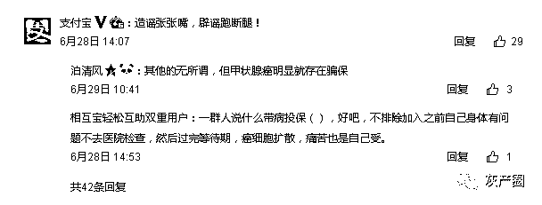**

结尾

从知道这件事，到后来调查取证，再到官方辟谣，如过山车般刺激，对于这件事，我们的态度是保持中立，根据粉丝的爆料，我们觉得骗保之事不无道理，但官方既然“官宣”了，我们也无话可说，毕竟此事件无论是真是假，对于互助宝这个平台影响都不好，那“辟谣”在所难免，我们不希望“骗保”产业链存在，但是，存在即合理，有漏洞就是市场，但是否存在，我们并无证据。

**孰是孰非，看大家有什么想法？**

**请在下方留言让我们看到。**

← 向右滑动与灰产圈互动交流 →

**阅读原文加入灰产圈高端社群**