# 我信你个鬼！无息贷款？免费快速申请？最快 30 分钟到账？

> 原文：[`mp.weixin.qq.com/s?__biz=MzIyMDYwMTk0Mw==&mid=2247495604&idx=1&sn=da9cdae016c38a6381db3645aaabf720&chksm=97cb248ca0bcad9acb079508e9eb0935cc24673963622d4468f3cf44d76379742f8b2fdb3bca&scene=27#wechat_redirect`](http://mp.weixin.qq.com/s?__biz=MzIyMDYwMTk0Mw==&mid=2247495604&idx=1&sn=da9cdae016c38a6381db3645aaabf720&chksm=97cb248ca0bcad9acb079508e9eb0935cc24673963622d4468f3cf44d76379742f8b2fdb3bca&scene=27#wechat_redirect)

**点击上方蓝色字体免费订阅“灰产圈”**

阳光明媚的一天，校园图书馆内，女学生妮妮像往常一样翻看书架上感兴趣的书。一阵阵高跟鞋轻踏地板的声音从不远处传来。她抬眼望去，是一个妆容精致、打扮时尚的女子。妮妮是大一学生，刚从小县城步入大城市，很羡慕能这样打扮的女孩子。妮妮虽然两眼放光，但想到自己囊中羞涩，根本没多余的钱来打扮，还是默默忍住了冲动。

像上面这样让妮妮受到冲击的画面不止一次两次，有时候是舍友们互相展示自己的大牌化妆品、名牌衣服包包，有时候是同学之间拿着价格昂贵的手机互相炫耀。妮妮承认自己很喜欢这些超出消费能力的很高的东西，妮妮觉得处在现在的社会，有虚荣心很正常。

一个平常的下午，妮妮收到一则贷款短信，“**无息贷款 _ 免费快速申请 _ 可快至 30 分钟到账**”，妮妮也深知贷款买这些东西不合适，所以一开始并没心动，但有一颗种子已经在心里悄悄埋下。经过多次欲望的召唤，妮妮想到了这条贷款短信，往回翻手机找到这条短信。妮妮想，现在信用卡、花呗、白条不都是鼓励提前消费，提前享受么？再说了，自己还能在外打工兼职还钱。伴随多次的心动，妮妮终于走上了贷款之路。

**她拨通之前保存下来的贷款公司电话：喂，我想贷款。**

对方说提供身份证号码和家人的信息，能快速贷款 2 万元。没有前期费用，只收三个点的包装费，也就是借妮妮 2 万，只给他 600 元就行。能拿到将近 2 万元，这对于妮妮来说真的是一笔不小的数目。

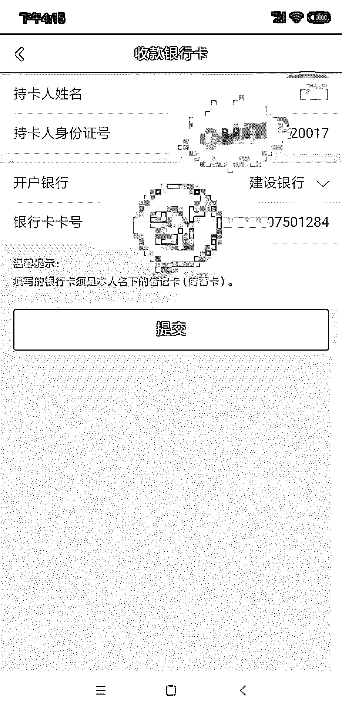

填写信息截图一

很快妮妮按照对方发来的链接填写自己的信息以及家人信息。

填写完，半个小时就审核通过了。**但是对方说妮妮的综合评分过低，需要验证还款能力**，让妮妮还第一期的贷款进去，才能把两万套出来。妮妮答应了， 还了一千块钱进去，app 显示打款中。过了一会，app 又显示贷款失败：

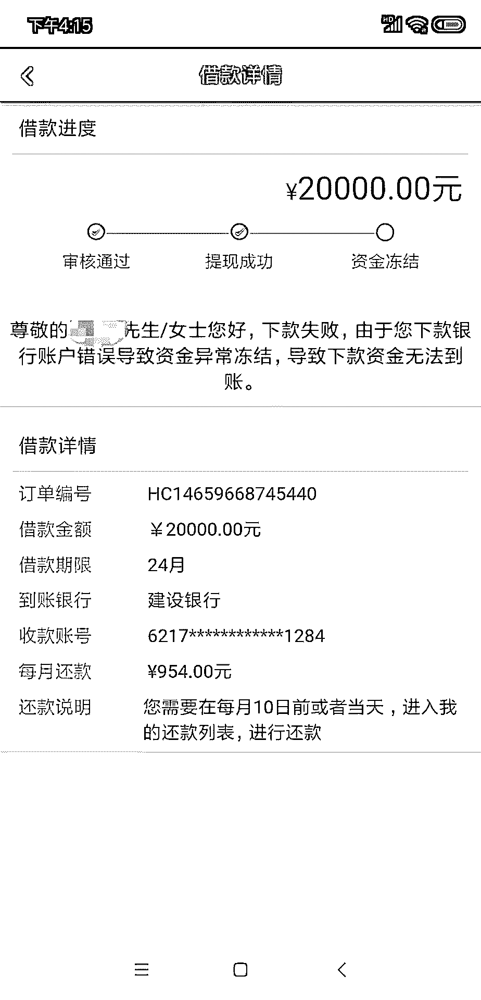

填写信息截图二

妮妮问对方怎么回事？对方说妮妮的银行卡号填错了，妮妮一看！真的多了一个 0。但是妮妮觉得自己是个谨慎的人，应该不会填错过个人信息。**对方说要解冻资金，需要交 4000 块钱保证金**，然后通过后把 24000 一起打到妮妮卡上，再给他 600 包装费。

此时妮妮感觉被骗了！在对方发来的语音中，妮妮听到旁边的工作人员说：您的银行卡号不对，我们没办法给您打款！妮妮意识到不是自己问题，是他们的猫腻！赶紧说：“不贷款了，1000 块钱也不要了！你不要再来找我！我认栽！” 结果对方还不放弃！一定让妮妮付 4000 块钱！妮妮报了警并把对方拉黑，但是不敢想象对方掌握了自己家人信息还会做什么出格的事，妮妮后悔不已。

为了贷款遇到陷阱的人们不在少数。更多的时候，他们比妮妮下场更惨：

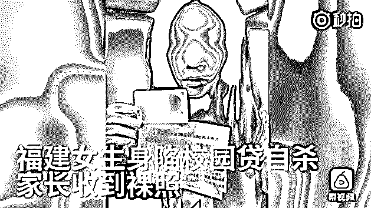

图片来源网络

张家口市一在校大学生，在当地一家宾馆被发现死亡。该男生父亲说：“怀疑儿子死亡是因为“校园贷催贷”，今年 1 月至今，已接到多个催贷电话”。

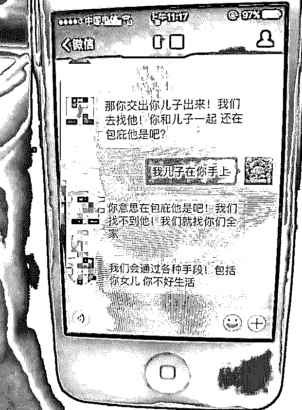

图片来源网络

现如今，不少人谈贷款色变，因为不良网贷在我们周围蔓延得太厉害，已经分不清牛鬼蛇神，我们的经验永远跟不上不法分子的脚步。贷款出现的目的本来是为了促进经济发展，增加银行或者其他机构自身积累，但越来越多的不法分子打着贷款的幌子实施非法欺诈。

到底这些骗子如何实现上述诈骗过程的呢？

前面案例中妮妮是在接到贷款公司的广告后萌生贷款的想法，所以说骗子会在各个渠道大量打广告，诱惑囊中羞涩的人。但是在广发广告之前，他们还需要做大量的工作。

猎网平台接到的多起举报也证实，贷款诈骗的流程基本与上述案例过程一样。打开对方给的链接或者扫描二维码下载 app，登录进去填写自己的信息以及家人的信息，之后被各种理由索要包装费、保证金等。这些 app 通常是下面这种分发平台上的。

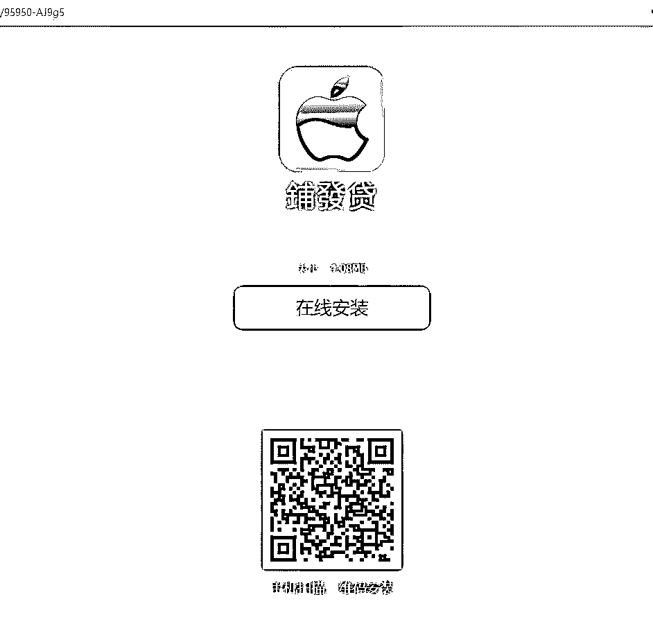

分发平台一

我们都知道在国内知名应用商店上架 app 变得越来越困难，审核周期长，通过率低，所以就出现了分发平台，他们给 app 开发者提供一个 app 上传下载的平台，在上面上传安卓 apk 文件和签名好的苹果 ipa 文件就可以生成相应的下载地址和二维码。而很多分发平台审核并不严格，所以骗子都会选择在这些地方发布钓鱼 app。

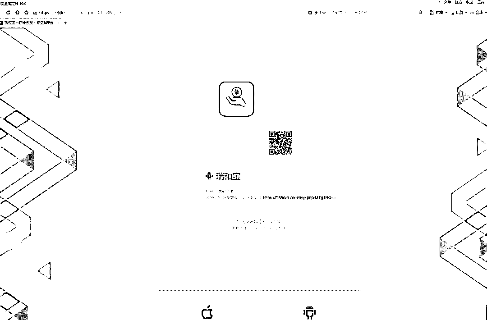

分发平台二

打开多个 app 查看，界面十分相似。

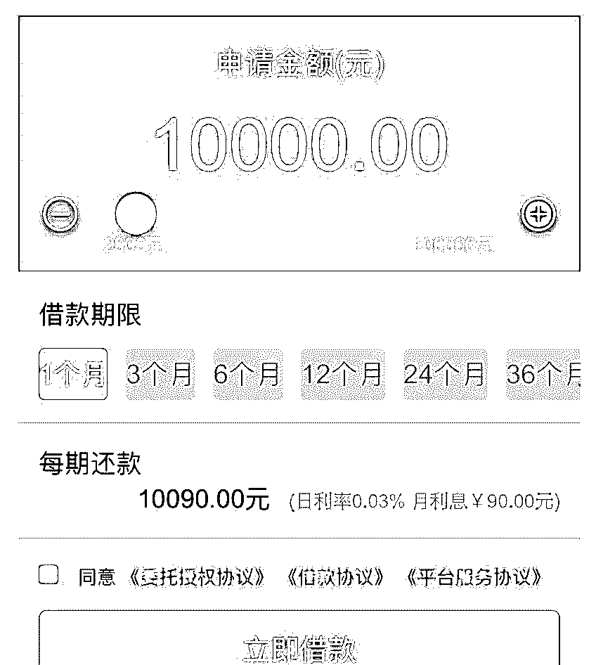

骗子应该是在某些地方购买了统一的模板，小猎尝试在百度搜索“app 贷款模板购买”，结果惊人，出来很多卖贷款 app 模板的网站。

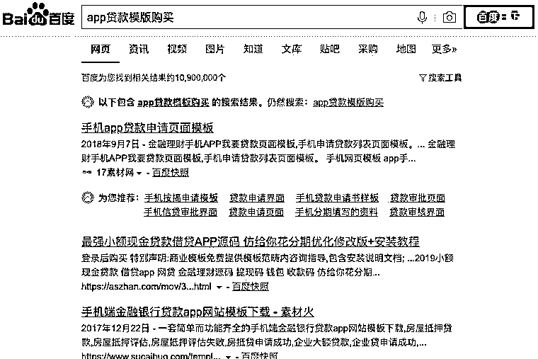

打开其中的一个网页 ，这种熟悉的模板售价是 500 元。

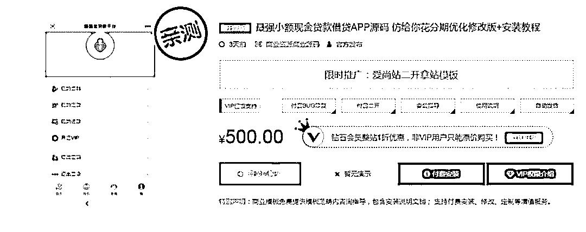

另一个网站售价仅 30 元，成本非常低。

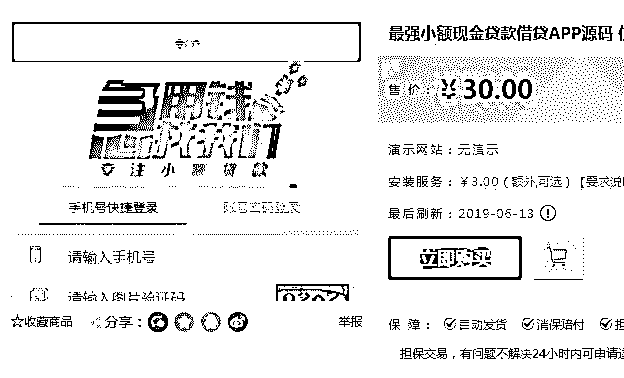

这些源码能提供很多功能，提交成功、审核、押金、冻结银行卡异常等等。

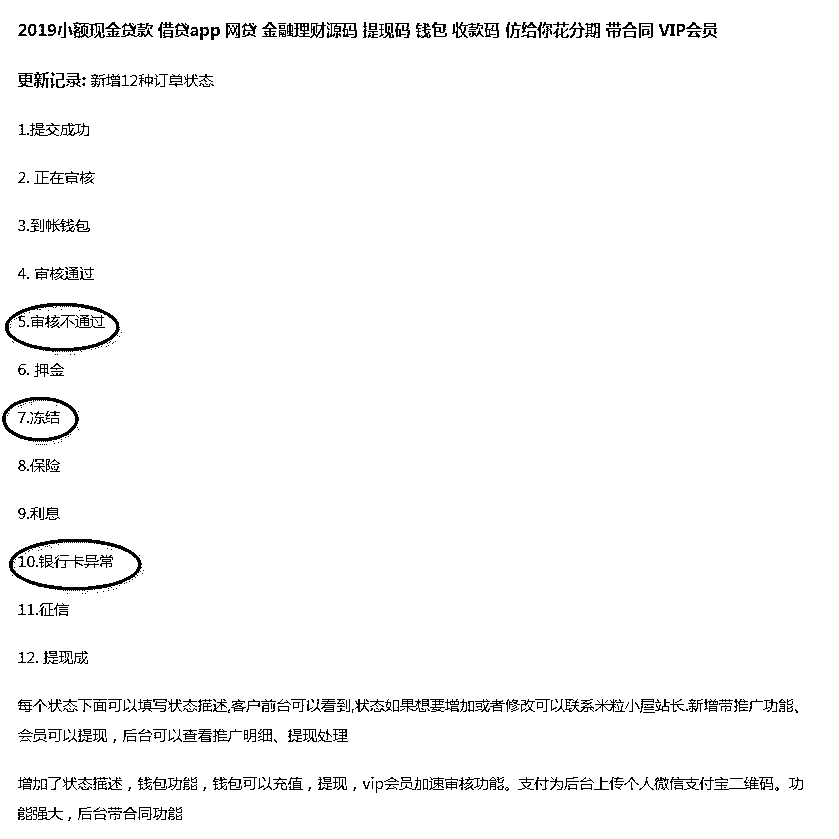

小猎尝试联系售价 500 元的卖家，卖家称，现在的源码是网页版，如果打包则需要额外交 200 元，总价下来是 700 元。

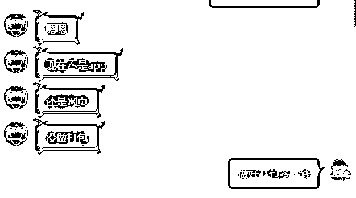

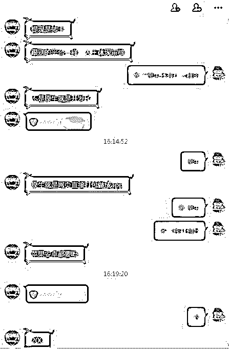

并且发来一个案例，打开一看，小猎又看到了这个熟悉的页面，这个模板跟用户举报的钓鱼模板一样。

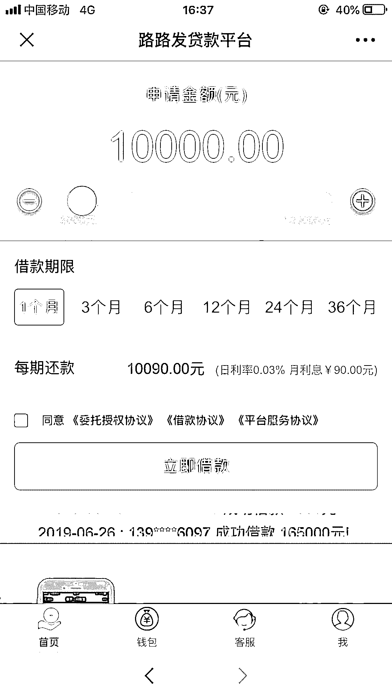

截图为 app 首页

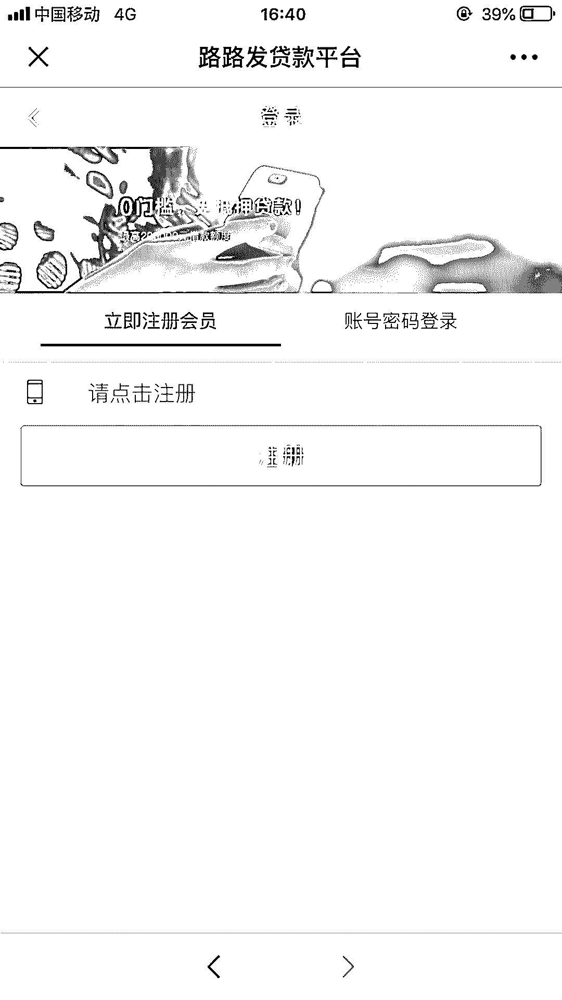

截图为 app 注册页

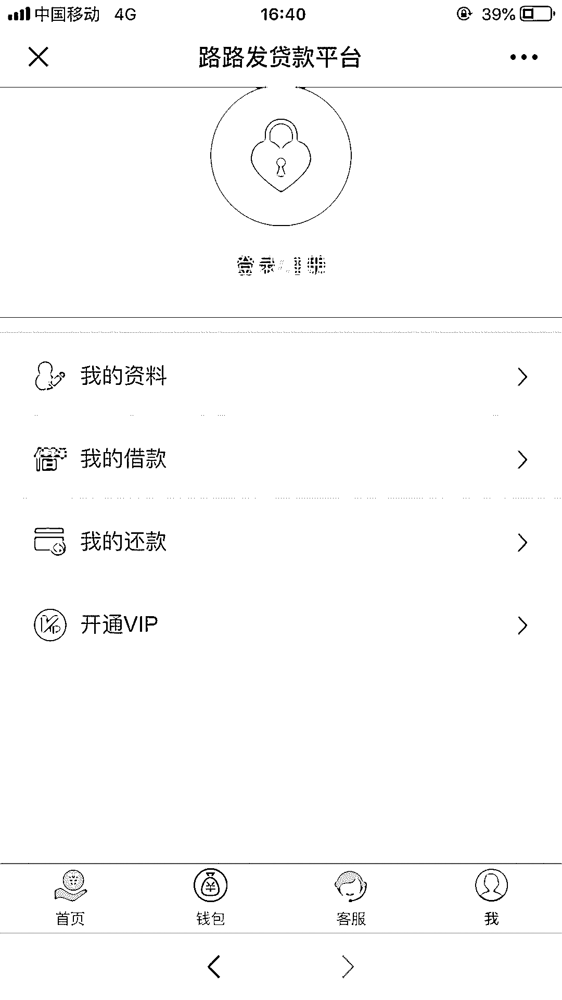

截图为 app 个人页

客服还说如果苹果和安卓手机都生成下载链接的话，苹果要复杂一些，需要签名证书，让小猎自己找，不过他说自己有一些渠道，但是签名不稳定，很明显关于苹果上 app 签名问题也会牵扯出一些灰色产业链，小猎在这就不再多说。

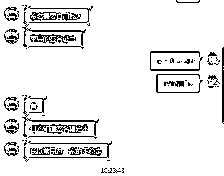

除了前台展示，后台的操作也比较简单，网站展示一些后台截图，购买后会有教程手把手教，实在不懂就联系客服咨询。

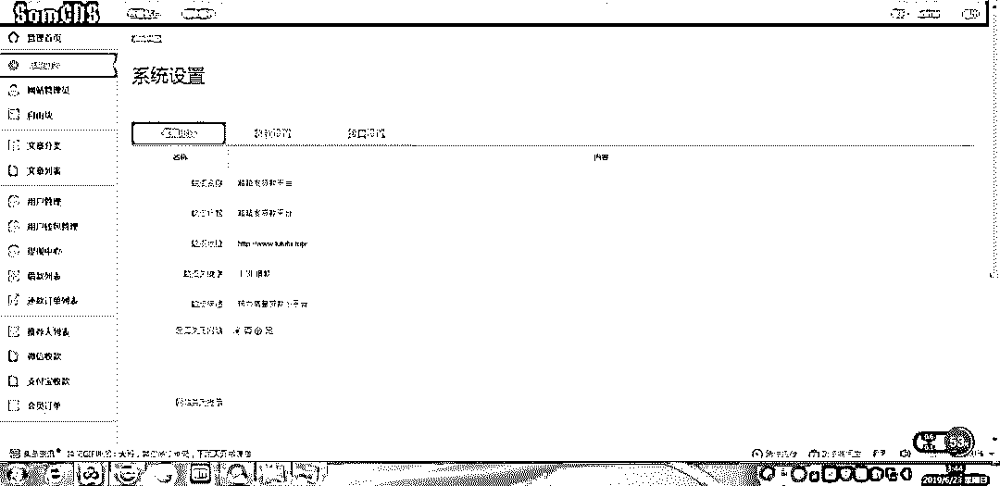

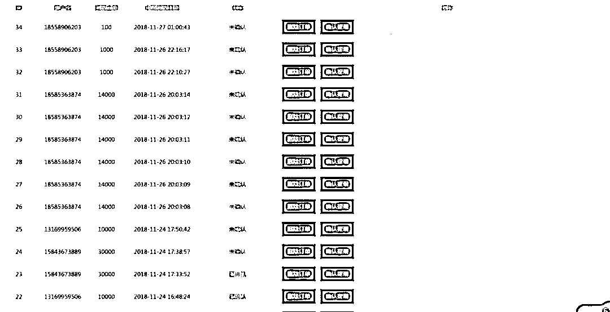

那么，有了这些现成的模板，骗子只需去其他渠道购买一些手机号群发贷款广告，再准备一些专业话术来应对不同的用户，一个简单的贷款诈骗就“出炉”了。想弄更大的骗局，会勾结社会上闲散人员暴力催收，上演套路贷诈骗。

贷款诈骗成本如此低，导致越来越多的人因为贷款受骗，已经是 2018 年高发诈骗之一。《金融诈骗司法大数据专题报告》中指出，贷款诈骗罪逐年升高，已经占比 3.97%。

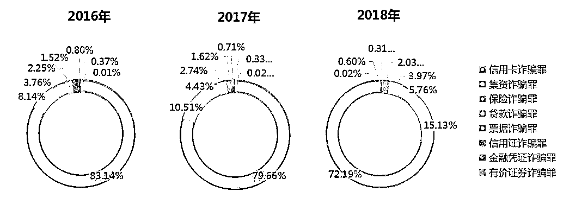

*金融诈骗司法大数据专题报告截图

最后小猎提示：贷款一定要通过正规渠道，否则只能越陷越深。而如何杜绝这些诈骗？民间借贷越来越多，这些贷款公司应该受到更严格的监管，不能随便放贷；分发平台应该制定严格的审核流程，要对每一个上传上去的 app 做深入的审核，代码分享更是要杜绝此类源码的上传以及销售。多方面的努力才能更好地减少诈骗的发生。

← 向右滑动与灰产圈互动交流 →

**阅读原文加入灰产圈高端社群**

# 

> 原文：[`mp.weixin.qq.com/s?__biz=MzIyMDYwMTk0Mw==&mid=2247495601&idx=1&sn=4457099e69b889cf8b1c8802e7ede49a&chksm=97cb2489a0bcad9f8e96956f62de42cd38dc2ed6d637243ef39739c2dbba7aabbff9ed176cc0&scene=27#wechat_redirect`](http://mp.weixin.qq.com/s?__biz=MzIyMDYwMTk0Mw==&mid=2247495601&idx=1&sn=4457099e69b889cf8b1c8802e7ede49a&chksm=97cb2489a0bcad9f8e96956f62de42cd38dc2ed6d637243ef39739c2dbba7aabbff9ed176cc0&scene=27#wechat_redirect)

## 央视焦点访谈曝光“微信号地下交易大案”始末

展开