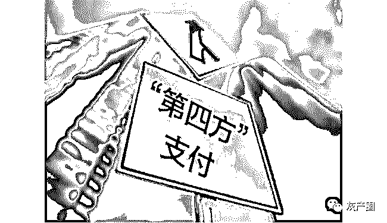
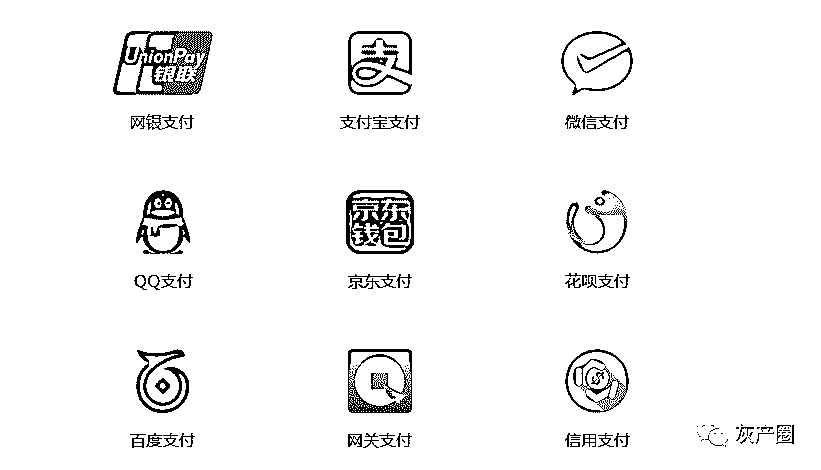
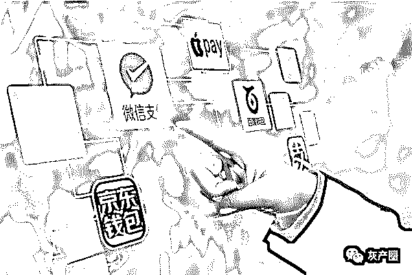
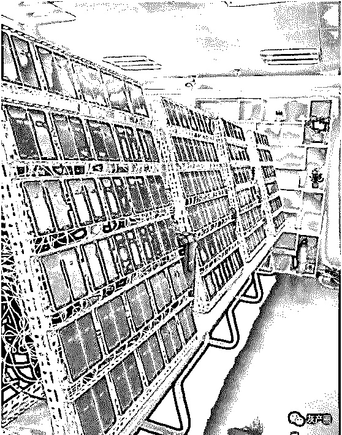
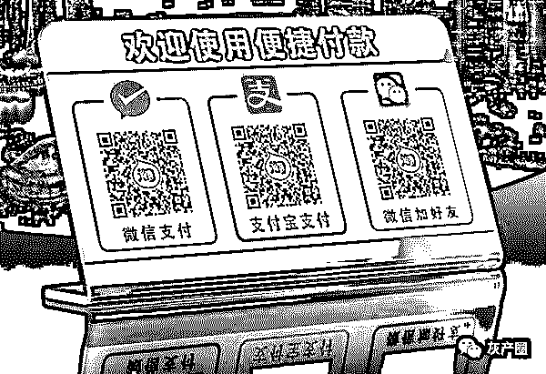
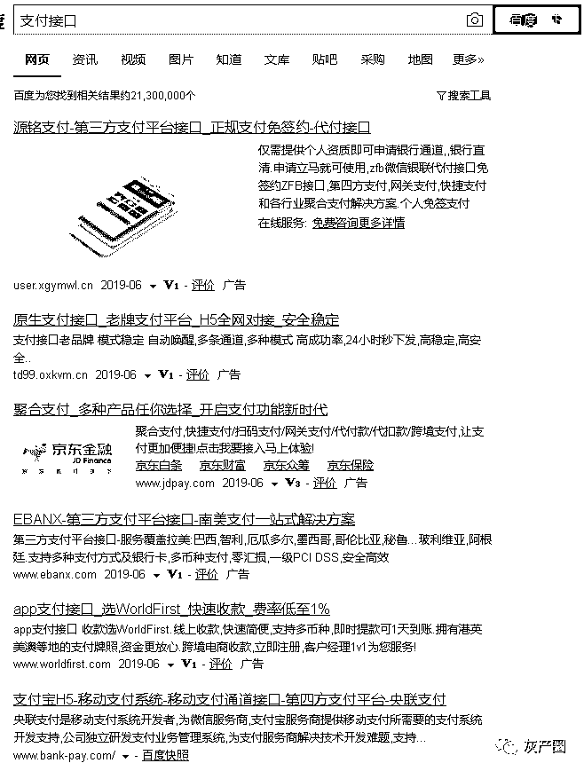
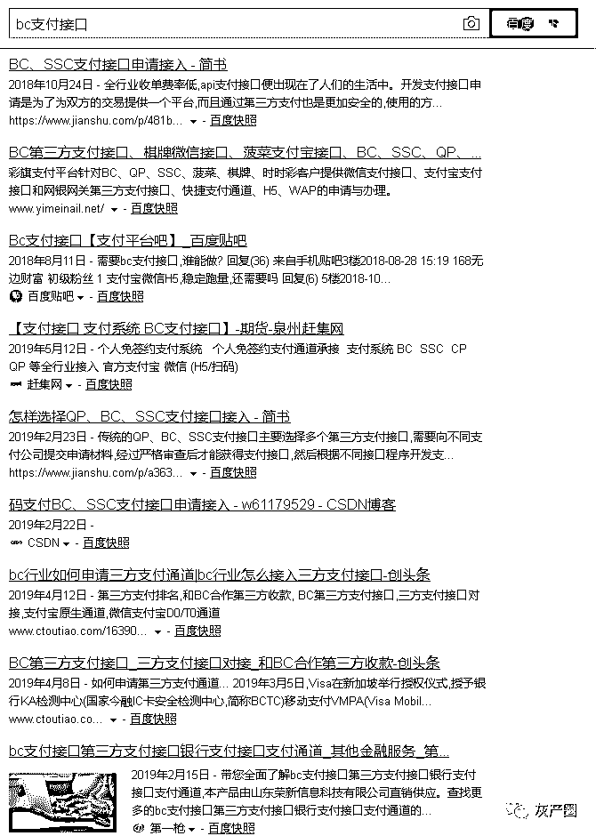

# 支付黑金风云录：七个月吸金七个亿！

> 原文：[`mp.weixin.qq.com/s?__biz=MzIyMDYwMTk0Mw==&mid=2247495598&idx=1&sn=775ed7644dbf3408666066d0e4b05b56&chksm=97cb2496a0bcad80145a874a162d7820b1c89077bedb97c6466afb00b56c9ac7d1979030c724&scene=27#wechat_redirect`](http://mp.weixin.qq.com/s?__biz=MzIyMDYwMTk0Mw==&mid=2247495598&idx=1&sn=775ed7644dbf3408666066d0e4b05b56&chksm=97cb2496a0bcad80145a874a162d7820b1c89077bedb97c6466afb00b56c9ac7d1979030c724&scene=27#wechat_redirect)

**点击上方蓝色字体免费订阅“灰产圈”**

导语

6 月 13 日，公安部召开新闻发布会，通报全国公安机关“净网 2019”专项行动典型案例，其中提及了犯罪团伙大肆利用非法“第四方支付平台”进行“洗钱”活动，再次将这条操盘隐蔽的第四方支付产业链背后的灰色空间曝光。

什么是第四方支付？

  

第三方支付介于银行和商户之间，第四方支付是介于第三方支付和商户之间，不具备支付牌照，依托正规第三方支付平台、银行的接口、互联网电信运营商等接口集合而成。

通过第三方支付提供的是资金清算通道，第四方支付在支付基础上的多种衍生服务。比如进行大量注册商户或个人账户，非法搭建支付通道，其中的“漏洞”为赌博、私彩等非法经营者提供资金支付结算通道，成为投机者的“金融结算中心”，为规避监管，他们最后以非法支付平台进行层层转账。

黑灰地带，第四方支付浮出水面

根据公安部发布的消息，2018 年 5 月，福建公安机关网安部门工作发现，以肖某等人为首的犯罪团伙大肆利用非法“第四方支付平台”进行“洗钱”活动，随即成立专案组开展立案侦查，迅速查明该团伙组织架构及犯罪事实。

2018 年 12 月至 2019 年 1 月，专案组在福建、北京、河北等地陆续开展收网行动，抓获主要犯罪嫌疑人 42 名，冻结涉案资金 580 余万元，一举捣毁了为网络黑灰产业提供资金通道的非法“第四方支付”平台。

无牌照公司，流水七个亿

除了公安部通报的利用第四方支付平台洗钱案例外，此类招数和模式相当案件不胜枚举。

今年 4 月初，温州警方成功摧毁一个为赌博网站提供充值、提现等服务的“第四方支付”平台，共抓获犯罪嫌疑人 31 名。

据调查，易捷科技工作室、易支付聚合支付平台、TT 支付等第四方支付平台与赌博人员进行结算，主要的方式是通过赌博网站上提供的二维码支付、网银转账等方式进行充值和兑现赌资，最终汇入赌博网站的相关账号中。

而上述第四方支付平台均无支付牌照公司，在提供替非法赌博网站提供资金收付的网络平台和通道中按 1%到 2.8%比例赚取手续费。 自 2018 年 2 月到 9 月份期间，短短 7 个月，这些平台的非法资金流水就达 7 亿元。

犯罪嫌疑人购买大量手机架设“手机墙”，“赌博网站提供给赌徒的二维码不断变化，所以手机屏幕上的二维码也在不断更新，接受全国各地赌客的赌资。”经办民警介绍。

那么，不断更新的二维码是有何作用？

实际上，主要是参赌人员扫描犯罪嫌疑人在网站公布的二维码进行赌资充值。

调查获悉，只需通过互联网违规购买、网上查询企业公开信息下载等方式即可获得数量可观的小商户信息，从而进行银行企业商户注册，也便于申请二维码支付。

曾在支付领域工作三年的 KK 介绍，博彩、赌博软件开支付接口并不难。“准备或者购买企业法人相关资料，过得去的网站设计，申请支付接口时接到网站某个网页中，等支付时跳转到这个页面即可。之后将接口卖掉或者二次包装，查出来的难度更大了。”

而第四方支付充当“中介”的身份帮网络赌博公司把参赌者充值的赌资如何处理并逃避监管的呢？

KK 介绍：“依托空壳公司申请一些第三方支付平台通道，通过几万元购买了第四方支付软件的源代码、一些空壳公司、身份信息、金融账户可以收取资金。”随后将这部分资金转入“干净”的第三方支付账户，再转入个人银行账户。若资金规模大，则需要多个账户加长周转链条。

通过层层账户的流转进入空壳公司，最终流向犯罪嫌疑人的指定账户中，整个转移路径较为复杂，正规的第三方支付平台更不容易发现痕迹，降低了监测风险。

支付接口为网赌“洗钱”

在有的支付 QQ 群里，其群员名字大多直接以“支付接口”、“三方支付”、“支付客服”、“专业搭建支付程序”等为文字命名，违规出售支付接口的信息随处可见。在 QQ 群，百度贴吧、论坛中只要搜索关键词即可跳出链接，直接在网上挂着联系方式。

除此之外，“支付通道，可接通 BC、QP、SSC、游戏、金融、商城业务”等“行话”，不是深耕支付行业的老兵难以理解这些“行话”。

在这些支付行业的资源对接群中，字母是某些“敏感词”的缩写，比如 BC 泛指博彩，亦称“菠菜”，QP 则是棋牌，SSC 是指时时彩，皆是以围绕赌博存在的支付行业“黑产”。但是，色情、赌博类属于违法业务，所有支付机构明确禁止为此类业务开通支付接口。

一位从事支付接口的人士坦言，“色情、赌博一些网站比以前管的严，风险高多了，但现在第三方支付和监管部门查的严，敢接的越来越少。”

在上述 QQ 群里，有群员发布消息称：“安全稳定费率低；微信支付宝均可识别支付，实时秒结到账 D0，无需中转提现，直接秒到您的微信和支付账户。无任何开户费保证金等费用。资金账户 100%安全，你敢用，我敢赔。

99.9%超高成功率，流程超顺畅”等标语，并保障安全高效。

值得一提的是，第四方支付到目前为止，还是多以正规平台为主，主要在从事正常运营活动，但因其准入门槛和运营规范不甚健全，才导致部分平台沦为非法通道。“只要第四方支付不碰二清、资金池、跑路挪用，按照监管的要求稳扎稳打其实有巨大的发展空间。”KK 认为。

现实情形下，聚合支付的规模正在爆发性增长。

从经济观察报在派盟咨询发布的《中国聚合支付行业发展报告 2018》获悉：

> **2018 年聚合支付机构处理交易总金额预计达到 21.1 万亿元，处理交易总笔数预计达到 540.0 亿笔；**
> 
> **2019 年处理交易总金额预计达到 40.7 万亿元，处理交易总笔数预计达到 1331.0 亿笔；**
> 
> **2020 年处理交易总金额预计达到 94.0 万亿元，处理交易总笔数预计达到 3936.5 亿笔。**

苏宁金融研究院研究员黄大智表示：

“从合规角度讲，聚合支付是收单机构的外包商，央行明确过三点，除了聚合支付作为收单机构的外包商，不负责商户的证件审核外，聚合支付也不能碰资金结算，涉及二清和无证经营支付业务，同时不能碰核心交易数据，正常来讲只有银行和支付机构才能碰。”

结尾

其实，监管层三令五申加强对网络新型违法犯罪的审查。

3 月 27 日，央行发布的《关于进一步加强支付结算管理防范电信网络新型违法犯罪有关事项通知》（即“85 号文”）对账户管理、特约商户、终端管理等方面加以返防，套现、违规提供支付通道的支付黑产再次重申监管力度。

“不得直接或变相为互联网赌博、色情平台，互联网销售彩票平台，非法外汇、贵金属投资交易平台，非法证券期货类交易平台，代币发行融资及虚拟货币交易平台等非法交易提供支付结算服务。”

但巨额利益面前，很多不法分子铤而走险，为黑灰产业提供支付通道，相信法网恢恢疏而不漏，最后，提醒那些还在此行业从业的团队或公司，莫伸手，伸手必被抓！

← 向右滑动与灰产圈互动交流 →

**阅读原文加入灰产圈高端社群**