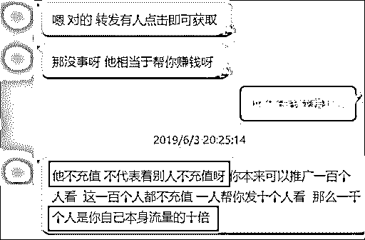

# 入侵抖音微博的“小黄文”，背后竟是个暴利产业！

> 原文：[`mp.weixin.qq.com/s?__biz=MzIyMDYwMTk0Mw==&mid=2247495559&idx=1&sn=c1c0efdd94b428f87839e6bd67fabb91&chksm=97cb24bfa0bcada9e13daa32f804702f0adc9c3690ae379d9951d42fc870c65d60e728d2b428&scene=27#wechat_redirect`](http://mp.weixin.qq.com/s?__biz=MzIyMDYwMTk0Mw==&mid=2247495559&idx=1&sn=c1c0efdd94b428f87839e6bd67fabb91&chksm=97cb24bfa0bcada9e13daa32f804702f0adc9c3690ae379d9951d42fc870c65d60e728d2b428&scene=27#wechat_redirect)

**点击上方蓝色字体免费订阅“灰产圈”**

导语

不知道有没有人跟我一样，每天深夜刷微博热搜的时候，总在看到这样的微博。点开图片一看，都是各种霸道总裁文、狗血文，甚至是纯肉文...... 

当看到最精彩的地方时，就出现提示，要求我关注公众号才能接着往下看，可以说是套路满满。

我发现，总是刷到这些霸道总裁文的不是我一个人，微博上有很多人都在吐槽......

出于运营人的好奇本能，我上网查了一下，**发现这些霸道总裁文的背后居然是一个暴利产业。**粗略算了一下，做这个能比我上班挣得更多呢......

于是，套路编辑部又开始了卧底和暗访。今天的文章，就带大家来扒一扒这个产业到底是怎么一回事！

## 

01

**入侵****各平台的“霸道总裁文”****到底是什么？** 

根据我的观察，这些“霸道总裁文”不仅仅出现在微博，它的足迹遍布了多个 App，比如抖音、爱奇艺，甚至在很多 QQ 群、微信群也可以看到。

这些小说的推荐文案和剧情都特别狗血...... 微博深夜档的文章更夸张，几乎都是“出轨少妇”、“我和我的小姨子”的剧情，文风像极了 00 年代的某些杂志。

而且，他们都有一个共同的套路，最后一定都会引流到公众号。我在爱奇艺的信息流广告里找了一篇小说，根据提示关注了公众号。

这些公众号的套路也非常统一，关注之后它会提示我“继续看”刚才那部小说，当我看得正爽时，**突然就有一个链接跳转出来，要求我充值金币，不充值就没办法继续往下看。**

除此之外，这些公众号都有自己的“商城”，商城里的小说分为“男频”和“女频”，不出所料，“男频”都是些游戏、英雄主题的小说，“女频”则是霸道总裁类、狗血爱情类小说。

这些小说点开都可以直接看，但是，同样的套路，**当我们看到高潮时，哎，充值链接又来咯。**

这就是小说分销的模式，简单来说，就是利用小说，把用户从微博、抖音等社交平台或是社群导流到公众号，然后再引导用户充值付费。

这些公众号也并非什么专业的小说阅读平台，而是小说分销平台的代理商，也叫小说分销商。他们商城里的小说，其实就是从小说分销平台那里来的。而那些狗血甚至露骨的推广文案，小说分销平台也会给予模板。

原本以为这些小说分销平台干的都是什么不正经的“勾当”，但搜罗了一圈后发现，网易云阅读、新榜、微小宝也都在做小说（或漫画）分销。

目前市场上的小说分销有两种方式。**一种是直接找小说分销平台，成为他们的代理商，跟平台进行“分成”合作。**

**另一种则可以自己搭建小说分销平台，然后去招代理。**淘宝上一搜，就有一大堆帮别人开发平台的，价格大概是几千到几万不等这样子。

自建“小说分销”平台的报价（部分截图）

那么，这些小说分销平台和小说分销商是怎样赚钱的呢？为了深入扒皮这个产业，我只好“乔装”成小说分销商，卧底了几个小说分销平台 。

结果，你还别说，这个行业还真有一些猫腻......

## 

02

**卧底之后，我发现了小说分销的猫腻** 

事实上，这个卧底可不是那么好当的，大部分小说分销平台都是有门槛，准入门槛是你得有个认证过的服务号。可是我没有咋整啊？

为了能够亲身体验小说分销的流程，摸清背后的套路，我还偷偷想过要牺牲下运营研究社的服务号做个测试（希望这句话贤哥看不到），那么运营研究社服务号的画风可能就会变成这样了……想想就刺激。（哦，不，离滚蛋不远了

在强烈的求生欲下，我尝试了 N 多个方法。果然功夫不如有心人，我找到了几个分销平台的客服，

### 

**1）前期高分成吸引，后期扣量攫取收益**

在跟第一个客服表达我想做小说分销的想法后，以下是我们的对话：

> 问：用什么渠道
> 
> 答：微信群。
> 
> 问：有几个？
> 
> 答：XXX

由于太过诚实，关于群的数量我没敢往多了说，对方表示我的“流量”太小不太适合。

有了前车之鉴，我在找下一个平台的时候多留了个心眼，果然在和客服的交流中对方同样会问到我关于“流量问题”。这次我对“量”做了个包装，结果对方特别爽快地给我开了户（相当于没有任何审核机制，果然是低门槛啊）。

为了了解更多信息，我加了一个专门做代理的群。刚一进群，我就被群里各种的小说分销平台广告刷了满屏，一会功夫就有群管理员小窗让我加他。

加好友后，管理员听说我在其他平台有开户，对方就试图说服我让我在他们平台试试。**还跟我讲一堆道理，让我多去推广，意思是说只要我有流量就会有钱赚。**

值得一提的是，这些小说分销平台都会先跟想要做代理的人明确分成比例，一般平台会给代理让利 9 个点（平台的分成比例一般在 85~95 之间），并且按日结算。

也就是说用户通过你的小说链接充了 100 元，你可以得到 90 元，而平台只得 10 元。

之后就是他们一贯的套路了，**跟你要收款人的信息提到要帮你开户，整个过程不超过 3 分钟。**你以为这就可以赚钱了，那你也太天真了……

他们先通过高额分成比例，吸引代理们纷纷加入代理平台，等到这些代理们做的风生水起的时候，**平台可能会对你的后台动手脚，用行话说就是“扣量”。**

****

扣量还有很多方式，比如按时间和按单数扣量，这在行业里已经是个公开的秘密了。

可以看到的是，**很多小说系统搭建平台会自带代理扣量的功能。**

那这个扣量是什么意思呢？

简单来说就是平台方会在你加入代理的前几天可以设置一个福利期（天数不等，有的 10 天、有的会设置 50 天，看小说分销平台负责人的心情），所有的单子都记录在平台上，**等福利期一过，你的系统上记录的单子就慢慢变少了；**

有的平台还会给你设置按单数扣量，**意思就是假设你一天做了 10 ，平台可能只会显示 5 单。**

贴吧网友爆料小说分销扣量内幕

### 

**2）教你推广技巧，顺势推广其他业务**

在跟和很多平台聊的时候，因为我发现一些平台会借帮你开服务号名义，推广其他业务，业务主要有公众号买卖，代办营业执照等。

一开始他会像朋友一样，先教你平台的使用方法，怎么做推广，然后对方会话锋一转问：你有服务号吗？

如果你的回答是“没有”，**那么接下来就会给你安利用服务号做的各种好处。**但是，开通服务号你需要认证，并且个人认证必须要有营业执照。

当我提到要去工商局办理营业执照的时候，对方说他有个朋友可以做营业执照的代办业务，并把他朋友推荐给我了。

聊下来发现，他这个朋友不仅可以办营业执照，**还可以直接在他那里买个服务号，费用基本上是五六百左右的样子。**

看似贴心的服务背后有一大堆猫腻，他们通过这种方式在你没赚钱的时候就先让你花钱，产生沉没成本后，这样你就不会说不干就不干了。

有的分销平台会提供文案培训，但是这样的平台对“流量”的要求很高，审核不通过他是不会让你去培训的。

有的平台没有完善的培训制度，他们会手把手教你用怎么做推广，并告诉你**什么类型的小说（会具体到哪几本）是用户充钱最多的，哪种类型是最受欢迎的，什么时间推广最佳，**转发文案要怎么写，转发到社群里面怎样提高链接点击率等等。

目的就是一个，为了让你的推广可以吸引到更多的用户过来充值，让你尝到甜头。**并且平台还会自信地跟你说，总有人会充值的。**

### 

**3）色情擦边球内容为何投诉无门？**

我登上分销系统后，被满屏的辣眼睛小说惊（艳）到了，终于找到老年人朋友圈的原罪了。

 

这个时候你可能会有个疑问，**这种的微信怎么不封杀，就没有人投诉吗？**为了逃避微信的监管，他们有的会搭建第三方平台，生成外链逃避监管。

更鸡贼的是，**你会发现小说的每一页都有一个特别明显的“投诉”通道，**按理来说这种类型的小说不知道被投诉多少回了，事实上也应该是这样，我就投诉了好几次，然而并没有等到微信爸爸的回应。

这是什么原因呢？仔细研究下来我发现，这个“投诉”通道根本就是他们伪造的，从网页的链接地址，就可以发现其中的猫腻。

此链接并非微信官方提供的，而是出自第三方平台的链接。也就是说就算你投诉了，微信爸爸也收不到 

 果然，搭建小说分销系统的功能上，就有“防用户举报功能”。实锤了 

### 

**4）小说不需要版权 or 根本没版权？**

关于小说版权问题，我问了下淘宝上分销平台的卖家和微信上搭建分销平台方，他和我说很多内容是不需要版权的，基本上都是别人的处理货，而且大家都采集来采集去的，没有人管版权问题。

要知道，采集小说做盗版可是触犯法律的行为，我们要坚决抵制的！

另外，**能被分销商拿到的资源一般都不是什么大作，甚至连腰部产品都算不上，**因为好的作品根本用不着分销。

后来，我还和平台方确认了下，对方表明自己的平台是有版权的，而且和我说：这个是跟你无关的呢，只做代理就无关……

真的没关系吗？不见得。据相关人士透漏，现在很多小说分销平台都存在着版权的问题，如果被原作者发现并维权的话，那么作为分销代理的你，也逃不掉干系。

## 

03

**结语** 

小说分销这个号称低门槛、高收入当日结的暴利行业，一直都吸引着很多想日入上万、躺着赚钱的人，但事实操作起来并没有那么容易。

总的来说，这个行业的水还是挺深的，主要的套路有：

通过前期高额分成吸引分销人员，手把手教你推广技巧，还有的提供专门培训，让你觉得这个行业的钱很好赚，后期通过“扣量”的手段攫取收益；还有的小说平台可能布局整条灰色产业链、一条龙式收割用户。

除此之外，小说分销平台为规避监管将链接接入第三方平台，伪造投诉链接；值得注意的是，拿来做分销的小说，有版权的少之又少，更多平台对于版权问题也是避而不谈的。

不得不说的一个事实是，**在想着收割别人的时候，其实别人也在收割你。**

← 向右滑动与灰产圈互动交流 →

**阅读原文加入灰产圈高端社群**