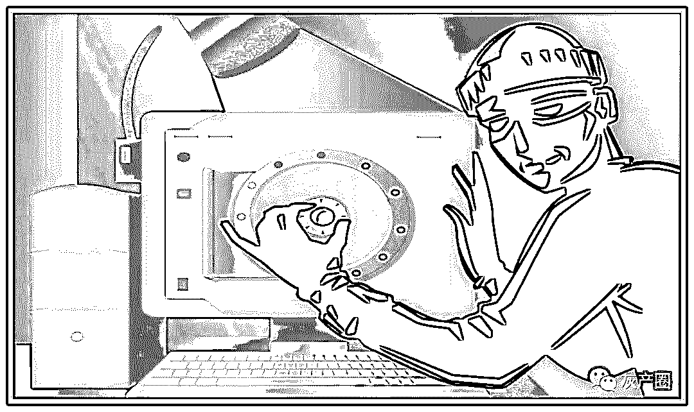

# 看个网页泄露手机号？手机访客营销已成黑色产业链！

> 原文：[`mp.weixin.qq.com/s?__biz=MzIyMDYwMTk0Mw==&mid=2247495543&idx=1&sn=26278cb8c3d6167b2ef0af303f320b95&chksm=97cb244fa0bcad59f378a6a231da6d7c8507ae8b1753baae6cff1734a722295b864c0de63518&scene=27#wechat_redirect`](http://mp.weixin.qq.com/s?__biz=MzIyMDYwMTk0Mw==&mid=2247495543&idx=1&sn=26278cb8c3d6167b2ef0af303f320b95&chksm=97cb244fa0bcad59f378a6a231da6d7c8507ae8b1753baae6cff1734a722295b864c0de63518&scene=27#wechat_redirect)

**点击上方蓝色字体免费订阅“灰产圈”**

为何看个网页就能泄露手机号？

“手机访客营销”已形成黑色产业链 每天危害数百万网民的个人隐私

只是用手机看了个网页，没多久自己的手机号码就成了各种骚扰电话的目标，这到底是怎么回事呢？

其实这都是“手机访客营销”黑色产业链在捣鬼，其利用运营商系统漏洞，非法获取公民手机号，再将信息转卖，用作所谓的“精准营销”。

用手机上网看几条新闻，下线之后没过几分钟垃圾短信、骚扰电话就不请自来，网友对此早已不胜其烦。

然而他们并不知道，就在自己漫不经心刷着手机屏幕的时候，一条新型贩卖个人信息的黑色产业链已经在身边悄然启动。

据统计，2016 年到 2017 年我国有 6.88 亿网民因垃圾短信、诈骗信息、个人信息泄露等造成的经济损失估算达 915 亿元。

360 集团助理总裁姚彤认为，在网络安全事件频发的大背景下，手机诈骗也呈现出犯罪手段心理学化、专业规模化、损失巨额化、信息贩卖产业化等新趋势，因此移动安全技术的升级不可或缺。

现状：用手机看网页也能泄露个人信息

昨天，邓女士的手机被推送一条新闻，她好奇点开浏览了一番，随后就关闭了。

但是很快，二手车广告短信就率先“叮”的一声飞进了手机，随后各种骚扰电话纷至沓来，银行贷款、英语培训、推销海景房、推销保健品等等五花八门。“骚扰电话多得都标记不过来，每天都能接到好几个！”邓女士抱怨道。

据悉，从 2016 年起，有多位网民在网上爆料手机号码、QQ 号码等隐私信息泄漏：“我在手机上搜索、浏览网页，很快就接到了网站客服人员的推销电话，我没有注册也没有登录，对方却精确地说出了我在什么时间、用了什么关键词、打开了哪个网站。”

对此，大多数推销员对用户的回答都是“手机号码是搜索网站提供的”。而实际情况是，黑产利用运营商系统漏洞，非法获取公民手机号，将信息转卖给医疗、教育培训、金融等机构用作所谓的“精准营销”。

具体的操作流程是，这些机构从二级代理手中按月或按年购买此服务后，将“手机访客营销平台”提供的恶意代码嵌入到网页中，当用户点击网页时，他们就可以在后台账户上看到用户的手机号、手机型号、搜索的关键词等各种信息，并雇佣电话客服，对访客进行精准的电话营销，从而让众多网民不得不承受着这些骚扰。

资料显示，2016 年到 2017 年我国有 6.88 亿网民因垃圾短信、诈骗信息、个人信息泄露等造成的经济损失估算达 915 亿元。另有数据显示，国内“网络黑产”从业人员超过 150 万，且有进一步扩大趋势。

调查：“手机访客营销”团伙年收入上亿

今年 6 月“海淀网友”小张在看到网上“提供手机号抓取服务，详情请添加 QQ 好友私聊”的信息。按照对方 QQ 的提示，好奇的小张注册了该网站的会员，并免费试用抓取代码三天。经过自己之前建的小网站测试，发现这项“服务”能够在手机用户浏览过后，抓取到手机号、型号等信息。

小张这时才恍然大悟，原来曾经浏览网页后收到的莫名网络电话，竟然都是黑产从业人员一手“策划”的。如果不是好奇心驱动，小张可能永远不会发现，这种手机访客营销 “服务”竟然已经形成了黑产工具制作、多层级销售代理、黑产工具购买者的 O2O 式的成熟产业链，而背后的利益规模巨大，按照每个网站年会员费 8000 元计，每年黑产团伙的收入就超过 3 亿元。

根据小张的举报，海淀分局网安大队和百度安全技术人员侦查发现，目前，抓取访客手机号已经形成了完整利益链条和黑色产业链，黑产从业者分工明确，覆盖全国大多数省份，每天危害数百万网民的个人隐私。

据介绍，“手机访客营销”黑产有着严格的等级分工。数据泄露源头为运营商手机号返回接口，访客手机号窃取的技术服务提供者根据接口开发出“手机访客营销”平台，并将此类平台销售给一级代理，一级代理负责将服务平台出售给大量的二级代理，二级代理进行手机访客营销业务的分销。

打击：“手机访客营销”黑产窝点被端

百度安全统计发现，大约 4 万个站点存在类似的情况，涉及数百万网民的隐私数据。为此，百度安全与公安机关联合展开 “滤网行动”，组成专案组共同参与侦查此案。

据悉，专案组历时 2 个月深入全国 18 个地市开展落地核查工作，破获了这起国内首例新型侵犯用户个人隐私黑产团伙——“手机访客营销”黑产，初步抓获了 26 家涉案网站及多名违法犯罪嫌疑人，查获公民信息 100 余万条。案件破获后，犯罪嫌疑人梁某等 33 人对“抓取访客手机号行为”供认不讳。目前他们都被检察机关依法批准逮捕。

值得一提的是，百度同步展开专项打击，用 AI 技术围剿黑产。百度安全利用机器学习技术进行非法网页检测，先后开展了 5 次针对性黑产对抗，3 个月内打掉了多个存在这类黑产行为的网站，网民点击到恶意网站的数量减少 99.33%。

据悉，除了此次“滤网行动”，近两年百度对黑产重锤封杀。2016 年 7 月，抓获 DDoS 攻击黑产团伙；2016 年 8 月，研发“天网算法”针对性打击窃取用户隐私黑产；2016 年 9 月，抓获撞库和撞库工具制作者，破获黑产链条；2017 年上半年，风险词黑名单拦截有害信息 1.7 亿次；2017 年上半年，“护苗 2017”清理色情信息超过 2200 万条；2017 年 10 月，配合公安机关抓获伪基站全部产业链黑产团伙。

观点：移动安全保护要向全产业链联动

值得警惕的是，信息贩卖产业化还为手机诈骗犯罪提供了滋生土壤。

360 集团助理总裁姚彤认为，随着近年来各类移动产品的爆发式增长与互联网热点事件的层出不穷，为不法分子提供了众多行骗的机会，比如现金贷陷阱，或者伪造共享单车退款进行诈骗。

对此姚彤认为：“当前诈骗电话与短信持续猖狂，花样不断翻新，在这种情况下，移动安全的技术升级不可或缺。”

他还指出，近年来，以勒索软件为代表的恶意软件逐渐呈爆发态势，危害巨大。而类似永恒之蓝的事件一旦在手机端爆发，目前的安全机制无法及时遏制，其危害程度将远高于 PC 端。“面对威胁，就需要利用大数据和人工智能技术进行场景分析与精准识别，结合态势感知对诈骗进行溯源分析，进行快速阻断。”姚彤说。

据统计，我国伪基站短信数量非常之大，已经成为传播电信诈骗、虚假广告的主要手段。

根据《2014 年中国手机安全状况报告》数据显示，2014 年，360 手机卫士共拦截 613 亿条垃圾短信，平均每天拦截垃圾短信 1.68 亿条，其中拦截各类伪基站短信 32.7 亿条，平均每天拦截伪基站短信约 1189 万条。

姚彤表示，网络安全已经进入“大安全时代”，移动安全形势更加复杂多变。

面对挑战，产业链各方应积极通过技术共享、信息联动、共同建立立体化的防护体系。

移动安全保护从单一型防御转向复合型防御、从技术为主转向技术意识并重、从各自为战转向全产业链联动已是大势所趋。在姚彤看来，系统化地解决反诈骗问题，仅靠单方力量是远远不够的，必须要从全产业链出发，需要主管机构、手机厂商、运营商、安全厂商、科研机构等多方构建一体多位、全链接的移动网络安全防护体系。

据悉，360 已经与三大运营商合作，提供骚扰电话识别、二次号码加白、全网彩信短信拦截、黑灰网址拦截与提醒等服务，业务覆盖全国各省；

与三星、华为等手机厂商开展各类技术合作；配合各地公检法机关打击诈骗犯罪等。

← 向右滑动与灰产圈互动交流 →

**阅读原文加入灰产圈高端社群**