# 当代地下黑市现状——网络犯罪根深蒂固，毒品交易“遍地开花”

> 原文：[`mp.weixin.qq.com/s?__biz=MzIyMDYwMTk0Mw==&mid=2247495540&idx=1&sn=d0117e911c7ab81020c9f72c0469300a&chksm=97cb244ca0bcad5a2741b3dec80df3f9e5d107d83afc1de8d125eda91f9609eb19502762565a&scene=27#wechat_redirect`](http://mp.weixin.qq.com/s?__biz=MzIyMDYwMTk0Mw==&mid=2247495540&idx=1&sn=d0117e911c7ab81020c9f72c0469300a&chksm=97cb244ca0bcad5a2741b3dec80df3f9e5d107d83afc1de8d125eda91f9609eb19502762565a&scene=27#wechat_redirect)

**点击上方蓝色字体免费订阅“灰产圈”**

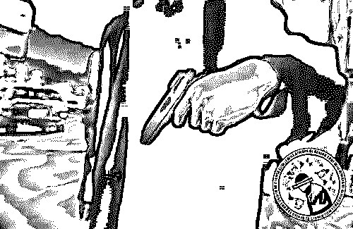

我是在 2014 年接触上黑客技术的，一晃眼，将近 5 年的时间就快过去了，在我刚入门的时候，有幸遇到一个便宜师傅。

他是一名黑色产业链的从业者，也是他第一个为我打开新世界大门的人，跟着他我了解到了许多大众不知道的黑色交易。

普通网民可能想不到，在这片被光明笼罩的大地下，有个充斥着网络犯罪的阴暗角落，每天都交易着成千上万条个人信息，这些信息或许和我们每个人，都有着紧密的联系。

人们为了利益在这片黑色江湖里厮杀，在里面是没有人可以信任的，自古以来，江湖中的行骗者是非常多的，黑产的圈子里同样不例外。

如果说暗网是犯罪分子的天堂，Telegram 又何尝不是呢？

这篇文章不求最全，只求易懂，看官们不妨当作一篇猎奇文去读，这些事可能你不知道。

**本文共 5659 字，阅读大概需要 13 分钟**

在互联网中，存在着一批这样的人，他们利用非法手段去获取利益，一般是指贩卖各类的个人信息，入侵攻击网站等等，这个称之为“黑色产业链”

早在 2014 年时，大量的黑色产业链就已经是在 QQ 群里进行交易的，而**雇佣黑客攻击或者入侵网站或公司网络**，也属于庞大的黑色产业链中的一条，我曾经的师傅就是这条产业链中的一员。

这些黑产从业者发起网络攻击，都是以流量攻击的方式对目标网络攻击至瘫痪，有个词叫“DDOS 攻击”而往往需要雇佣黑客攻击的人，大多数都是博彩同行之间的竞争。

两个赌博网站互相攻击，把对方的服务器攻击到崩溃，玩家无法登录，而一旦遭遇这种情况，做博彩网站的在国内本就不合法，一旦遭遇黑客攻击没法报警，只能不断的防御，并且雇佣黑客进行反攻。

这种行为或许可以称之为黑吃黑，但真正的黑吃黑还是当属这种。

去年 AG 太阳城在网络上公开悬赏竞争对手万博的高层人员信息，悬赏金额高达 500-1000 万。

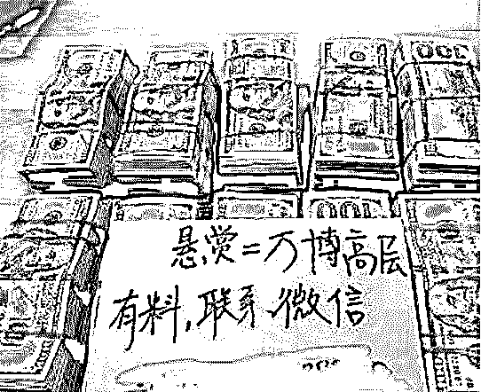

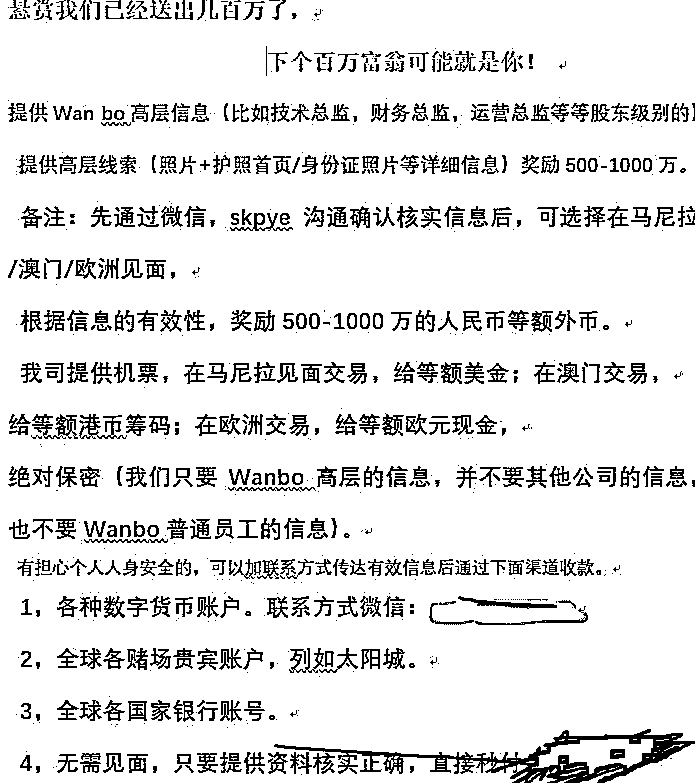

可能大家对于 AG 太阳城不熟悉，我来简单解释一下：“亚洲最大的博彩（赌博）平台，在印尼，菲律宾，泰国都有自己的大厦，旗下有专门的洗钱，打手，甚至是杀手团队，据说每天流水超过 10 亿。

这事的起因是——万博举报了 AG 太阳城的支付渠道导致被封，损失按十亿计算，没过两天万博也开始悬赏 AG 太阳城的高管信息，一旦真实身份被泄露，绑个人可能不是啥难事。

后来国家开始对网络犯罪打击的力度加大后，这一部分黑产从业者深知国内的社交平台不再安全，纷纷转移到国外的平台上——国外平台不归国内警察管。

**那么国外那个平台最适合他们？**

只有一个，号称全球无人能监控的国外匿名社交工具——Telegram。

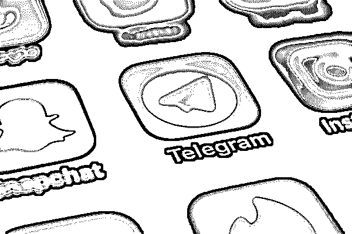

这个社交工具水很深，除了备受黑产从业者喜爱外，里面还寄存了国外的恐怖分子组织，包括反对我们国家政府的某些人群。

例如，民运人士，分 lie 分子，境外的反 hua 势力（不往深说，太敏感了）

过去的一周，我的朋友叶天，潜伏在 Telegram 的各大黑产圈里，亲眼看到了大量网络犯罪，甚至还有毒品贩卖。

数据贩卖在这个黑产圈里可谓是达到一种泛滥成灾的程度，而这个数据贩卖覆盖了全国各行各业的个人信息，说严重点，你的信息可能正在被出售。 

而数据贩卖一般来源两个渠道，一种是外部的攻击导致的泄漏，还有一种是来自内部的信息泄漏。

2019 年 5 月 24 日，我在 Telegram 的中文暗网交流群组看到一条信息——**出售国内学校后台，大学生信息。**

当时我拿烟的手微微颤抖了一下，紧接着尝试联系对方打听这些大学生信息，其实很多时候这些信息交易都是邀请制的，比如需要通过熟人介绍，他们一般不会卖给陌生人，因为担心对方可能是警察来钓鱼执法，又或者同行间来骗数据的。

我伪装成一个不懂圈内规则的台湾人假装和对方进行交易，对方告诉我，他手上有南充，湖南，邵阳国内三家学校后台，一共有十几万条数据信息。

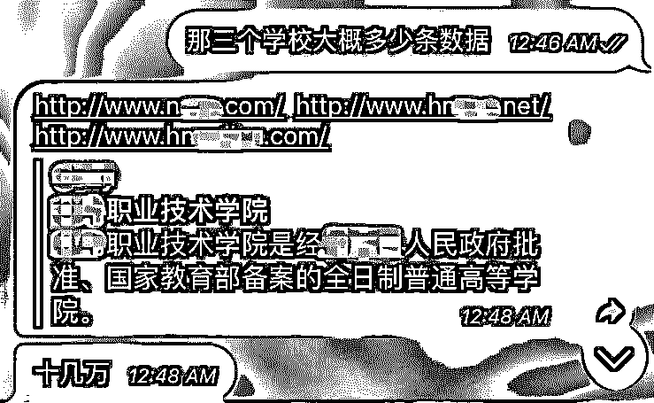

一个小时后，我成功骗到一份南充学校的测试数据，里面记录了一部分学生的姓名，手机号，QQ 邮箱，生日，以及学号，我随机挑选了几名学生信息，通过支付宝搜索该手机号，发现实名信息和数据中的学生姓名为一致。

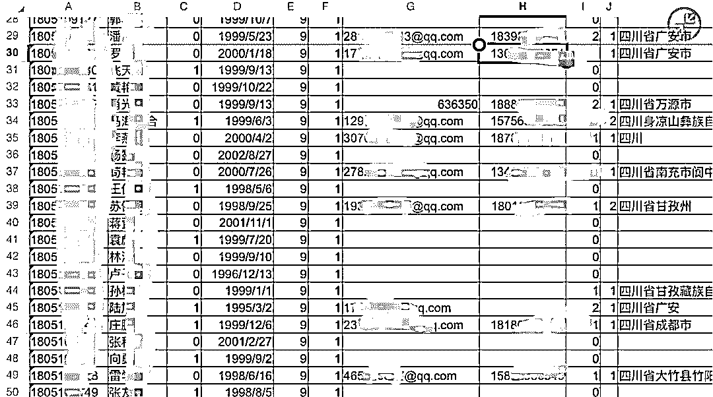

**对方提供的测试数据**

隔天下午，对方又给我发来一个湖南学校的后台登录视频，从视频里清晰的看到该家学校的名字，以及学生的个人信息，我知道购买这些详细信息的人多数为诈骗分子。

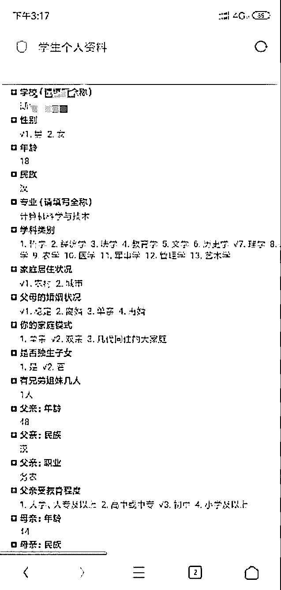

**对方发来的后台登录视频**

利用学生姓名和手机号，出生日期，学号等信息，完全可以设立一个骗局进行诈骗，如此详细的信息一旦落入骗子手里，会不会出现下一个徐玉玉？

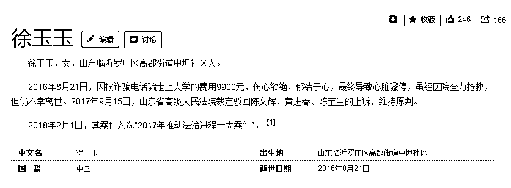

**该死的骗子**

第二种来自内部的数据泄漏，比如全国各地的 4S 店员工出售的车主信息，医疗机构出售的患者信息，房地产中介出售的房主信息，这一类的信息泄漏问题不严重，因为信息详细程度有限，往往要用到这些信息的人都是推销员。

但有一种信息泄漏，你不得不重视——来自我们上传到某些平台上的手持身份证照，这一类私密信息一旦泄漏，会带来很大的麻烦。

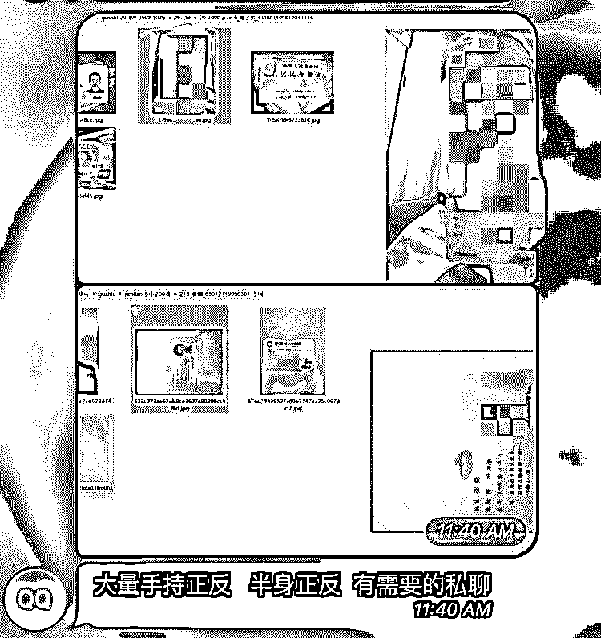

**手持身份证照片贩卖**

举例，某些不正规的金融机构，在他们的 APP 里要求我们上传手持身份证照进行实名，一旦这些机构面临倒闭的危机时，老板为了降低损失不惜出售用户信息，这可不是个例！

当我们这些手持身份证照泄漏后，犯罪分子可以利用这些信息进行平台实名，比如开网店需要实名，他们利用手持身份证照进行实名，在店铺里出售违法物品，而我们在毫不知情的情况下成为了一个月入万元的店铺拥有人。

可能有朋友会问，上传身份证后，不是要让你做眨眼，抬头的动作吗？

可以通过 3D 建模渲染人脸，完全可以模拟出一些简单的动作和表情，去欺骗活体识别，从而达到绕过平台实名认证机制。

除了以上说到的，还有很多很多的平台被入侵，用户信息被出售，只是这些都没有被媒体所报道。

其次就是黑产圈里的身份信息贩卖，一种是已经实名好的手机卡，通俗来说就是手机黑卡。

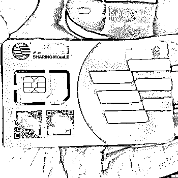

**这是虚拟运营商的手机卡**

使用这类手机黑卡的人，绝大部分都是诈骗分子，在我以前接到的网络诈骗案件中，他们一般都是这样操作的。

利用手机黑卡去注册微信后，在各大的社交平台上发布假信息，例如低价代购等小额金钱的诈骗，他们胆子小，一般都是骗一千几百块，这样也容易进行资金转移。

他们利用当地的便利店收款二维码来接收赃款，很多时候他们会和便利店的老板达成协议，给老板一定的手续费，老板把微信的钱换作现金结算给骗子。

还有一种方式是利用第三方的平台收账，比如通过携程的礼品卡方式，这一类的洗钱方式多数应用在咸鱼平台上的诈骗——搭建钓鱼网站，点击支付跳转到支付宝向某礼品卡支付。

如果是专业的电信诈骗团队，他们分工合作，有组织计划性的进行诈骗，在这种团队中，话务组就是专门用实名卡打电话。

当受害者上当后，剩下的就不归话务组管了，他们会把赃款转交给洗钱集团，黑话叫“水房”

通常他们在 ATM 机取钱时，会雇佣年轻人戴着摩托车头盔去取钱从而拿提成，因为作案工具都是摩托车，黑话里也叫做“车手”

**那么，这些实名好的手机卡是怎么来的？**

就是我刚刚说到的手持身份证照，这些实名好的手机卡，大多数的运营商都是虚拟运营商，比如 170、171 开头的手机号，因为这类运营商对实名认证的监管不严，只需要上传身份证的正反面照片+手持身份证照就能通过认证。

第二种，身份证四件套

身份证四件套在行业里有个词叫“CVV 四大件”也可以称之为“料”

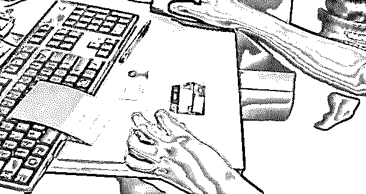

**桌子上的四件套**

所谓的身份证四件套，就是包含了身份证+身份证对应的手机卡+身份证对应的银行卡+网银 U 盾。

而身份证四件套能干嘛，第一个用途就是**隐匿**——北大高材生弑母事件，嫌疑人吴谢宇在早段时间被捕时，警察在他身上搜出三十多张身份证，这些身份证是他用来躲避警察抓捕所使用的。

我们普通人对于隐私保护，不可能用身份证四件套，因为不需要像逃犯一样活着，利用这些身份证四件套足以在小城市里藏的好好的——与年龄相仿的完全可以欺骗房东签订租房协议，而身份证照片不符合咋办？三言两语就能糊弄过去了。

第二个用途，**洗黑钱**。

用身份证四件套洗钱的一般都是搞赌博网站的人，国内反洗钱特别严，他们只能购买大批量的四件套通过小额度转账，把黑钱一笔一笔划出境外。

非常有趣的是，一些身份证贩卖知道有人买四件套去洗钱，他们会在这些银行卡里设置一个服务叫“资金归集”

而这个资金归集就是当这张卡里的钱超出了设置的金额时，就会自动转向另一个账户，当洗黑钱的人发现被人黑吃黑时的模样，和哑巴吃黄莲一模一样！

那么，这些身份证四件套都来自哪里？

这些身份证大多数来源深圳三和，三和大神是一个神奇般的存在，自从戒赌吧被封掉后，里面有很大一部分欠着一屁股赌债的老哥们在三和躲避债主，在他们的眼里，身份证能换来几百块钱无疑是最好的结局了。

**深圳三和挂的横幅**

还有一些偏远地区的务农们，一辈子没出过大山，他们认为身份证只不过一张可有可无的卡而已。

其次就是成人色情内容在 Telegram 上也有着一席之地，叶天告诉我，他发现这些色情群组存在着大量的儿童色情内容——有人利用俄罗斯等地区的小女孩黄色视频进行疯狂传播，把恋童癖变态引流到他们的私人群组里。

在他们的私人群组里放着这些儿童色情视频的下载地址，当用户点开这些链接进行下载视频时，会弹出广告展示，他们就是通过这个方式去获得平台的报酬。

其次就是色情群里暗藏的木马——我常常在 Telegram 的色情群组上看到有人投放一个文件名非常露骨的压缩包，当受害者下载运行后，会自动运行文件内的木马，紧接着通过监控你的电脑摄像头，拍下你的**视频进行勒索。

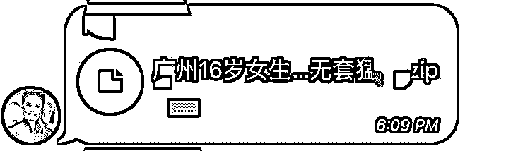

**往往这些文件里都包含了木马**

不知道从什么时候开始，色情总会和博彩挂上钩——色情网站的赌博广告，赌博网站中的色情元素。 

当一个全是男人的色情圈子里，突然出现一个好听的女声，而这个女声还是来问色情资源的，我想大部分男的都会心里都会有云云，毕竟人类有种与生俱来的本能是渴望异性。

你可能想不到，这其实是狗推的一种套路。

狗推，顾名思义就是——狗一样的推广员，这些推广员都是服务于东南亚和菲律宾地区的赌博网站，他们为了骗你赌博，会扮成女人和你谈恋爱，有个骗局叫杀猪盘。

Telegram 的色情群组狗推，一般是这样骗人的，首先他们会用一个变声器或者提前录好的女声在群里发一段语音：“我想看这部片，有资源的能私聊发我吗？”

当有人私聊狗推后，他们会设置圈套，跟受害者聊天，一步一步的引导对方走进他的圈套，比如玩线上赌博，当把你的价值压榨到没了，狠狠一脚把你踢开。

狗推们只要把你骗去玩，其他的压根不用担心，因为所有的赌博网站都是利用人类的贪婪欲进行敛财。

网络安全从业者的朋友应该知道，赌博网站的后台是可以设置赢率的，博彩人员最初会让你小赢一百几十块钱，当你尝到甜头后就开始投入更多的钱去玩，记住，久赌必输，这是定律。

最后就是毒品贩卖在 Telegram 上居然越来越多，从 2019 年 5 月 20 日起，我陆陆续续发现几个群组里出现大量的毒品出售广告。

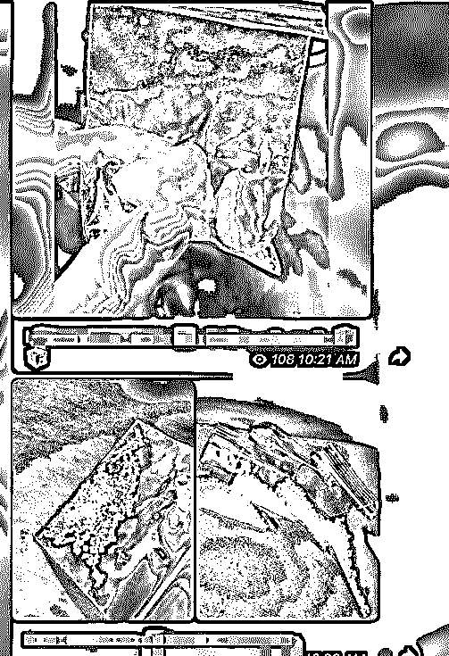

**大量毒品贩卖广告**

例如一种像贴纸似的新型毒品早段时间在国内查获，而 Telegram 上同样有人正在出售，毒贩子利用一种叫 LSD 的半人工致幻剂融入水中后，再滴到这种花花绿绿的贴纸上，吸毒者只需要把它放在舌头上就能完成一次吸毒。

**以前经常看到推特上的国外人拍照片来炫耀**

早段时间杭州警方也查获了一起贴纸类的毒品案，这类贴纸的新型毒品非常容易隐藏，一般人还真就看不出来，也很容易欺骗别人进行毒品运送。

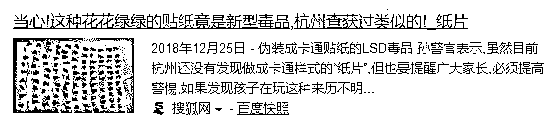

但如果是成品贩卖，要通过快递发货就很难了，于是我联系另一个直接出售冰毒的卖家尝试打听有用的消息。

在继而连三的抛出心里的担心后，卖家告诉了我，他们是通过 X 能这个快递公司发货，其他的没有安全问题，就是慢了点。

**六月份为什么不能发快递，我不知道** 

在卖家问我是哪个城市时，我瞎说是安徽的，对方却说：“安徽没人，发不了货。”

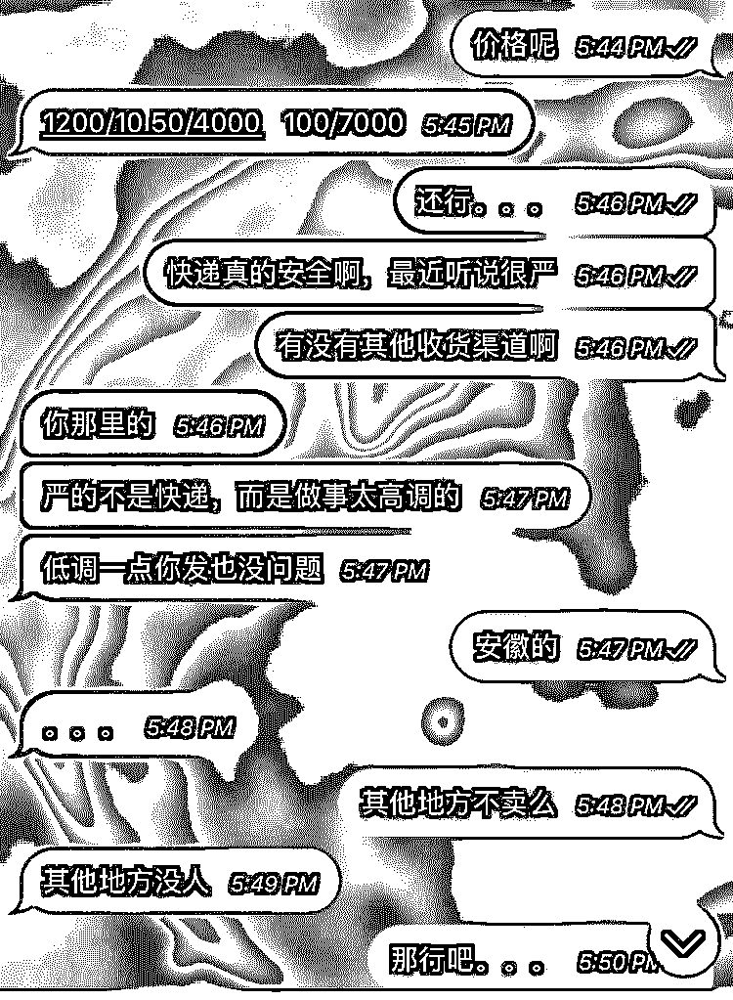

**最后一句话信息量略大**

这句话的信息量很大，总是让我歪想到快递员和毒贩子勾结，但没有能证实的证据，我也不敢瞎说，怕人家告我。

在 5 月 28 号，大部分的毒品贩卖群开始禁言，部分群主甚至把 Telegram 帐号注销掉了，说是 262 敏感期，至于什么是 262，我也不得而知了。

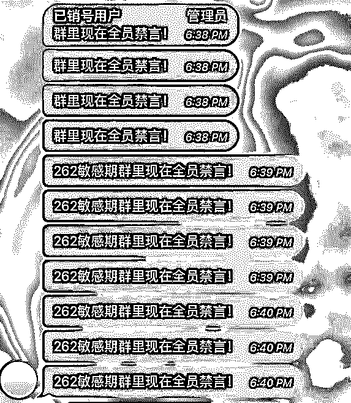

**这个群的群主已经注销帐号了**

同时，部分卖家的发货方式进行了改变，买家只能通过菜鸟驿站进行收货，同时不需要提供姓名的手机号，毒品运到后由卖家告知取货码进行拿货。

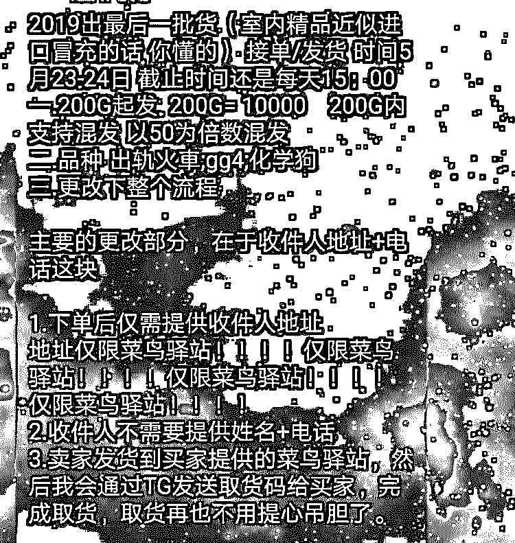

我的猜测是有两方面，第一为了防止卖家被抓后牵连到买家，因为卖家如果被抓了，自然无法给买家提供取货号，从而达成交易取消。

第二种就是，毒品贩子防止警察的钓鱼执法。

综合以上，这仅仅是我所了解到的冰山一角，这片光明的大地就像平静的海洋，而海洋的深处究竟有些什么，这值得我去探索，值得我去探索...

最后希望我的读者朋友们，不要踏入这片不属于你们的领土。

这些年来我看到了太多太多的黑产大佬相继锒铛入狱，我曾经的师傅也其中一个。

当年，他快要出事的前几天，给我发了条 QQ 信息：“我出事了，藏几天，暂时没法教你东西。”

我想了很久，最后只回复他两个字：“保重”

我没有太多的情绪波动，干他们这行的，终要付出相应的法律代价。

或许被警察抓了，才是他们最好的结局。

本文部分线索由叶天提供

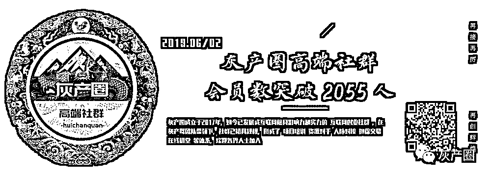

← 向右滑动与灰产圈互动交流 →

**阅读原文加入灰产圈高端社群**