# “系兄弟就来砍我”，都是传奇惹的祸！《贪玩蓝月》背后大佬被捕！

> 原文：[`mp.weixin.qq.com/s?__biz=MzIyMDYwMTk0Mw==&mid=2247495539&idx=1&sn=d2f76cca8ade866b06f6cc915d22f1f6&chksm=97cb244ba0bcad5dfb8b955f1eff72b6c63ba5e4fcfe512fb520745feb9813d9aad39a552c6f&scene=27#wechat_redirect`](http://mp.weixin.qq.com/s?__biz=MzIyMDYwMTk0Mw==&mid=2247495539&idx=1&sn=d2f76cca8ade866b06f6cc915d22f1f6&chksm=97cb244ba0bcad5dfb8b955f1eff72b6c63ba5e4fcfe512fb520745feb9813d9aad39a552c6f&scene=27#wechat_redirect)

**点击上方蓝色字体免费订阅“灰产圈”**

01

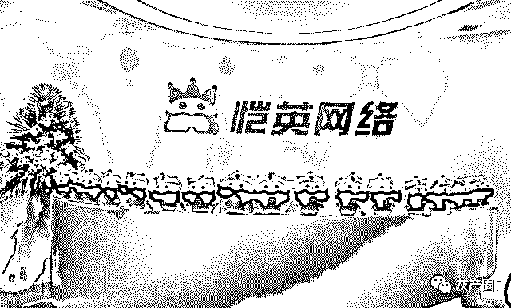

又有上市公司爆雷。

恺英网络实控人叫王悦，6 月 12 日晚间，公司公告称，这个人被正式逮捕了。

恺英网络于近日收到王悦先生的《通知函》，王悦先生因涉嫌操纵证券市场罪，经上海市人民检察院批准，已被上海市公安局正式逮捕。

据悉，王悦在游戏圈的名气很大。2016 年 3 月，王悦迎来人生的高光时刻，以 70 亿元的身家，与滴滴创始人程维一同入选“2016 胡润全球富豪榜”，成为中国最年轻富豪。

02

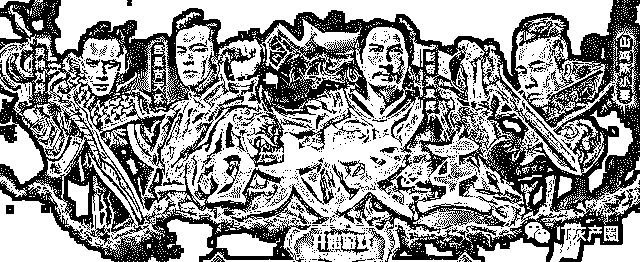

王悦是谁？他就是贪玩蓝月的实际控制人，贪玩蓝月号称游戏界的脑白金，没错，他就是创始人。

当天，#贪玩蓝月实际控制人被捕#热搜第七。

阅读 2884.5 万，讨论 3954。

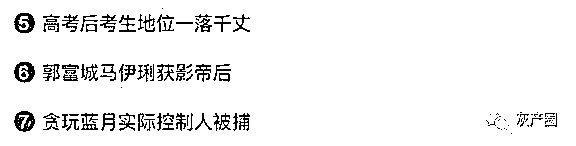

说起《贪玩蓝月》，就不得不提他的洗脑广告语：

> **01 搭嘎好，我是渣渣辉。**
> 
> **02 是兄弟就来抓我，我在贪玩蓝月等你。**
> 
> **03 古天乐绿啦，古天乐绿啦，惊喜不断，月入上万。等级能提现，装备换点钱。**

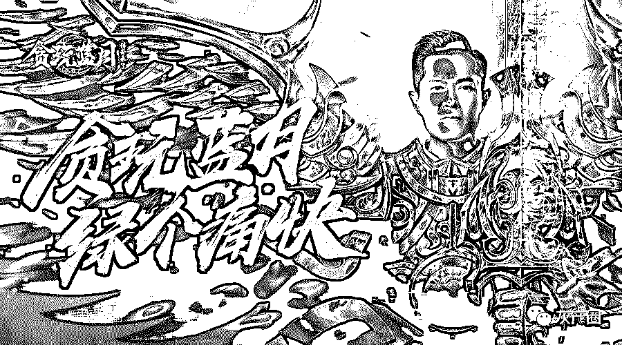

《贪玩蓝月》代言人，集结了张家辉、孙红雷、张涵予、吴京、古天乐、陈小春、甄子丹、成龙、吴孟达、宋小宝、郭富城、曾志伟、马丽等明星。

陈小春在 2015 年 8 月、2017 年 9 月分别代言了页游《贪玩雷霆之怒》和《贪玩问世》。

《贪玩蓝月》在 2016 年找了孙红雷、古天乐，在 2017 年先后找到张家辉、陈小春、刘烨做代言。

此外，吴镇宇也在 2015 年期间代言过《贪玩传奇盛世》。

阵容豪华，都是用钱砸出来的。

据媒体报道，贪玩游戏成立 30 个月，全平台月流水已经突破 5 亿。

创始人更牛逼。

恺英网络实控人叫王悦，2001 年开始在长安大学学习修大坝的专业，父母都是老师，家庭顶多小康。王悦不安分，搞互联网，并且开始做个人站长。

据他本人说，他并不沉迷游戏，只是想办法架站做流量，包括下载站、音乐站等，然后广告变现。据悉他在大学时期就已经年入百万。

2005 年毕业后在上海认识了[http://51.com]的老板庞升东。于是做了 51 的产品经理，一直做了三年，经历了互联网公司的各个岗位。当时 51 的游戏部门就是他创建的，他经历了员工从十几人到几百人，用户量从零做到 1.7 个亿的发展历程。

2008 年他带领团队成立了恺英网络。从做社交游戏开始，类似当时的开心农场等游戏，名叫“摩天大楼”，先后接入当时非常开放的人人网和腾讯平台，用户量很快到达 1 亿。每月营收超过千万。

2017 年，《贪玩蓝月》开服数量 19912 位居页游年度第一名。

2017 年，《贪玩蓝月》流水 10 亿+ 页游年度第一。

2016 年 3 月曾以 70 亿元的身家，与滴滴创始人程维一同入选“ 2016 胡润全球富豪榜”，成中国最年轻富豪。

2018 年，恺英网络的业绩遭遇了滑铁卢。

在 2018 年业绩快报中显示，公司去年实现营收 22.85 亿元，同比下降 27.09%;实现净利润 3.29 亿元，同比下降 80.80%;实现归属于上市公司股东的净利润 1.65 亿元，同比下降 89.75%。

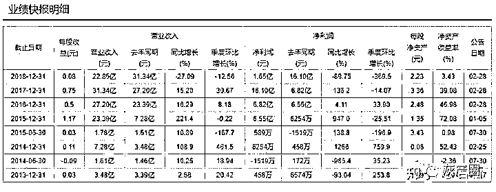

03

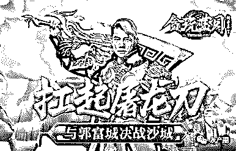

3 月 29 日，恺英网络发布公告称，因受到深圳证券交易所的问询函，问询函中的相关问题需要恺英实际控制人王悦进行确认，但是 3 月 28 日起，恺英网络通过邮件、电话等各种方式都未能与王悦取得联系。

4 月 1 日晚，恺英网络再次公告称，“至今仍无法与王悦先生取得联系。截至目前，公司尚未能够了解到王悦先生失联的具体原因。”

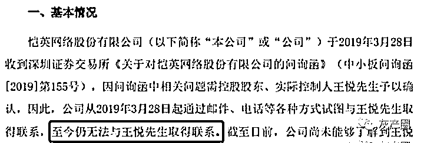

4 月 2 日晚，经济观察报发文称收到消息确认，王悦已被公安机关“网上追逃”，事由涉嫌操纵股价、内幕交易等。

据知情人透露，监管机关的调查已经持续了一年多时间，在 2018 年春节之后陆续收网，其中王悦在几桩收购中，涉及到业绩对赌、市值对赌等事项。

6 月 12 日晚间，恺英网络公司发布公告称，公司于近日收到王悦先生的《通知函》，王悦先生因涉嫌操纵证券市场罪，经上海市人民检察院批准，已被上海市公安局正式逮捕。

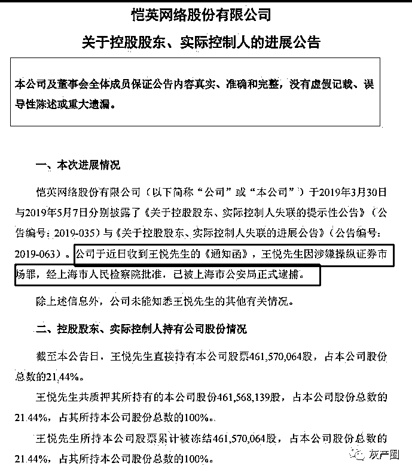

在对浙江盛和以及对浙江九翎网络科技有限公司的收购期间，涉嫌内幕交易、操纵股价。

公告显示，王悦直接持有恺英网络股票 4.6 亿股，占比 21.44%，而且几乎质押了其所持的股份。

04

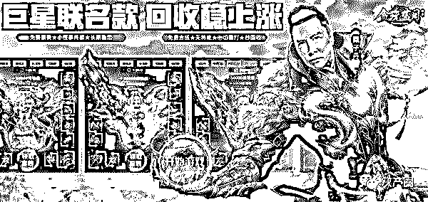

想不通，他年纪轻轻都那么有钱了，为什么还要去做违法的事。

王悦被捕的消息一出，紧接着，江西贪玩信息技术有限公司（以下简称“江西贪玩”）就赶紧出来辟谣，声称游戏是他们的，不管是贪玩蓝月还是江西贪玩这家公司，都和王悦没关系。

这是什么洗白的骚操作？

一起来围观下人家的危机公关：

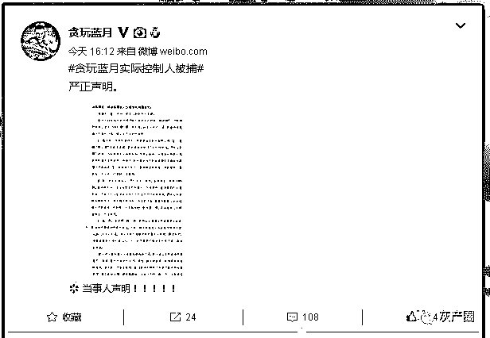

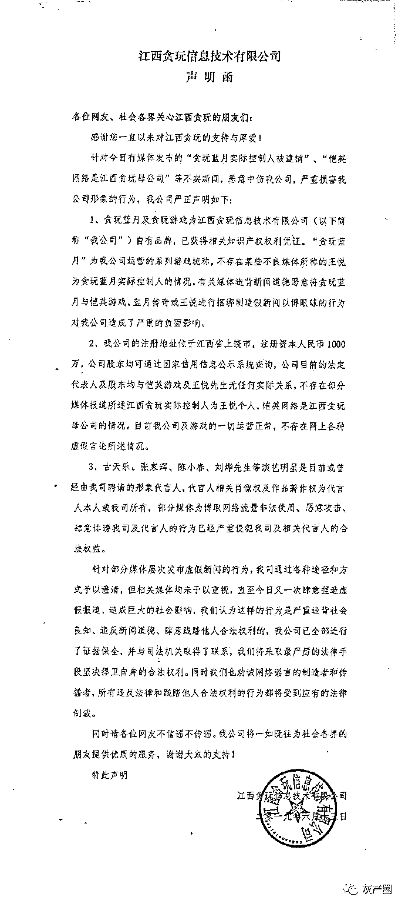

官方声明写的很清楚，很明显是危机公关，至于有没有关系，可能没有比贪玩蓝夜官方更清楚的了，在国内，一般都是谁出了事，所属公司立即声明，与我么没关，我们是躺枪，不是我，我没干，与我无瓜

05

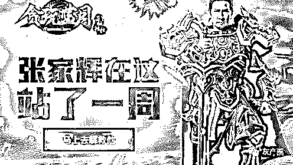

王悦与其说是操纵市场，不如说是被市场坑了。

2015 年 4 月，恺英网络借壳上市消息一出，壳市值在短短一月间就翻了 4 倍，从 25 亿上涨到了 100 亿，2015 年底交易完成之后，恺英网络市值很快就突破了 400 亿。

这个价格高到管理层觉得不变现就是傻叉了，但是才交易完，股票还没解禁呢，只能看着这个股价流口水。

一边是手握数十亿却短期无法变现的股权，一边是只能领着几十万的死工资，买房还需要贷款。

明明都进了富豪榜，妥妥的财务自由了，却没办法爽快花钱，这谁能忍啊。

于是，在借壳上市不久，管理层就开始大规模的股权质押。

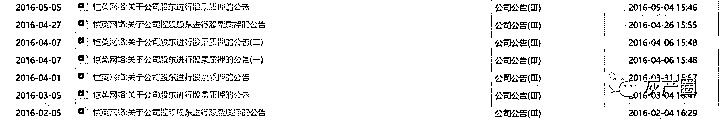

现在卖不了股票，那我就用股权作为抵押物贷款，等解禁了再还。

而且王悦也不算飘了，抵押差不多 37%的股权，然后质押率再设到 30%左右，实际贷款数额也就身家的 10%-15%，身价 80 亿，贷款 10 个亿也是预留了很高的安全垫的是吧。

然后就是买买买了，别墅、私人飞机买起来，作为成功人士，风险基金也要做起来，项目投几个，再借点给朋友亲戚，钱很快就花的差不多了。

可惜之后恺英网络流年不利，业绩被券商吹破之后无法满足市场预期，股价一路下跌，到了 2017 年初市值已经腰斩，已经接近当初质押的平仓价格，这时候经过不断的补充质押，王悦的股权质押比例已经从 37%提升到了 62%。

2017 年 6 月，公司收购三家互联网金融公司开始搞当时红红火火的小贷业务，记得没过多久小贷行业就因为国家政策收紧变得半死不活。

还好股票市场也整体回暖，带动公司市值回到 300 亿的安全线。

2018 年是整个游戏行业的梦魇，恺英当然也逃不掉，版号发不出来，游戏无法上市的结果就是业绩大幅下跌，带动股价一路向下。

2018 年 3 月，恺英开始涉及区块链项目，急于拉抬股价的迫切心情十分明显。

2018 年 4 月，恺英市值重新回到 200 亿，这时候王悦已经慌了，到处借钱想要做市值管理。

结果又遇到了下半年的熊市，这下窟窿彻底补不过来了，市值到 100 亿的结果，就是股权收不回来，还倒欠几个亿。

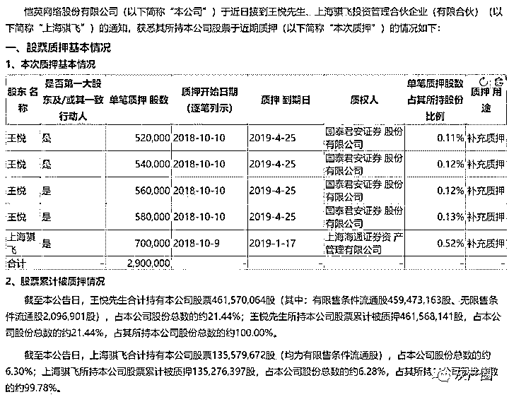

等真的没钱了，就因涉嫌操纵证券市场罪进去了。

本来看上去很安全的股权质押，却使得王悦财富归零，除了行业的流年不利和公司本身的经营问题，最大的原因还是被当时的市场忽悠了，以为自己的公司还真就这么值钱了。

06

| 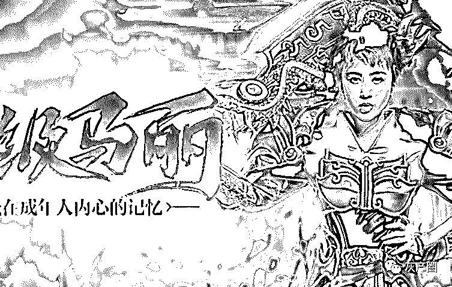 | 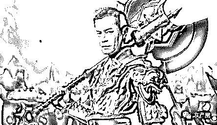 | 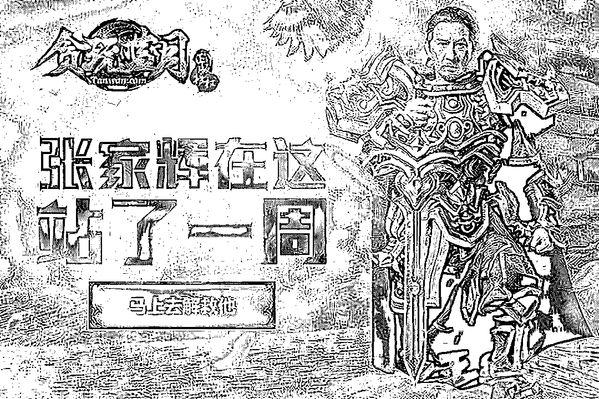 |
| 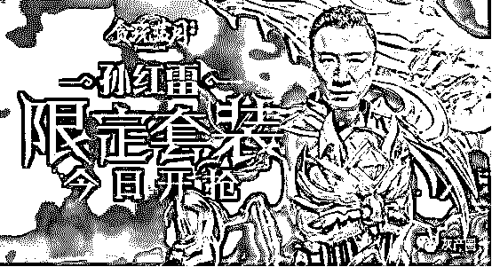 | 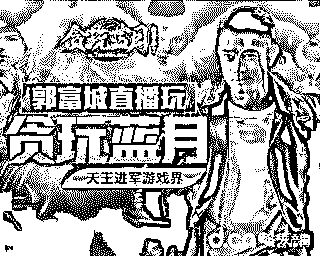 | 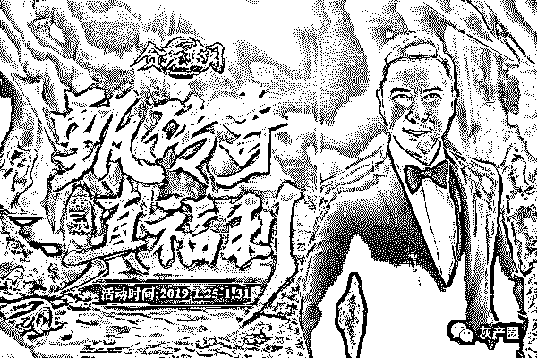 |

**<贪玩蓝月>六大代言人**

是兄弟就来救我，牢房副本，等你来刷，这是你没有挽过的船新版本。

救我出去就送价值 99999 的元宝，抢到牢房钥匙立马高价回收。

牢房打看守，全区横着走。

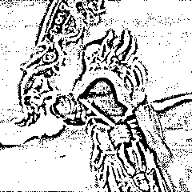

← 向右滑动与灰产圈互动交流 →

**阅读原文加入灰产圈高端社群**