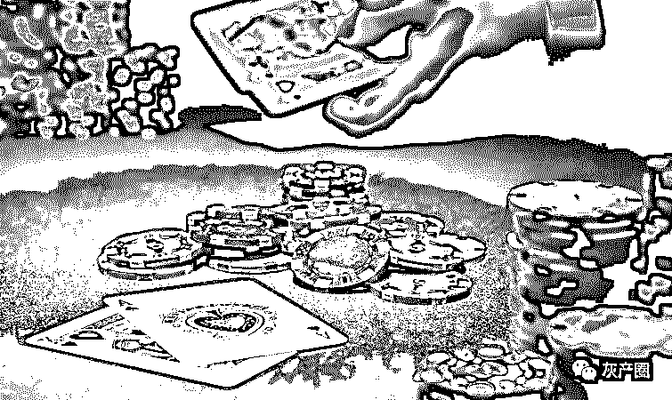
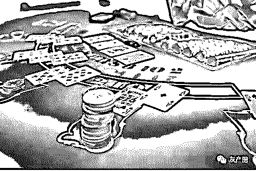
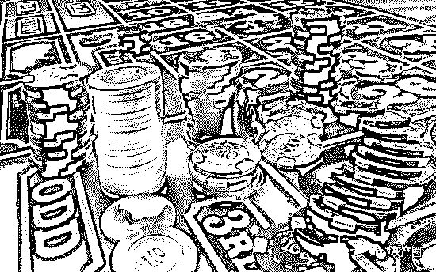
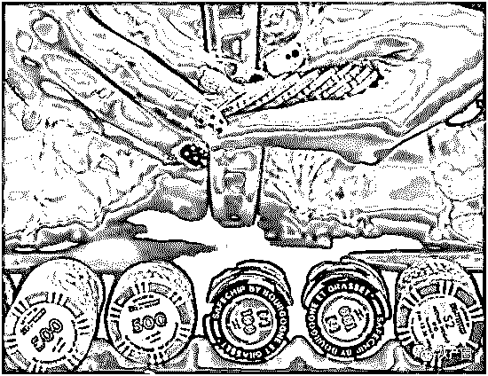
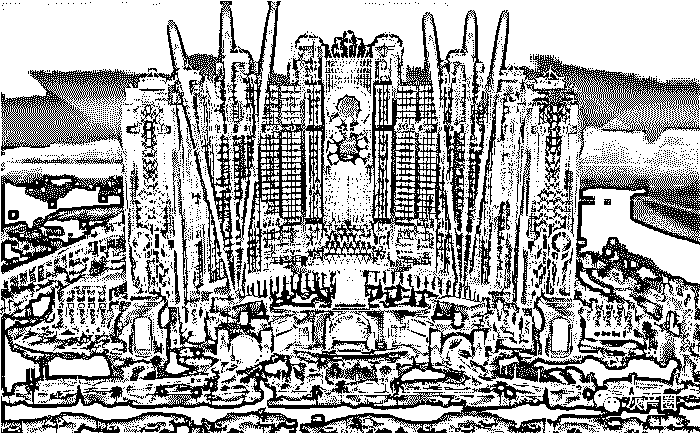
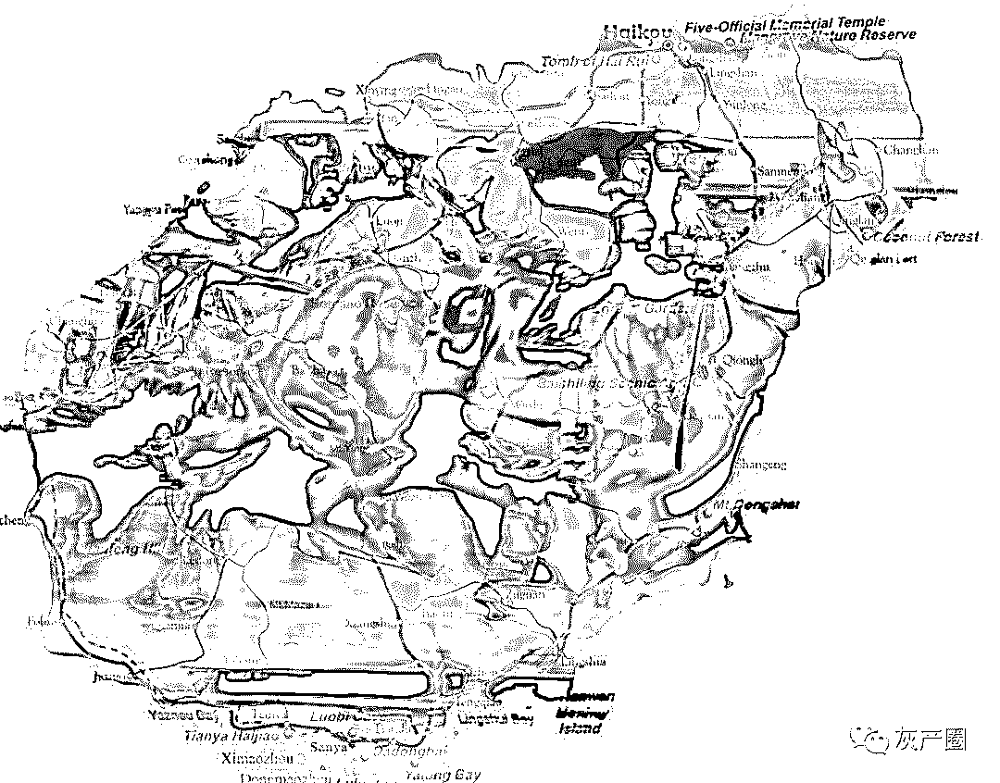
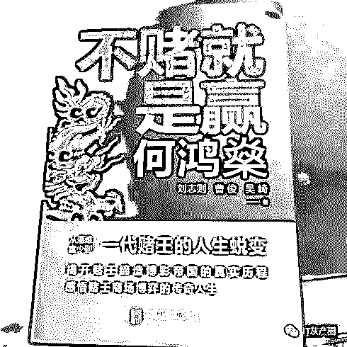
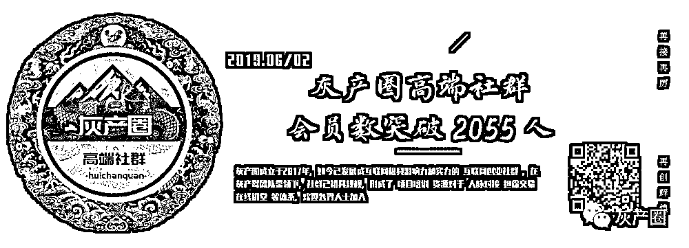

# 菲律宾不是天堂，当一切已成过往

> 原文：[`mp.weixin.qq.com/s?__biz=MzIyMDYwMTk0Mw==&mid=2247495531&idx=1&sn=0c077994ca68c82cac061a6b8ea0fcd0&chksm=97cb2453a0bcad45858e013572b6fe367b01dcd17dfb6f3c18b7406fb196723259b3da4b205a&scene=27#wechat_redirect`](http://mp.weixin.qq.com/s?__biz=MzIyMDYwMTk0Mw==&mid=2247495531&idx=1&sn=0c077994ca68c82cac061a6b8ea0fcd0&chksm=97cb2453a0bcad45858e013572b6fe367b01dcd17dfb6f3c18b7406fb196723259b3da4b205a&scene=27#wechat_redirect)

**点击上方蓝色字体免费订阅“灰产圈”**

灰产圈之前发布了关于东南亚博彩的一系列文章，很多读者看到后除了震撼和点赞还有很多有过从业经验的粉丝看完想起过往，一位粉丝找到我们，他想讲讲发生在自己身上的故事，那么，好，我们侧耳倾听：一位资深的博彩从业者的故事，粉丝名称暂且成为“小 K”，下文是粉丝“小 K”的真实故事，希望对你有所启发和影响。

01

09 年的实习期的时候，那时刚刚毕业，也不知道能干嘛。比较喜欢玩网游，所以就投了一大批各种网络公司的简历。

有一个猎头找到我，问我愿不愿意出国从事网络游戏。当时年轻，听到出国就觉得很高大尚，想都没想就去了，回寝室拿行李的时候还能感受到室友羡慕嫉妒恨的心情。

（现在回想 09 年那个时候的人真的很单纯）

我的第一站是柬埔寨，飞到金边以后司机接到我开了差不多两个小时，刚下车入眼之处皆是一片荒芜。当时比较失望，和想象中差别太大。而现在看来，那个地方已是这个行业的标志性的聚集地了，地理位置靠近越南，那个时候除了一个市场与几家赌场以外一个超市都没有。

02

而后根据职业技能测试，我被分配到了一个品牌维护的职位上，而不是现在所谓的推广和人事，那个时候从事这个行业的公司很少，也没有推广和人事这种职位的存在，招人都是通过猎头公司，推广也不需要推广，我接手到 QQ 号以后，大把大把不知道从哪主动找来的人求着我教他怎么操作，几乎那时就存在的公司放到现在都是巨头般的存在了。

当时和现在的区别：

我们当时的人信息相对现在较闭塞，互联网智商相对不高，比较单纯。

我的同事和我当时的老板，并不是为了逃避责任跑路、或单纯为钱而工作。

我们当时是纯粹抱着做好一件事、单纯的为了爱好兴趣而去做的，与现在的人出发点不同。（包括现在我和我的朋友也没有谁把钱放在第一位）

我们的服务理念是创造一个公平的网络游戏平台，作为回报我们取得业内最低的流水抽成，我们能确保游戏公平性，对非正常玩家实行劝退并返还本金加盈利。不少任何人的一分钱。

（有一段时间老板都在借钱亏，因为很多不正常的玩家，就是现在你们所说的刷子）

我们与客户的关系更像是朋友，我们会为有不理智冲动消费的客户实行劝导节制工作。（入职第一天的必修课，因为这一点所以我才把这个当成是游戏行业）

当时此行业口碑整体无较大污点，对社会安定影响不算大，我们与国家政策并没有产生直接的利益矛盾点。（你喜欢的贴吧随便发，想去哪怎么发都行）

当时的人是为了玩而玩，娱乐成分占多数，现在客户是为了贪而玩，因为当时我们会引导客户树立这只是一场游戏而不是生活的理念，我们倡导有节制性的娱乐。

当时：把诚信放在第一位，公平的游戏。

现在：诈骗

03

好景不长，一伙福建人盯上了这一行的利润，拉帮结伙的加入了进来。我当时的公司主营是体育。从那以后我的工作内容发生了变化，负面舆论的针对成了我最主要的工作。众口铄金有理难辨。大量新冒头的小公司以抹黑我们形象为基础而后引导客户去他自己平台的这种行为成为了行业主流现象。

整个行业充斥着欺诈与谎言。而我的工作量与内容也大大增加，从最初的舆论“不用管”到中间的“全力管”再到后面的“管不住”索性变成了“懒得管”，直接怀疑人生。（当时我随便去一个贴吧都能看到某州害我兄弟家破人亡这种贴）。

可公司作风是啥样子，我还是了解的。当时一伙海南人打协议球（野鸡小比赛），而我这家公司当时也没像现在有风控数据库，这伙海南人赚的钱我当时都很眼红，大约持续了一年，直到老板花重金挖了些大牛过来搞了风控数据库这才停止，而在那之前，为了维护口碑，没少海南人的一分钱。而后这个地区的所有 ip 都放入了黑名单中。

当时年纪轻，比较玻璃心，天天上班就要面对网络暴力，辞了，当时的猎头介绍我跳去一家搞技术劫持渗透流起家的公司。那时候的体育市场基本是被这两家公司霸占了，但由于技术流那家公司不做任何社交渠道的推广，所以被人黑的不怎么多。没错，第一家叫狗州。我这第二家公司叫狗万。

 现在是 19 年，我早已回国四年，近日听说狗万成为了在菲的全民公敌，能提供高层信息者就可以拿到百万佣金。脊背一阵发凉，幸好我跑得快。

 因为我不是专业写文章的，所以想哪写哪，有些不严谨，请诸位海涵。

04

下面我说一下这个行业演变为诈骗的原因：

万恶之源福建人：

安溪一代人居多，拖家带口加入这个行业，为利润不择手段。依靠点对点单聊哄骗客户最终拉入群的方式来给客户洗脑，客户赢了就黑钱。听闻安溪一代人的结婚风俗都是不问车房，只关心对方家里是否有盘。

 万恶之源包网公司：

不需要有大量的资金，不需要有网站开发维护的技术人员，你啥都不需要，只要花非常少的钱就可以买到一体化的建站服务。你所需要付出的代价就是每月的维护费、开板费，以及最重要的平台盈利分成。这类专业化批量生产网站的公司，极大拉低了整个行业的门槛。

一个又一个炮灰投身进来开网站，靠杀猪维持生活，最终只能一个又一个死去。而包网公司确越来越肥。

 万恶之源海南人：

（海南人依靠打水协议等非正常投注手段，让这一类的公司生存岌岌可危，很多不想黑钱的庄在生存压力下也选择了黑钱，而后人多了以后逐渐把套利也做成了诈骗学费的行业。）

现在这两年行业概况：

同行太多，非正常投注行为用户也越来越多（有的小网就是靠骗打水的人为生），而顾客却越来越少（多数已经洗白去从事狗推了），互联网信息屏蔽的概率大大提高，导致这类公司能接触到客户的面越来越小。

特别是今年我国加大了对第三方支付机构的整治力度，无疑掐住了这一行业的咽喉。这个行业的所有公司都在亏损，导致现在除了最早一批的三个巨头公司，其他所有公司全部偏离了“赌”的这个范畴。获利对象也逐步从客户转移到了员工身上，“落地万元户”“万和拳馆”“小黑屋”“祭天”这些名词就是这一行业的员工所要面对的现状。

05

这么多年下来，狗庄没挣钱，顾客也没挣钱，打水的也被黑的洗白。

那么钱哪去了？

答案是全让老菲老柬政府收税赚去了大半，包网公司与当地餐饮和娱乐业也是赚个钵满。

现在的网赌全部有进没出，因为所有不黑的公司都在亏钱，我拿狗州打个比方：

9z 国内至少坐拥 20W 的客户，早年起身时存在杀猪行为，后期大力投资风控技术，挖最先进的人才。

u-e-d 那个时候关网倒闭，散落了一大批的无家 du 狗，就是这批人，盘活了整个 9z，也养活了整个菲的行业生态链，因为当时万 bo 没有推广，只有九州有推广国内，这批客户是 9z 成为行业巨头的资本。

06

9z 20W 客户什么概念？

一旦黑了对我国造成的社会影响性是极其恶劣的，因为 9z、万 bo 这类的公司才存在千万级以上级别的超级大户，而且很多，你们没见过吧，这类客户是人精，也是人上人，也不会傻到小网站玩。9z 一旦开始违背原则，这批人带来的社会影响力将会是无法想象的，所以 9z 后期也被协议球与打水偷鸡搞的亏钱，但又不能黑，不能开这个头，咋办？

 成立一个新盘，ku 游，他把所有的推广精力人力物力财力都放在了这个网，这个网引流的都是新人，不存在什么超级大户。 就可以名正言顺的账户审核拉，就可以黑钱拉~

 如果 9z 近期运营成本不是亏损的，你觉得 9z 这级别的公司吃饱了撑的去分散一个品牌开新盘么？

 9z 可不是你们小网，可以一个老板开几十个都行，品牌既是资本，资本无利不起早。行业巨头都亏钱的情况下，你就知道这行业末日快要到了。

总结：

不要妄想靠网赌搬本，以前的时候只需要考虑输赢翻身都很难，更别提现如今你还要面对 90%以上的黑钱率。所有的庄都是在钓鱼，不是不吃你，只是没养肥而已。对任何非正常行为的用户也会保证他们的权益性，做到百分百 0 污点的这种巨头公司，整个亚洲目前就凤毛麟角的两三家，这一行信息又不透明，在上万家公司里辨别真假与山寨，碰到的概率是极小的。

更不要去从事这一行，如今知识经济的年代，你拿出国外那种 12 小时月休两天的推广精神，卖袜子也比从事这行钱来得快，出国的大多数人只是懒，需要一个爹来监督工作。现在的市场推广这行不亚于劝别人直接把钱送给你，傻子只会越来越少。

而那种不黑钱的大公司要人的门槛至少是知乎线以上，依靠着猎头推荐才能进入。猎头又不可能告诉你他们盘的名字，所以进这种公司的难度也是不亚于中彩票的，一旦没赌对，你可能就要面临天价赔付与小黑屋了。

07

我不做这一行业已经很久了，此贴不带任何广告性质，意在劝人不要奔入这个火坑。

还望各位看官不要举报，让多一点的人意识到这个行业的黑暗面。信息不透明是这个行业存在至今的很大原因之一。

> **10—13 年，去马尼拉就算没有爱情还有钱
> 13—16 年，去马尼拉没有爱情但或许可能会有点小钱
> 17—19 年，去马尼拉没有爱情也没有钱，只有赔付与铁拳。**

行业公司道德线介绍：

> **fun88：和同乐城是一批人做的，道德金钱标准线是 10K（超过就存在黑钱可能性）。**
> 
>  **9zhou：只存在限.额与冻结账号的可能性（钱照退）。**
> 
>  **biwei：限额且道德标准线是 30k。**
> 
>  **wan 博：只存在限.额与账户审核的可能性，你提供给他们需要的资料钱就退你。**

 我暂时只能想到这几家公司，你们想知道其他公司的作风可以提。

柬的公司相对来说会轻松一些，管理方面稍显散漫，老板的生存压力相比菲高昂的办公成本要低很多。

近十多年内出国务工找寻机会的年轻人太多，如果你现在正在菲从事基层岗位或在来的路上，那你不如在国内，花几百块钱请邻居或是朋友监督你，时刻鞭策你干活，一偷懒就打。

然后每个月拿出跟你这边一样的时间，每天十小时以上，月休 2 的这种时间。

再拿出你在这边把客户当成爷爷奶奶的这种耐心，网上就算卖个裤衩子，你能有耐心一个一个聊下来，收入都不一定会比这边低。

但请记住，一定要舍得花钱请人盯着你，大多数人最最需要的就是这个。

**最后**

我们感谢这位粉丝“小 K”为我们讲述的故事，最后的最后，我们再送上至理名言：

**不赌为赢！**

← 向右滑动与灰产圈互动交流 →

**阅读原文加入灰产圈高端社群**