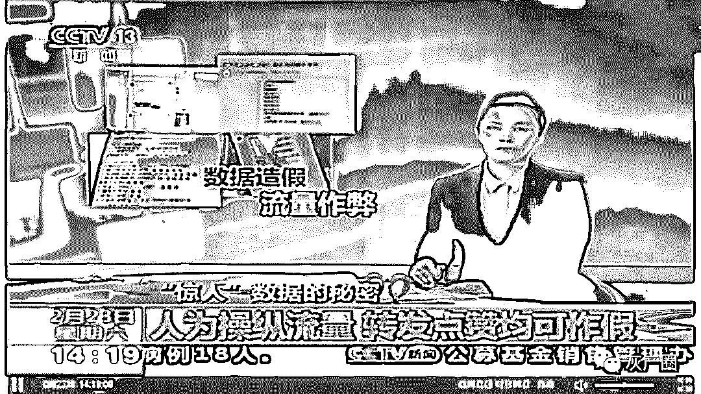
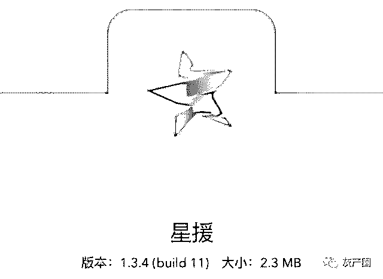
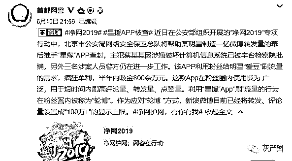
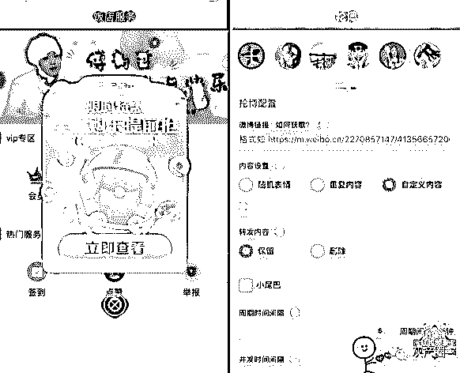
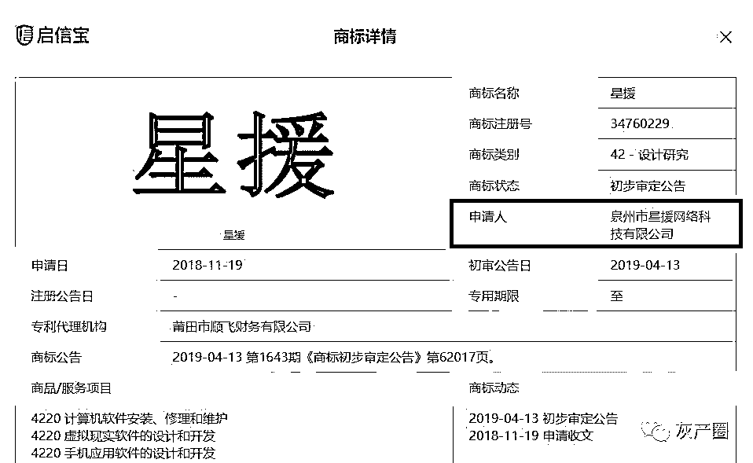
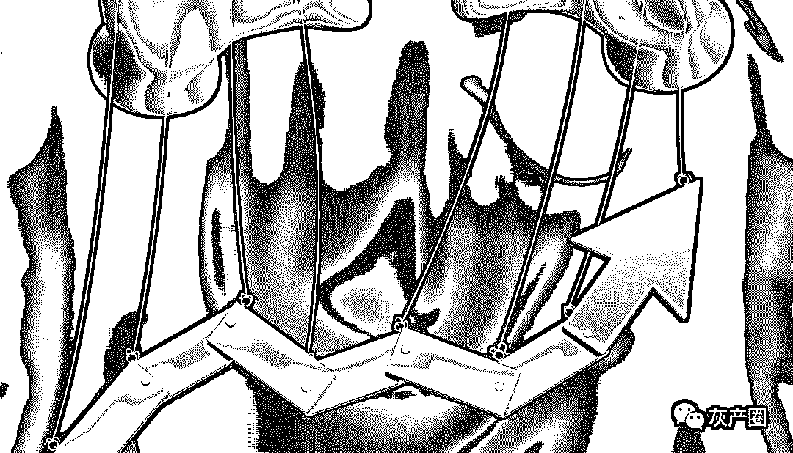
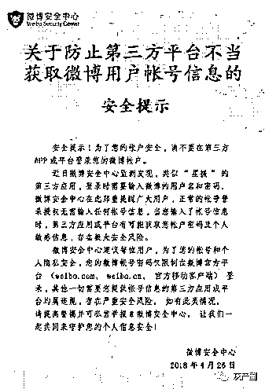
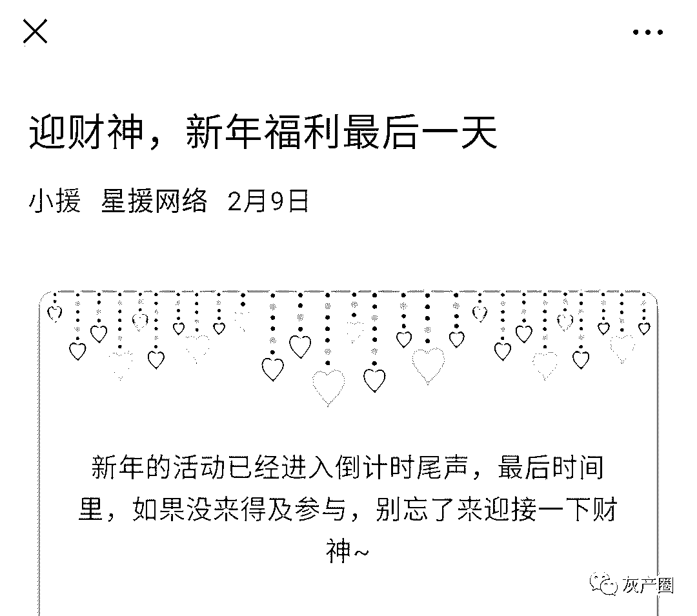
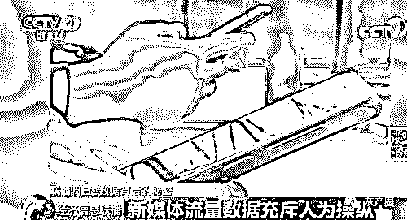

# 星援 App：蔡徐坤 1 亿转发量的幕后推手！

> 原文：[`mp.weixin.qq.com/s?__biz=MzIyMDYwMTk0Mw==&mid=2247495526&idx=1&sn=ed083a726cec1f9f77c91b9ee81de6b6&chksm=97cb245ea0bcad48bd0206a8b38f398f856f1832cf594f6ee11829758ed2704fdc8e7ec35af3&scene=27#wechat_redirect`](http://mp.weixin.qq.com/s?__biz=MzIyMDYwMTk0Mw==&mid=2247495526&idx=1&sn=ed083a726cec1f9f77c91b9ee81de6b6&chksm=97cb245ea0bcad48bd0206a8b38f398f856f1832cf594f6ee11829758ed2704fdc8e7ec35af3&scene=27#wechat_redirect)

**点击上方蓝色字体免费订阅“灰产圈”**

助蔡徐坤一亿微博转发量幕后推手被端

6 月 10 日，据北京市公安局网安总队发布消息，曾帮明星蔡徐坤制造一亿微博转发量的明星应援 App“星援”被封，主犯已被检方批捕。

星援 App 是一款“爱豆”应援神器，设置多项付费服务。粉丝购买相关服务后，可在短时间内为喜欢的明星微博刷高评论量、转发量、点赞量等。据警方披露，星援 App 半年吸金达 800 万。

2018 年 4 月，星援 App 曾被微博安全部门点名，星援 App 的官方微博也被封禁。随后，星援 App 转战微信公众号，并回应粉丝称被点名事件是“违规，不违法”。

星援 App 被封，半年吸金 800 万

2018 年 8 月，明星蔡徐坤一条微博出现“过亿转发量”，进而引发“明星流量数据造假”的争议。

10 个月后，这个为“流量注水”的幕后应援 App 被警方查封。

2019 年 6 月 10 日晚，首都网警官方微博发消息称，近日，在公安部组织开展的“净网 2019”专项行动中，北京市公安局网络安全保卫总队将帮助某明星制造一亿微博转发量的幕后推手“星援”App 查封，主犯蔡某某因涉嫌破坏计算机信息系统已被丰台检察院批捕，另外三名涉案人员警方仍在进一步工作。

据首都网警披露，该 App 利用粉丝给明星“爱豆”刷流量的需求，疯狂牟利，半年内吸金 800 余万元。这款 App 在粉丝圈内使用极为广泛，用于短时间内刷高评论量、转发量、点赞量。

利用“星援”App“刷”流量的行为在粉丝圈内被称为“轮博”。作为应对“轮博 ”方式，新浪微博目前已经将转发、评论量设置成“100 万+”的显示上限。

星援 App 为用户提供多种付费应援服务。

我们注意到，星援 App 是一款可以批量转发微博内容的应用软件，常被粉丝用于为“爱豆”刷量。其中，如会员功能、批量绑号、转发自定义内容等功能则需要用户付费购买。而且，在星援 App 推出前，该产品还曾以网页、小程序、PC 端软件等形式呈现。

6 月 10 日晚，我们从苹果、安卓等多款手机的应用市场中发现星援 App 已无法搜索下载。同时，星援 App 官方微信号“星援网络”中的 App 下载、会员中心等多项功能也被停用。

我们查询发现，2018 年 8 月，泉州市星援网络科技有限公司注册成立，并于 2018 年 11 月申请“星援”文字及图片的商标权，该公司法定代表人显示为蔡坤苗。同时，蔡坤苗名下另有两家工作室，其中，四川省锦江区星援网络工作室成立于 2017 年 11 月，目前显示为星援官方微信号的运营方。

星援官微曾被新浪点名封号，回应称“只违规，不违法”

2018 年 4 月 26 日，新浪微博安全中心“点名”星援 App，提醒用户将账号授权星援类似应用，可能存在被盗号等风险。

微博安全中心表示，“正常账号登录授权无需输入任何账号信息，当输入了账号信息时，第三方应用或平台有可能获取用户账号密码以及敏感信息，存在极大安全风险。”

**2018 年 4 月 26 日，新浪微博安全中心“点名”星援 App。**

随后，星援官方微博被封，星援转战微信公众号“星援网络”。同年 4 月 28 日，针对官微被封一事，星援网络官方微信向用户回应称“这次被新浪点名，微博方面的通告是违规调用新浪接口，而不是违法。”

同时，星援网络也表示，“我们和上亿微博用户使用的是同样的接口，只是允许大家批量重复操作，任何微博微博相关业务的问题都是操作配置的问题或者微博后台的限制。”

我们注意到，2018 年 4 月至 2019 年 2 月，星援网络公众号继续推送星援 App 的付费应援活动，最新一条推送截至 2019 年 2 月 9 日。

我们从微博官方获悉，2018 年 11 月，微博就星援 App 刷量一事向北京市公安局报案。2018 年 12 月，北京市公安机关开展侦查取证工作。2019 年 3 月初，专案抓捕组将星援 App 制作者抓获。

6 月 11 日，新浪微博客服中心就星援 App 被封一事发声称“这是社交媒体行业第一起互联网黑产案，将对互联网行业后续的类似案例提供参考，具有风向标意义，对网络黑色产业也将产生长久的震慑力。”

戏说“流量造假”

我要说的是，流量造假因何而起？

提起流量明星，多数人想到的是当红偶像。但我觉得流量明星和偶像有区别。（非偶像艺人也可能是流量明星）

娱乐圈的追星现象也存在已久，但当时不存在流量明星一说。

我还记得当年的 she、小虎队乃至四大天王还是年轻偶像。还记得当时青少年追星疯狂程度不输现在，说是谁的粉丝，唱某某某的歌，买他的磁带海报是基本的，极端的还会打群架。

但当时的宣传渠道是什么？电视、报刊杂志为主。

电视上各种晚会、联欢会等文艺节目，是宣传明星的正面战场，靠自身表演说话。而娱乐新闻、报刊杂志则是艺人公司宣传艺人的侧面战场，会报道大量的艺人相关的新闻、周边、八卦、甚至谣言。是的，舆论战也由来已久，互黑与洗白也由来已久。

传统媒体的宣传效果与速度是受限的，而网络媒体将信息传播的时间和范围限制大大缩小。

当互联网发展起来，各类公共信息平台，成为了获取娱乐信息的前线。也成了娱乐公司宣传的重要阵地。

但是，至此为止，还没有流量明星。

明星成为流量明星的最后一个阶段，是流量的介入。

何为流量？微博的转评赞数量是、超话榜单是，百度的搜索指数、信息指数是，微信指数是，视频平台的播放量是，各平台的关注人数是，各第三方数据公司提供的数据是，但凡将艺人的人气表现量化成便于对比的数据皆为流量。

**一、“流量大就是有人气”**

这个观点，各位是不是眼熟呢？是谁灌输给我们的呢？

**1、娱乐公司**

首先，流量宣传已经成为一些娱乐公司常规的宣传手段。根本原因，相对于传统媒体，网络宣传成本极低，传播快，范围广，效果明显。上电视需要联系节目吧？发布消息需要邀请媒体吧？哪个比网络平台刷数据容易？而且数据成果具有直观性和可比性，看到这点的娱乐公司宣传艺人的成绩必说流量。

尤其是当娱乐公司没有足够的资源、渠道、资金支持自己的艺人成为所谓的资源咖时，流量宣传就会成为必备的手段。尽快打造当红流量艺人，然后在艺人的流量消失殆尽之前收割红利，已经成为一种固定的赚快钱模式。

**2、社交平台**

社交平台提供了流量宣传必备的一切条件：首先是各种各种原始的统计数字，打开各平台，发一条消息，这条的流量就会直接的显示它的下面；其次是各种排行榜，原始数据在这里被对比，清楚的标识出红与不红。社交平台的规则（含潜规则）为流量打开便利，并依靠流量带来的人气同时也是用户营造的热度换取利益。

**3、“金主”（代言商、推广商等）**

“金主”也会看数据。我知道的可以分两种情况：第一种，金主认为流量数据是真实的。开始我天真的认为这是不存在的，因为任何观察娱乐圈和粉丝圈时间够久的人，都会发现，数据造假这个问题。但是当真实的事例摆在面前，有些时候就是会上当。第二种，金主掌握相对真实的数据，针对对粉丝群体进行定向营销，俗称割韭菜。

**4、粉丝和流量明星**

流量明星是娱乐公司靠流量培养起来的，依靠流量挣“金主”钱，“金主”又赚粉丝的钱。

归根结底还是粉丝为娱乐公司、流量明星、“金主”买单。表面上和非流量明星没什么区别。

其实有一点存在区别，粉丝是不情愿的。不信的话，你可以对任何一个流量明星的粉丝问下面的问题：如果你粉的人是资源咖，你还会做数据吗？看看得到什么回答。

其实多数粉丝也不知道流量有什么用，为什么做数据，但是当娱乐公司通过水军扮演不同的角色（粉丝、黑粉、知情放瓜人）和粉丝会管理人员不断的灌输以下的概念后：

你粉的人只能靠你了（一边说公司不给资源、社会舆论不认同、队友攻击抢资源、金主不看好等等；另一边说数据好看就会被金主看到、买的代言商品多就会被看到，拿资源、拿代言、推广等）。

多数粉丝只能妥协，妥协一次就有第二次，沉没成本逐渐升高，再脱身就难了。

**二、流量造假**

与上面 4 点相对应的，流量造假的原因有以下几个：

> **1.造假容易，成本低**
> 
> **2.社交平台纵容（符合自身利益）**
> 
> **3.真假数据难辨，假数据确实能骗到人，骗到“金主”；一些“金主”不仅知道数据造假，还会催数据。**
> 
> **4.大家都造假，你自己不造，就糊了。**

流量造假的曝光，将会对“流量就是人气”的观念产生冲击，也标志着用流量作为衡量人气的标准开始遭受质疑。

我很乐于见到上面和社会各界开始重视流量造假的问题，因为只有造假大潮褪去之后，真正的人气才会体现出来，好的作品和艺人才会更多的进入人们的视线。

**三、对粉丝说的话**

可能你粉的艺人就是流量艺人，可能现在的环境下，粉丝不做数据，他/她可能就慢慢糊了。但请保持理性的看待问题，对待自身利益。同时，他/她之所以被你喜欢，肯定不是因为数据，请尽量多发现和宣传艺人作品和本身存在的优点，以期被更多的人看到。

结尾

星援 App 倒下了，会有千千万万的星援站起来，其实类似于星援的 App 市面上真的不少，只不过恰好枪打出头鸟，同类型的 App 可能在瑟瑟发抖，也可能在暗自偷笑

我想说打击刷量灰产，仅仅是抓流量中间商是不够的，治标不治本，还是需要从源头抓起：微博为代表的流量平台，平台自身掌握着流量的后台，应该从微博自身的风控抓起，以及修改必要的规则，比如转发超过 100W 只显示 100W＋留言超过 10W 只显示 10W 以内的内容等等措施。

最后，做个投票，你支持花钱帮偶像买流量的行为嘛？

 /mp/newappmsgvote?action=show&__biz=MzIyMDYwMTk0Mw==&supervoteid=504226848#wechat_redirect 

**有什么看法可以在最下方留言告诉我们。**

← 向右滑动与灰产圈互动交流 →

**阅读原文加入灰产圈高端社群**