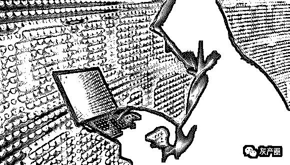
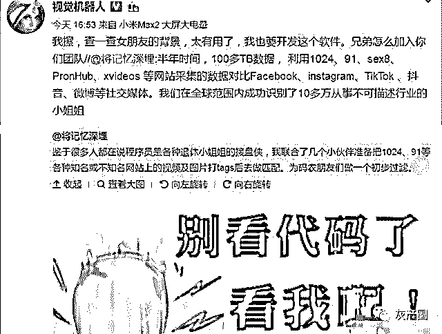
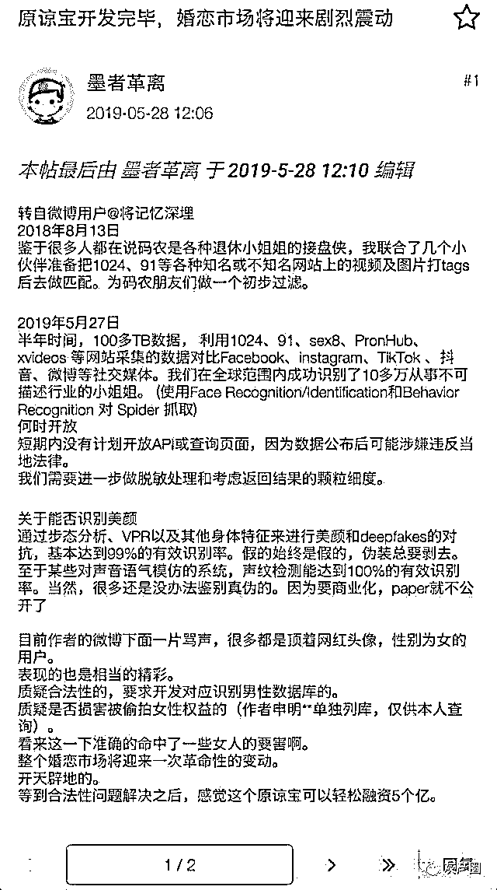
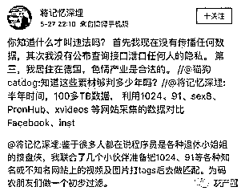
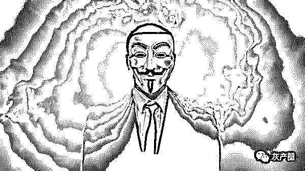
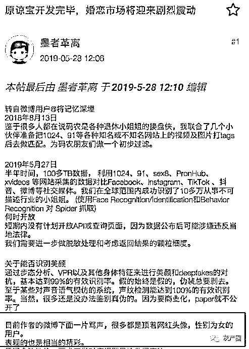
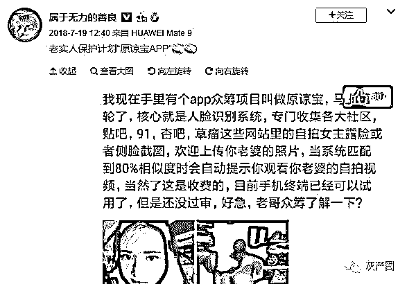
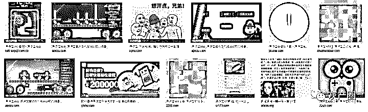
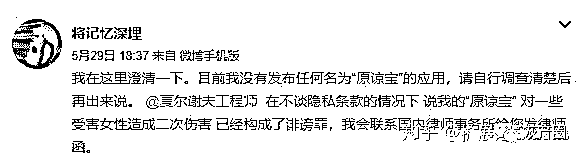
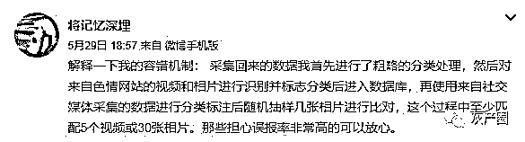

# 原谅宝：你介不介意她拍过的 X 视频？

> 原文：[`mp.weixin.qq.com/s?__biz=MzIyMDYwMTk0Mw==&mid=2247495479&idx=1&sn=e69c42772b1df176430cc8db03d872c9&chksm=97cb240fa0bcad190c46a8d2d5b1646258ae8059c751e8e13c80f2a0406f4d12803e17a0012d&scene=27#wechat_redirect`](http://mp.weixin.qq.com/s?__biz=MzIyMDYwMTk0Mw==&mid=2247495479&idx=1&sn=e69c42772b1df176430cc8db03d872c9&chksm=97cb240fa0bcad190c46a8d2d5b1646258ae8059c751e8e13c80f2a0406f4d12803e17a0012d&scene=27#wechat_redirect)

**点击上方蓝色字体免费订阅“灰产圈”**

导语

  

作为互联网行业中的高薪岗位，程序员备受大众的关注。许多名校毕业的程序员往往在刚毕业后拿到的薪资就与传统行业工作十年以上的老员工持平甚至更多

然而程序员也有自己的烦恼，程序员性别比例较其他岗位相当失衡，大多数都是男性，这样也造成了很多程序员长期处于单身的状态。

随着社会对于程序员关注度逐渐增高，程序员也成为了相亲市场中的"抢手货"。很多小姐姐甚至点名相亲对象必须是程序员。因为程序员赚的钱多，花的钱少

其次程序员自主可支配时间较少，嫁给程序员就能拥有更多自己的自由时间，不会被婚姻和家庭所限制。

始于“程序猿”

  

大多数程序员看起来似乎并不擅长交际，但是并不代表他们不会，而是不屑于去做。因此面对感情，具备高 IQ 的他们也不傻，如果贸然与一个看上去对自己很满意的小姐姐结婚，很大几率会成为传说中的"接盘侠"！如不提前提防起来，没准结婚几年后还会升级为"绿帽侠"！

面对这样的现状，有一批程序员坐不住了，开发出了"原谅宝"这个程序。

该程序员研发的作者表示，该程序在半年时间内采集了 100 多 TB 的数据，涉及多个不同平台，目前已经成功在全球范围内成功识别了 10 多万从事不可描述行业的小姐姐。

简单来说，如果你遇到一个情投意合的小姐姐但是你又对她的过往不了解时，你便可以利用该程序对其进行识别，十分便捷，没准还能找出几个视频。

不过该事件一被公布研发者的微博便迎来了一大波人的围攻，博主可谓被骂的狗血喷头，而这些喷博主的用户则大多数为女性网红用户。

而博主也正面做出了回应，说自己目前并没有传播任何数据，并且本人居住在德国，当前不存在违法行为。

但是可以预见的是，一旦该应用成功研发并投入市场后，婚恋市场将承受巨大冲击！

中国男性按照感情次数可以分为三类：

> 1.感情十分丰富（恋爱次数 5 次以上），
> 
> 2.感情经历正常（恋爱次数 1-5 次），
> 
> 3.老实人（恋爱次数 0 次）。

按照正常逻辑，恋爱次数越多将越懂异性的心思，越会照顾对方的感受，因此当小白遇上感情丰富的老手，会被很快拿下，无论男女。

但是作为小白来说都会介意对方之前的感情过往，并且担心未来自己是否存在被绿的几率。

因此当"原谅宝"上线后，恋爱小白（老实人）将有几率查到对方的过往感情史，倘若存在自己无法接受的事实，大多数人会立刻选择放弃这段感情，毫无疑问这款产品维护了感情经历少的老实人利益。

但是同样它将损害那些感情丰富者的利益。"玩腻了找个老实人嫁（娶）了"在曾经一度成为一度火爆网络的话语，而善于伪装的渣男渣女们则可以将过往历史隐藏的不易被察觉。

但是如果这款应用真的上线，那么之前自己做的任何出格的事情都可能会被曝光

起底“原谅宝”

这个原谅宝是谁做的，究竟有什么用，相信大家十分感兴趣。我们从网络上现有的资料整理如下：

### 原谅宝资料

**制作者**：将记忆深埋 

**制作初衷**：鉴于很多人都在说码农是各种退休小姐姐的接盘侠，我联合了几个小伙伴准备把 1024、91 等各种知名或者不知名网站上的视频及图片打 tags 去做匹配。为码农朋友们做一个初步过滤。（制作者原话）

**制作过程**：历经半年时间，采集了 100 多 TB 的数据，利用 1024、91 等网站采集的数据对比 Facebook、Instagram、tiktok、抖音、微博等社交媒体，在全球范围内成功的识别了 10 万多从事不可描述行业的小姐姐。(使用 Face Recognition/Identification 和 Behavior Recognition 对 Spider 抓取)

**制作情况**：已完成

**开放时间**：待定（因数据公布后可能涉嫌违反当地法律，需要做进一步的脱敏处理和考虑返回结果的颗粒细度。在解决法律风险的情况下，对外发布）

**原谅宝功能**：通过女性照片，识别女性是否曾经从事过不可描述的行业。（可识破美颜、假声）

**关于网民对待原谅宝的态度**：

网上知晓原谅宝的男生双手赞同程序员开发原谅宝

网上很多女生极力反对程序员开发原谅宝。

解析“原谅宝”

## 

一个原本在程序员内部都没有引起注意的项目，甚至连名字都没有，是如何一夜之间变身“原谅宝”并在全网掀起惊涛骇浪的呢？

这当然少不了某些黑产在其中推波助澜。

5 月 28 日，某论坛名为《原谅宝开发完毕，婚恋市场将迎来剧烈震动》的帖子引起了大量转发。

同时，另一张有关“原谅宝”众筹的朋友圈截图也随之扩散，大家纷纷认为这就是 @将记忆深埋 的人脸识别系统。

殊不知，这只是 2018 年 7 月之前的一条旧闻，在今天再次被营销号翻出来炒作而已。

谷歌搜索“原谅宝”，你会看见有许多同名 app 的下载链接，几乎每一个都指向了病毒或者广告植入。

显然黑产也想趁机再收一波韭菜，其中的套路未免太过明显。

5 月 29 日， @将记忆深埋 澄清，“原谅宝”App 并非自己发布，并表示此前发布这条消息的 @夏尔谢夫工程师 已经构成了诽谤罪。

随后， @夏尔谢夫工程师 删除此前的微博，并对@将记忆深埋 道歉。

## “原谅宝”的真相

直到现在，有关“原谅宝”的辩论依然在激烈地进行着。许多人反对的观点几乎都围绕这三个问题展开：

1.侵犯隐私权；

2.怎么判断数据真假；

3.偷拍视频会对受害女性造成二次伤害。

对此，原作者都一一作出了详细解释：

1.整合公开资源并不犯法，但是作者没有表示过数据可以公开查询，因为公开数据做搜索引擎是在大多数国家和地区是违法的。

2.从容错机制上来讲，误报率很低，整个过程至少匹配 5 个视频或 30 张照片。

3.查询结果是本人通过 eID 进行实名认证后获取，不经过本人根本无法查询。因此这个系统更像是“婚前体检”，秉承双方自愿的原则。

4.从技术层面来说，大部分偷拍视频清晰度根本没法拿来做训练集，基本上能识别的都是摆拍。

另外，所有偷拍视频都会单独区分在一个数据库， 查询者只能是本人，在查询之前需要先通过 eID 进行认证，并人脸识别从政府部门查询返回的相片和用户自己上传的相片做二次认证。

并且，如果有人发现自己被偷拍并被识别，系统会提示你向原色情网站提交 DMCA 等要求删除；私下兜售视频的，也会相关采集数据并匿名发送给公安机关。

总结下来，重点就是：只有经本人同意才可查，所查询到的原视频不支持完整观看，偷拍视频经本人举报泄露源删除后也会自动删除。

从出发点来看，作者的初衷是好的：

一方面能帮助男性进一步认识自己的伴侣，

另一方面也能帮助更多的受害女性知道自己所遇非人，

否则偷拍视频永远挂在网上而不自知。

最后，问一下，你希望原谅宝 App 上线么？为什么？

请在下发投票并留言给我们。

← 向右滑动与灰产圈互动交流 →

**阅读原文加入灰产圈高端社群**