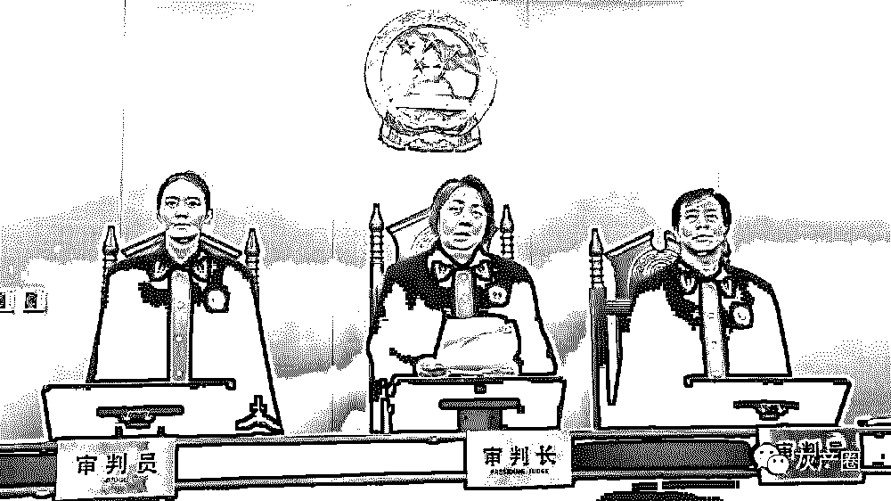
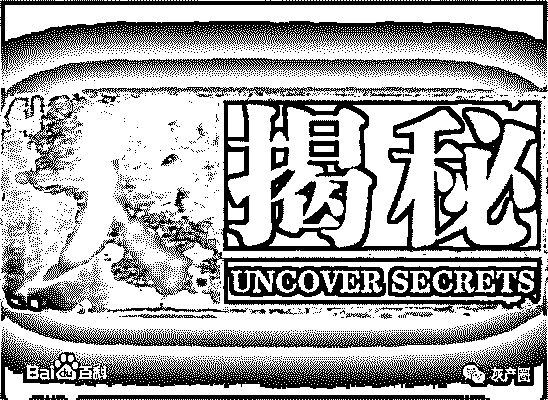

# 全国首例“暗刷流量”案当庭宣判！揭开互联网刷量黑幕！

> 原文：[`mp.weixin.qq.com/s?__biz=MzIyMDYwMTk0Mw==&mid=2247495428&idx=1&sn=c9c7e06ff077fcba3a5675b6b30a07b0&chksm=97cb243ca0bcad2a348cb1dfc7a0ef78315598bce110fb4fdbe6c734ca10c0a565d902588696&scene=27#wechat_redirect`](http://mp.weixin.qq.com/s?__biz=MzIyMDYwMTk0Mw==&mid=2247495428&idx=1&sn=c9c7e06ff077fcba3a5675b6b30a07b0&chksm=97cb243ca0bcad2a348cb1dfc7a0ef78315598bce110fb4fdbe6c734ca10c0a565d902588696&scene=27#wechat_redirect)

**点击上方蓝色字体免费订阅“灰产圈”**

导语

  　3 万元刷出近 3000 万游戏点击量，刷完量却未收到款，并由此引发全国首例“暗刷流量”案。

5 月 23 日下午，此案在北京互联网法院开庭审理，“暗刷流量”这一在互联网界隐秘的潜规则也首次曝光在公众面前。

　　北京青年报直播栏目《法学苑》对整个庭审过程进行了直播，并请到中国人民大学助理教授熊丙万和游戏自媒体人板娘小薇揭秘网络游戏行业“暗刷流量”的暗藏玄机。

案情

　**　刷流量小伙伴反目，为点击量对簿公堂**

　　常某与许某经人介绍成为网友。常某称，2017 年 9 月，许某在微信上提出请常某进行某游戏 APP 移动端 iOS 的暗刷流量，双方在微信聊天中达成协议，约定常某为许某提供“暗刷流量资源”，每千次点 UV（独立访客）的单价为 0.9 元至 1.1 元。双方确认通过第三方统计平台 CNZZ 对流量进行统计。

　　许某解释称，其是应马某的要求而找常某刷流量，而且也对常某明确要求过不要机刷，只要真量。

　　2017 年 9 月 15 日至 10 月 8 日，双方曾进行过三轮交易。但在 10 月 9 日至 10 月 23 日间，许某对常某刷出的约 2800 万 UV 产生怀疑，认为其中有 40%的数据掺假，仅同意支付对应价款 16293 元。

　　而常某则认为许某应按照 2800 万 UV 对应的 30743 元支付，遂将许某诉至北京房山法院索赔剩余钱款，后又撤诉转至北京互联网法院。

庭审

　　**层层分包都是“真人”，搭广告便车暗刷流量**

　　在 23 日下午的庭审中，双方分别阐述了暗刷流量的过程，从而揭开网络流量黑产的冰山一角。

　　常某的诉讼代理人介绍，涉案的 2800 万点击量需要在 15 天中，每天超百万手机用户点击才可实现。而常某本人也是中间商，为完成这些量需经过层层分包。

　　“我下面有代理，将代码发送给代理，每个点击都是真实的人在点。”常某称自己的代理还拥有下级代理微信群，“链接是一串代码，我的下家做成吸引用户点击的图片。”

　　庭审中，技术调查官季晓辉将常某叙述的 js 暗刷流程归纳为“借助其他 APP 或广告的点击量，在其中植入 js 暗刷点击，通过搭其他广告便车的方式来刷其自身游戏的访问量，并且不被相关用户知晓。”此说法获得了诉讼当事双方的认可。

揭秘

　**　暗刷之外还有“机刷”，具体方式不容易查明**

　不过，许某表示，涉案的点击量中并非都是 js 暗刷，可能存在用机器模拟用户的机刷。

　　由于涉案的链接已失效，双方也无法提供详细信息，为查明此案中刷流量的具体方式，法院向北京市通信管理局、北京市网信办、CNZZ 等多家单位进行走访调查，推定常某可能是在多个小网站或小 APP 上挂暗链，从而获取用户点击。

　　许某认为，常某提供的“网络暗刷服务”本身违反法律禁止性规定，依托此类服务所成就的服务协议应认定为无效。

　　此外，由于许某认为自己并非常某暗刷流量服务的受益方，仅仅是受马某所托从事居间，并非此案的适格被告。法院依法将马某追加为第三人，但马某拒不到庭。法院最终根据有关证据，认定常某和许某分别为适格原、被告。

判决

　　**双方刷流量合同无效，履行过程中获利被收缴**

     网络产品的真实流量能在一定程度上反映网络产品的受欢迎程度甚至质量优劣情况，因此，流量成为网络用户选择网络产品的决定因素之一。

      虚假流量会扭曲网络用户的决策机制。涉案合同当事人通过作弊造假行为进行欺诈性点击，违反商业道德底线，违背诚信原则。这一行为亦会同时侵害社会公共利益，既侵害了不特定市场竞争者的利益，又会欺骗、误导网络用户选择与其预期不相符的网络产品，侵害了广大网络用户的福祉。

　　根据相关法律规定，有损害社会公共利益的情形的合同无效。涉案合同违反社会公共利益、违反公序良俗，应属绝对无效。

　　此外，双方通过虚假流量交易获益，违背任何人不得因违法行为获益的基本法理。同时，考虑到此案呈现的技术复杂性、“刷流量”行为的隐蔽性，以及由此产生的对社会公共利益的严重损害，需通过个案的查处表明司法对此类行为的否定态度。因此，法院对双方在合同履行过程中的获利，另行制作决定书予以收缴。同时，将涉案其他违法行为线索转交相关部门另行依法查处。

　　此案审判长、北京互联网法院院长张雯在接受专访时表示，暗刷流量的行为扰乱了正常的网络产业秩序，对于真正致力于大众创业万众创新的人来说是一种不正当竞争，不利于网络治理法制化。下一步法院会向相关行政部门发送司法建议，共同治理网络乱象，营造清朗的环境。

　　我们认为，此案会成为互联网法治发展过程中的一个值得研究的案例。“法院与行政监管部门的有效联动，更有助于企业公平地参与市场竞争，践行社会责任。”

　　此案的宣判从法律的层面给互联网领域通过非法方式或技术手段提高网上浏览量、数据交换量等行为敲响了警钟。“我们发现只要是破坏了正常的行业秩序，无论是否在个案中处于弱势，都不会得到法律的支持。”板娘小薇说。

点评

　　**数据造假是行业潜规则，涉嫌对消费者进行欺诈**

　　数据造假作为一种行业潜规则，在造假的过程出现纠纷时很少会选择诉诸法律手段，导致这种现象一直被深藏。而认定这些数据是否具有真实性也存在一定的现实困难。

　　其实，无论是线上还是线下都或多或少存在这种“水军”，游戏自媒体人板娘小薇披露称一些手机应用商店的下载排行榜也是会有水分的。

　　面对此案中游戏点击数据暗刷的情况，板娘小薇介绍，正常的游戏广告投放流程，需要有与游戏本身对应的广告素材，用户对广告本身感兴趣才会点击进去，这样产生的数据就是真实有效的。

　　“而这个案子中双方都认同了这个数据并非有效的，因为这种点击由于与用户判断不一致，并不能实际转化为用户。”板娘小薇说，“但他们对于这个数据是否真实还是有争议的，就是这中间可能存在机刷的问题。”

　　2016 年 9 月 1 日起施行的《互联网广告管理暂行办法》中明确规定，不得以欺骗方式诱使用户点击广告内容。而这样的暗刷行为显然违反了规定。

　　此外，我们认为，数据暗刷同样也侵犯了消费者的权益。一方面消费者被诱骗点击的行为侵犯了知情权，另一方面，商家通过数据造假，给潜在消费者营造出一种商品很受欢迎的错觉，也是对消费者的一种欺诈。

[`v.qq.com/iframe/preview.html?width=500&height=375&auto=0&vid=a0874q686hn`](https://v.qq.com/iframe/preview.html?width=500&height=375&auto=0&vid=a0874q686hn)

**全国首例“暗刷流量”案**

**宣判收缴原被告全部非法所得**

更多推荐[警惕！你的"男朋友",可能是做博彩的！](https://mp.weixin.qq.com/s?__biz=MzIyMDYwMTk0Mw==&mid=2247495423&idx=1&sn=f10d3c870258bccb203f0b5c92e25b0d&chksm=97cb25c7a0bcacd1e70f92e40c9668a5fffc345b124d46e986c7d9d98368a2a4e1af0e029f00&scene=21#wechat_redirect)[甜蜜的“陷阱”，去 TM 的“爱情”！](https://mp.weixin.qq.com/s?__biz=MzIyMDYwMTk0Mw==&mid=2247495393&idx=1&sn=d7ae7fcd64fd55f03fa5724254f024c0&chksm=97cb25d9a0bcaccf9eb066ec78ea59d013e7cbc952657e0fb8d41f317aeff5e71b000006cc56&scene=21#wechat_redirect)[四年赌博，我失去的不止是青春](https://mp.weixin.qq.com/s?__biz=MzIyMDYwMTk0Mw==&mid=2247495383&idx=1&sn=f6f6961ae4d0d7a02df8a75750d30e61&chksm=97cb25efa0bcacf9c4d4c0cfbdfb7f1faec0afe9679e7760b31eb19f05bb9afbd44c5d29fd50&scene=21#wechat_redirect)[“来电标注”背后的灰色产业链](https://mp.weixin.qq.com/s?__biz=MzIyMDYwMTk0Mw==&mid=2247495383&idx=2&sn=f5360d7fbd5c10fa04d925b0055d1507&chksm=97cb25efa0bcacf9f533153d508a717aec4cab06a90f7eb0d396b8b302424934c82a15009a07&scene=21#wechat_redirect)[专门坑害女性的 PUA 邪术，终于被查了！把女人当宠物调教，恶心！](https://mp.weixin.qq.com/s?__biz=MzIyMDYwMTk0Mw==&mid=2247495379&idx=2&sn=b2df222c65f0fd02ddeca9ead5c7cb20&chksm=97cb25eba0bcacfdcd266c1753a52a05120da0be1b8c1c85ec9f1dab28b11d2914c4b37bcf63&scene=21#wechat_redirect)       

← 向右滑动与灰产圈互动交流 →

**阅读原文加入灰产圈高端社群**