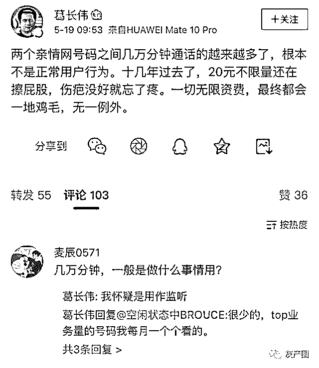
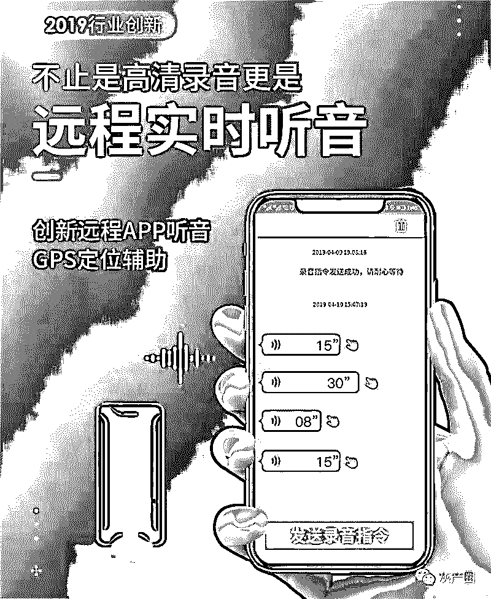
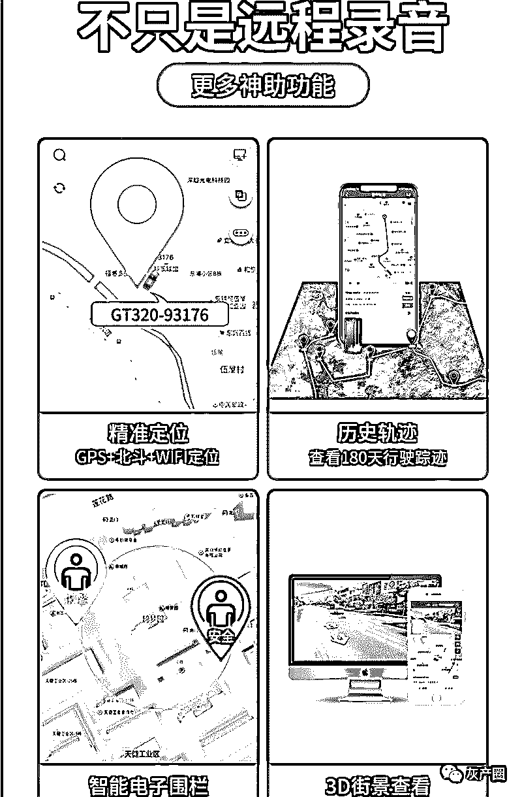
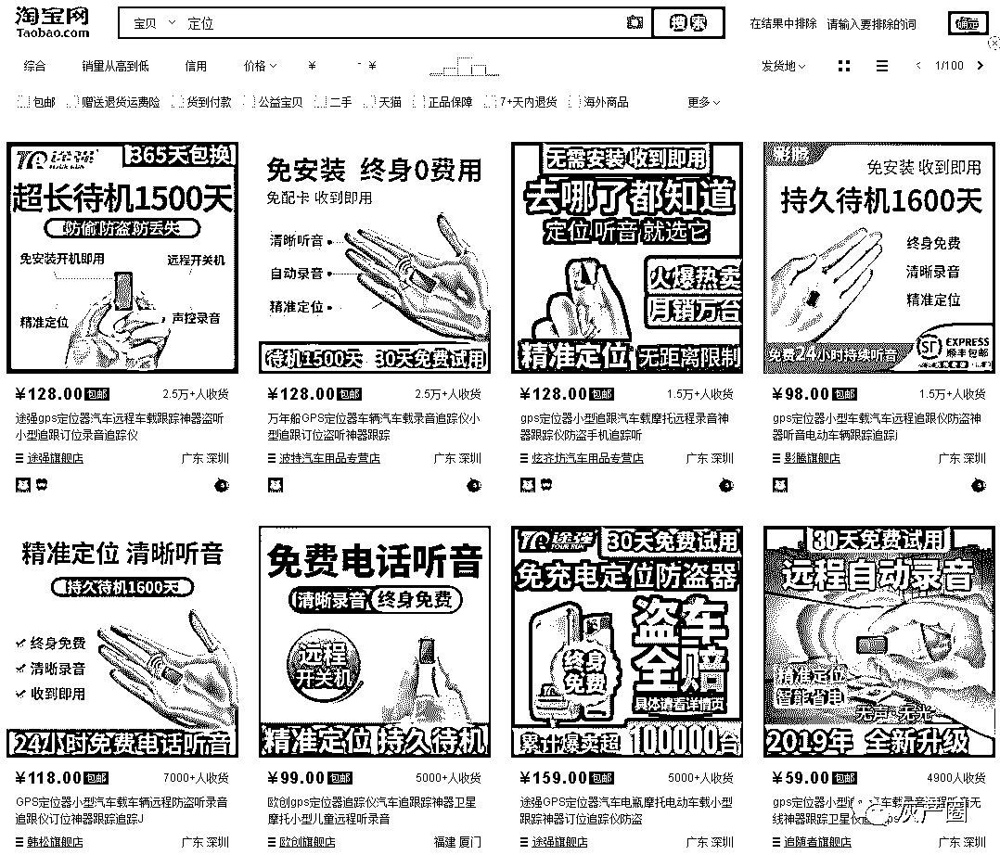
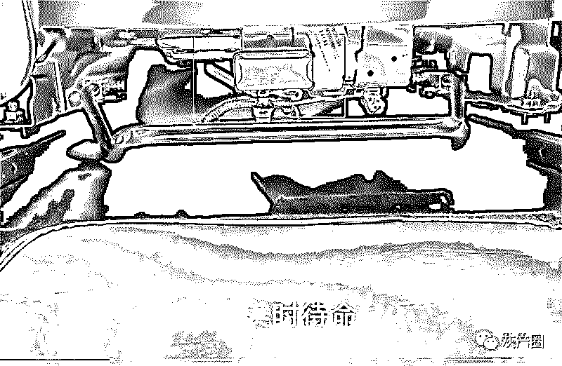

# 一个月通话 3 万分钟！移动亲情号码被滥用隐藏的可怕真相

> 原文：[`mp.weixin.qq.com/s?__biz=MzIyMDYwMTk0Mw==&mid=2247495388&idx=1&sn=79e6aeed0f0d5dab56cc07adfc66b402&chksm=97cb25e4a0bcacf2e513c5be3d189441a112cedfb48c975803e524d5009f6e0d158661b43e7b&scene=27#wechat_redirect`](http://mp.weixin.qq.com/s?__biz=MzIyMDYwMTk0Mw==&mid=2247495388&idx=1&sn=79e6aeed0f0d5dab56cc07adfc66b402&chksm=97cb25e4a0bcacf2e513c5be3d189441a112cedfb48c975803e524d5009f6e0d158661b43e7b&scene=27#wechat_redirect)

**点击上方蓝色字体免费订阅“灰产圈”**

导语

两个亲情号码之间几万分钟通话的越来越多，根本不是正常用户行为 

以上感言是近日里中国移动浙江公司市场部葛先生于微博里说的，让他如此愤慨的原因是，每次中国移动一旦向市场推出某些惠民的无限量套餐，总会被人用来做一些擦边牟利之事。

在对国人为了赚钱总能诞生出无穷无尽“创意”而感到遗憾的同时，这些话经由移动员工说出来，或许也意味着无限通话分钟数的亲情号间拨打也到了阉割之时。

移动亲情号码是什么

移动亲情号是中国移动一项通话优惠业务，一人付费，全家共享（并且移动没有规定一定是需要亲属才能开通），基本费用为 10 元/月，组网最少 2 人，最多 19 人，网内成员可享受互相拨打不限时长优惠。下面是关于移动亲情号更详细的一些说明 

一个亲情号（网）只能拥有一个主号，并且任一一个中国移动手机号只能加入一个亲情号网（移动就是通过这个要求来做一定的限制）
*   移动亲情号码不限于同省内或市内，只要是中国移动号码都行，其实外网的也行，但仅限于拨出优惠（移动打给联通或电信是不计时常）

*   移动亲情号码基本月租为 10 元，含 3 个基本成员号，添加超出 3 个号码后，再增添一个省内成员号每月加 1 元/月，省外成员号 2 元/月，除主号后最多再添加 18 名成员

*   移动亲情号组成员由主号添加，被添加人需要短信回复确认才可有效加入，并且被添加人随时可以退出亲情号组网，但新加入亲情号需待下一自然月

从上文可以看到，其实移动亲情号不过是一种措辞或者说法而已，实则跟移动早年间的短号集群网如出一辙，不过就是组网人数没那么大罢了。

因为该优惠并不需要考核被添加人跟你是否真的具有亲属关系，也就是说你可以把伴侣、好友、同事等经常需要联系的人添加进来也是没问题的（但要注意的是，每一次添加新成员进亲情网的同时，都会向所有其它组员发送一条短信，XX 手机号现在已被加入到亲情网中，所以那些想说好几个异性朋友都添加到一个亲情网里省钱的，小心搬石头砸自己脚了） 。

3 万分钟的秘密

### 一个月通话 3 万分钟是怎么打出来的？

### 这里面到底隐藏了什么不可告人的秘密？

从移动葛先生发的微博我们可以了解到，两个亲情号码间一个月通话时长达到几万分钟，正所谓无三不成几，如果我们按三万分钟来计算，一天 24 个小时，每个小时有 60 分钟，一天就是 1440 分钟，那三万分钟通话时长=21 天

就是说，这对无论是情侣还是爱人还是什么关系的，居然在一个月里至少有 21 天不间断的通话。抛开吃饭睡觉和不方便的时候，到底是怎么样的一种关系才支撑他们如漆如胶地没日没夜通话呢？

别想了，根本不存在这样的关系，因为通话的人不可能不用上班，不用上学，不用打游戏看电视只用手机跟你连线通话，那这 3 万分钟通话时长是怎么来的呢？难道是移动计费系统出问题了？

当然不是！我们看微博下面葛先生自己的评论 - “我怀疑用做监听”。顺着这个线索，我们搜索了一下什么都能买得到的某宝，果然发现了一些可插入 SIM 卡使用的超小型随身“被通话”设备。

上图是某宝上随便搜出来的一款可插入 SIM 卡远程“录音/通话”装置，其实它的原理很简单，就是一个没有屏幕没有键盘的手机，由于插入了移动 SIM 卡（为什么是移动，因为移动是目前手机网络覆盖最好的），只要这玩意能联网打电话（甚至还有 4G 网络），当然就能记录身边发出的各种声音和对话，然后通过内置的程序，就能远程操纵实时监听。

也可以做到像上图那样，智能语音监测，当有声音的时候才会开机录音并向你发送录音片段。

这款装置更可怕的地方是，通过配套的专用软件及机身本就带有的 GPS 定位装置，它能记录运动轨迹，再配合现在的地图实景导航，真的是你在哪里跟谁在一起都做了些什么全程无秘密了，听着都可怕。

其实看了上图，虽然该商家也没再细说什么，但聪明的人都会知道这款设备“最应该用来做什么”。

目前某宝上这样的装置还有很多，而且价格一般也就是 100-1000 元之间都有，便宜的是没 4G 网络只可通话的，贵的都是配有软件可记录定位可上传云端的。

我想这时候的你们心中只有一个疑问，这些装置体积有多大？

别想太多，现今的民用科技，要把一款没屏幕没键盘的 4G 手机缩小还要配上支持长时间待机的电池，其体积还是有两个叠在一起的打火机那么大，如下图红色框中的设备。

在该商家的一个用途宣传视频里，就有把这个设备粘在驾驶座下的场景推荐。更牛的是，这些设备还有云上传功能，就是把声音实时通过流量上传到他们位于云端的备份服务器中，所以也别想说有什么毁尸灭迹这种说法了，只要身边有这个玩意存在，你可以默认自己说过的事去过的地方通通都不再是秘密了。

说到这里，你是不是已经跑下去检查自己的小车了...

← 向右滑动与灰产圈互动交流 →

**阅读原文加入灰产圈高端社群**