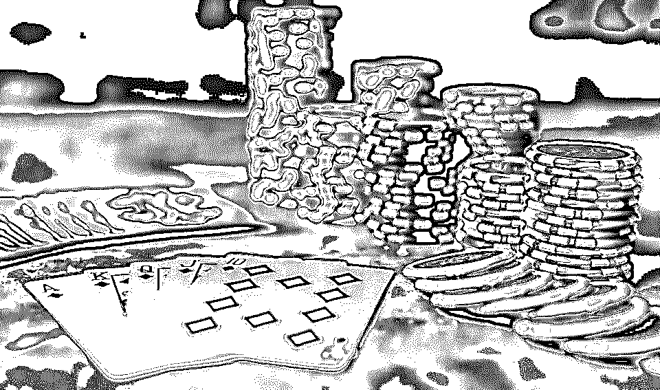
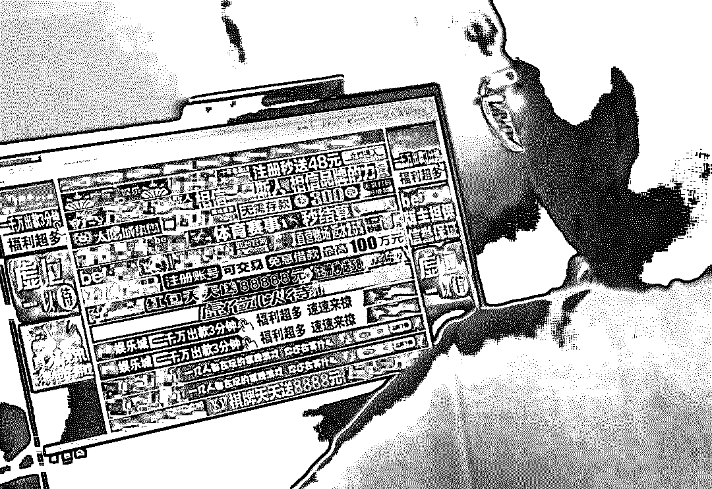
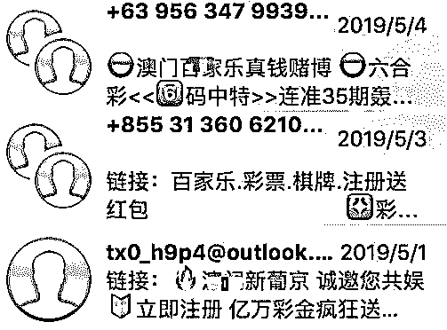

# 四年赌博，我失去的不止是青春

> 原文：[`mp.weixin.qq.com/s?__biz=MzIyMDYwMTk0Mw==&mid=2247495383&idx=1&sn=f6f6961ae4d0d7a02df8a75750d30e61&chksm=97cb25efa0bcacf9c4d4c0cfbdfb7f1faec0afe9679e7760b31eb19f05bb9afbd44c5d29fd50&scene=27#wechat_redirect`](http://mp.weixin.qq.com/s?__biz=MzIyMDYwMTk0Mw==&mid=2247495383&idx=1&sn=f6f6961ae4d0d7a02df8a75750d30e61&chksm=97cb25efa0bcacf9c4d4c0cfbdfb7f1faec0afe9679e7760b31eb19f05bb9afbd44c5d29fd50&scene=27#wechat_redirect)

**点击上方蓝色字体免费订阅“灰产圈”**

作者:守护者计划

只需一台电脑、一部手机再加一个网站，百万富翁一夜就能成百万“负”翁；隔着一道屏幕，无数人的血汗钱源源不断地流向庄家。

这就是——**网络赌博**。

本期文章，守哥采访了一位有 4 年网赌经历的“大五”学生小洋（化名），希望从受害者的角度揭开网络赌博骗局的真实面目。

*1*“那一天，我尝到了一夜暴富的滋味”

守哥：小洋好，据我所知你之前有长达四年的网赌经历，那你具体是从什么时候开始赌的呢？

**小洋：**是从大二的下学期开始的，其中曾多次戒赌却又忍不住，前后加起来大概是赌了有 4 年。

守哥：一开始，是从什么渠道你接触到了网络赌博？

**小洋：**最初我是在游戏论坛中点击了一个**网友分享的链接**，没想到打开后是一款赌博平台的 APP，出于好奇我便下载了。

某赌博网站的注册界面

守哥：当时是因为什么原因让你选择玩下去的？

**小洋：**注册后，客服主动联系我给予了 200 元的**注册奖励**，我随便下注了一个“3 分乐”（3 分钟开奖的博彩游戏），没想到中了 600 元！这让我很兴奋，负责我的客服说最近是平台福利期，**下注可返水 20%**，而且当账户余额高于 1000 元时就可提现；于是，我开始一次次地往里充钱。

几乎所有赌博网站都有类似的“返水”奖励制度

*2*“越陷越深，我的生活里只剩下赌”

守哥：这样赌了大概多久你发觉自己上瘾了？在这些平台里你具体都玩什么呢？

**小洋：**现在想来，从赢第一笔钱时我就上瘾了。和钱挂钩的东西很容易让人成瘾，**大把大把的钱像大风刮来似的，谁能把持住呢？**

玩了一段时间后，我就不满足于单一的下注了。后来我通过类似途径接触到更多的线上赌博网站，平台多了我什么都玩，赌球、德州扑克、大菠萝、百家乐等等等等，甚至连选秀节目的冠军是谁都能赌。

守哥：那因为网络赌博，你的生活是否有发生什么改变？

**小洋：**这四年，我应该输了近 50 万，刚开始身边能借的朋友我都借了个遍，借不到钱后，还在**客服的建议下在平台里借了网贷**。昔日的好兄弟因为我迟迟还不上钱开始远离我，父母更是前后帮我还了三次债。

到后来，我连学费都输没了，也不想去上课，先是留级，后索性休了学，在租来的房子里没日没夜的赌。那时，生活里好像只剩下赌。

守哥：如果当时你已意识到网赌会影响到生活，为什么没有选择收手？

**小洋：**想翻本，我觉得**只是继续下去就一定能赢回来**。

*3*“跌宕起伏，才发现陷身其中无法自拔”

守哥：在这 4 年之中，给你留下印象最深刻的事是什么？

**小洋：**嗯，印象比较深的应该是前年我参与平台内组织的扑克比赛一个晚上赢了 30W，把我激动坏了。

守哥：我很想了解一下这是个怎样的比赛？那么高额的奖金最终有拿到手吗？

**小洋：**这是一个由平台不定期组织的会员间的德州扑克大赛，有不同的下注级别，还分为线上线下场次。钱是到手了，但是扣除其中的费用，再加上拿钱后我在自我膨胀之下参与了更大级别的赛事，轻而易举就**全部输完了**。

守哥：从你的角度，你觉得这比赛中是否存在一些猫腻？

**小洋：**后来想想，其实这个比赛的逻辑是这样的，比方说一场比赛的报名费是每个人 800，加上需要交**“10%的税”**，就是 880 的报名费，然后所有参赛玩家的数量乘 800 就是这场比赛的奖金，由玩家瓜分，**而所谓税钱则白白流入了主办方的口袋里。**

同时，赛事之中你是**需要付荷官的打赏金以及追加下注**。如此一来，比赛真正盈利的永远都是主办方。

所谓的“性感荷官，在线发牌”

有些线下的比赛更是要收高昂的参赛费、交通费、住宿费、场地费等等，根本没有玩家能真正赚到钱。

*4*“我希望，我只是个个例”

守哥：4 年的网赌生活，现在回顾起来，你觉得得到或失去了什么呢？

**小洋：**如果说教训也算收获的话，这可能就是我得到的吧（笑）。但，我失去的真的太多太多了。

我现在回忆那段日子，能想起来的就是我把所有借来的钱统统输完的那一刻，躺在床上的我好像躺在了悬崖边，不知道自己该往哪儿走，只剩下绝望。**我曾是一个很热血的人，但因为网赌，我真真正正地放弃了自己，越陷越深，束手无策。**

守哥：其实，现在还有很多人挣扎在赌海之中，甚至很大一批是年轻人，你想对他们说些什么吗？

**小洋：**其实很多赌博的人都清楚，劝诫别人戒赌作用都不大；只有当 TA 自己狠狠地摔了一跤，才能知错，而到那时，就为时已晚。**所以我希望，所有人永永远远都不要碰赌博，否则，你可能会成为下一个我。**

无论你是否参与过，生活中一定曾遇到——赌场的骚扰短信、网页弹出的小广告、莫名加好友的六合彩号码预测……互联网牛皮癣，非网赌莫属，它正无孔不入的向网民伸出魔爪。**而小洋，只是网赌成千上万受害者之中的一个。**

删不完的骚扰短信

<sectionxiumi.us><sectionxiumi.us><sectiondisplay: inline-block="" top="" solid="" none="" rgb=""></sectiondisplay:></sectionxiumi.us>

那这些网赌平台，究竟是如何运作的？</sectionxiumi.us> 

首先他们会把自己**包装成境外赌场，看上去高大上，显得正规合法**。**并通过各类手段疯狂触达用户**，其中就包括短信邮箱分发、网页小广告、骚扰电话、搜索引擎关键词等等。

接着，他们会给**新会员甜头，培养兴趣**，同时设置提现、参赛等规则，让赌客不能轻易退出。

最后，这些**平台都有一套系统的管理制度**，下设多个团队，如推广团队、代理团队、服务器维护团队等；这些团队各自独立，组织严密，单线联系，导致警方查处十分困难。

<sectionxiumi.us><sectionxiumi.us><sectiondisplay: inline-block="" top="" solid="" none="" rgb=""></sectiondisplay:></sectionxiumi.us>

赌博有赢有输？错，赢的只有庄家！</sectionxiumi.us> 

几乎所有的网络赌博，**组织者在后台都有技术控制的权限**。哪怕到开奖前的最后一秒，组织者或者庄家都可以让程序员在后台更改结果，参与者却一直蒙在鼓里。

而一些平台开设的所谓赛事，更是他们的快速圈钱活动，此种赛事中，组织者不“坐庄”，只提供平台服务。当赌资越滚越大，**平台就可以躺着挣钱。**

守哥写在最后的话

采访的最后，小洋告诉守哥，他已经决定回校复读，重新开始他的人生；小洋的人生还很长，有回头和改正的机会。**但有很多赌徒的人生，却赔进网赌平台了。**

今天文章的最后，守哥只有四个字送给大家——**“不赌为赢”**。

PS：本文根据真实事件改编，文内人名均为化名。

← 向右滑动与灰产圈互动交流 →

**阅读原文加入灰产圈高端社群**