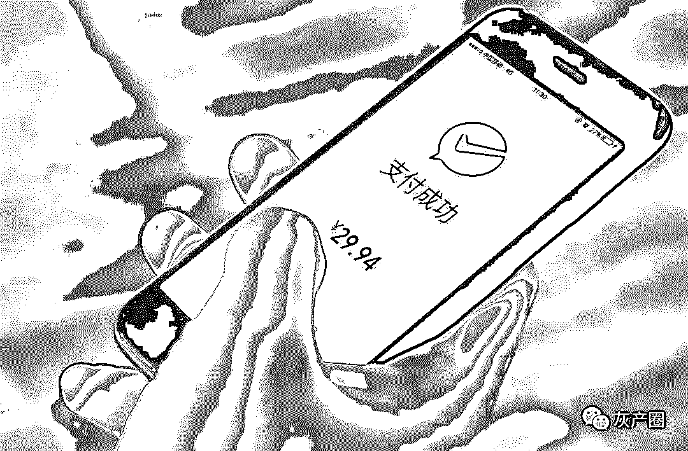
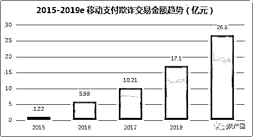
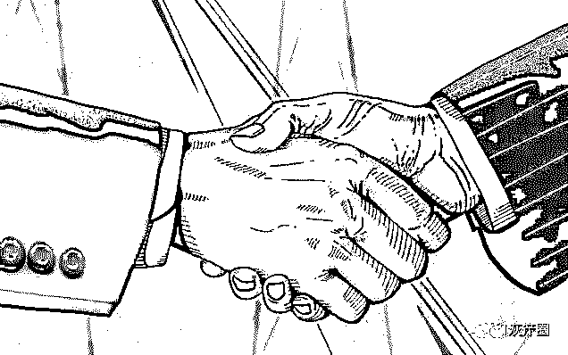
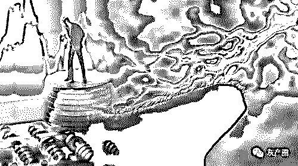
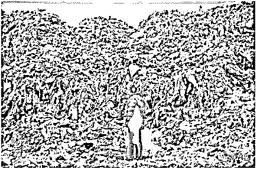
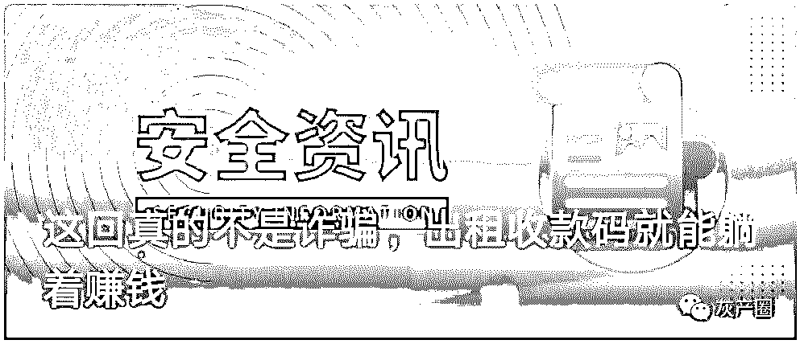
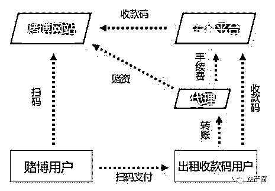

# 生意经幕后的潜规则：支付企业成黑产谋利帮凶！

> 原文：[`mp.weixin.qq.com/s?__biz=MzIyMDYwMTk0Mw==&mid=2247495379&idx=1&sn=a41f6147e435948b6e5af06bdd28e5c1&chksm=97cb25eba0bcacfde50073a33c624bf91fc1e2226b48476da2d55027726312f64f3e4f18b105&scene=27#wechat_redirect`](http://mp.weixin.qq.com/s?__biz=MzIyMDYwMTk0Mw==&mid=2247495379&idx=1&sn=a41f6147e435948b6e5af06bdd28e5c1&chksm=97cb25eba0bcacfde50073a33c624bf91fc1e2226b48476da2d55027726312f64f3e4f18b105&scene=27#wechat_redirect)

**点击上方蓝色字体免费订阅“灰产圈”**

导语

天下熙熙皆为利来，天下攘攘皆为利往。

近日，有多名投资人向我们表示，他们参与投资的多个平台最后发现是虚拟货币、网络博彩、和其他非法外汇等部分违规违法平台，而不少支付机构还为这些平台提供支付结算业务，众多投资人要求支付企业查封账号并冻结商户资金。

据投资者反映，这些支付机构中，不乏支付宝、银联等行业巨头。

对此，一位支付公司负责互联网支付业务的资深人士表示：“虽然监管条例的威慑力很强，但是落实起来比较困难。”

随着互联网逐渐渗透到个人生活的方方面面，网络用户已经成为各商家争相掠夺的对象。随之而来的是，各种网络黑产泛滥，且有越来越严重的趋势。

那么，支付企业为何成为网络黑产的推手？产业链背后又有哪些不为人所知的秘密呢？

支付平台成为网络黑产的幕后推手

经过多年的发展，互联网黑色产业链日趋完善，并逐步向专业化、产业化趋势发展。目前整个黑产行业通过分工合作，以团伙作案的方式，对整个互联网金融行业造成了欺诈、洗钱、骗贷等多种风险。

据中国支付清算协会测算，2018 年中国移动互联网支付交易规模将超 170 万亿元，如按照移动支付行业十万分一的交易欺诈率测算，2018 年由黑产造成的欺诈交易损失将超 17 亿元。而欺诈交易金额在 2016 年时才 5.88 亿，到 2019 年预计高达 26.8 亿元，未来将继续保持高速增长的趋势。

众所周知，互联网金融牌照对于从事该行业的企业来说非常重要，也非常稀缺。对于没有互联网金融牌照，又想从事互联网金融、或者和支付有关业务的公司，只能与拥有移动支付牌照的第三方平台合作。

当用户在第三平台交易时，移动支付公司会向第三方平台收取一定比例的手续费。只要有用户交易，第三方平台和移动支付双方都能获利。由于利益的驱使，导致移动支付平台容易忽略对合作方资质的审核和监管，或者出现自身违规的行为。

特别是 2018 年以来，总体监管趋势越来越严。如果按单次超过 400 万以上的罚款来计算，2018 年整年度，央行反洗钱处和支付结算处针对互联网金融公司，已累计开出超过 1.7 亿元人民币的巨额罚单。

一方面是移动支付欺诈交易金额逐年上升，另一方面是互联网金融行业的罚单居高不下，都说明了网络支付黑产行业的繁荣盛况。

对此，银联方面回复称，中国银联作为清算组织，始终严格遵守各项监管规定。同时，严禁成员机构为任何非法交易提供支付服务，如有违反将严格按照相关业务规则予以处置。支付宝方面也表示，对于网络赌博是零容忍，拒绝与任何涉赌商户合作，并会不断引入新技术加强打击力度。

有法律界人士表示：“投资者的资金被骗，第三方支付结算平台也有着不可推卸的责任。如果支付平台加强对合作方的审核，对合作方资质有严格的要求，必然在很大程度上减少欺诈事件的发生，为用户的资金提供安全保障。”

产业链上多方各取所需

在移动互联网时代，越来越多的消费和支付从线下转移至互联网，移动支付已经普及开来。同时，日益增多的移动支付安全风险，以及不断暴露在公众视野中的支付黑产问题频出。

移动支付黑产日益发展壮大，离不开产业链上的用户方、第三方非法平台、以及支付平台这三方各取所需，共同推进产业链不断增长。

站在用户端角度，用户手上的资金，需要找投资出口，以期获得不错的回报。2018 年 1 月至 10 月，广东公安机关依法侦破涉众型经济犯罪案件 967 起，其中查处 P2P 网贷平台 67 家，资金总额高达 469 亿元。不仅广东，还包括浙江、上海、江苏等经济发达的省市成为 P2P 爆雷的重灾区。

爆雷的背后，一方面是投资者明白持有人民币，把钱存在银行虽然安全，但是收益率过低，远跟不上通货膨胀的速度，希望把钱投到投资回报率较高的行业，P2P 平台因为承诺投资回报率相对高而受到追捧；

另一方面，由于 P2P 平台难以长期兑现投资者较高的利息，或者部分平台就是以蝇头小利引诱投资者加入，最后骗取他们的本金。

一个愿打一个愿挨，导致许多 P2P 平台接连爆雷。还包括各种发行虚拟货币，然后割韭菜事件等，都是商家深谙个人投资者的贪婪，希望获得高额的投资回报率。殊不知，“你要得是别人的利息，对方要得却是你的本金。”

投资者无论是在相关网络平台购买虚拟货币、从事网络博彩、还是投资外汇等，都是出于内心的贪婪，希望获得高额回报。第三方诈骗平台正是基于对用户心理的洞悉，才屡屡得逞。

站在第三方非法平台角度，他们本身就是为了非法牟利。由于他们没有移动支付牌照，要想从事支付业务，只能寻求与银联、支付宝等第三方支付平台合作。

一方面，第三方非法平台为了争取和规模较大的第三方支付平台合作，于是和后者达成合作协议，许以较高的支付佣金。另一方面，为了吸引用户，许诺用户较高的投资回报率，等用户参与投资，或者得投资金额达到一定规模后，就极易容易出现携款跑路的情况。

站在支付第三方平台角度，支付平台与第三方非法平台达成合作后，只要用户产生交易行为，就能获取手续费。迫于利益的驱使，导致支付平台对第三方非法平台资质、资料等审核不严，从而出现诈骗的情况。

总之，移动支付产业链持续增长，是因为三方各自追求利益，同在一条船上，只是个人投资者处于弱者的角色罢了。

用户成为稀缺资源，就是钱

移动互联网时代，用户是互联网平台所需要的，拥有的用户越多，越容易变现。

不过，在网络大爆炸以及移动互联网红利接近尾声的大背景下，网络诈骗屡禁不止，P2P 跑路、虚拟货币平台割韭菜等，已经习以为常。

终归结底这些不法商家都是在玩抢占用户，从而通过多种方法，赚取用户手上的钱。无论是第三方诈骗平台，还是第三方支付平台都在抢占用户，因为只有用户才能为他们带来收入，没有用户意味着没有赚钱的机会。

自 2019 年 1 月 1 日，人民银行、银保监会、证监会联合发布的《互联网金融从业机构反洗钱和反恐怖融资管理办法（试行）》开始正式生效，管理办法中对“有效进行客户身份识别”再次作了重点说明，要求从业机构执行客户身份识别制度，做好客户身份核实。

并明确规定从业机构不得为身份不明或者拒绝身份查验的客户提供服务，或与其进行交易，不得为客户开立匿名账户或者假名账户，不得与明显具有非法目的的客户建立业务关系。

虽然行业监管在加强，但不法网络平台和第三支付平台难以抵挡利益的诱惑。并且，对于广大的非专业投资者而言，他们的手上的钱也需要找投资出口，导致网络支付黑色产业链很难被杜绝。

结尾

前几日，微信官方平台：**微信 110** 发布了一篇文章[《这回真的不是诈骗，出租收款码就能躺着赚钱》](http://mp.weixin.qq.com/s?__biz=MzIzNzAzODg4OA==&mid=2650065400&idx=1&sn=1d03fdb43109950ad4f4aceb40c2d1ab&chksm=f0ced5bfc7b95ca9738cdfd6b635ec6758ed2cd98a25c6ca044c21c25ae31e7c47722c5b3aba&scene=21#wechat_redirect)

从文章中可以看到灰产平台利用个人微信收款码作为第三方支付收款的灰色产业链。

此次借用文章中的图片来概述这天灰产利益链条，简单易懂。

正是有了第三方支付包括微信支付宝银联等渠道，才会助长灰色产业链的嚣张气焰，为什么？因为有足够的匿名性让被骗的人的钱财通过非实名的支付渠道洗出来，希望第三方支付平台能加强风控，谨防资金通过支付通道洗白出境。

← 向右滑动与灰产圈互动交流 →

**阅读原文加入灰产圈高端社群**