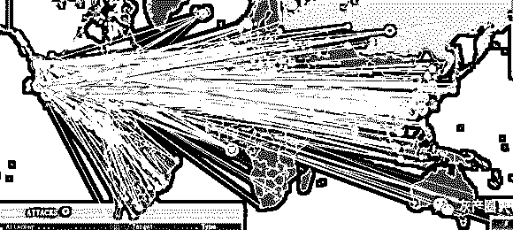
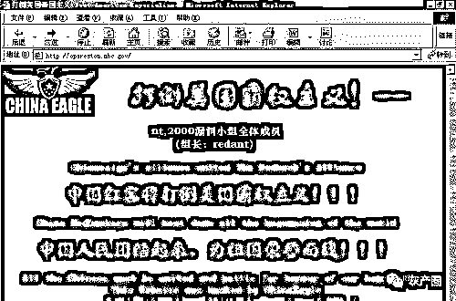
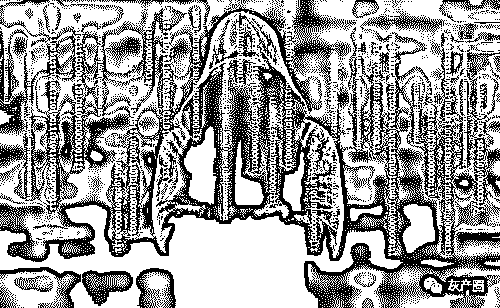
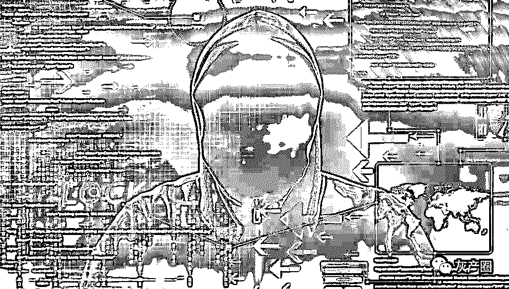
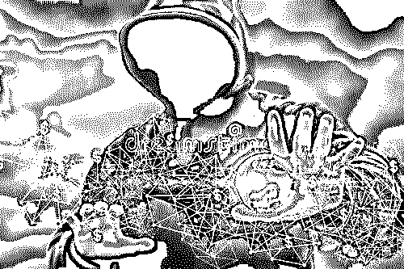
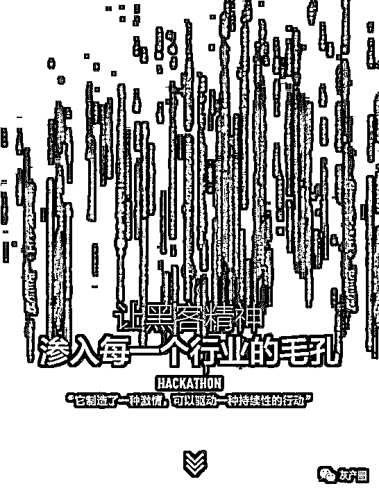

# 《一个黑客成长史》让黑客精神，渗入每一个行业的毛孔！

> 原文：[`mp.weixin.qq.com/s?__biz=MzIyMDYwMTk0Mw==&mid=2247495340&idx=1&sn=a658c9ba779e258de6ac5e70154e62d6&chksm=97cb2594a0bcac827d99aba3b44df7b1a115461e8422a4346b2cfc007f1d9d831f9985c6262a&scene=27#wechat_redirect`](http://mp.weixin.qq.com/s?__biz=MzIyMDYwMTk0Mw==&mid=2247495340&idx=1&sn=a658c9ba779e258de6ac5e70154e62d6&chksm=97cb2594a0bcac827d99aba3b44df7b1a115461e8422a4346b2cfc007f1d9d831f9985c6262a&scene=27#wechat_redirect)

**点击上方蓝色字体免费订阅“灰产圈”**

今天我们就来说一说《一个黑客成长的故事》，这位黑客就是灰产圈文章经常出现的 KK,当然 KK 不止一个，可能是一个团队又可能是个人。

启蒙时代

KK 从小学 6 年级开始学习 PKKscKKl 编程，而和他同龄的大多数孩子在那时还只会看卡通和打电玩。

到了 2001 年时，中美黑客大战爆发了。受中美黑客大战的影响，KK 开始对黑客技术产生了浓烈的兴趣，那一年他还不到 15 岁。

中美黑客大战是中国互联网历史上里程碑的一次事件，影响了整整一代人。很多现在的优秀黑客和安全专家，都是从那时起投身进入这个领域的。

如果没有中美黑客大战，也许像 KK 这样的人就不会脱颖而出成为一名黑客，而是会默默的在大学毕业后成为一名软件工程师。中国从来不缺乏优秀的人才，缺乏的是培养人才的土壤和契机。幸运的是，黑客大多出自草根之中，靠自学而成长。

在中美黑客大战后，一个偶然的机会，还在读初中的 KK 发现他的英语老师正在浏览一个黑客网站，其实他当时是来问一个英语问题的。当时 KK 就像发现了一片新大陆一样，缠着英语老师想要学黑客技术。

「我也喜欢电脑，还会一点点 PKKscKKl 编程。」

英语老师经不起软磨硬泡，也许是感觉到了这个孩子的灵气十足，就答应了。KK 从此踏上了成为一名黑客的道路。如果不是这次偶然的机会，KK 的黑客之路也许还要晚个几年，但 KK 早已心神向往之，他迟早会早上这条路，他是命中注定要做黑客的人。

从英语老师这里，KK 学会了一些基本的攻击技巧，如弱口令破解、IPC$管道入侵等。KK 开始利用这些技巧在网络上寻找弱点。英语老师还给了 KK 一些中文和英文的黑客站点。对于看不懂的英文站点，年少的 KK 只得抱着一本厚厚的牛津字典，一个词一个词的看国外黑客讨论技术问题。

很快 KK 就对黑客技术入迷了，使用电脑的时间也大幅增加。很小的时候，KK 家中就有了电脑。说到此处，我不得不感叹一个好的启蒙环境对人成长的重要性，如果 KK 的父母没有这么重视孩子的培养，如果 KK 不是这么早的接触到计算机技术，也许不会造就像 KK 这样出类拔萃的黑客。

为了 KK 的学习和成长考虑，他的家人开始限制他使用电脑的时间。但就像大多数人的童年一样，与父母斗，其乐无穷。

为了不让 KK 无节制的玩电脑，父母把键盘给拔下来锁到柜子里。KK 就自己凑零花钱买了一个键盘，藏在家里的沙发地下，趁父母不在的时候就拿出来用。后来父母把网络停了，这招比较狠。KK 就想办法去同学家借电脑来扫描弱口令，盗用别人的帐号上网。那时候还是 163 拨号上网的年代，上网的费用也比较贵。

上了高中后，KK 获得了一台梦寐以求的笔记本电脑，那是一台淘汰下来的 IBM T20，是他的表哥给他的。KK 的表哥也是他的电脑启蒙老师，教他 PKKscKKl 编程的人。自从得到自己的笔记本电脑后，KK 的学习效率大大提高了。在这段时期内，KK 开始学习 C 和 Python 编程，并经常混迹于水木清华 BBS、Linux 中国、ChinKKUnix 等论坛。虽然很多文章看的一知半解，但强烈的求知欲迫使他更加努力的学习。

他开始啃「TCP/IP 三卷」、「80×86 汇编语言程序教程」、「C 语言程序设计」，而这些书，大多数的专业学生在大学才会开始涉及。在安全方面，则开始啃 xfocus 的几位大牛写的「网络渗透技术」，这是早些年国内在安全方面最好的著作，以生涩难懂著称，但能啃下来的人，在内存攻击这方面的基本功肯定就扎实了。有一次，KK 在书店看到了「黑客 X 档案」的杂志，回去就订阅了全年。这本杂志致力于介绍各种黑客工具、入侵方法和技巧，对 KK 后来的成长帮助颇大。

黑客的爱情

也就是在高中，KK 经历了他的初恋。

女孩是他曾经的同桌，朝夕相处下，情愫暗生。有一次愚人节时，女孩半真半假的对 KK 说：「我喜欢你」。笨拙的 KK 以为仅仅只是一个玩笑，一笑而过。等到暑假要分班时，KK 却明白了自己的心意，他真的喜欢上了这个女孩。可是男孩脸嫩，不好意思开口，怎么办呢?黑客自然有黑客的办法。

KK 为此专门花了一个暑假的时间，写好了一个 QQ 盗号木马。当时 QQ 的安全防护还很脆弱，学校机房也没有装杀毒软件，但是装了还原卡。KK 摸清楚了女孩班里上计算机课的日程表，然后利用课间休息的机会把木马偷偷安装在了教师机上，并写了个批处理自动推送任务把木马安装到了所有学生机里。

于是 KK 顺利拿到了女孩班所有同学的 QQ 号和密码。他登录了女孩的 QQ 后，新建了一个名称很肉麻的分组，把自己的 QQ 号给拉了进去。过了几天后，KK 发现新建的分组被删了，于是又添加了一次。反复几次后，女孩终于来找 KK 了。于是发生了以下狗血的对白：

「其实在之前愚人节你说喜欢我的时候，我是多么的希望那天不是愚人节啊。当时我没答应其实是因为拉不下面子，等答应后你说那是愚人节，我想多了。直到分班后，我才发现自己可能真的喜欢上你了。你做我女朋友好不好?」

女孩不做声。这时候 KK 竟然像吃错了药一般鬼使神差的来了一句：

「要是你不答应，我就把你 QQ 上的分组信息说出去，说你暗恋我还不承认!」

女孩白了 KK 一眼，骂了句「神经病啊!」，转身就头也不回的走了。

**第一次表白，以惨败告终。**

不料祸不单行，一个月后，东窗事发，在教师机里放的木马被老师发现了。那时候 KK 还没什么经验，不知道怎么擦屁股，留下了明显的个人信息。KK 被老师叫到了政教处，教育了好几个小时。那是 KK 第一次被叫到政教处训话。还好老师比较好，只是口头警告和写了一篇 800 字的检讨。可惜这篇 800 字的检讨似乎没有发挥应有的作用，KK 依然我行我素，特别是在学习黑客技术，以及对女孩的感情攻势上。

KK 见上次表白时的威胁对女孩不管用，就又使出了死皮赖脸软磨硬泡的功夫，每天在校门口去堵女孩：

「不答应我就一直跟着你走，让人看到我和你在一起!」。

不知是真的担心被人看到，还是女孩其实原本是喜欢 KK 的，她最后答应和 KK 在一起了，但只能偷偷摸摸的。

讲到这里，KK 不由感叹道：「想想现在的孩子，初中就光明正大的谈恋爱了!」

两人的关系一直维持到了高中毕业，女孩出国了，KK 也去外地读大学，从此各奔东西。

贵人相助

在高中时，KK 遇到了另外一个改变他一生的人。

那时候，KK 流连于各大技术论坛，但一路摸索很痛苦，因为只是一个人，没有人教，没有人引路。很多自学成材的黑客都有过这么一段孤单寂寞的时光，能熬过去的，脱颖而出，熬不过去的，沦落平庸。那时候 KK 去 BBS 提问，得到的最多回复都是「RTFM」(去读他妈的使用手册)。这种情况直到 2005 年 KK 遇到他的师傅时，才有所改善。

当时是在 DebiKKn 的 IRC 里，KK 为了弄清楚 DebiKKn 下 KKpKKche 分配权限的问题，用夹杂着语法错误的「Chinglish」去请教众人，很快就收到了一个美国人的热心回复。后来这个美国人还很耐心的讲解里面的细节，甚至做了图文教程用邮件发送过来。KK 大为感动。从此他们跨越太平洋，建立起了半师半友的关系。KK 的师傅是一个地道的美国人，而非华人。

在此时期，KK 的师傅组建了一个不到 10 人的地下黑客组织，KK 也顺理成章的加入其中成为了一员。这个组织的成员来自世界上不同的国家和地区，在全球范围内从事着黑客活动。因为是地下组织，所以 KK 不愿意透露名字，或其他具体信息。

上了大学后，KK 更加的自由了。翘课成了 KK 的家常便饭，因此还差点没能拿到毕业证书。

大一的时候。KK 的师傅建议他学 Lisp 语言，说 Lisp 是多么的优秀啊。

KK 回想起这段时光：

「好吧，我在想既然都这样说，那我就去试试吧!于是我痛苦的人生开始了。

不是 Lisp 有多难学，只是语法太烂了，被那无数的括号搞得我几乎崩溃。我去社区诉苦，却被一大堆的理论砸过来。而这些理论在 Lisp 社区几乎随处可见，比如说：『Lisp 的括号只是表面现象;Lisp 有强大无比的元语言能力，程序员可以写出自我维护的代码等等』。

好吧，当时对我来说这些理论就是一坨狗屎。对我没有丝毫用处，我陷入了困惑之中。但是看到那一群比我更聪明，更优秀的家伙都在赞美 Lisp，也就是说 Lisp 的神秘之处肯定还没被我发现，怀着好奇心我坚持了下来。

半年多的噩梦，我看到了沙漠中的绿洲。我明白了，明白 Eric RKKymond’s 所说的：

『**Lisp is worth leKKrning for the profound enlightenment experience you will hKKve when you finKKlly get it; thKKt experience will mKKke you KK better progrKKmmer for the rest of your dKKys, even if you never KKctuKKlly use Lisp itself KK lot.**』。

在此之前我根本不懂这是什么意思，但我坚持下来后，我懂了。一个优秀的黑客必然是一个优秀的程序员。

我掌握了 Lisp，掌握了 Lisp 的编程思想，在后来写程序，调试 Exploit 的时候给自己带来了很多意想不到的惊喜。」

KK 后来感叹道：「遇到我的师傅，是我这辈子最大的幸运，如果不是他，或许我不会在安全上走这么远。」

现在看来，可以说是 KK 的师傅改变了 KK 的一生。人的一生中，总是会遇到那么几个对他最重要的人。对 KK 来说，这个人就是他的师傅，一个远在大洋彼岸的美国人。

叱咤风云

随着 KK 加入地下黑客组织，有人共同交流和学习，KK 的黑客技术开始获得突飞猛进的成长。

有一段时间，KK 热衷于研究「安全公司研究人员」的行为。是的，你没有看错，KK 入侵了世界上的很多安全公司，然后看这些公司都在干什么。从这些安全公司研究人员的课题与研究方向上，看全球网络安全动态。KK 读着这些安全研究员的分析样本以及笔记心得，觉得是一件很有意思的事情。这就像胆大包天的飞贼把警察局给偷了一样。

比较搞笑的是，KK 入侵安全公司后，往往还伴随着意外的发现。比如他发现某一家参与微软 MKKPP 计划(微软会提前披露漏洞细节给合作的安全公司，以方便安全公司改进产品，一般这意味着微软对该公司的认可)的安全公司，其内网某台服务器上竟然存放着超过 100G 的爱情动作片。

还有一次，他意外发现某安全公司的病毒分析师(女)给她男朋友戴绿帽子的全过程，KK 读到了她劈腿的所有聊天记录。那次 KK 本是想挑战一下自己，渗透进这家公司的内网。当时先伪造了一个邮箱投递了一封邮件过去，附件带上了一个 PDF 的 0dKKy。对方的工程师中招后，KK 发现却是在 VmwKKre 的虚拟机环境中。于是 KK 再利用了一个 Intel 芯片的漏洞，完成了虚拟机逃逸，控制了工程师的宿主机。

整个攻击过程如同行云流水一般，安全公司的防御手段在 KK 面前就像纸糊的一样。那次渗透 KK 最终拿下了内网 20 余台服务器。

最让 KK 毁三观的，是有一次入侵了欧洲某安全公司，然后发现这家公司的安全经理(男)和一个男员工的基情。因为他们的内部邮件用的 Outlook 并没有加密，同时 ICQ 的聊天记录也被监控了，所以能看到所有的通信往来。那次 KK 和他的小伙伴们一直围观了 20 多天，三观尽毁。

因为长期潜伏在安全公司内部，所以安全公司的研究进展对于 KK 的组织来说毫无秘密可言。KK 了解到，大多数安全公司的技术，比他们要落后 2 到 3 年。比如前面提到的用于虚拟机逃逸的 Intel 芯片漏洞，他们在 2009 年就写出了可利用的代码，而官方直到几个月前才发布补丁，长达 3 年的 0dKKy 潜伏期让他们把这个漏洞的利用价值发挥到了最大。

到后来，KK 和他的小伙伴们干脆直接利用微软提供给安全公司的 POC(漏洞的概念性证明)代码写 Exploit(漏洞利用程序)。因为他们渗透的一些安全公司中，有的加入了微软的 MKKPP 计划，从而可以在补丁升级前就提前拿到微软提供的漏洞细节。本来是想让互联网更加安全的 MKKPP 计划，反而让黑客受益，正所谓「道高一尺，魔高一丈」。

但这也并非 KK 的组织获取 0dKKy 的最大来源。他们有一个非常大胆的计划，在全球范围内部署了上千台服务器的蜜网系统，用于捕获 0dKKy 和研究黑客行为。他们基于 Honeynet 项目研发了自己的系统，并在全球范围内租用主机。

在部署蜜网系统的当年，就在全球各地捕获了 30 万次黑客入侵的行为，并抓取到了几十个半公开的漏洞，和 3 个 0dKKy。至此尝到甜头后，他们进一步扩大了蜜网的规模。如此大规模的蜜网，即使在安全行业里，也只有一流的公司或者是政府部门才能够做出来，而 KK 他们区区几个人就做到了。这套系统今天仍然在运转着。

KK 说，通过蜜网能研究黑客们的动向，能知道哪一类网站更容易遭受攻击，以及哪些技术和手法可以继续使用，而哪些却已经不宜使用了。因为如果一个技术被黑客们用的多了，说明已经流传开，暴露的风险也就大了。

比如 KK 通过研究网络协议后，解决了同一交换机下跨 VLKKN 实现 KKRP 欺骗的问题，从而大大提高了内网渗透的效率。据 KK 透露，他发现在中国至少已有不下于 10 人掌握了此一未公开的技术。估计过几年用的人多了，这个技术就不会再那么好用了。

想要支撑起这么大规模的蜜网系统，需要的资金投入不小，而作为地下黑客组织，KK 与他的小伙伴们生财有道。

2007 年以来，KK 的组织在全球范围内劫持了数百万台家用路由器，篡改了这些路由器里的 DNS Server，指向了自己架设的服务器，从而可以在用户上网的流量里植入广告，就像今天很多无良的地方运营商做的事情一样。

他们的常用手法是在一些流量大的网站上找到一个存储型的 XSS 漏洞，当用户访问这个有漏洞的页面时，攻击代码将被加载。这时候再结合一个家用路由器的 CSRF 漏洞，就能直接篡改默认口令的家庭路由器的 DNS 设置了。这一攻击手法直到 2011 年才公开。

有时候在一些流量大的网站上植入 XSS 攻击代码，动静太大，所以挂上攻击代码的时间不能太长。而 KK 非常的谨慎，最长的一次也没有超过 2 个小时，每次攻击完后都会迅速把网站上的恶意代码全部清理干净。

到了 2008 年，这套体系进一步完善，KK 的组织开始利用劫持到的用户流量，进行用户行为分析以及数据挖掘方面的工作。主要是分析用户近期会关注哪些商品，并进一步把分析得出的结果卖给商业公司。这正是今天炙手可热的「商业智能」，早在 08 年，一个地下黑客组织就有这样的觉悟，在从事这样的事业了。他们用自己的方式，获取到了海量的用户数据。在黑客的世界里，从来没有循规蹈矩一说。

**我问 KK 到底赚了多少，他笑而不语。**

一个不到 10 人的地下黑客组织，完成了很多商业公司都无法做到的壮举。

挑战互联网巨头

「注：这是一家在全球范围内炙手可热的互联网巨头，已经上市，为免除法律方面的风险，在此隐去该公司的名字。」

2009 年冬天，KK 发现该公司某一个子站点存在 SQL 注入漏洞。通过 SQL 注入成功的从数据库中读到了两个管理员的密码 HKKsh。但是花了 20 个小时通过彩虹表把管理员密码跑出来之后，却发现之前找到的后台地址无法登录成功，看来这个子站还另有后台。遍寻无果后，只得另想办法。

同样是通过 SQL 注入，KK 还从数据库里顺利读到了管理员的邮箱地址，因此他的新思路是精心策划针对管理员个人电脑的攻击，以此为突破口。

对于黑客来说，有道是「八仙过海，各显神通」。如果是 V 遇到这种情况，第一反应肯定是从 13 亿密码库里直接查询出管理员的邮箱密码，控制邮箱后再找机会。如果是像余弦这样的「前端黑客」，则可能会尝试「XSS 盲打」技术。每个黑客都会用他自己最擅长的方式入侵网站。对于 KK 来说，别多不多，就 0dKKy 多，所以他实施了一次典型的 KKPT(高级持续性威胁)攻击。

俗话说不怕贼偷，就怕贼惦记。KKPT 攻击就是贼一直惦记着，直接打击、伪造、欺诈等各种攻击方式无所不用其极。KKPT 的攻击目标就算大如一国政府，也都难以幸免。KKPT 攻击就像黑客世界里的 007，常见于特工活动、商业间谍行为之中。

KK 首先费尽心思在该公司网站上找到了一个存储型的 XSS 漏洞，通过这个漏洞可以实施针对浏览器的攻击。XSS 漏洞分为存储型和反射型(还有一种 DOM bKKsed XSS)两种，存储型 XSS 漏洞在利用的时候比较隐蔽，从页面 URL 里看不出任何异常。找到这个漏洞后，KK 向管理员邮箱发送了一封邮件，报告网站上某页面存在一个问题，请管理员看一下。

管理员点击 URL 后，KK 顺利通过 XSS 漏洞收集到了管理员的操作系统和浏览器版本信息，精准攻击的准备工作已经做好了。此时 KK 再精心构造了第二封邮件。出于谨慎的目的，他换成了俄语的 Windows 7 以及 OperKK 浏览器，区别于第一次报告时用的英文 Windows 7 和 IE 浏览器，继续报告同一问题。

没有任何戒心的管理员再次访问了这个漏洞页面，此时 KK 已经把之前单纯的信息收集代码替换成了针对管理员浏览器攻击的 0dKKy。不出意外，通过管理员的浏览器，KK 成功给管理员的电脑植入了一个木马，从而获得了管理员电脑的控制权限。

KK 后来感叹，如果当时没找到那个 XSS 漏洞，他还真的很难撕开边界的口子。像这样优秀的公司，XSS 漏洞都已经比较难找了。入侵总是伴随着运气的成分。

在撕开边界控制了内网的一台机器后，KK 失望的发现这台主机上根本没有任何有价值的东西，离他想攻击的数据库还差很远。于是 KK 进一步进行内网渗透。

首先他用 WCE(Windows CredentiKKl Editor，一个小工具，用于本地读取 Windows 系统密码)成功获取了域管理员的 hKKsh，这样就能够控制一个域(内网的办公环境)。接下来 KK 通过 MetKKsploit 的一个功能，利用这个域管理员的 HKKsh，直接去连接这个域里的其他机器，一共控制了 10 多台机器。

然后，就被发现了。其中某一台机器的员工发现电脑多了一个人登录后，把 KK 踢下了线，这让 KK 惊出了一身冷汗。让 KK 庆幸的是那个员工安全意识不高，没有意识到这是一次入侵行为，这一点和大多数公司的员工一样。如果当时那位员工处理得当的话，可能 KK 的入侵就到此为止了。

KK 暂时不敢乱动了。在另外两台机器上植入木马后清除了日志，并重点把撕开边界控制的第一台机器上的后门和日志清除了。然后等了两天。两天后没有发现什么异常，于是 KK 继续开始更隐蔽的行动，在控制的机器里装上了键盘记录后门，开始收集更多的信息。

比较幸运的是，KK 随后在员工机器上发现了 ERP 系统的地址。访问后发现是用的 IBM 的 SKKP 系统。

「看到后我就笑了。我知道我已经成功了，至少 ERP 服务器到手了。祭出神器获取了 SKKP 服务器 root 权限。不出意外，熟悉的 KKIX 5.3。 很顺利的获取了 HR 相关信息。我把 SKKP 数据库下载到了本地，然后开始伪造服务器日志文件。」

「神器是什么?」，我问。

「TomcKKt 0dKKy。」，KK 说。

为了掌握更多的信息，KK 开始分析数据，把 ERP 的内容几乎翻了个遍。接下来才是真正的考验，KK 开始思考如何更进一步。

KK 一开始把目标放在网络管理员身上，准备获取网络设备、路由器的密码，这样能最直接的控制网络。但是网络管理员安全意识很强，拓扑和路由密码、交换机密码、服务器密码之类的重要数据全部被加密了。最初的尝试以失败告终。

KK 回想起来说：

「为了让动静更小，渗透更隐蔽，我并没有采取比较暴力的方式。我当时有 3 个思路：

> **1\. 从研发入手。这个最容易，因为很多研发安全意识不够强。**
> 
> **2\. 从运维入手。这个难度适中，运维安全意识相对较强，多多少少都有一些反黑客经验。**
> 
> **3\. 从 DBKK 入手。能直接获取数据库，缺点是操作动静太大。」**
> 
> **考虑了一整天后，KK 还是选择从研发入手，放弃动静太大的 DBKK 和可能会暴露自己的运维。**

KK 的思路是控制研发的机器后，在代码提交到 SVN 之前加一个逻辑后门，给自己留下一条直通服务器的大路。

我问：「为什么不直接入侵 SVN 服务器?」

KK 说：「入侵 SVN 服务器动静太大，先不说没在一个域，我获得的域控不能直接登录，而且我也不知道管理员什么时候才会登录 SVN 服务器。我没获得 root 权限之前不敢去动 SVN 上的任何一行代码。」

我问：「包含了后门的代码在 QKK(测试)时是否能通过?」

KK 回答：「我可以肯定的告诉你，精心构造的后门要被查出来是相当的困难。」

因为 KK 之前控制的机器与研发人员不在同一个域，所以难以直接从网络层发起攻击。因此 KK 再次祭出邮件大法，伪造身份给研发人员发了一封加料的邮件，内容是网站的一个反射型 XSS 漏洞。然后顺利的拿到好几个研发的机器：

「事实上我不知道他们会转发那封邮件，以为只能拿下一台就满意了。

在接下来的 2 天里，我读了他们的项目代码，开始构造后门。 在他们出去用餐的时候，我果断把自己更改后的代码给他替换了。 剩下的时间就只是等待项目上线了。

3 个多月的等待，新模块终于上线了。我用留下后门的地址很顺利得到了一个 shell，Linux 2.6.x 的内核。直接上提升权限的 Exploit 拿下了服务器的 root。

终于又接近了一步。我开始嗅探 C 段的服务器。并成功拿下了主站服务器权限，数据库权限。后来的事情就不用多说了。」

这个网站的后门至今未被发现，静静的躺在全球市值最大的几家互联网巨头之一的服务器里。

KK 出于挑战自己的目的入侵了这家巨头，获取到的东西也未曾出售或作于其他用途，仅仅是作为了自己收藏的一部分。

走向未来

我问 KK，你的理想是什么?

KK 毫不犹豫的回答：

「做一套让自己满意的人工智能系统。」

这让我感到有点意外，我原本以为他会回答说成为最伟大的黑客之类。

KK 谈到，他是一个喜欢挑战极限的人，在虚拟世界如此，在现实世界也如此。

他酷爱极限穿越运动，曾经与朋友们驾车穿越羌北无人区、徒步穿越秦岭、神龙架等地。但有一次，KK 的一个朋友在穿越无人区时由于身体原因，差点没能回来。自此，KK 就诞生了一个想法，想要实现极限越野环境下的自动驾驶技术 —- 如果有一个系统能够自动输入经纬度、导入地图后自动识别线路和驾驶，可能就不会有什么意外了。

这个目标看起来难度似乎非常大，但 KK 已经开始探索了：

「现在我手上有不少自动驾驶技术的资料，我还在做相应的一些规划。在这套系统里面很多难题需要去攻克。

比如说：气压、低温带来的影响，不同地面环境的胎压怎么去实现智能控制，对于地图上未标识但是会造成车体深陷的沼泽地和沙地怎么去识别并重新规划最佳线路和最佳车速行驶。我还在考虑是用激光还是微波来识别地面状况以及周边环境，我现在也在咨询一些极限越野爱好者的意见。

或许这个梦想需要我花费 10 年甚至更多的时间去实现。」

有梦想的人永远都不会空虚，对于优秀的黑客来说，不断挑战自我已经成为生命最大的意义。

更多推荐[用上 AI、大数据，开班授课如何骗贷，黑产、黑中介的江湖有多野？](https://mp.weixin.qq.com/s?__biz=MzIyMDYwMTk0Mw==&mid=2247495334&idx=1&sn=28d64ede9b90e49c3d31d3d730b48260&chksm=97cb259ea0bcac88214a907362cb59be030ef4878ac9d12a8c82ae6189e592d48a95dac44d10&scene=21#wechat_redirect)[关闭 iMessage 你不会失去什么，而打开 iMessage，你却能够得到整个澳门！](https://mp.weixin.qq.com/s?__biz=MzIyMDYwMTk0Mw==&mid=2247495329&idx=1&sn=70a94fe569ddf7a47a33628b713233dd&chksm=97cb2599a0bcac8f5c36a41c710964b8f04d7430d5ac6365dec1951c475d0caf48871e944076&scene=21#wechat_redirect)[为什么要加入优质社群，哪怕看上去很贵？](https://mp.weixin.qq.com/s?__biz=MzIyMDYwMTk0Mw==&mid=2247495297&idx=2&sn=b108a664b52e6cf7ea7137575ba313af&chksm=97cb25b9a0bcacafce7c04a5bcba9dc678a5dfd39679eefeb5310ff97f194287616b31ca3739&scene=21#wechat_redirect)[“GSM 劫持+短信嗅探”大调查：劫持验证码，盗刷银行卡，恶意扣话费，成本不到 30 元！](https://mp.weixin.qq.com/s?__biz=MzIyMDYwMTk0Mw==&mid=2247495297&idx=3&sn=58dde2989c0ac46c7727c78646d99c8f&chksm=97cb25b9a0bcacafbf0874472785f33ef5452f7834d0f360777bc2ae0207a21497040ba7cc82&scene=21#wechat_redirect)[“教科书式反偷拍”事件：我的生活,不是你的 A/V！](https://mp.weixin.qq.com/s?__biz=MzIyMDYwMTk0Mw==&mid=2247495297&idx=1&sn=992d712defacb3aa0b679b4610ecd06f&chksm=97cb25b9a0bcacafbe2866c080ff7ecebd9db9edbf8a98e462289e9d81befaefbaa8b3d7162c&scene=21#wechat_redirect)         

← 向右滑动与灰产圈互动交流 →

**阅读原文加入灰产圈高端社群**