# 关闭 iMessage 你不会失去什么，而打开 iMessage，你却能够得到整个澳门！

> 原文：[`mp.weixin.qq.com/s?__biz=MzIyMDYwMTk0Mw==&mid=2247495329&idx=1&sn=70a94fe569ddf7a47a33628b713233dd&chksm=97cb2599a0bcac8f5c36a41c710964b8f04d7430d5ac6365dec1951c475d0caf48871e944076&scene=27#wechat_redirect`](http://mp.weixin.qq.com/s?__biz=MzIyMDYwMTk0Mw==&mid=2247495329&idx=1&sn=70a94fe569ddf7a47a33628b713233dd&chksm=97cb2599a0bcac8f5c36a41c710964b8f04d7430d5ac6365dec1951c475d0caf48871e944076&scene=27#wechat_redirect)

**点击上方蓝色字体免费订阅“灰产圈”**

导语

昨天（8 日），“打开 iMessage 得到整个澳门”的话题登上微博热搜，引发大量网友强烈共鸣。

这句话的意思是说，使用苹果手机 iMessage 功能的用户经常收到来自澳门赌场的短信，因此有网友感慨，“关闭 iMessage 你不会失去什么，而打开 iMessage 你却能够得到整个澳门。”

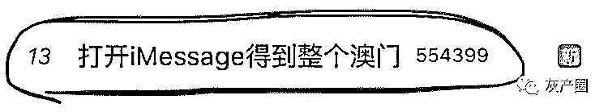

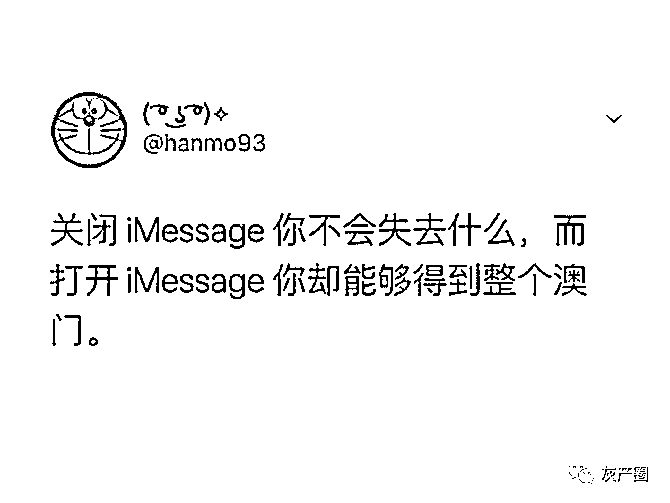

iMessage 收件箱里塞满澳门赌博、六合彩的垃圾短信，相信每个苹果用户都不陌生。 

**为什么这些涉嫌违法的短信没有被拦截下来？**
*   **为什么以保护用户隐私著称的苹果迟迟没有作为？**

*   **又为什么偏偏是澳门赌场短信？**

使用境外号码、地址，但可用银联充值

打开微博热搜，一则“打开 iMessage 得到整个澳门”的话题在榜单上居高不下，截至今天（9 日）早上 8 点半，阅读量已经高达 1.3 亿次。网友们纷纷晒出自己收到过的澳门赌场短信。

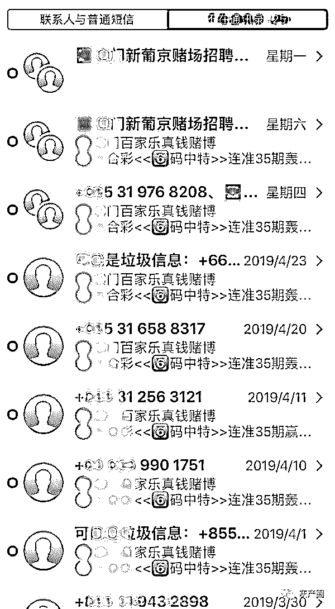

**iMessage 垃圾短信。图自微博网友@布朗的 room**

微博名为**“SOMEONE-YM”**的网友更是吐槽称，“我不但得到过澳门 我还得到过无数的发票 无数的假包 无数的色情小说 等等等等 打开 iMessage 我得到了全世界”。

博彩类垃圾短信通常使用境外号码，或是前缀为一串没有规律的字母的邮箱地址，内容则通常包含彩色图片和各种表情符号。

据我们统计，苹果用户频繁收到的博彩类垃圾短信具有以下共同特点：

**网站号称注册地址为境外，但网站默认显示中文；**
*   **使用的充值方式为银联、网银、支付宝、微信等国内常见支付方式；**

*   **收款账户为国内公司或个人，收款公司众多并且随时变更，但几乎都为 2017 年后创立。**

博彩广告的历史

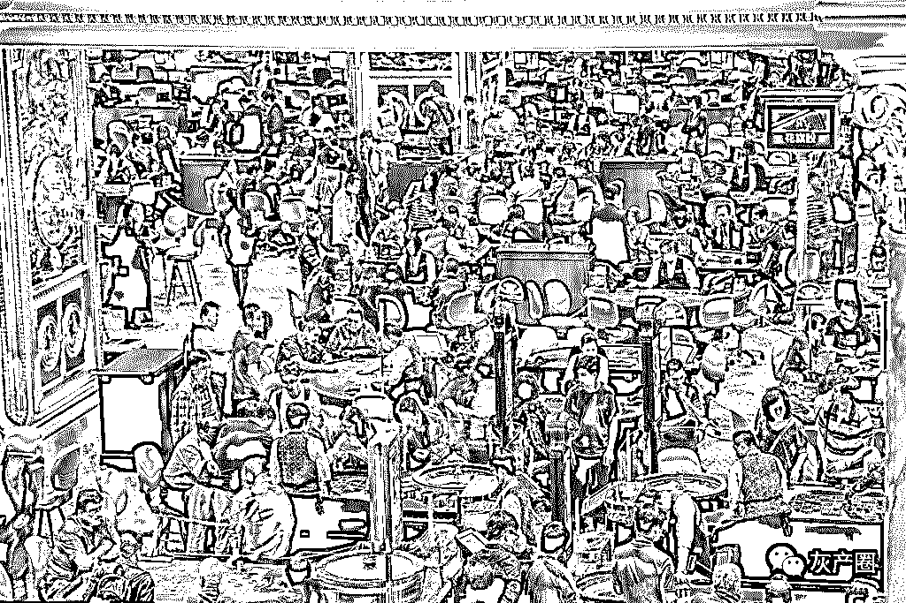

“澳门威尼斯赌场、在家斗地主月赚 100 万不是梦、日本女优成人直播网、准到没庄家......”这些内容，大家一定都不会陌生，比如，部门小姐姐们就表示深受其扰......

但是除了删除、报告垃圾短信，甚至关闭 iMessage 外，似乎拿它没太多办法。然而，谁会想到，这些垃圾短信背后，却藏着一条巨大的黑色产业链......

可能大家不信，博彩行业是随着我国移动互联网的普及而兴起。当前最早可查的博彩垃圾短信出现在 2012 年，那个时候 iPhone 还不多，三星为代表的安卓手机，以及传奇诺基亚都有留下了博彩广告的痕迹。那个时候，一条内容 + 链接就是一条短信，我们暂时称之为“博彩广告 v1.0”

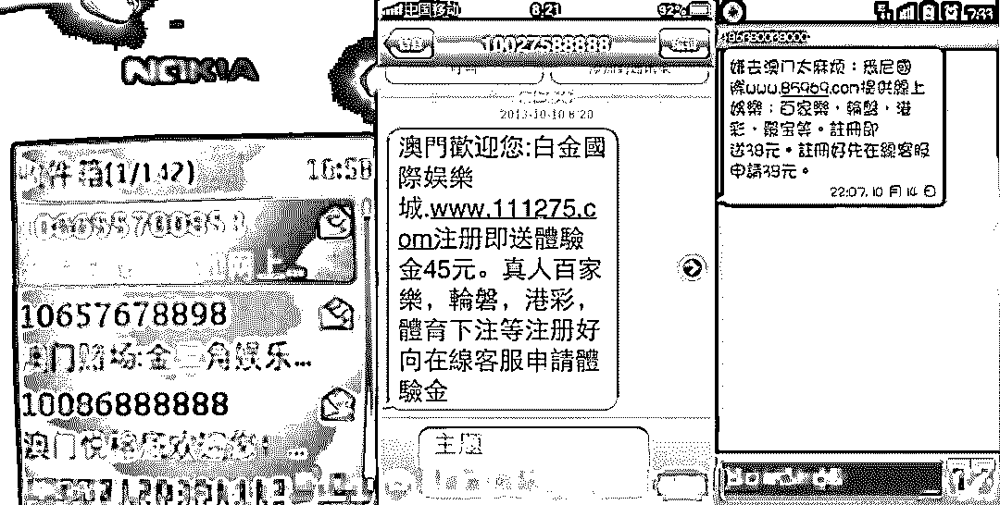

简单粗暴的博彩广告 v1.0

随后到了 2015 年，随着 emoji 的兴起，个别博彩公司也放弃简单的文字+链接形式，而改为更加趣味性的 emoji+文字+链接。而且，邮箱开始替代固定号段，直接通过 iMessage，绕过三大运营商，举报投诉封号的机会都不给你......这一类我们称为“博彩广告 v2.0”

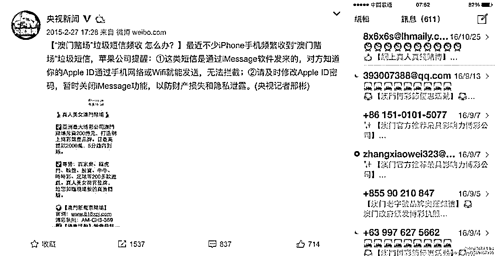

博彩广告 v2.0 曾经引发央视的关注

而到了 2016 年，随着移动互联网的发展，博彩公司开始尝试图文结合的富媒体传播形式。于是乎，除了广告内容外，我们看到了“性感的荷官”......这一类，我们称为“博彩广告 v3.0”

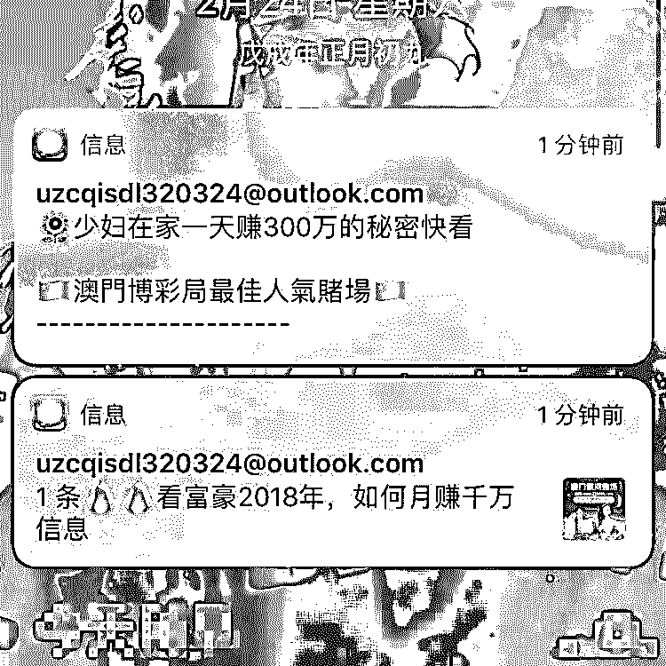

博彩广告 v3.0  性感荷官上线

而我们今天要说的，可能是你还没有玩过碰到过的全新版本，博彩广告通过短信，无需跳转完成 APP 下载。如此骚操作，我们都心动了......

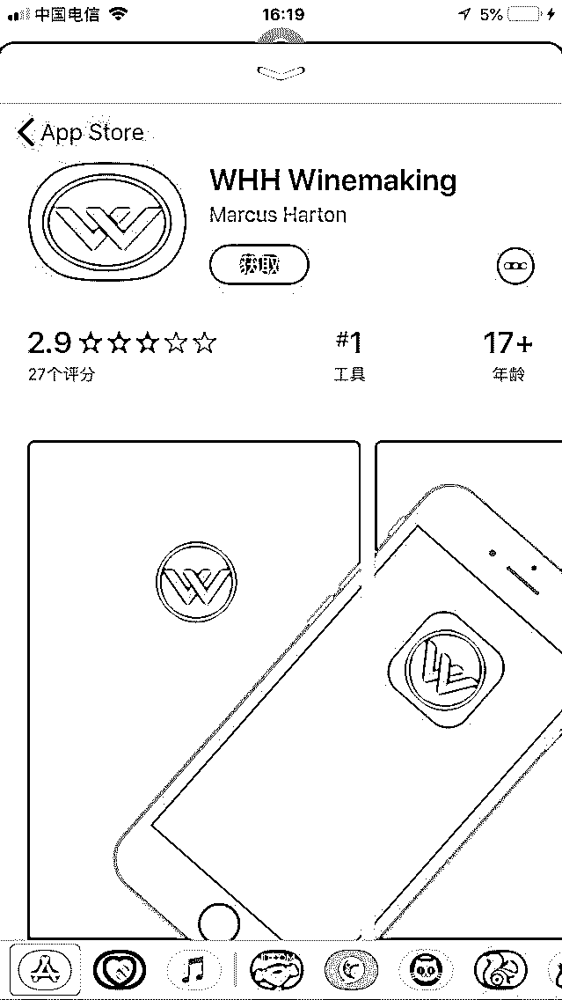

谁能想到这就是博彩公司的恶魔之门

也就是从这里开始，我们进入了另外一个世界......

上面这些短信从哪里来呢，我们按照“黑产”溯源三步骤，一百度，二淘宝，三 QQ 群，很快找到了 iMessage 代发组织。iMessage 代发其实并不违法，但是一般的项目需求量很小，很难走量，利润低。而菠菜（博彩黑话）、微商、A 货、信用卡，贷款等需求就很多，其中以博彩为最大。 

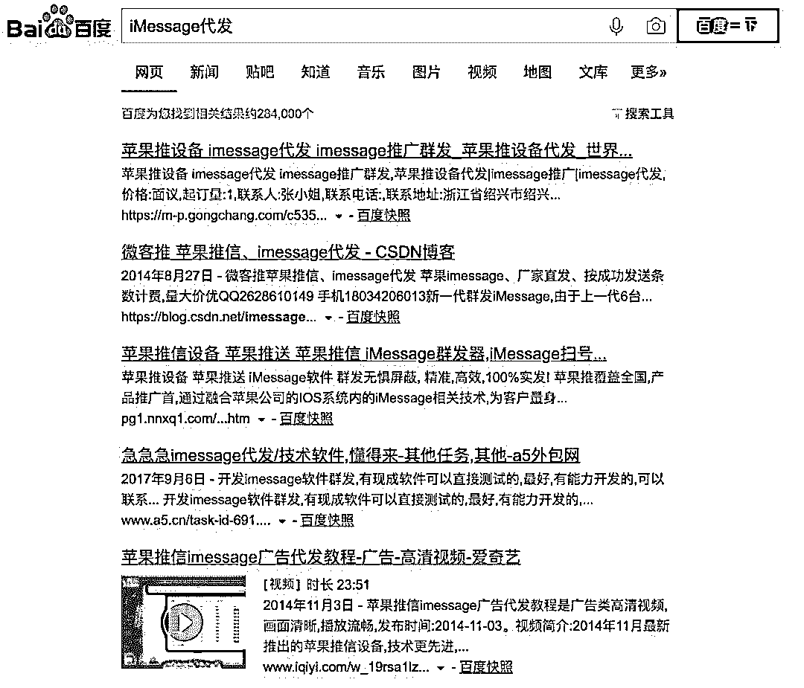

百度上甚至有教程 

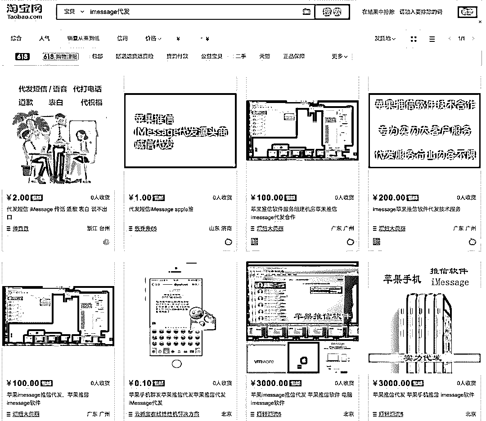

淘宝上也不少

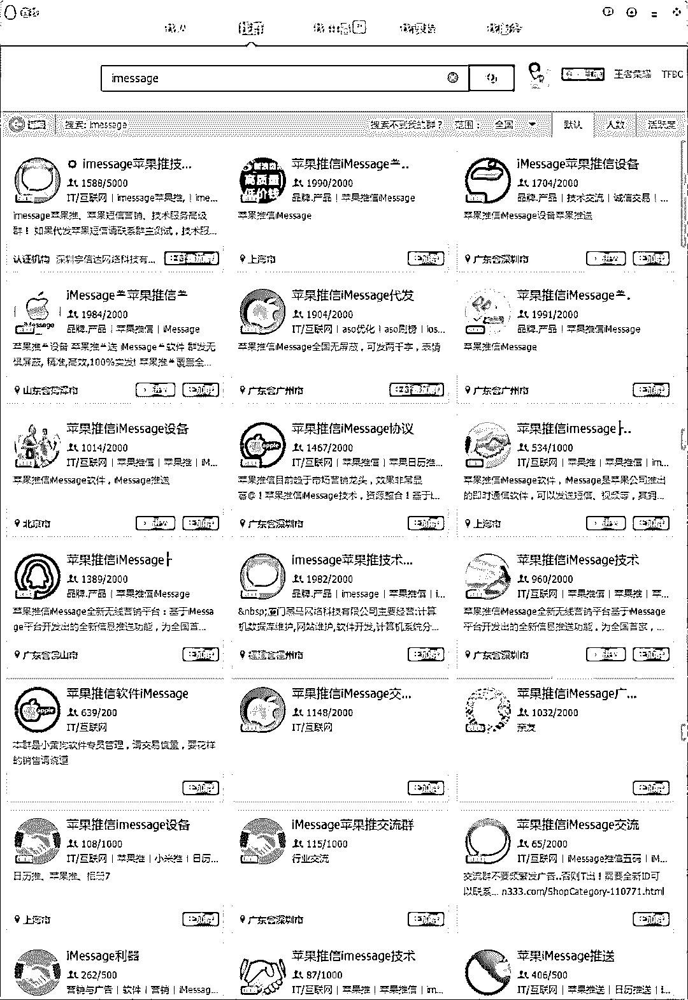

QQ 群里就更多了

我们随便混进一个群，发现有个哥们大晚上还在揽活儿，奔着着敬业精神，我们很快得到了一些线索：

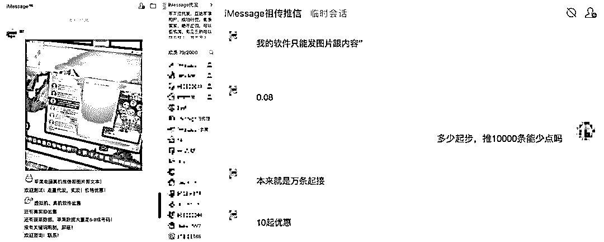

目前主流的还在做 v3.0 版本的生意

当前，包括淘宝在内，主流的 iMessage 代发做的还是 v3.0 版本的生意，目前行情价格是 8 分钱，起步 1 万，10 万以上有折扣。

而从淘宝某店家得知，我们遇到的最新版本，直接可以通过短信下载 APP 的形式，目前还未普及。主要原因并不是技术方面，还是成本考虑，除了博彩公司，一般小打小闹的工作室做不了......

如果把线上博彩比作恶魔，那么 iMessage 代发中做博彩生意的，就是恶魔的使者。

不会被运营商或第三方软件拦截

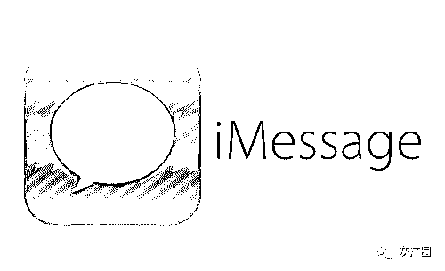

我们了解到，由于 iMessage 仅需 Wi-Fi 或移动网络即可发送，不经过短信通道，因此几乎不会被运营商或第三方软件拦截。 

基于这个特点，iMessage 垃圾短信已经形成了相当规模的产业，可以通过他人代发或自己购买软件发送，被称为“苹果推信”。

我们在 QQ、淘宝等平台搜索“苹果推信”，发现了不少 QQ 群和淘宝卖家。不过，他们都谨慎地在介绍里表示，由于行业特殊，只能加 QQ 私聊。

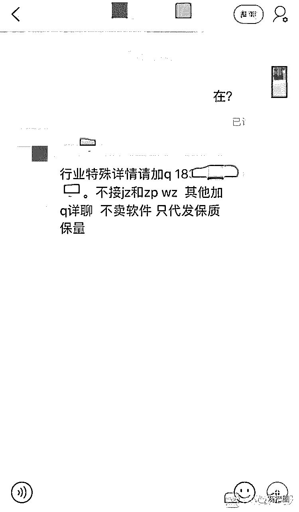

**苹果推信卖家仅接受 QQ 私聊。**

一个从事苹果 iMessage 推信的 QQ 群在公告里介绍，苹果推信是“一种全新的无线营销平台”，比较适合中高端消费者，不但“具有丰富的信息量”，还可以“无视其他软件的屏蔽功能，将信息安全准确的发送给客户”。

加了上述 QQ 群的群主之后，我们以有投资业务培训需求为由，询问苹果推信的操作方式。该群主回复称，如果是线下培训，可以针对地区发送 iMessage 短信；如果是线上培训，全国都可以发，最多可发给 10 亿苹果用户。

我们提出希望第一批短信仅发送到北京、天津和上海三座城市，该群主立刻表示“几千万（人）没有问题”，价格为每发送成功一条收一毛钱，并发来一张与其他买家的聊天截图，上面显示他给出的价格为一毛五，意即给我们的价格已经算低的了。

iMessage 推广可躲过违法关键词屏蔽

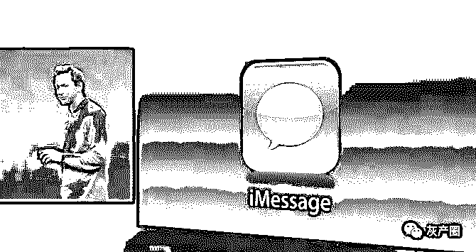

针对 iMessage 垃圾短信泛滥的情况，苹果客服对我们表示，发来的信息是用户被动收取的，只能进行后期的投诉、删除等操作。用户还可以点击“删除并报告垃圾信息”，减少收到垃圾短信的次数。

**那么，为什么运营商和苹果都拦截不了 iMessage 垃圾短信？** 

KK 对我们表示，对于运营商而言，这些 iMessage 短信只不过是经过他们网络通道的一串字节数据，具体数据内容是什么，运营商一般不太干涉。 

另一方面，据媒体报道，对于苹果来说，短信内容里包含的文字、数字、图片，甚至小视频，都会增加苹果筛选垃圾短信的难度。

> **小贴士：如何拦截 iMessage 垃圾短信？**
> 
> **1、在“设置”中开启“过滤未知发件人”；**
> 
> **2、向苹果官方投诉邮箱 imessage.spam@icloud.com 投诉；**
> 
> **3、安装专业的手机安全软件，开启相应功能进行拦截；**
> 
> **4、直接关闭 iMessage 功能。**

← 向右滑动与灰产圈互动交流 →

**阅读原文加入灰产圈高端社群**