# 有车有房却要捐款治病，众筹背后的水有多深？

> 原文：[`mp.weixin.qq.com/s?__biz=MzIyMDYwMTk0Mw==&mid=2247495313&idx=1&sn=27aa78b42942154bed4f1bddf8d92811&chksm=97cb25a9a0bcacbfad7dde37a7acc7eb658917bc1e99fe7f5514d934a343b282ce4a6cd17fa5&scene=27#wechat_redirect`](http://mp.weixin.qq.com/s?__biz=MzIyMDYwMTk0Mw==&mid=2247495313&idx=1&sn=27aa78b42942154bed4f1bddf8d92811&chksm=97cb25a9a0bcacbfad7dde37a7acc7eb658917bc1e99fe7f5514d934a343b282ce4a6cd17fa5&scene=27#wechat_redirect)

**点击上方蓝色字体免费订阅“灰产圈”**

导语

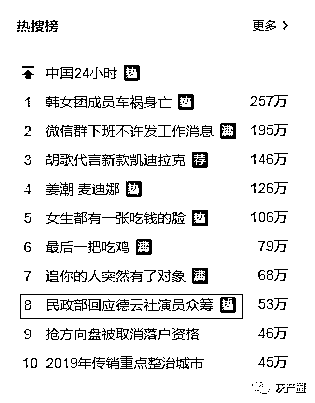  

德云社里的相声演员又上热搜了，但这次既不是因为相声也不是因为小曲儿，而是因为“众筹”。 

德云社演员吴鹤臣近日突发脑出血，其家人通过水滴筹发起百万众筹。

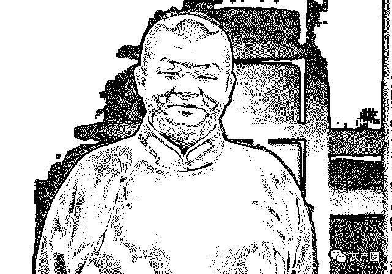

随后有网友质疑：需要这么多钱吗？难道德云社没有医保？为什么首先不是卖房？

有网友表示，治疗脑出血根本不用那么贵，一般只需要几万到几十万就可以，但是吴鹤臣的家人却要筹集 100 万，为此有很多网友开始质疑其真实性。

甚至有网友调侃称“车房不能动，救命靠大家”。

当日，微博上还出现了“给比你有钱的人捐款”这一热搜话题。

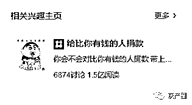

骗捐疑云

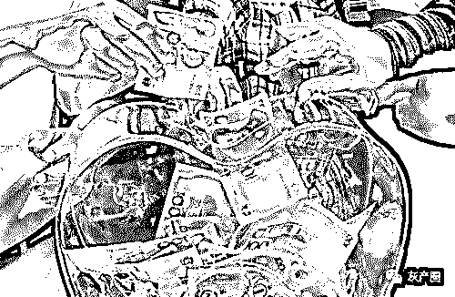

擅长微博断案的网友们纷纷出手，扒出了关于吴鹤臣财产状况的更多信息。

吴鹤臣为北京昌平人，家中有车还有两套房，作为德云社员工，确实有医保。

父母是下岗职工，但都有退休金，21 岁的太太在他生病期间还买了价值一万多的某品牌手机最新款，而在众筹申请中，他们却勾选了贫困户。

5 月 4 日，吴鹤臣妻子@张泓艺，在个人微博就网友“众筹目标金额 100 万”“有房有车为何还来众筹”等质疑进行了回应。

张泓艺表示，因为不懂平台规则，首页让输入金额就输了一个上限额度。房子有两套均为公租房，但由于都没有房产证不能进行交易，车是自己的嫁妆，属于婚前财产，且家中有病人来往医院需用车，所以不能卖。手机是此前就已经预定的情侣款。

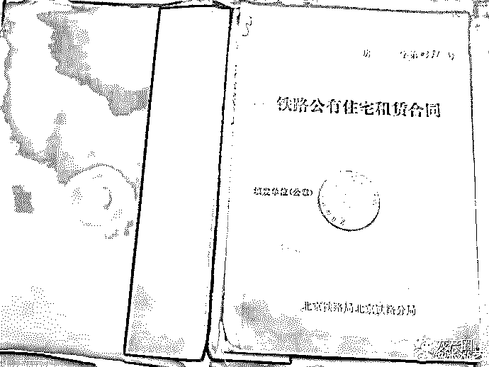

截至当时，她已经筹到了 14 万多，并将通道关闭，以后有需要会再行商议开通。

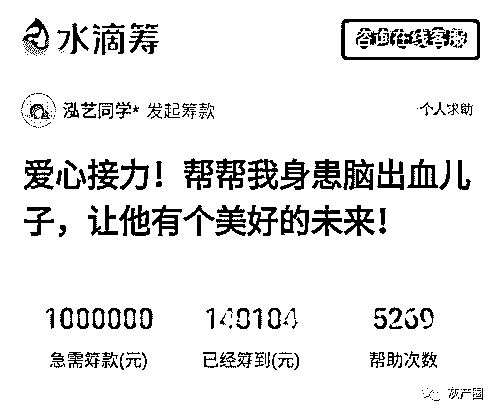

5 月 4 日上午，她再度更帖，强调没有逼捐骗捐，并承诺一切费用都将公开透明。而目前为止所产生医疗费用，全都由他们自家承担，没有动用一分钱善款。

水滴筹方面回应，平台没有资格审核发起人车产房产信息，有房有车也可以发起筹款，前提是要按照平台的规定去提交这些证明材料。

勾选“贫困户”是发起人误操作；曾与医院沟通，但医疗花费医院也没办法给出。

德云社也公开回应表示，吴鹤臣妻子发起众筹系其私人行为，公司已开展内部募捐活动。

花费百元就能轻松造假

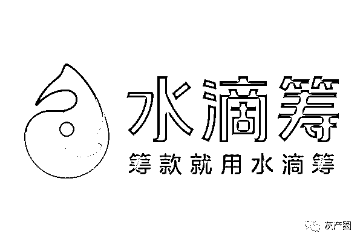

从罗一笑到吴鹤臣，众筹事件再次捅破了网络众筹与网友信任之间的窗户纸。

近年来，诈捐事件频频出现，甚至还有专门造假照片、假证明利用网友善心通过众筹敛财，伤透了网友们的心。

有记者调查发现，众筹背后存在代写经历、提供虚假病历等黑色产业。

水滴筹等众筹平台，在筹款人要发起众筹申请时，需要填写相关个人信息，其中最重要的是患者详情介绍，以及上传患者的医疗材料，比如诊断证明、住院证明、检查报告等相关信息。

但这些却能通过网络购买，轻松搞定，价格只需要几百元。

此前，上游新闻调查显示，网络造假商声称，用假病历资料上传众筹平台赚钱已不是什么秘密，且咨询的人不少。

一份出具医疗证明材料的收费价格表，医院诊断证明每份 100 元，检查报告每份 150 元，住院病历每份 150 元。还表示，除了诊断证明、检查报告、住院病历外，他还可以开出整套医疗证明，只要付费，想要啥就有啥。

除此之外，还有众筹文案代写业务，有商家称代写众筹文章一篇 50 元。

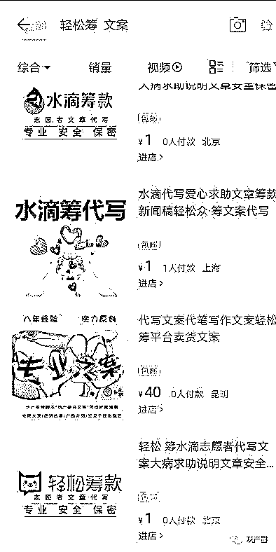

上图为一个月之前查询的截图，今天搜索淘宝 已经找不到商品

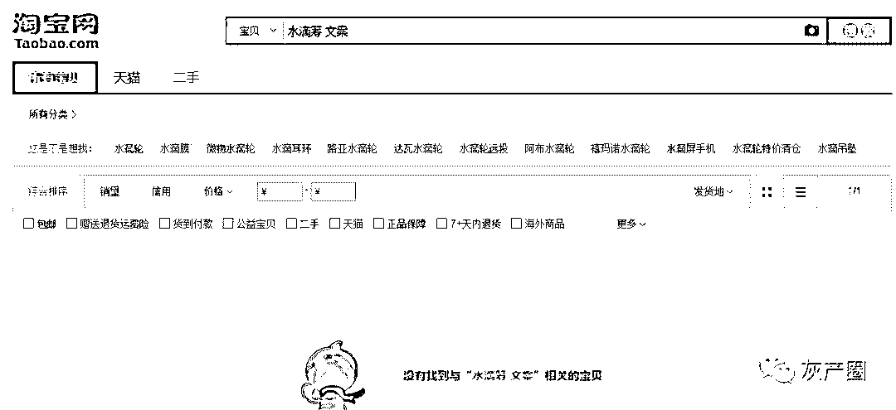

对于这种虚假病历材料，众筹平台方是如何审核的？能分辨出真假吗？

水滴筹平台志愿者称，一般情况下，如果申请人很有钱，但是没有人举报是不会去核实筹款人提交材料的真假的。

对此水滴筹官方回应，表示媒体调查所发起的众筹已经通过平台初步审核，但是还未通过求助人社交网络的监督验证以及提现公示验证等多个环节，无法完成提现。

众筹不是筐

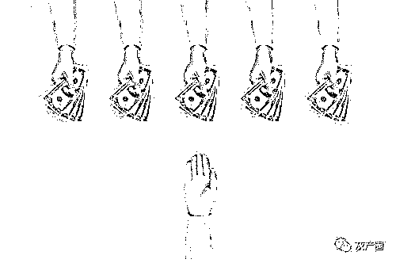

吴鹤臣求助案例中最大的争议，在于他们勾选了平台提供的选项“贫困户”，但按一般人常识鉴别，不认为他们的家庭情况属于这一类别。众筹捐款确实是大家自愿的，但是利用大众的同情心和善良，来解决自己本可以“负担”的困难，说白了是自私自利。

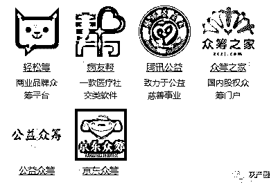

近两年，众筹高调进入“互联网+”，求助者、创业者、电商平台、消费者纷纷试水。以大病救助为核心的民间自发求助信息，几乎成为了所有众筹平台的主业。随着此类筹款方式的普及，类似于当下“德云社演员百万众筹”和此前“凤雅之死”、“罗一笑你给我站住”等事件所引发的争议和质疑声越来越多。

众筹平台相关制度“缺位”、资金账户属患者私人所有、捐资去向无人监管更无人负责、家属对众筹金额具有绝对的把控权种种现实因素，才使得如今民间众筹经常面目全非。由于信息不对称，众筹模式几乎成为了低成本的试错工具和低风险的诈捐温床。风生水起的互联网众筹产品背后，行业自律、平台监管、消费者维权等方面的问题随即开始暴露出来。

网络上发布的求助信息，属于慈善性质的求助。在网上发布求助信息，意味着该家庭已经面临非常迫切的状况，处于困境之中。而在平台上发布出来，则表示自己无力解决希望向大众寻求助力，前提是平台可以保证发布者所发布的信息真实性，尤其是困境的“真材实料”和财力的“力所不及”。

结尾

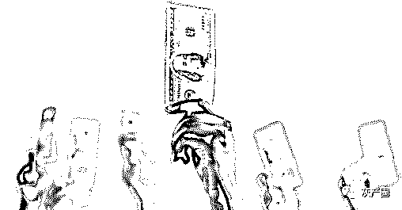

人性很难用制度约束，但平台可以用制度完善。更严格的审核和更人性化的机制是可以避免或者降低问题出现的几率。

可以借鉴国外经验：平台针对众筹项目发起人的身份，进行分类管理，设置不同的准入门槛，对发起人身份进行明确提示，使捐助者可以清晰看到。

众筹平台需要出台对于求助者的身份、家庭背景、财产情况等审查机制，同时引入社会第三方监督保证信息公开透明，加大信息失真的违约成本。

爱心没错，更不该“搭错车”。在社会福利体系、医疗体系、保险体系还不完美的今天，民间众筹里聚合的光和热，不该被浪费，理应被珍惜。

**以上部分内容综合整理自上游新闻，光明网等。**

**记者调查：网购众筹文章虚假病历 轻松通过平台审核**

[`v.qq.com/iframe/preview.html?width=500&height=375&auto=0&vid=j0867ihe2aq`](https://v.qq.com/iframe/preview.html?width=500&height=375&auto=0&vid=j0867ihe2aq)

更多推荐[为什么要加入优质社群，哪怕看上去很贵？](https://mp.weixin.qq.com/s?__biz=MzIyMDYwMTk0Mw==&mid=2247495297&idx=2&sn=b108a664b52e6cf7ea7137575ba313af&chksm=97cb25b9a0bcacafce7c04a5bcba9dc678a5dfd39679eefeb5310ff97f194287616b31ca3739&scene=21#wechat_redirect)[我们被“趣步”投诉了！披着区块链外衣的“趣步”还能走多远？](https://mp.weixin.qq.com/s?__biz=MzIyMDYwMTk0Mw==&mid=2247495261&idx=1&sn=9e5d5ddc2843202d172ea17ca439b537&chksm=97cb2565a0bcac73821265a7f6de8496bbaa0c2ac81042d1cb2129074e412bc5d4090e4f7ddc&scene=21#wechat_redirect)[“GSM 劫持+短信嗅探”大调查：劫持验证码，盗刷银行卡，恶意扣话费，成本不到 30 元！](https://mp.weixin.qq.com/s?__biz=MzIyMDYwMTk0Mw==&mid=2247495297&idx=3&sn=58dde2989c0ac46c7727c78646d99c8f&chksm=97cb25b9a0bcacafbf0874472785f33ef5452f7834d0f360777bc2ae0207a21497040ba7cc82&scene=21#wechat_redirect)[色情与诈骗共舞，还有谁在探探社交？](https://mp.weixin.qq.com/s?__biz=MzIyMDYwMTk0Mw==&mid=2247495297&idx=4&sn=50d8e384dea97b8177cfcb62502c4bca&chksm=97cb25b9a0bcacaf41c3fc25f82b181cd29665ed6e016fbbf09a395b2aa0f02ea7a6107bbb5b&scene=21#wechat_redirect)[帅哥，炒股么？我专业“割韭菜”的](https://mp.weixin.qq.com/s?__biz=MzIyMDYwMTk0Mw==&mid=2247495264&idx=1&sn=5ff1c43f78c3a0679fe6fedaf6db0884&chksm=97cb2558a0bcac4e53ba0d1cb7b4e58d352648c99da83b2b205e4c93bf292aa14f5f39834720&scene=21#wechat_redirect)

← 向右滑动与灰产圈互动交流 →

**阅读原文加入灰产圈高端社群**