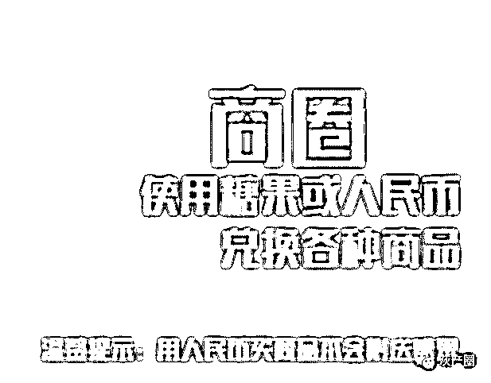

# 我们被“趣步”投诉了！披着区块链外衣的“趣步”还能走多远？

> 原文：[`mp.weixin.qq.com/s?__biz=MzIyMDYwMTk0Mw==&mid=2247495261&idx=1&sn=9e5d5ddc2843202d172ea17ca439b537&chksm=97cb2565a0bcac73821265a7f6de8496bbaa0c2ac81042d1cb2129074e412bc5d4090e4f7ddc&scene=27#wechat_redirect`](http://mp.weixin.qq.com/s?__biz=MzIyMDYwMTk0Mw==&mid=2247495261&idx=1&sn=9e5d5ddc2843202d172ea17ca439b537&chksm=97cb2565a0bcac73821265a7f6de8496bbaa0c2ac81042d1cb2129074e412bc5d4090e4f7ddc&scene=27#wechat_redirect)

**点击上方蓝色字体免费订阅“灰产圈”**

导语

4 月 26 日，灰产圈发布了一篇文章《趣步：“骗局”永不止步！“传销”不走寻常路！》

4 月 30 日，灰产圈收到投诉，从 14：56 到 15：00 连续三条投诉 出自一家公司，传说中的投诉三连击，截图如下:

公司主体如下，正是趣步官方运营公司：**湖南趣步网络科技有限公司**

对于这个莫名的躺枪，灰产圈决定开始行动。一个披着区块链外衣的“传销”组织竟然如此嚣张，想通过这种手段消除“网络负面”，我们哪肯低头？相信正义只会迟到，从不缺席！

正义行动

通过天眼查，我们查询到**湖南趣步网络科技有限公司的基本情况，如下图：**

****

**公司企业图谱：** 

****

**公司股权架构：**

****

我们发现**湖南趣步网络科技有限公司 2019-04-18**出现经营范围变动，这引起了我们的关注，如下图：

可以清晰看到，**湖南趣步网络科技有限公司**经营范围由变更前：

变更后：

我们可以很清晰看到之前的经营范围包含“**区块链技术的研究开发以及咨询和技术转让**”变更后增加了“广告，体育用品，电子商务” 这说明，用户数量多了，公司开始开发运动电子产品以及通过海量用户来进行广告营销收费，这一点本毋庸置疑，但是，我们看到了趣步在下一盘“大旗”，请继续往下看。

在天眼查上我们翻看到最后，关于本企业的问答栏目，我们发现了“真相”、 

问答一：这公司真的不会卷钱跑路?？

**问答二：趣步网络科技合法吗？**

****

**问答三：这个公司是正规公司吗，都有什么业务项目 ？**

**问答四：有谁知道趣步的盈利模式吗？**

****

**问答五：产生的糖果卖给谁？**

****

层层解密

[`v.qq.com/iframe/preview.html?width=500&height=375&auto=0&vid=a08103udb25`](https://v.qq.com/iframe/preview.html?width=500&height=375&auto=0&vid=a08103udb25)

我们从网上找到了趣步的官方宣传片，从宣传片可以明显看到，趣步打着区块链技术与运动相结合的口号，如下图：

同时运动会产生糖果来兑换商品：

|  |  |  |

接下来，灰产圈将说明六点内容：

**第一**：趣步似乎靠推行糖果，推广用户赚取流量，然后通过糖果之间的交易收取手续费的方式进行牟利，糖果由线下的用户自行买卖，价格一度上涨，这看起来和股票一样，实质上却有很大区别，股票的价格无论涨跌都有公司股份保证。可糖果的价值由什么来保障？

有人卖就有人买，我承认现阶段的卖方只需要走走路就能得到糖果积累，能够赚一些零花钱。可买方的投资该找谁做担保？糖果只是一个虚拟物品，如果有一天趣步 app 不再运营，那么买家的投资该找谁要？

**第二**：糖果并不是商品，商品必须满足使用价值和价值的两个概念，可糖果的存在并没有实质的使用价值，糖果的发行量说是要有 10 亿个，那么这几百亿的价值该有谁来承担，趣步这个 app 能承担的起吗？

**第三**：截至目前，并没有一家银行或者大型平台认可趣步里的糖果，糖果的买卖只是用户在私下进行的，没有平台说愿意收购这些糖果，如果哪天趣步被支付宝认可，支付宝愿意收购糖果，用户可以在支付宝中将糖果变现，而不是通过私人交易，这才有一定可信度，可目前完全没有。

**第四**：我知道有很多推销的人将这个类比比特币，首先比特币不是货币，这一点是明确的，其次即便比特币目前已经被广为交易，可这仍然掩盖不了比特币的巨大风险，那么这个糖果动不动就以比特币做类比，且不说它会不会像比特币一样被国际市场认可，即便被认可，它的发行只寄托于一家公司，一个 app 软件，这不显得有些可笑吗。

**第五**：我只想对推广这些的人说，任何交易都应遵守道德底线，如果你们推行这些就必须对买卖双方负责，我所说的负责并非负责市场风险，而是负责公司风险，我还是那句话如果趣步 app 有一天宣布不再运营，那么投资者的钱该找谁要？

**第六：**趣步宣称是立足运动健康领域，以区块链技术为支撑，开发并运营趣步 APP 及网络商城，鼓励全民关注自身健康，参与快乐运动的创新型科技公司。

简单点说就是，运动就能赚钱。只要你每天在该软件上计入走路步数 3000 步（最多只能 3000 步），就可以获得相应的糖果，该平台主要是以糖果进行交易，运营团队对糖果的价值进行定价，获得糖果的途径除了走路计步之外还可以通过提升活跃度，也就是参与平台任务或者拉人推广来获得糖果奖励，目前该平台上糖果价值是 1 美元。收益模式见下图。

平台上糖果价格、交易规则都由平台运营方制定，平台在交易过程中收取 30%的手续费，这种模式就是在炒虚拟币，先进场参与的玩家通常会通过低价买入糖果，然后炒高糖果的价格，赚取收益后抛售，就像击鼓传花的游戏一样，最后进场的一些投资者就是最后的接盘者，平台方空手套白狼，赚取收益之后可能关站跑路。这种形式已经被国家定义为违法犯罪。

“寻找真相”

我们在知乎上找到了一个关于趣步的问题《趣步最近好像很火，被一些人炒的要上天了，谁能解释一下趣步 app？》

其中有个知乎网友**@苦行僧**的回答可以说非常公平公正的分析了趣步：

我们经过授权，把他的回答分享出来：

最近趣步、亦跑、约跑火得很，到处都是分享二维码求加入的。号称是：区块链加运动新概念。实际是什么？

一点一点给你解析：

拿趣步为例，因为后面这俩其实就是仿的趣步。号称发行 10 亿糖果，永不增发，就好像比特币，越挖越少。再加上它的零售和其他概念，就说这个未来有增值空间！现在线上 1.57 美金一个，折合人民币 10 元左右，线下谈价格能到 17、18 甚至更高，未来会更高！就好像股票，因为其有增值空间，所以很多人会看中而投资，价格会继续上涨，可以待价而沽。

本质是什么？本质有几种可能：1、打着免费走路挣钱的幌子获取流量。2、兜售其升值空间让别人花钱入行，到一定价格割了韭菜跑路。

怎么挣钱：实名认证后会送一个月活跃度 1，一个月后清零需要花费 10 个糖果续买卷轴才能继续。1 的活跃度一天走 3000 步，获得 0.36 个糖果，3 天 1 个，一个月也就是 10 个糖果，如果能升到 L3，交易费 30%，也就是你手里有 10 个糖果，实际只能卖掉 8 个左右，因为其他的是你的交易税。一个糖果按现在线下交易金额 17 来算（实际到不了这个价格），获利 136 元。然后你这个号就废了，拿钱走人。如果你不想卖，花 10 个糖果买卷轴，第一个月收益 0，第二个月推荐 20 个人，这 20 个人都实名认证并且每天都摇 3000 步，那么你获取直接推荐人 5%的活跃度，也就是活跃度可以达到 2，加上加入团队和组队的活跃，一天能得 0.73 个糖果，一个月能达到 21.9 个糖果，按照升到 L4 来算，交易税 28%，全部卖掉能卖 17-18 个左右，一个月获利 300 左右，清号走人。或者继续投入糖果买卷轴。以此类推，活跃度越高获利越多。

那么我们来说说这个东西在诱导你什么？

1.让你一直投入，不套现，套现意味着号没用了，买了卷轴意味着可以继续，所以很多人不会提现，继续投入糖果买卷轴，也会鼓励下面的人继续买卷轴不要套现。这就是画一张饼：未来会很好。现在不要着急。打这个时间差，这个时间差可能几个月可能 1 年很小概率会更久，我们把糖果一直投入投入，换取未来更大的可能。但有一天无以为举会是什么后果？

2.线上交易价格很低，当你操作交易的时候你会发现只有卖给收购的，你没办法在卖单列表输入一个很高的价格，这说明什么？当卖单上价格只有零点几美金的售价时很多人都会去买单列表出售，买单列表的价格最高只能到 1.57，谁控制的？别有用心的人。买卖价格的控制就能够给别有用人的制造哄抬或者暴跌的可能。

3.极其不完善的 APP，各种问题，问题多到让人难以相信这是个几十亿的大饼。

总结：这就是个以传销模式经营的概念 APP，目的上面已经说过，为了攒取流量（我没说骗啊），或者为了哄抬价格，让人盲目买入，等价格高了割韭菜。

总之：我奉劝各位：玩可以玩，至少目标没骗人，如果你不投入一分钱，一个月后卖了走人就是白挣的，如果你一直投入糖果，那么未来骗的就是你的时间和努力，如果你花钱买糖果，未来骗的就是你的钱。

发布于 2019-01-03

结尾

最后，我们借用知乎网友@复姓宇文名唤二狗 的回答结尾：

我先创造一个有价值的货币概念。

你们快来注册每天打卡获取这个货币。

顺便成为我的流量。

流量可不能丢了每天拿点小恩惠喂着先。

我流量很大诶大家快来打广告啊。

那么多人来我这儿打广告要排队，除非加钱。

做大了吸引教务处目光了。

被教务处点名了要被约谈了。

被抓去谈话之前再卖掉流量信息赚点跑路钱。

抓去谈话之后，
结果一
罚款交了，公司没了，但是不用跑路了。
算算账赚了，赚了就行，赚了就行。

结果二
主要背锅侠被抓，公司被当典型宣传，行业教育意义深远。
投资人利润到手，广告客户目标流量到手，商业合作成功。
背锅侠业务能力得到肯定，n 年后出宫又是一条好汉(某播 wx)。

结果三
被商业巨鳄相中，纳入麾下。
从此顺风顺水成为国民日常必需。
旷工继续创造价值，各方受益。
公司平稳运营，直到行业发展末期退出历史舞台。

小声 bb 一句，两年之内趣步要上头条

**最后的最后，我们借用媒体朋友今天的推文**

**再次说明：正义只会迟到从不缺席！**

更多推荐[趣步：“骗局”永不止步！“传销”不走寻常路！](https://mp.weixin.qq.com/s?__biz=MzIyMDYwMTk0Mw==&mid=2247495204&idx=1&sn=4b87e6bab52fdaddb1c8c2017125380c&chksm=97cb251ca0bcac0aee310d6aeb28749274f948a89a2098a8fdf18a62bb1ce59cafe3b20bfb27&scene=21#wechat_redirect)

← 向右滑动与灰产圈互动交流 →

**阅读原文加入灰产圈高端社群**