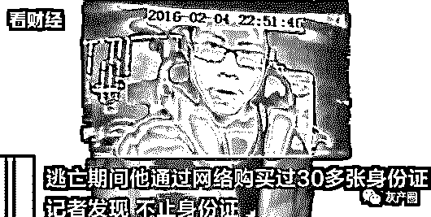
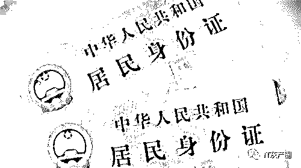
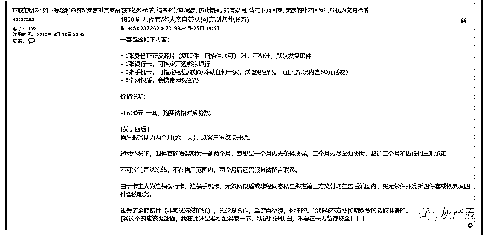
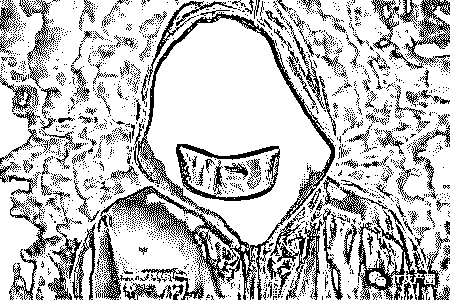
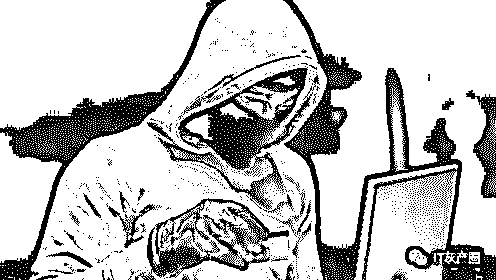
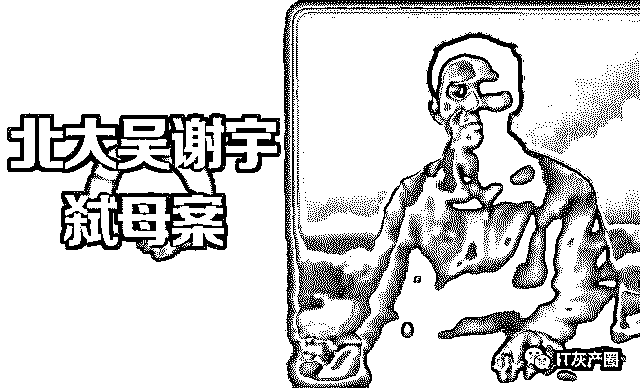

# 北大吴谢宇弑母案背后：暗藏身份证买卖黑色产业链

> 原文：[`mp.weixin.qq.com/s?__biz=MzIyMDYwMTk0Mw==&mid=2247495211&idx=1&sn=b6735a2551409eba33d3512e89230e69&chksm=97cb2513a0bcac05bb9d1708c3896468259d73983ef3dcd620426b32122fc69663b76ebbaf75&scene=27#wechat_redirect`](http://mp.weixin.qq.com/s?__biz=MzIyMDYwMTk0Mw==&mid=2247495211&idx=1&sn=b6735a2551409eba33d3512e89230e69&chksm=97cb2513a0bcac05bb9d1708c3896468259d73983ef3dcd620426b32122fc69663b76ebbaf75&scene=27#wechat_redirect)

**点击上方蓝色字体免费订阅“灰产圈”**

**导语**

“（证件）做出来外表跟真的一样，镭射、纹理都一样。”

4 月 26 日，一名身份证定制卖家介绍说。 

4 月 25 日，涉嫌弑母的北大学子吴谢宇被抓获。

据接近警方透露，逃亡期间他通过网络购买 30 多张身份证，一直在国内活动。调查发现，在吴谢宇能够购买多张身份证的背后，一条长期盘踞在各类证件之上的黑色产业链浮出水面。

在调查中了解到，仅仅需要 500 元，客户不到一星期便可以拿道“私人定制”的身份证。

除定制外，在暗网某个担保市场中，发现大量与个人证件买卖相关的信息。

此外，屡次被警方打击的银行卡“四件套”被明码标价，该产品交易帖中还显示了“欢迎老板前来长期合作”的内容。

**证件“私人定制”**

据接近警方的内部人士透露，吴谢宇在重庆江北国际机场被机场公安民警抓获时，被搜出随身携带 30 多张身份证，且逃亡期间一直在国内活动。这些与吴谢宇身份存在较大差异的身份证，或是其从网络渠道购买而来。

“其实，办假证在国内并不算新鲜的黑产。”一位业内人士说，“只不过这个古老的产业链被吴谢宇案件从幕后推向了台前。”同时，调查发现，不止身份证，包括士兵证在内的各种个人证件造假已经形成了一条较为成熟的产业链。

我们登录并检索一个名为“诚信办证网”的网站后发现，该网站的产品目录涵盖 20 种证件，分别是普通话等级证、报到证、国外文凭、大学毕业证、高中毕业证、中专毕业证、驾驶证、房产证、公证书、身份证、户口本、离婚证、结婚证、资格证、英语四六级、职称证、计算机等级证、营业执照、出生医学证明、士兵证。

在上述网站的公司简介一栏中，标注了明确的办证流程。据办证流程显示，客户可以通过该网站查看样本，提交办证所需材料，并付小部分定金后便可以进行证件的“私人定制”。证件制作周期为 1-2 天，采用快递发货。全国 1-2 天到货，偏远地区 3-4 天。据此推算，从下单开始，不到一周就可以拿到定制的证件。

通过“诚信办证网”网站显示的 QQ 号，我们以身份证买家身份与一名黑产从业者取得联系。据其介绍，我们仅仅需要将姓名、性别、民族、出生日期、住址、发证单位、有效期限、身份证号码、照片发送给，他便可以开始制作。

公开资料显示，正规的身份证含有多种防伪措施。

那么，黑产者制作的假证能否达到以假乱真的程度呢？“按你提供的资料来，做出来的外表跟真的一样，镭射、纹理都一样。”该证件的制作商自称从事该行业已经十年，技术绝对过关。

通过 QQ，上述制作商发送过来几张最近制作出炉的假证照片。我们对比后发现，照片中的假证字体式样和花纹与正规身份证看起来没有什么不同。“但是，里面没有磁条，不能机读。”该人士“坦言”。

上述人士还表示，随着“查得越来越严”，已经“不再制作士兵证”。

暗网兜售银行卡“四件套”，有团伙靠此获利 500 余万元

如同其他黑产从业者一样，暗网的去中心化和难追踪为其创造了得天独厚的发展空间。在这个隐蔽在互联网深处的庞大市场中，包含身份证买卖的交易信息几乎随处可见。

在暗网上的一家担保交易市场中，我们发现大量与证件买卖有关的信息。该市场的实体物品中一则交易帖显示，“银行卡四件套，欢迎老板前来长期合作”。所谓四件套，即银行卡，身份证复印件，U 盾和银行预留手机卡。

我们浏览多个交易帖发现，“四件套”价位由 800 元至 1600 元不等。

我们注意到，为了凸显“诚意”，交易帖中普遍包含多项售后规定。

一则交易帖中的“关于售后”一栏显示，所售产品售后服务期为两个月，以客户签收（银行）卡开始。一个月内无条件质保，二个月内尽全力协助，超过二个月不做任何主观承诺。

这些被非法交易的银行卡以及配套信息，成了滋生金融犯罪、电信诈骗的温床。此前，警方曾对买卖“四件套”行为进行多次打击。

> **据中国新闻网报道，去年 11 月四川警方曾打掉一特大妨碍信用卡管理犯罪团伙。在该案中，犯罪嫌疑人柯某某、柯某、付某某、汪某依靠买卖银行卡“四件套”，在不到一年时间内获利 500 余万元。**

**灰产圈****深度调查**

据我们调查，一张身份证 200 元、一张银行卡 100 元……而手机号、身份证、U 盾、银行卡“四件套”仅需 1200 元。

这些身份证、银行卡都是以 100 元-300 元不等的价格被收购，随后被卖给了从事网络诈骗的人员。

“帮忙淘宝刷信誉，办张银行卡就给 50 元”，这样的信息时常在网上传播，直接收卡成为一种渠道。

我们了解到，“收证—办卡—卖卡”，网上非法买卖银行卡已形成一个完整的灰色产业链。

由于假身份证会被银行识别出来，所以这些身份证都是真实的。

有一部分是捡来的，还有一部分是通过网络从其他人手中购买，一张身份证售价 100 到 150 元不等，批量买每张甚至低至 50 元，当然最为齐全的“四件套”可卖到 1200 元。80 后与 90 后的身份证，在这个“市场”上销路最好。

在收购完身份证后，就是以这些身份证去银行开户。虽然银行开户时会核查开户人与身份证上的人是否一致，但由于是靠肉眼甄别，身份证上的小照片是否本人，并不容易甄别出来，有些银行的自助开卡服务，更容易被犯罪分子利用。

办好的银行卡，会以 500 元至 1000 元不等的价格卖到各地。主要被用于电信诈骗、伪卡盗刷、洗钱、赌博等下游犯罪资金的转账提现。

**“灰产”老炮的故事**

　“能不用自己的信息注册，就尽量不用。”这是 KK 保护自己个人信息的新办法。因为不堪推销骚扰，他在网上买了一套自称是“注册四件套”的神器，内含一套个人信息资料，用于日常平台、应用账号的注册。

　　而这套资料内的个人信息，来自一位普通的 32 岁男性用户，资料信息可以满足大多数互联网平台注册用户账号时的需求。KK 直言，身边有一些亲朋好友为了保护个人隐私，也都买了这样的“四件套”。

　　这真有点儿意思，害怕个人的隐私信息被泄露，就去购买这种侵犯他人的隐私信息的注册套件，这套逻辑能行得通?

　以恶制恶，“注册四件套”需求巨大

　　“有了这个注册四件套，几乎可以注册任何平台账号。”

　　作为曾经从事个人信息买卖“灰产”的老炮儿，CC(化名)透露，所谓的“注册四件套”，就是身份证照(正反面)、证主手持身份证照片、实名制手机 SIM 卡，以及相对应的银行卡号信息。

　　这四样东西，就已经包含了大部分互联网应用、游戏平台甚至互联网金融平台注册时，所需要上传或输入的验证信息。有部分甚至还包含有“信息主人”的生活照片，可用于设置社交账号的头像。

　　“因为银行卡号、实名手机号码都是一一对应，亲测有效的。”CC 表示，这样一套万能的“注册四件套”，售价大概在 300~500 元左右。如果是年龄在 20~35 岁之间的用户注册信息，价格还要略高一些。

　　然而，这个看起来并不便宜的价格，却吸引了众多像 KK 一样，有隐私泄露顾虑的用户购买。据 CC 透露，类似的“注册四件套”他每天都能卖出去上百套。据他分析，这个圈子整体上四件套的销售总量，每个月估计都会在百万套以上。

　　“虽然一套的价格不便宜，但合计下来还是挺划算的。” CC 表示，有些做销售和批发生意的用户，每天都要接听上百通重要来电。如果被推销电话骚扰导致占线，随时都有可能导致业务丢单，所以他们最乐于用这种四件套。

　　即便是一些没有业务需求的学生党，只要家境好一些的也会花几百元钱买个清净。既能畅快的在互联网上注册账号，又能免除大量营销机构、职培机构的骚扰，何乐不为。

　　“手里有这么一套资料，人就等于多了一件马甲，在网上做任何事情，都不用太多的顾虑。”CC 说，现在有些用户在网上注册信息都很是小心翼翼，上网后也不敢违规。有些爱捣蛋的也收敛很多，怕的就是因为账号实名，会被“人肉”出来。

　　而有了“马甲”之后，这些人即便在社交平台上也可以肆意妄为，不怕被追究处罚，更不怕被网友“人肉”，因为账号信息即便被曝光，资料也不是自己的。

　　当被问及数量如此庞大的“注册四件套”究竟来自哪里时，CC 始终三缄其口。只是隐隐约约地暗示，年轻人不要轻易在网游里上传或验证个人隐私信息;办理移动电话相关业务的时候，一定要选择运营商官方营业网点，不要去所谓加盟连锁门店。

　　“注册四件套”相当于是在互联网世界里给普通用户戴上了一个面具。用他人的隐私信息，保护了自己的隐私信息，显然是损人利己的行为。

　　如果说，这种注册方式能够最大程度的隐藏个人真实身份，那么有类似购买需求的群体，自然不会仅仅是那些不堪骚扰的普通用户。

　　居心叵测，“灰产”这样隐藏身份

　“从买家的需求，大概就能看出其从事的行业。”

　　CC 表示，虽然行规约定俗成，不会询问买家购买“注册四件套”的目的，但却可以从其使用行为上看出端倪。

　　如购买身份证照、实名手机卡、银行卡号之外，还询问是否有人脸识别视频的人，一般都是为了在电商(含二手)交易平台上注册新账户的“不良卖家”。通过套用他人注册信息，好在平台上销售假冒伪劣产品。

　　“这种注册套件自带人脸(信息)的资料很少，价格也很高。” CC 强调，一套带人脸信息的资料价格多为几千元，但这些“不良卖家”买起来却丝毫不会手软。

　　CC 透露，曾有不少华强北的手机卖家在他这购买了多套类似的个人资料，在电商平台开店，以销售翻新机、组装机。一旦东窗事发，用户追诉、官方介入后，卖家便能立刻溜之大吉。

　　除此之外，不少灰产同行也经常到 CC 这儿来购买“注册四件套”，用于注册大量的社交账号去推广业务。有电商刷单的，应用刷量的，尤其世界杯开赛后，部分从事私彩赌博的非法机构，也都是用着类似的注册信息，从事交易行为，以规避被查处的风险。

　　“再有一些就是做微商和群控，买的也比较多。” CC 分析，目前由于微信官方对于未实名绑定账号的管控手段越来越严格，导致部分接码系统所提供的验证方式，也无法顺利注册、解封微信号。

　　因此，微商、群控不得不寻找真实的用户信息加以绑定，试图规避管控规则。而且，这部分群体对于“注册四件套”的需求数量，往往都十分庞大。

　　“尤其是微商，如果产品出了问题，大不了跑路就是。”CC 笑称，一些从事微商的宝妈一个月内就会找他买好几次账号。只要对方一出现，就知道其微信号又被举报封禁了。

　　对于有些人购买“注册四件套”信息，用于从事违法、灰色交易的行为，CC 自然心知肚明。但正如他所说的，在这个圈子的行规约束下，从事个人信息交易的灰产同行，谁都不会过问太多。

　　“再者说了，有钱赚就卖，这是生意人的思维。”虽然已经离开这个行当，但是 CC 知道这个圈子里赚钱谁还会去顾及良心。即便当违法行为被有关部门查处之后，他们也会以“不知者无罪”为由，规避部分连带责任，只单纯对买卖个人信息的违法行为负责。毕竟，违法成本太低!

资料一套多卖，灰产上演“黑吃黑”

　　“信息买回来注册时，竟然显示已有用户名了。”

　　TT 因为喜欢在网上打“嘴炮”，他在某“灰产”卖家那花了几百元买来一套“注册四件套”，虽然对方号称信誉极好，但买回来的信息只能注册微信，很多网上的平台账号都注册不了。

　　TT 表示，注册时输入身份证号码后，不是显示号码被占用，就显示用户已存在。即便通过手机号码找回账号，所绑定的用户信息，也与其买回来的资料对不上。

　　“于是我就截了图，找了卖我资料的那个卖家。”TT 承认，卖个人隐私信息的卖家是自己在某二手电商平台上，用隐晦的词语搜索到的。在担保交易之后，对方通过微信发送相关资料，全程不涉及身份证、手机卡、注册信息等敏感词汇，“心照不宣的完成了一次交易。”

　　看到他无法注册的截图之后，卖家倒是挺讲“信誉”，二话不说就在微信上给他又发来一套全新的用户资料，让他继续试试看。然而，依旧还是有部分平台显示被占用。

　　来回注册多次之后，TT 也累了，卖家也不再搭理他了。让他十分不解的是，“四件套”上的材料姓名、证件号码都是一一对应的，为何会出现部分平台无法注册(信息占用)的问题呢?

　　“这是因为一套资料被卖太多次的缘故，很多代理卖家太不厚道。”对于这个问题，CC 解释说，很多小卖家出售的个人隐私资料，都是从上一级批发商那代理来的，数量本身就比较有限。

　　因此，他们会想着用有限的资料，压榨出尽可能多的价值。于是，小卖家会将这些资料信息分类卖，如微信注册为一类，用于电商注册为一类，P2P 账号注册为一类等等。

　　如果买家只想注册微信，那么将这一套资料卖给他，之后还能再卖给想开通电商账号的买家，以及注册互金平台想要“薅羊毛”的羊毛党。

　　“所以小卖家在卖个人信息之前，都会问问买家注册什么平台，怕卖重复了。”CC 说，尽管都一一做了登记，但免不了有部分买家说是用来注册微信，结果却注册了所有可用的平台。这样会导致部分“四件套”出现问题，在有些平台能用，有些则被占用。

　　本想用别人的资信息来维护个人的隐私，并在互联网世界里逞一时嘴快(骂人)的 TT，到头来只能自认倒霉。

　　很多居心不良者认为，通过购买他人的隐私信息用于注册账号，任何不法行为都能够瞒天过海。但他们却没有想到，买卖公民个人信息已经构成了违法行为，一旦东窗事发非但不能免担责任，反而会罪加一等。

　　而那些想借用他人隐私信息，以维护个人隐私信息的普通用户，更是在不经意间违反了相关法律法规，并且纵容了灰产生意的变本加厉，进而去盗用、骗取更多的无辜用户的资料信息。也正是这种动机，才会造就“四件套”灰产得以生存。

　　守规矩，在有些人的脑海里，似乎是一件很傻很 low 的事情，抖点儿小机灵买个“马甲”在网上做些不太规矩的小动作，看似聪明，实则愚昧。贪小便宜必将吃大亏，这句话再次送给在网络上躲避规矩的“聪明人”。

结尾

我们相信，法网恢恢疏而不漏！从吴谢宇案件来看，这么多年能躲避警方追查身上的 30 多张身份证“功不可没”，“四件套”作为网络黑产隐藏身份以及资金转移的工具，存在了很多年，之所以到现在没有连根拔除，是因为存在即合理，换一句话说，有需求就有市场。

希望大家不要购买“四件套”，不管出于什么目的，购买“四件套”的行为已经犯法，切勿以身试法，更何况黑吃黑的情况也有很多。

最后，愿吴谢宇能够在监狱中忏悔醒悟，愿大家能通过这个案件警示自己！

← 向右滑动与灰产圈互动交流 →

**阅读原文加入灰产圈高端社群**