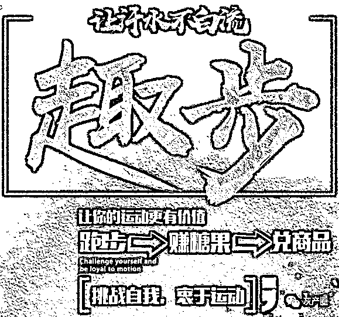
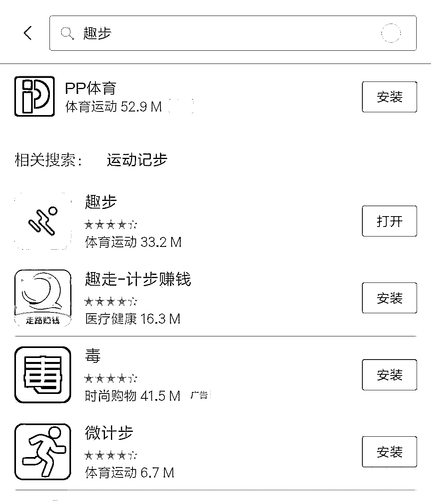
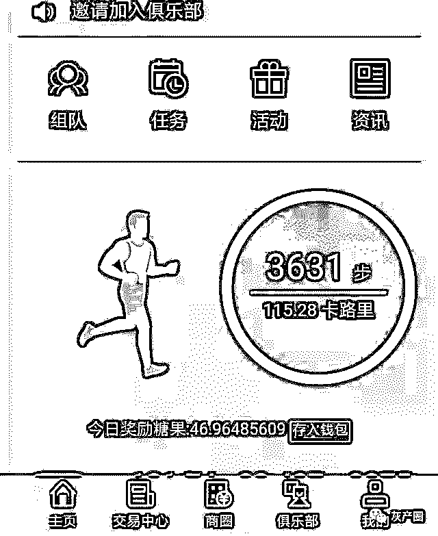
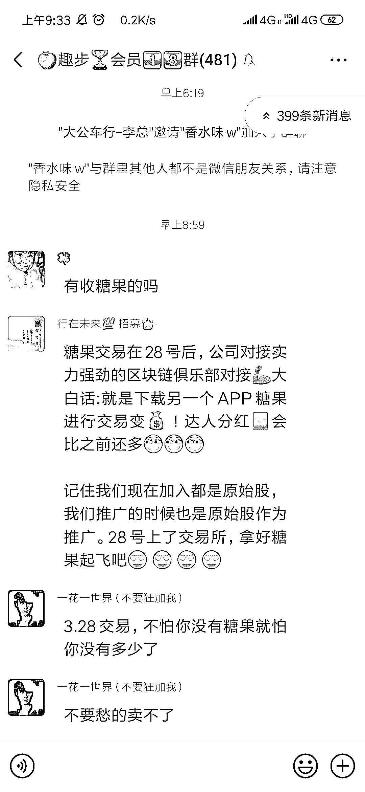
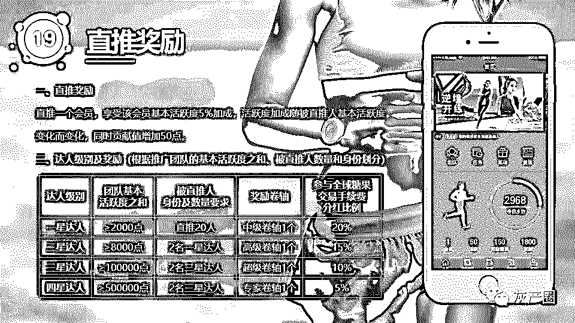
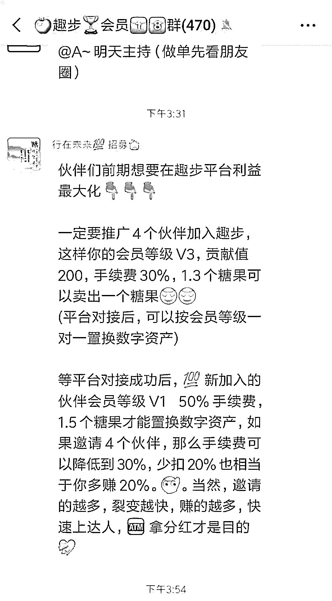
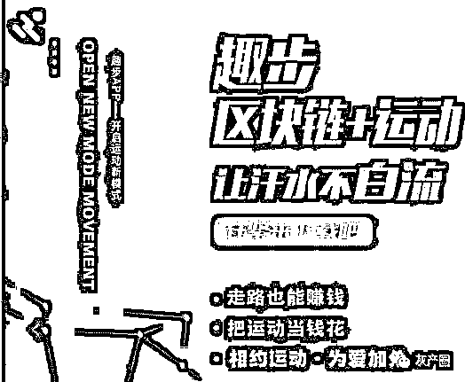
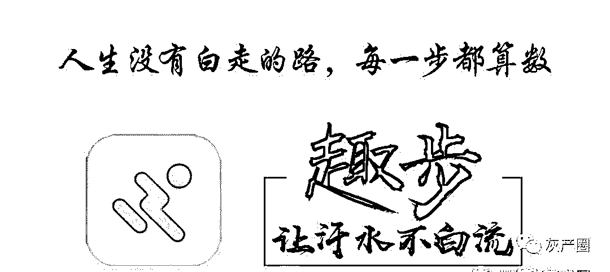
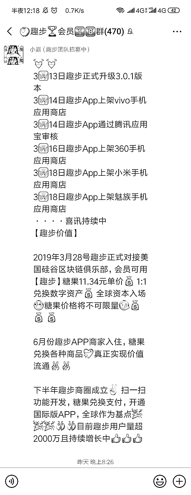

# 趣步：“骗局”永不止步！“传销”不走寻常路！

> 原文：[`mp.weixin.qq.com/s?__biz=MzIyMDYwMTk0Mw==&mid=2247495204&idx=1&sn=4b87e6bab52fdaddb1c8c2017125380c&chksm=97cb251ca0bcac0aee310d6aeb28749274f948a89a2098a8fdf18a62bb1ce59cafe3b20bfb27&scene=27#wechat_redirect`](http://mp.weixin.qq.com/s?__biz=MzIyMDYwMTk0Mw==&mid=2247495204&idx=1&sn=4b87e6bab52fdaddb1c8c2017125380c&chksm=97cb251ca0bcac0aee310d6aeb28749274f948a89a2098a8fdf18a62bb1ce59cafe3b20bfb27&scene=27#wechat_redirect)

**点击上方蓝色字体免费订阅“灰产圈”**

由于最近资金紧缺，KK 在一个刷单群里做了一个佣金为 5 块的任务，这个任务是下载注册一个计步软件，软件名叫趣步。

乍一看这个计步软件并没有什么特别的，但是之后越用越感到蹊跷。

首先，这个软件一开始并不能在各大应用商店下载，在应用商店上是找不到一款名叫趣步的 APP。

这个能理解，毕竟有的软件刚开始只是内测，现在上去搜已经能看到趣步这个 APP 了。

但是当注册时，它绑定支付宝账号和身份证信息，并且要扣一块钱手续费，其实扣费这个倒没什么，但是绑定身份证时，这便引起了 KK 的警惕。

毕竟见过太多的信息泄露，以致于人在家中坐，债从天上来的事例。负责人说，这个是为了绑定你的支付宝，好转账过去。但其实还是有风险的。

忘记提了。这个趣步计步了 3000 步后，可以兑换糖果，但是限定了数额。而糖果可以用来兑换人民币。这里就有一个很重要的问题，糖果产出来兑换的钱由谁来承担？

这里趣步的开发公司是这么说的，糖果累积到一定数额，可以进行交易，而且现在一颗糖果价值 7 块钱，之后便是几倍的增长，到时候一颗糖果也许就会上升到几十块钱了，可以进行自由交易买卖。然后还提到了区块链什么的，KK 心想，这有点像炒比特币的感觉。

这里有个趣步的群，当里面有人想卖出糖果时，便有人适时出来说话。

他的解释是 3 月 28 号也就是几天后会开放交易模式，并借此再吹嘘糖果的增值潜力。并且人们在进行糖果交易时，公司会收取交易手续费。

但如果仅仅是这样，其实还不足以引起 KK 更多关注。因为 KK 本身并不了解炒股和区块链这些金融交易行为，所以 KK 并没有太大的感觉。

但是这里有个地方让 KK 更加警惕了。推广 4 个小伙伴加入趣步，会员等级升为 V3，交易手续费就从 50%降到 30%，邀请得越多人，糖果赚的收益越高。

这难道不是传销？！

而且这个群的负责人天天歌功颂德，说什么趣步将要上市，起飞什么的。想到 KK 的身份证还绑在这个 APP 上，心里一阵打颤，急忙把账号身份证信息解绑了，就是不知道会不会已经被记录了。

在这个信息时代，个人隐私真的是无所不处地被泄露。

之后 KK 查了一下百度和知乎，大致上是这么个情况。

这就是一起区块链传销，一种新型的传销模式，不知道算不算合法的传销。

> **趣步的模式：**

利用区块链技术以人体运动计步来计算糖果的产量，参与者的每一步都能够产出糖果，糖果目前十分稀少，价值很高。

会员觉得糖果有价值会买卖糖果从而获得现金收益，而平台收取每笔交易手续费。参与者可以拉人提高会员等级保证更多人参与进来。

平台先期出钱给用户的糖果兑换钱，后续让用户自己交易糖果。有的人可能会不甘心赚走路获得的糖果换的钱，便从家里取款大量买入糖果，直接炒作，就如同当初炒比特币一样，炒高价格，再转手卖出去赚一笔。

初期糖果很少，物以稀为贵，由于糖果是根据人的步数来产出，或许平台还会偷偷注册小号加快糖果的产出。之后糖果越产越多，交易越来越多，平台赚得盆满钵满。KK 们学过高中政治就知道，货币发行超过了需求时，货币的价值就会降低，于是会产生贬值。

总有一天，糖果价格会下跌，到时候人们就会急于抛售糖果，甚至不得不低价抛售，价格直线下滑。最终的结果就是平台赚钱跑路，只剩下了炒糖果亏得倾家荡产的人。这和当初的比特币如出一辙，只是这个趣步还增加了拉人头的传销模式，并且以走路就能赚钱的噱头来吸引更多用户参与进来。

说到这里，趣步的本质已经很清楚了，就是一个不知道哪来的公司花了十几万开发的一个用来圈钱的平台，等待着越来越多人进入这个圈子，投入更多的金钱和精力，最后再进行一波收割，走人，完美。

奶茶：你为啥要告诉 KK 这些啊？

可乐：因为你是 KK 朋友啊，怕你被骗呢。

奶茶：好兄弟，以后 KK 进了传销第一个拉你进来!

可乐：滚......

← 向右滑动与灰产圈互动交流 →

**阅读原文加入灰产圈高端社群**