# 视觉中国：第一个被黑洞吸走的网站！

> 原文：[`mp.weixin.qq.com/s?__biz=MzIyMDYwMTk0Mw==&mid=2247495062&idx=1&sn=0ab29384498641a6e49b07540922c654&chksm=97cb26aea0bcafb8ca311ec8620f7d18a4abe9fe6f4344d5c74e897190b54a0d9eec5df2f09e&scene=27#wechat_redirect`](http://mp.weixin.qq.com/s?__biz=MzIyMDYwMTk0Mw==&mid=2247495062&idx=1&sn=0ab29384498641a6e49b07540922c654&chksm=97cb26aea0bcafb8ca311ec8620f7d18a4abe9fe6f4344d5c74e897190b54a0d9eec5df2f09e&scene=27#wechat_redirect)

**点击上方蓝色字体免费订阅“灰产圈”**

导语

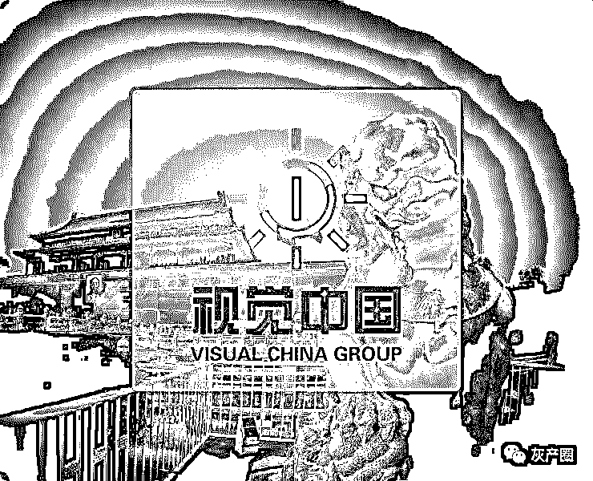

4 月 11 日，视觉中国图片版权问题持续发酵，目前其官网已无法打开。

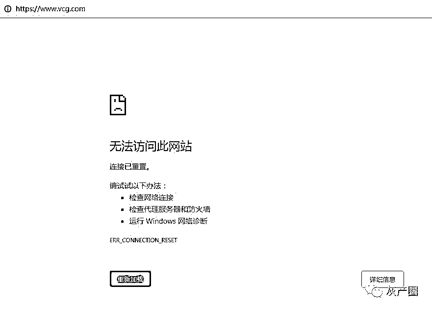

视觉中国官网截图

事件始末

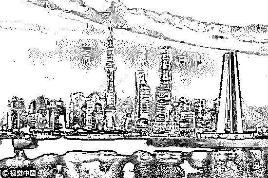

## no zuo no die，视觉中国刚攒的那点好感也被自己作光了。

## 先说说起因吧。

4 月 11 日，视觉中国网站上出现了昨晚公布的人类史上首张黑洞照片。并注明此图如用于商业用途，请致电或咨询客户代表。

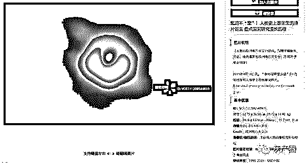

此事一经曝光，立刻引发热议。

人类首张黑洞照片由全球 8 部事件视界望远镜(EHT)共同观测而成，是多为科学家的成果，关于版权问题

中科院院士武向平表示：一旦发布了，就是全世界可以使用的，媒体上也可以看见，只要标注是哪里来的就可以。

对此不少网友、媒体纷纷到视觉中国客服进行询问。

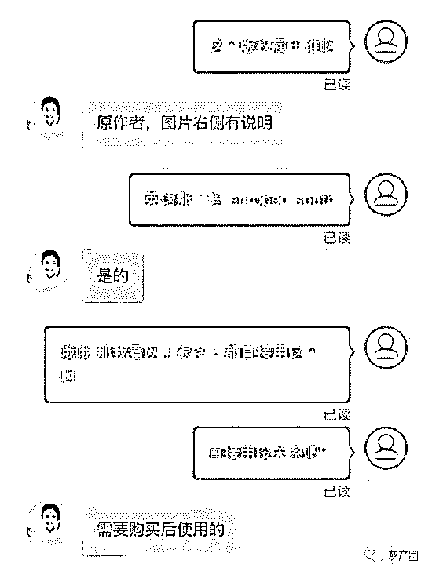

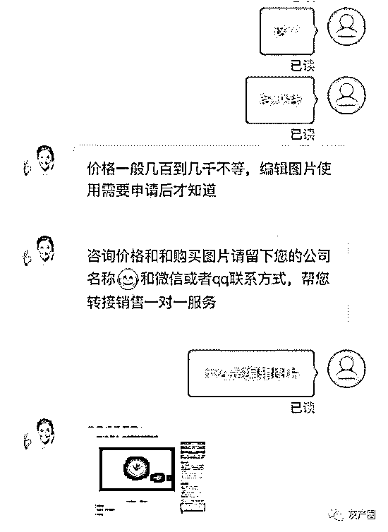

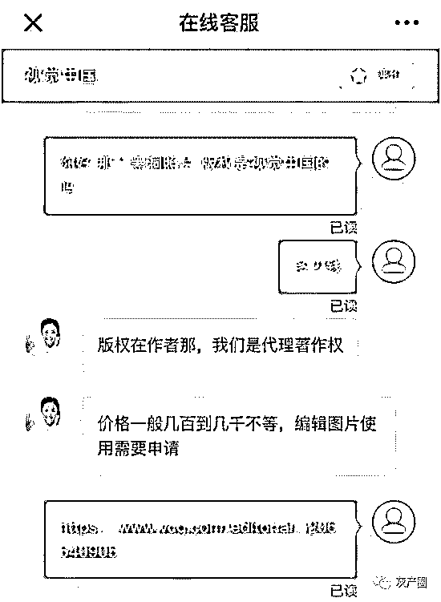

　　视觉中国回应：通过合作伙伴获得编辑类使用授权，但授权并非独家

随后，关于黑洞照片版权的问题，蓝 V 认证微博@视觉中国影像 发布声明：“黑洞”照片属于 Event Horizon Telescope 组织，视觉中国通过合作伙伴获得编辑类使用授权。

根据版权人要求只能用于新闻编辑传播使用，未经许可，不能作为商业类使用。商业使用一般包括广告、促销等使用场景，视觉中国并未获得该图片商业用途的权利。如未经版权人授权，用于商业用途，将可能存在风险。

### **最后，共青团出手了！**

4 月 11 日 15:05，共青团中央官方微博 @共青团中央 发布微博并置顶，发问视觉中国：国旗、国徽的版权也是贵公司的？

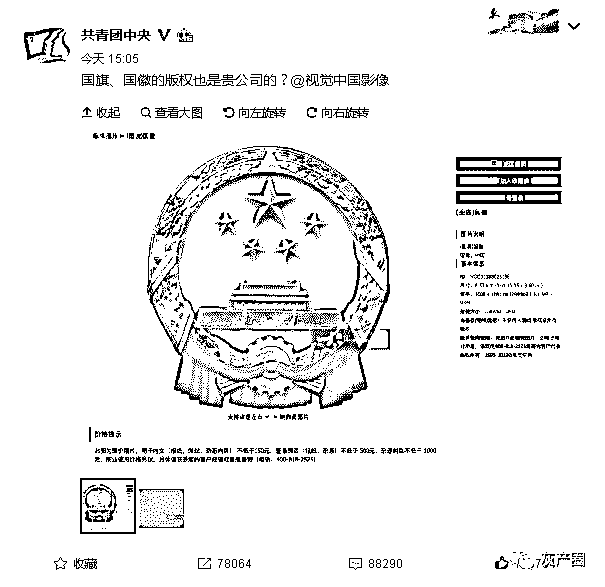

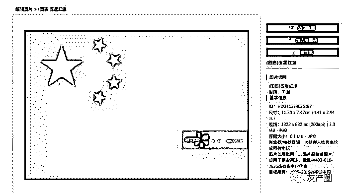

事情就是这么个事情，视觉中国这么做不仅违法（直接违反国徽法），而且对其品牌形象影响极坏，毕竟，一个号称尊重版权的公司，在这件事上却折（she）了！

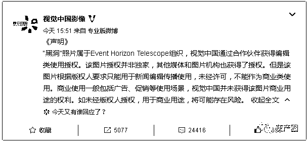

新浪科技讯 4 月 11 日下午消息，针对视觉中国已经在国内拿下了全球首张黑洞图片的版权一事，视觉中国官方微博回应称，该图片授权并非独家，其他媒体和图片机构也获得了授权。但是该图片根据版权人要求只能用于新闻编辑传播使用，未经许可，不能作为商业类使用。

声明称，“黑洞”照片属于 Event Horizon Telescope 组织，视觉中国通过合作伙伴获得编辑类使用授权。

视觉中国补充道，商业使用一般包括广告、促销等使用场景，视觉中国并未获得该图片商业用途的权利。如未经版权人授权，用于商业用途，将可能存在风险。

此消息一出，共青团中央官方微博质疑并配图称，“国旗、国徽的版权也是贵公司的？”之后，百度、联想、海尔、360、苏宁易购等纷纷在其官微下配图留言互动。(云红)

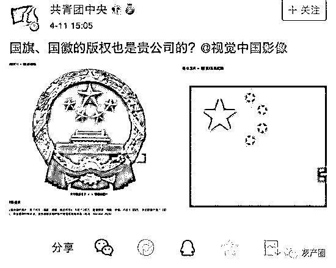

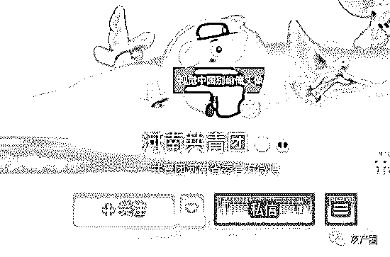

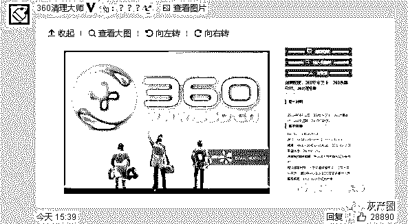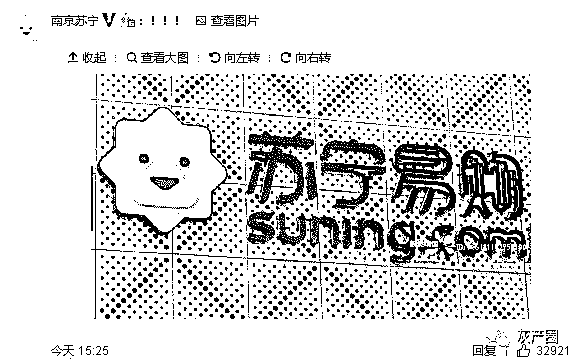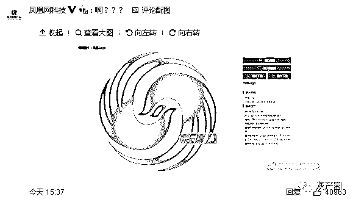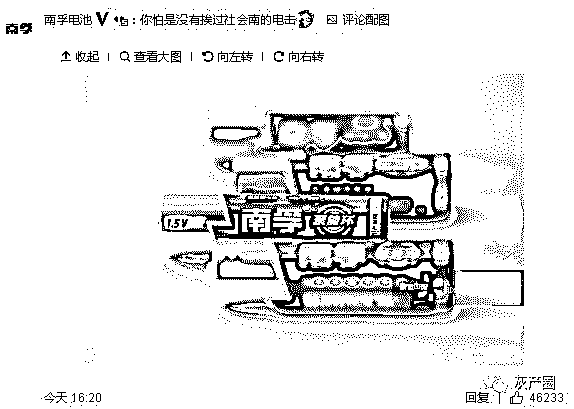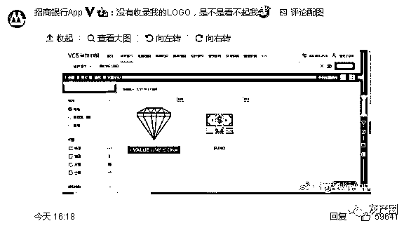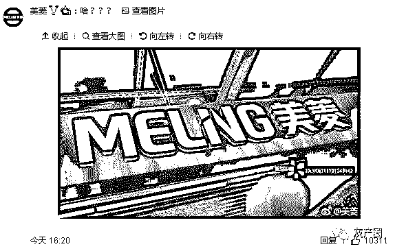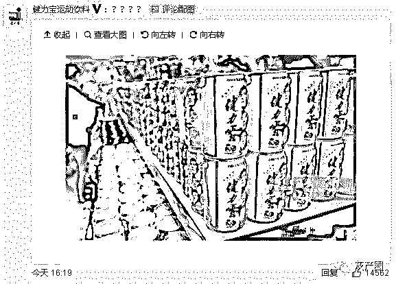

**以上留言真的是有史以来互联网公司最齐心的一次！没有之一！**

**一家人，最重要的是整整齐齐！**  

很可惜，现在视觉中国主页已经打不开了， 如果能打开的话，估计**灰产圈**的头像也会在上面标注版权归属视觉中国所有。

还原事实

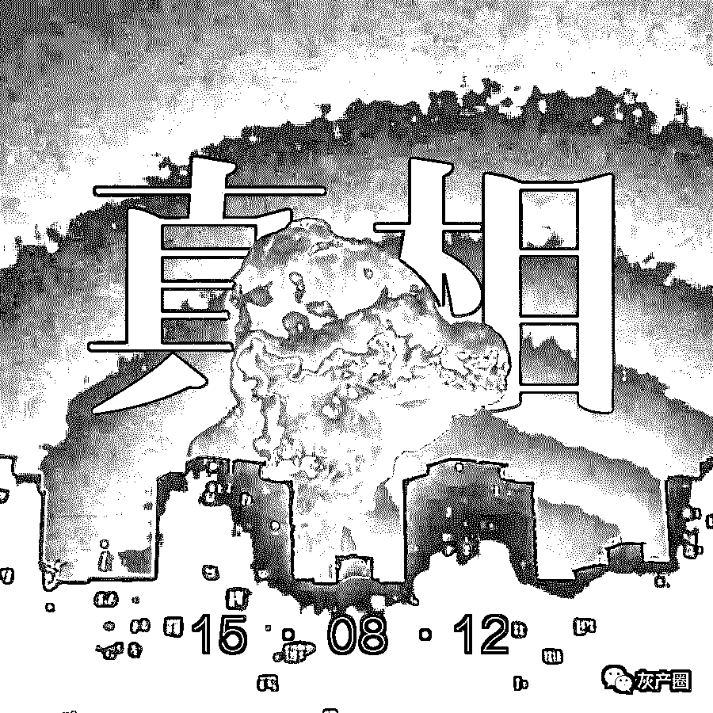

这只是个引子，这件事之所以引起众怒，重点在于视觉中国长期以来对自媒体行业的倾轧。

近些年来，许多自媒体从业者一听到“视觉中国”这四个字就心头一颤，不知道什么时候误用了一张图片，紧接着一张律师函就被送到手中。

但说真的，版权这个事对错其实很清楚，如果侵权已是事实，那么挨打自然就要立正，自媒体人不应该有什么话说。

可是视觉中国作为一家百亿市值的主板上市企业，其所谓“维权”的诸多举措，并不能令人信服。下面我简单列几条：

第一，狮子大开口

同视觉中国打过交道的自媒体人都知道，这家企业一张嘴就是几十万的索赔，并且坚决不接受删除道歉等解决方式。并且在沟通过程中态度极其强势恶劣，颇让人吃不消。

据自媒体“航通社”所形容，那简直是：“充满了刀光剑影，血雨腥风。他们警告的手法十分恶劣，语气严厉，而且基本不给思考机会。感觉就是将每一个盗取他们图片的人，都像是杀父之仇，夺妻之恨的那种不共戴天的仇人一样看待。”

第二，“钓鱼执法”之嫌

事情发生后，我国的著名投资人张颖便在朋友圈内就此事发表了评论，从评论中我们可以了解到，通过诉讼行为来获取赔偿，已经成了这家公司的一种“核心商业模式”！

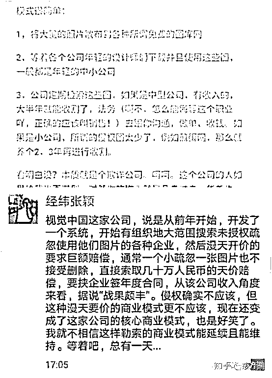

所谓版权维权，其目的是为了“不再有人来侵权”而出现的托底式法律规定。而据许多自媒体从业者的观感来看，视觉中国的种种行为，都有一种“希望你来侵权”的感觉。而当你真的“侵权”达成之后，他又会扑上来与你大肆厮打，以期获取超额的赔偿收益。

作为一家互联网公司，视觉中国手握如此庞大的版权资源却不去积极探寻一种健康的商业模式，以一种近似“勒索”的方式作为自己的核心“商业模式”，未免遭人耻笑。

第三，版权所属问题

从黑洞照片，到我们的国徽国旗，乃至各家企业自己的 logo，其中许多图片的版权明显不属于视觉中国但它依然在其主页中有所声明，这里面或许体现了“视觉中国”的一个思路：管它呢，是图片我就占个位，指不定哪天就能通过诉讼来牟利。

第四，商业及社会价值

作为一家上市企业，视觉中国原本可以做得比现在要更多。推进版权的正规化对整个中国的创作氛围乃至全社会都将产生出巨大的价值。

视觉中国它本可以真的去做一些事，但它选择了席地而坐，派出一个个所谓的“法务”去拿下一张张所谓的“单子”。

结尾

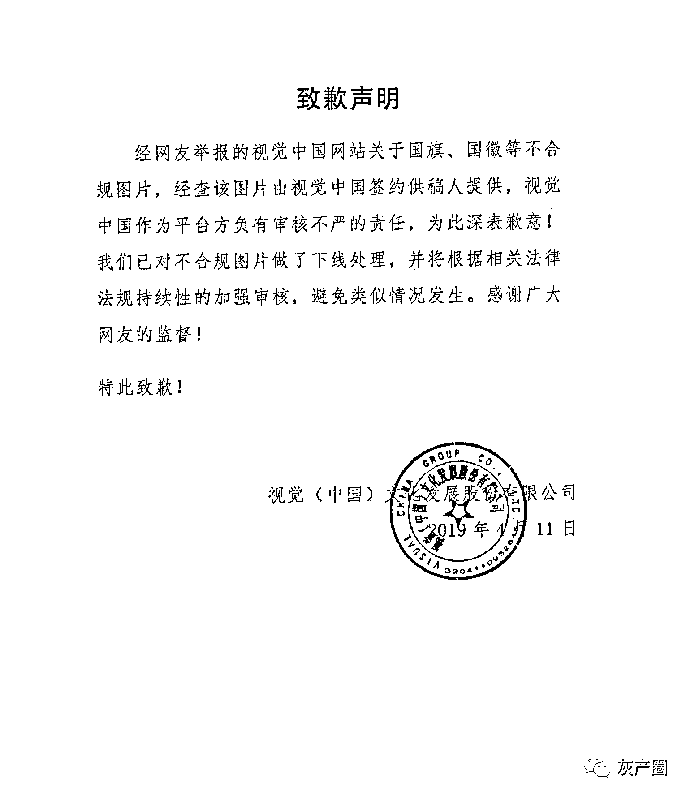

**视觉中国致歉声明**  

这世界永远分为 easy way 和 right way。

在故事的另一种可能性上，我看到视觉中国真的在积极推进图片版权的合法化，合理化，合规化。

我看到每一个自媒体人在搜索图片时都可以清晰地看到图片来源和图片价格，我看到一个复杂的集成系统，在那里图片的使用者和创造者都同样拥有尊严。

但视觉中国选择了 easy way。

在今天，这条路终于走到了尽头。

●[1 个 95 后，3 个 QQ 号，60 名团队成员，2 年诈骗 1 亿元！](http://mp.weixin.qq.com/s?__biz=MzIyMDYwMTk0Mw==&mid=2247494999&idx=1&sn=25711b33034c74460b2365c5444f8e2d&chksm=97cb266fa0bcaf79c2658bf9b05fa0ce60e423f1321d46e023b62b0d49cf3b2d728a53562a95&scene=21#wechat_redirect)

●[一分钟带你了解刷单诈骗的真面目！](http://mp.weixin.qq.com/s?__biz=MzIyMDYwMTk0Mw==&mid=2247494981&idx=3&sn=4e5eacdacd5cfa80c93c9e172f2eedab&chksm=97cb267da0bcaf6b47975049193c3fd30f0850f291f2d25405e8139bc57603f407d9d648b702&scene=21#wechat_redirect)

●[游戏币诈骗黑色产业链：三类角色，固定剧本，引人入坑！](http://mp.weixin.qq.com/s?__biz=MzIyMDYwMTk0Mw==&mid=2247494876&idx=8&sn=021c04f303d210f8c5ba003b45d7cf64&chksm=97cb27e4a0bcaef2a8acd4693fbfa372507ce64e1edcf138afe24b2d3aa288e498b6f4093ff2&scene=21#wechat_redirect)

← 向右滑动与灰产圈互动交流 →

**阅读原文加入灰产圈高端社群**