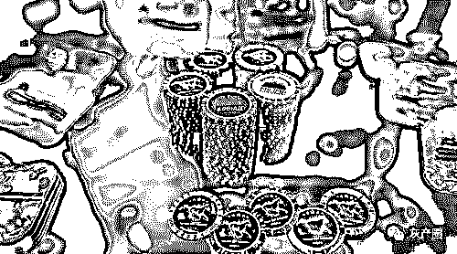
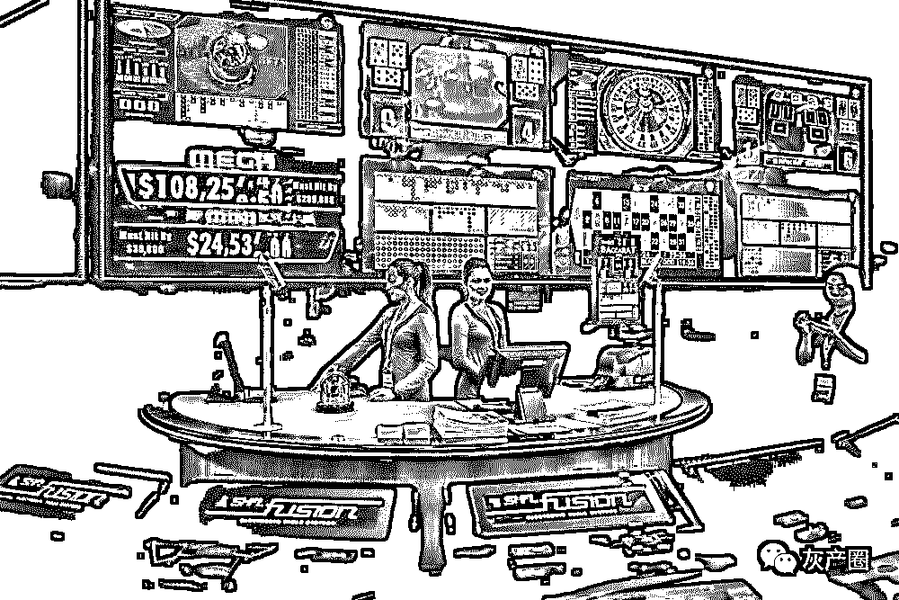
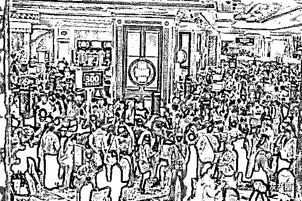
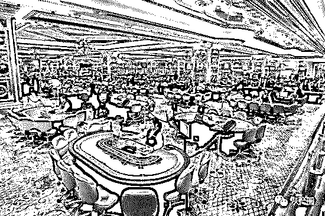
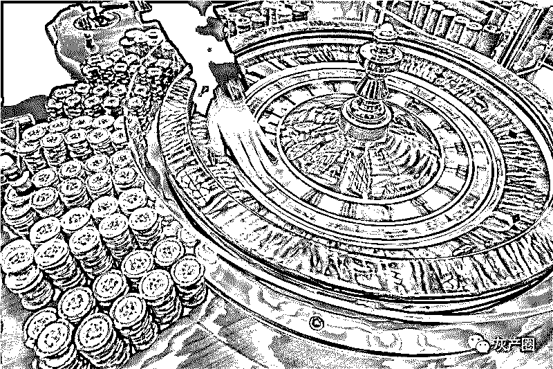
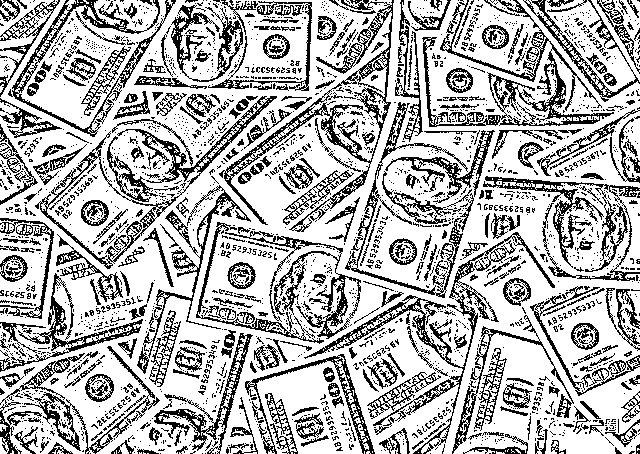
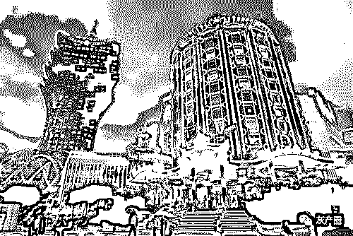

# 博彩业《不能说的秘密》：为什么久赌必输?

> 原文：[`mp.weixin.qq.com/s?__biz=MzIyMDYwMTk0Mw==&mid=2247495037&idx=1&sn=5aa5a761e36ac14fc459f33d643cb152&chksm=97cb2645a0bcaf53cae193ff61cdbcf1cbd456c2dd5af8a8c3f0eb5b2cdc28249bd9a966ccff&scene=27#wechat_redirect`](http://mp.weixin.qq.com/s?__biz=MzIyMDYwMTk0Mw==&mid=2247495037&idx=1&sn=5aa5a761e36ac14fc459f33d643cb152&chksm=97cb2645a0bcaf53cae193ff61cdbcf1cbd456c2dd5af8a8c3f0eb5b2cdc28249bd9a966ccff&scene=27#wechat_redirect)

**点击上方蓝色字体免费订阅“灰产圈”**

导语

看一个网友的例子，**如何用经济学解开“赌博“的奥秘：**

KK 在美国读书多年，学的是金融数学，我不是一个赌徒。但是家中有人（我的舅佬）在过年的时候输钱躲债，全家人才知道他赌博的事实。他在澳门豪赌，本来拿来回周转资金链的钱全部吞进，结果落得这个下场。 

**作为一个旁观者，我想用概率学的角度告诉大家，你们所谓的赢钱，再大，其实都是小钱。** 

赌博的成本，你知道有多大吗？

大家都知道成本的概念，做凡事都有成本，无论是赌博还是做生意。赌博中的成本是什么，我想大家都会说：赌资，本钱呗。正是因为如此，所有人会固然的认为，赌场上的盈亏，无非就是赢得钱能否覆盖你的赌资。或者，输得钱能否被你的赌资覆盖。 

这个想法是大错特错的！ 

**现在我来告诉你一个会让你觉得诧异，但是科学的理论，其实，你每赢得一万当中，赌场其实偷偷的从中抽了至少百分之 90！** 

因为大家忽略了一个重要的成本概念：**机会成本。**

你肯定以为我乱说，赢的钱已经实实在在的放到了我的口袋里，怎么还会被赌场偷偷抽成呢？因为大家只在意你手上的赌本，而忽略了西方经济学很在意，也是决定生死的一个隐形成本：机会成本。 

什么是机会成本?

****

**我解释一下，用一个实际的例子： 你每每进入赌场，或者网赌，亦或机房，入座，下注，上分，比如说你的赌本是 1000，你要去搏一个 1 赔三，就是 3000，概率是二分之一（当然只是假设），然后你面临的选择就是，百分之五十的概率，你最后拥有 4000，百分之五十的概率，你血本无归。然而，那天你运气大好，一把就中，3000 乖乖入账。你这时候得以忘形，以为自己拿 1000 赢了 3000，而且成本也还在。**

其实，**用经济学的角度考虑，在你下注的一刹那，你的经济系统立即产生了两笔成本：1000，你的赌本，和百分之五十可能输得这个隐形成本，**3000 乘以百分之五十，其实，你的总成本是：1000+1500=2500，你最后赢了，得到了 4000，其实你最后赚的钱是：4000-2500=1500\. 那个承担风险的钱，便是你的机会成本。 

说到这里，你可能以为我在危言耸听：但是，4000 的钱实实在在我已经拿到了，怎么会只赚了 1500 呢？答案就是：赌场里输钱的人帮你承担了。而你每次输钱，只不过是在帮别人承担机会成本罢了。 

现在我们计算下，一个赌局，你下 10 万，有百分之 10 的机会打到 150 万，这个概率依然诱人，但是算入机会成本，150*百分之 90 的输钱几率，你最后只赢 15 万，再减去 10 万的赌本，其实你最后只赢 5 万。 

现在请大家集体回忆，自己赢的最多的时候是几个：一个？五个？十个？五十个？再按照你的经验或者赌场固有概率（比如 21 点的概率就是 49-51 左右）， 回头算算，那一次你到底赚了多少钱？算好你会发现，可能你以为发财的那一次，其实只进了区区几万几千甚至更少罢了。

导语

赌场就是靠这个隐形成本赚钱。因为十个赢钱的人，反赌率至少 95%以上，除非你真是路过撒钱的然后上学去的。 大家可能吗？ 

赌博是一种病理性特征，和烟瘾一样，在 90 年代末期已经有它的临床根据。这就是为什么，大家每每经过赌场机房或者打开网赌网站，心里甚至生理会产生极具难忍难受的反应。

**因为，你生病了。** 

**我建议赌瘾严重的人，不要强忍，没用而且难受，应该去做心理咨询。当然，万事前，先还债，要戒赌，先坦白，再还债，再治病，少上网，多工作。** 

**那既然赌博是洪水猛兽，为什么很多国家并不明文禁止，甚至会扶持博彩行业呢？** 

**为什么世界上越来越多的国家和地区开放博彩呢？只有一个理由，为了获取财政收入。** 

在西欧，只有瑞士、西班牙和斯堪的纳维亚国家禁止开办赌场，英国有 120 家赌场，其他国家有 180 家赌场。有许多国家只允许旅游者参加赌博，而不许当地居民参加，如韩国的华克山庄，距离汉城市中心要一个小时车程，它拒绝韩国公民入内。 

对于旅游者来说，夜生活确实是个问题。像在澳大利亚，即便是大城市墨尔本，到了晚上九点后，没什么地方好玩的，这时澳洲的最大赌场王冠赌城就很吸引人了，130 个游戏点，1200 台扑克牌，极有声势；而且，王冠赌城就在市区的世界贸易中心内，方便得很。

一家名为纳嘎的柬埔寨赌场公司，最近已准备在新加坡上市，计划集资 5000 万美元。在 2000~2002 年的 3 年中，纳嘎赌场平均拥有高达 48%的纯利率。 

当然，真正让赌博成为产业且发扬光大的还是美国。1999 年，美国赌博行业总收入已超过 580 亿美元，其中抽奖（160 亿美元）和赌场（130 亿美元）是最重要的部分。相比较而言，1999 年美国电影门票收入仅为 75 亿美元，音乐带的收入倒与赌场持平。

美国首屈一指的赌博中心自然是内华达州，这里的赌城拉斯维加斯最大的特色在于，几乎所有的博彩饭店收入的一半都来自非博彩业项目，如客房、饮食和娱乐，六家最大的赌博公司的收入占到全州收入总额的 80%。这是多么惊人的数据。 

只想奉劝一句，很多国家赌场里参与赌博的都是外地游客，很傻很天真，才会去赌博。另外，连日本都要建赌场促经济，你说这些钱被谁挣走了。 

你想知道赌场是如何赚走你的钱吗？

****

**博彩业的真正盈利奥妙至少有三个 :** 

**第一，输家的钱是用来弥补赢家的，但并不是数学意义上所要求的那么多。**也就是说，博彩业的利润不仅来自输家，也来自赢家。像赛马赌博中，要从赢家和输家所贡献的钱里面扣除各样的税、马道使用费和“破损”费。 

**第二，赌场的收益率和赌博频率成正比，尽可能地让赌客玩得次数和时间长一些。**拉斯维加斯就有本事让前去那里的人平均逗留时间为 3.8 天。同样是赌城，大西洋城旅游者的平均逗留时间却少于一天，很多人只是呆上数小时而已。 

**第三条盈利之道尤其值得我们注意。**在一个 50:50 的赌博中，从长期看，输赢的结果常常是一半对一半。但由于赌客的钱是有限的，所以他在概率上肯定是输钱的。 

问题是，我们大多数人去赌场是玩玩的，去享受过程中的快乐，不可能将 100 美元一次押在赌桌上，输了就走人。而赌场业主也正是利用这点，即使在没有庄家收益率的情况下，也能稳赢不输。 

你能战胜赌场吗？

****

**就如投资者想战胜股市，职业赌客的最高理想则是战胜赌场。** 

吴敬琏先生提到了“中国股市连赌场还不如”，这要分两个层面讨论。 

**第一，股市是不是赌场？**从目前的经济学家研究来看，股市与赌场有极大的相似性，这可能还包括汇市和期市等，至少，我们的投资者若不保持清醒的头脑和理性的分析精神，其行为基本上可与赌徒无异。因此，投资股市也需要谨慎！

**第二，什么叫赌场还不如？**由于在平日的扑克牌等游戏中，很多人都把若有若无的“作弊”视为嬉戏的一部分，要建立一个完全公正的游戏规则是非常困难的。即便当代的美国式赌场或股市，也是经历了很多的曲折才达到现在还算过得去的公正状况。所以，不但是深沪股市中“猫腻”不断，就是香港股市中，很多“仙股”（价格几分钱的股票）都有或曾有过被操纵的嫌疑。

最后

****

**博彩的最大特点就是以小博大，它与人类与生俱来的贪婪相匹配。也正是这点，让我们的投资者把股市等投资市场看作赌场，让庄家可以作奸犯科，欺骗投资者，把股市弄得连赌场也不如。** 

最后，据媒体报道，韩国某赌场涉嫌引诱中国赌客赴济州岛进行境外非法赌博，甚至不惜利用韩国明星色诱赌客。只能说明，赌场经济是能带动一个地区发展的，此外，如果你是没有自控力的人，轻易就能被引诱，最后一定会在赌场输得很惨的。

●[线上博彩是不是真的？99%的人输惨了！剩下的 1%是托！](http://mp.weixin.qq.com/s?__biz=MzIyMDYwMTk0Mw==&mid=2247494796&idx=1&sn=a4a00b04ce7e22769fbe81ee42817dd5&chksm=97cb27b4a0bcaea27b77992e94c22b9cceac2742cab586004a2589f52a1ef39735f71cfa8db5&scene=21#wechat_redirect)

●[深度|你所知道的网络博彩，只不过是冰山一角【上集】](http://mp.weixin.qq.com/s?__biz=MzIyMDYwMTk0Mw==&mid=2247494739&idx=1&sn=a1d9b3a6624aa1706824cab04de24f9c&chksm=97cb276ba0bcae7d188bb27d0df93c0004900ff5f11a6f8bf698686f05f5a4d219de5e926228&scene=21#wechat_redirect)

●[深度|你所知道的网络博彩，只不过是冰山一角【下集】](http://mp.weixin.qq.com/s?__biz=MzIyMDYwMTk0Mw==&mid=2247494754&idx=1&sn=2b78230b2b6db8c2c1b8181a8fb97d2c&chksm=97cb275aa0bcae4cdbdef7331dec66e8aced9f361e524a9b656699a91ff27f609095b309e22a&scene=21#wechat_redirect)

●[一个"赌狗"的自我救赎之路：从“千万家产”到“家破人亡”！](http://mp.weixin.qq.com/s?__biz=MzIyMDYwMTk0Mw==&mid=2247494818&idx=1&sn=0db1e986b57967cd50c8fc4b494386b4&chksm=97cb279aa0bcae8ce05cf2a6154da4c76ac25231a0429299580e9452e96a41c0842a9c202d70&scene=21#wechat_redirect)

← 向右滑动与灰产圈互动交流 →

**阅读原文加入灰产圈高端社群**