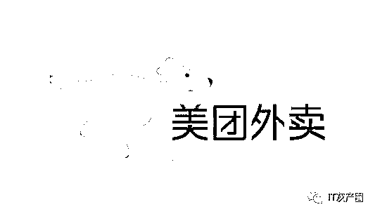
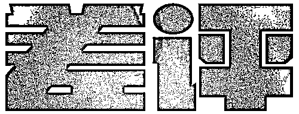
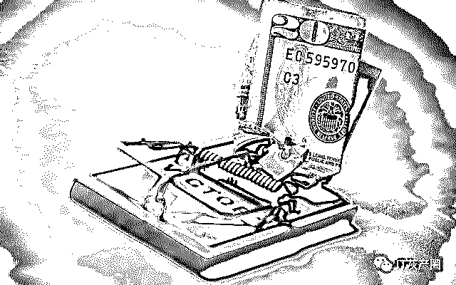
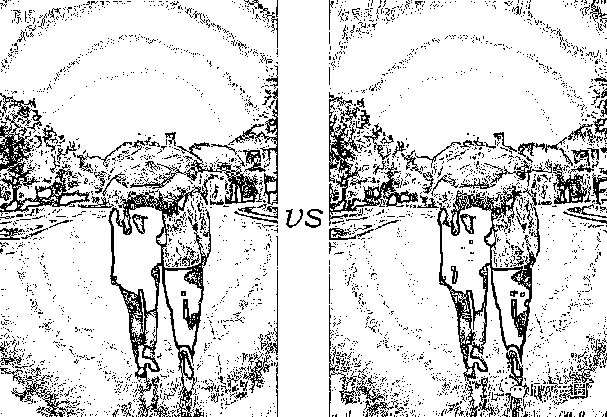
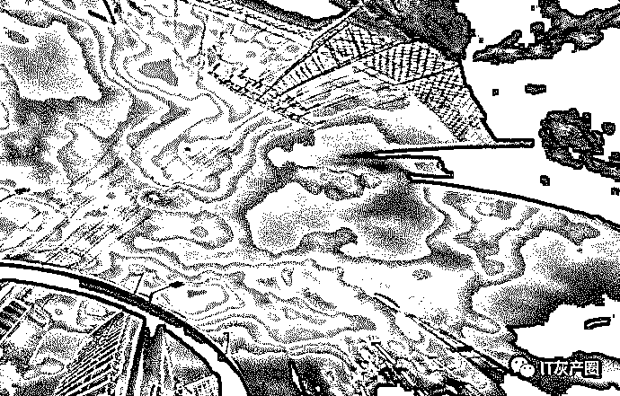
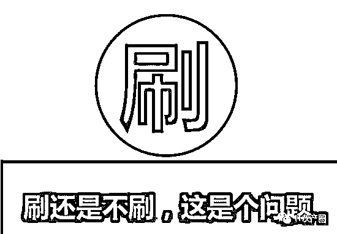

# 「刷单」，为何已经成为互联网行业发展的毒瘤？

> 原文：[`mp.weixin.qq.com/s?__biz=MzIyMDYwMTk0Mw==&mid=2247495029&idx=1&sn=d464cc839fedcbc59a2f170965b28c18&chksm=97cb264da0bcaf5b528a1d313a3ee17d8efcd41006ed350a73785adbc8d8758adf3a43be4174&scene=27#wechat_redirect`](http://mp.weixin.qq.com/s?__biz=MzIyMDYwMTk0Mw==&mid=2247495029&idx=1&sn=d464cc839fedcbc59a2f170965b28c18&chksm=97cb264da0bcaf5b528a1d313a3ee17d8efcd41006ed350a73785adbc8d8758adf3a43be4174&scene=27#wechat_redirect)

**点击上方蓝色字体免费订阅“灰产圈”**

导语

美团外卖怒了！

日前，美团外卖表示，对刷单、删差评零容忍，目前正积极收集相关信息源，将联动监管部门坚决打击灰产。如此举措是可以理解的，毕竟刷单、删差评已经严重影响到正常的互联网商业体系和生态。

数字的俘虏

打开淘宝、京东、美团外卖、滴滴、携程、去哪儿……我们早已习惯不管购买任何商品，还是选择任一服务，都会先看商家的好评率、售卖数量等，再做出是否消费的决定。被好评率、售卖数量等束缚消费理念的我们，实质上已经成为“数字的俘虏”。

如果好评率、售卖数量是真实通过商业行为积累的，那么自然值得信任。但刷单、删差评等灰色产业的肆虐，让这些数字变得尤为可笑。刷单，删差评等，已成为让互联网变为一潭浑水的毒瘤！

对信誉的疯狂需求，让灰色产业无孔不入

“在 XX 网上定了昆明的酒店，网上评价十分完美，居住舒适、交通便利、服务优秀。但没想到完全不是那么回事儿，酒店硬件和服务都太垃圾了！”

“看 XX 网上一条连衣裙卖出 1 千多条，评价都是说穿上有‘仙气儿’。剁手之后，没想到色差那么严重，穿上还像大妈一样有中老年气质。”

“网上不是说这家餐厅超好吃吗？团购来了，发现菜少得可怜，味道更是一般！”

类似这样的抱怨、吐槽，我们早已见怪不怪。

我们在很多有高好评率的店家、商家消费时，总会遇到货不对版、服务较差的问题。就像经过化妆、美颜、滤镜包装出的大美女，真人却是丑到“见光死”。

数字滤镜

  

那么问题来了，为何商家乐于刷单、删差评，为自己蒙上一层云里雾里、让消费者分辨不清的“数字滤镜”？

首先，商家深刻了解现在消费者的消费习惯和消费理念。互联网上的商品和服务，既看不到，又摸不着。这样的“虚幻”特性，决定了消费者的消费习惯是通过好评率、售卖数量，判断是否下单、购买。商家如果在好评率、售卖数量方面没有上佳的“数字表现”，很难让消费者产生购买驱动欲。

为了让消费者对自家的商品、服务“一见钟情”，刷单、删差评成为最快、最有效的手段。海量看似美好、优质的商品与服务，通过大量刷单机构被凭空构造出来。而一个构建于好评率、售卖数量上的虚拟互联网商业生态圈，就这样被捏造、被追捧。

其次，由好评率、售卖数量等组成的信誉矩阵，决定着商家的“钱景”。据了解，刷单、删差评能够为商家直接带来经济利益。知乎网友“老斯基”就指出，在外卖行业，一旦某天某门店收到 1 到 2 条差评后，本来稳定的订单量会减少 10%至 20%。这意味着，一个日均五六十单的商家，可能会减少 5 到 10 个订单，对订单量带来严重冲击。

此外，差评不仅会拉低评分，还会对进店及下单转化率造成影响，甚至降低自然曝光量。由此一来，商家的竞价成本也会提高。而且不刷单的话，没有售卖数量上的支持，也不会被平台推至显眼位置，人气始终不高。为了最终的利益，商家自然会不断去刷单、删差评。哪怕冒着被平台封杀的风险，也要坚持下去。

我们认为，正是因为商家对信誉有着疯狂的追求，最终让刷单、删差评这样的灰色产业无孔不入。这场“数字游戏”，或许还会在很长一段时间内持续下去。

乌烟瘴气

刷单弊端显露，互联网一片乌烟瘴气

在我们看来，商家刷单、删差评是为了给商品、服务找到精准消费人群，并扩大自身的消费半径和覆盖范围。但随着刷单、删差评的常态化和肆虐，已对正常的互联网商业生态造成沉重打击。

就目前来看，刷单、删差评带来的弊端、后果已然显现。它们的存在，让互联网变成一潭浑水、一片乌烟瘴气。

首先，刷单、删差评渗入到衣食住行等多个行业，让信誉变得不再可信，对整个互联网的根基造成冲击。我们日常所接触的互联网，其已经覆盖生活的方方面面。

但如果电商平台的商品和服务经过了“虚假内容”的包装，又有什么价值呢？反而会让互联网变得不具可信性，让消费者大幅降低对其的依赖性。当互联网变得不再可信，其根基也有可能会被动摇。

其次，某些平台对这些行为“纵容”，一旦曝光，更加让消费者愤怒。我们不否认，大多数平台还是会对刷单、删差评进行严厉打击。

如去年双十一过后，阿里表示已通过数据技术主动风控识别出 2800 多个刷单团伙，联合执法部门，打掉傻推网、整点抢、牛刷刷、蓝天碧水、蓝天网等大型炒信平台。而今年美团外卖也对刷单、删差评零容忍，要对这些行为严厉打击。

但还有很多中小平台，为了用户活跃度、商家入住数、订单增长率等指标，对刷单、删差评睁一只眼闭一只眼。这些平台看似迅猛的增长势头，与刷单、删差评有着千丝万缕的联系，事实上也对互联网商业生态造成了一定冲击——让投资者、用户等都陷入“迷阵”。这样做，其实也会让自身陷入泥淖。如最近某二手车平台就被曝光销售量刷单，而这家公司如今已“摇摇欲坠”。

最后

最后，刷单、删差评提供了大量虚假信息。

此前一篇名为《电商刷单江湖：“每天 60 万刷手待命”》的报道称，部分商家在“双十一”前刷销量、刷好评，来提升商品在“双十一”的关注度和销量。

在刷单产业链条中，有平台号称“有 60 万刷手”，店家也要求“刷手”履行货比三家、假聊、收藏宝贝等要求，模拟真实交易以逃避平台监管。

如此庞大的刷单群体，必然会在互联网上产生海量的虚假信息，让商品、服务的优劣难以真实显现出来。对于消费者来说，他们要花费极多时间和精力去判断真假，由此产生极大困扰和不必要的成本。如此一来，以提供便利为主旨的互联网，与自身的本质、初衷被背道而驰。

世界著名的媒体文化研究者和批评家尼尔·波兹曼曾经提到，“毁掉我们的，不是我们所憎恨的东西，而恰恰是我们所热爱的东西。”

我们之前太过迷信于互联网上商家的信誉和那些数字，最终在疯狂刷单、删差评下它们变得再不可信。

而互联网，也由此“变了味儿”。或许，是时候对刷单、删差评的灰色产业展开雷霆打击了。

●[一分钟带你了解刷单诈骗的真面目！](http://mp.weixin.qq.com/s?__biz=MzIyMDYwMTk0Mw==&mid=2247494981&idx=3&sn=4e5eacdacd5cfa80c93c9e172f2eedab&chksm=97cb267da0bcaf6b47975049193c3fd30f0850f291f2d25405e8139bc57603f407d9d648b702&scene=21#wechat_redirect)

●[假数据、薅羊毛、刷单……“网赚”黑产正在掏空你的企业！](http://mp.weixin.qq.com/s?__biz=MzIyMDYwMTk0Mw==&mid=2247494277&idx=1&sn=b9568697d908ac74017f0011cee952d2&chksm=97cb21bda0bca8ab30acb961d1e51dbf8fe2a559de14eb07da8b19298f72773e1fa8b5a98604&scene=21#wechat_redirect)

●[支付宝发布年终“神反转”盘点：有人被盗刷 900 次？真相，究竟是什么？](http://mp.weixin.qq.com/s?__biz=MzIyMDYwMTk0Mw==&mid=2247494310&idx=1&sn=93c325d465f4bed00cdafaf77fa46253&chksm=97cb219ea0bca8883be930861573e9b32b95a05892114cf6f386e935ee00e0967cd0d412acd1&scene=21#wechat_redirect)

← 向右滑动与灰产圈互动交流 →

**阅读原文加入灰产圈高端社群**