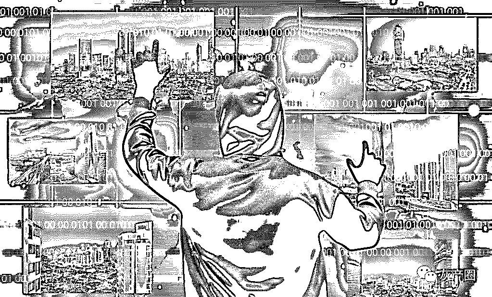
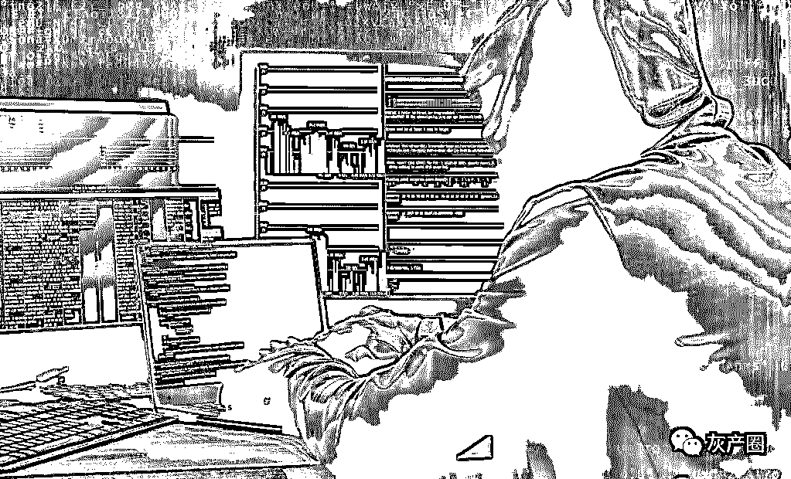
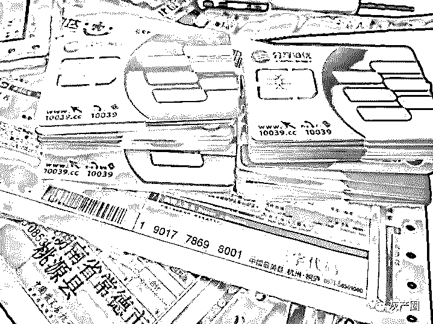
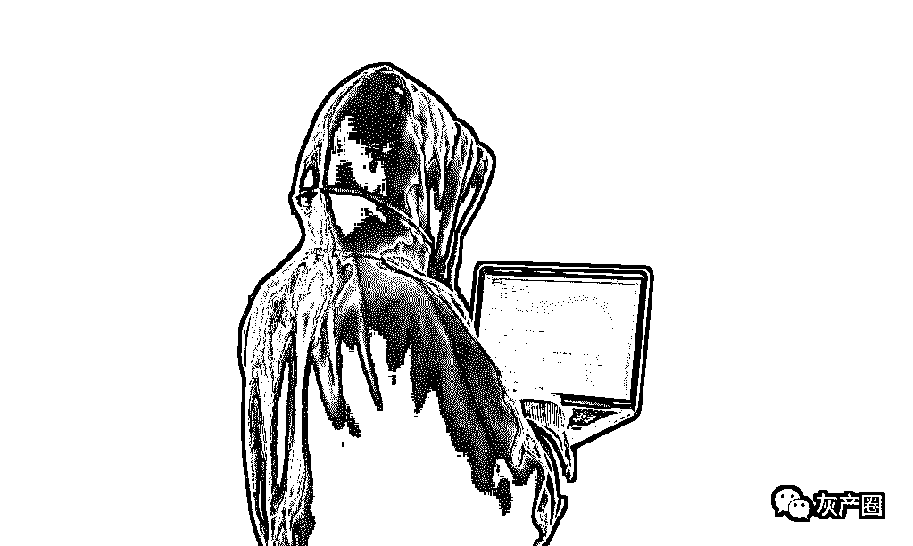
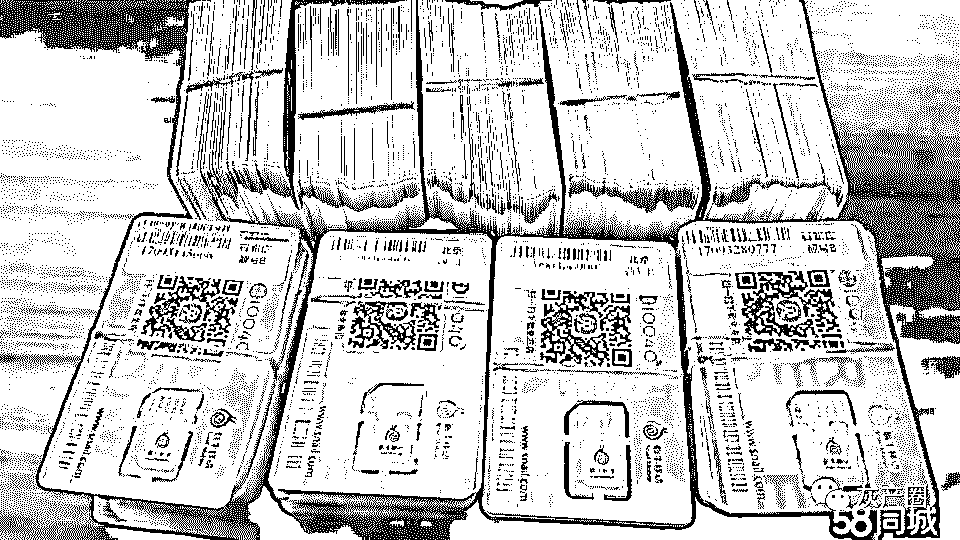
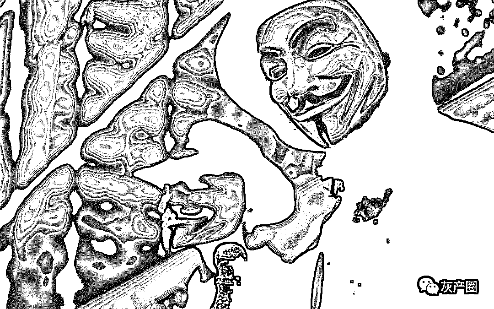
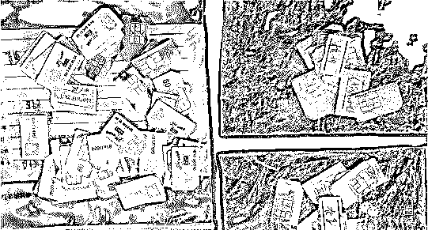
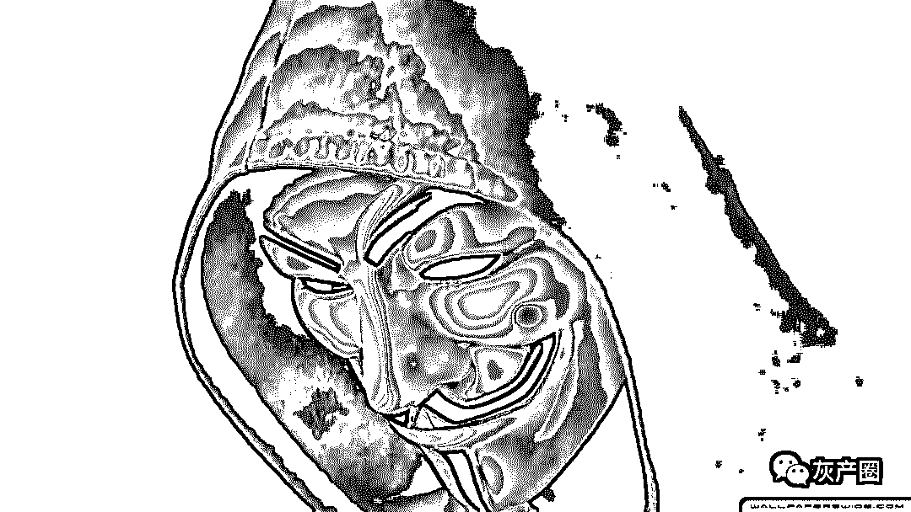

# 有人在“养”你的实名手机卡 ！

> 原文：[`mp.weixin.qq.com/s?__biz=MzIyMDYwMTk0Mw==&mid=2247495011&idx=1&sn=41eb57fedd97bd9cc60f9c0c29fe651e&chksm=97cb265ba0bcaf4df1b4648ec1577d5dc8781626cc6ee36dbcef05599644fca5452a96ec29d2&scene=27#wechat_redirect`](http://mp.weixin.qq.com/s?__biz=MzIyMDYwMTk0Mw==&mid=2247495011&idx=1&sn=41eb57fedd97bd9cc60f9c0c29fe651e&chksm=97cb265ba0bcaf4df1b4648ec1577d5dc8781626cc6ee36dbcef05599644fca5452a96ec29d2&scene=27#wechat_redirect)

**点击上方蓝色字体免费订阅“灰产圈”**

导语

为了牟取利益，利用客户到代办点办理业务机会，偷拍客户的身份证照片，非法盗取公民信息数据，违规办理手机 SIM 卡，并作为“商品”出售。

> 经江苏省淮安市洪泽区检察院提起公诉，法院日前一审以侵犯公民个人信息罪判处被告人徐兵有期徒刑一年零六个月，缓刑二年，并处罚金 6.5 万元；判处被告人李刚有期徒刑一年，缓刑一年零六个月，罚金 4.5 万元；判处被告人成芹拘役二个月，缓刑四个月，罚金 5500 元。

诈骗案牵出神秘“卖卡人”

2018 年 5 月，淮安警方办理了一起电信诈骗案，被害人杨先生被犯罪分子以公司大额采购为名连续实施话术诈骗，被骗 4.8 万元货款。“当时，对方冒充采购方多次打来电话联系‘生意’，使用的是淮安本地号码，和我经常联系的一些客户的号码非常相似，我以为是本地客户推荐的……”杨先生说道。

被害人报案后，警方迅速对案件展开初查，很快发现了诈骗人员的踪迹。随着案件的深入调查，警方竟从该案中意外发现了另一起侵犯公民个人信息犯罪案件线索。“在调查过程中，我们发现用于实施电信诈骗活动的手机号码就是本地号码，并且是犯罪嫌疑人从网上非法购买使用他人身份证办理的实名 SIM 卡。”负责该案的民警说道。

据了解，办案过程中，警方发现，在一些微信群、QQ 群中，有一群被称为“卖卡人”的特殊群体，他们专门从事实名手机 SIM 卡违规交易，为诈骗等犯罪活动提供“便利”，用于诈骗杨先生的两个手机号码，就是犯罪嫌疑人从网名为“白白”的神秘“卖卡人”处高价购得。

鉴于案件的复杂性，警方决定兵分两路开展深入调查，一组负责调查诈骗，另外一组负责调查“黑卡”。经过 3 个月的缜密调查，同年 11 月，警方在泰州将非法从事手机 SIM 卡交易的犯罪嫌疑人李刚（“白白”）抓获，并从其住处查获大量尚未完成交易的移动、电信等手机卡号。

根据李刚的交代，警方很快又在无锡将提供 SIM 卡的另一“卖卡人”徐兵抓获，并从其住处查获了多达 1700 多张 SIM 卡非法交易记录。

代办点老板偷拍资料办卡

“我主要在微信群和 QQ 群发布求购消息，一些代办点的老板为了赚取差价会主动和我们联系……”徐兵交代。按照国家关于实行手机实名制的规定，一个用户在同一家运营商办理的有效卡限额为 5 张，由此一个身份证可以在三大运营商办卡 15 张。

手机实名制推行后，电信诈骗、网络赌博等犯罪分子为逃避打击，高价收购手机卡作为实施诈骗等犯罪的作案工具，嗅出商机的徐兵开始主动在网上发布“收卡”信息，并与一些经营移动、联通代办业务的老板联系，让对方帮忙搞一些实名卡。诈骗杨先生的那两张卡就是徐兵从通过微信认识的代办点老板成芹那儿收来的。

“客户到代办点办理业务时，只要对方不注意，我就把照片和身份证信息留下来，借助这些信息再办几张卡留着，算上充在卡里的话费，加个几十块钱，就可以卖给‘收卡人’了。”当得知自己的行为已经涉嫌侵犯公民个人信息犯罪后，成芹后悔不已。

据查，自 2018 年初至案发，成芹非法盗取公民信息数据，违规办理实名 SIM 卡并出售给李刚、徐兵等职业“收卡人”，先后卖出近 200 张卡。

“黑卡”贩卖利益巨大

“手机 SIM 卡实名制后，电信诈骗、网络赌博等犯罪分子为逃避打击，以高价非法收购实名制 SIM 卡，使得类似盗销 SIM 卡犯罪活动日益猖獗，逐渐产生新的利益链条，由此引发侵犯公民个人信息等多种次生犯罪。”淮安市洪泽区检察院检察长 KK 谈到该案时说。

据 KK 介绍，网上非法买卖实名手机 SIM 卡被称为“黑卡”交易，不法分子获得“黑卡”主要有两种渠道

> 一是与移动、电信等通讯公司的“内鬼”勾结，利用“虚拟阅读”等黑客软件，篡改读卡器与设备之间驱动协议，避开二代身份证读取设备，自动生成虚拟身份信息替代真实信息，从而非法办理大量本需实名制认证的手机 SIM 卡；
> 
> 第二种则是通过少数经营手机充值等代办服务的个体工商户，利用客户到代办点办理业务的机会，在对方不知情的情况下，偷拍客户的身份证照片，非法盗取公民信息数据，违规办理实名 SIM 卡。

据了解，在手机 SIM 卡灰色产业链条中，有一种被称为“养卡人”的特殊群体。养卡人通过猫池（一种类似多卡多待手机的电子设备，市场上多流行 4G+8 端口或 4G+16 端口，分别可使用 8 张卡或 16 张卡）定期缴纳话费，保证号码始终处于正常状态。“养卡人”除了将实名卡用于买卖交易外，还从外卖订餐平台、电商、App、金融平台推出的优惠政策漏洞中获利。

2018 年 1 月，一度引起网上热议的“拼多多薅羊毛”事件，就是因电商平台充值话费业务存在重大软件漏洞，大量养卡人借助“猫池集中薅羊毛”方式，通过大量手机“黑卡”同时注册作业，批量盗取优惠券，再通过手机话费、Q 币等方式，短时间迅速转移和变现，由此导致“拼多多”在一天内损失近千万元。

最后

目前，针对手机 SIM 卡“灰色产业”犯罪暴露出的监管不严等问题，淮安市洪泽区检察院已主动联合工信、公安等职能部门，加大对买卖手机 SIM 卡等新型网络犯罪打击力度，重点严惩身份证卖家、实名卡卖家、养卡人等犯罪群体。同时，该院通过发检察建议等方式，积极督促相关职能部门认真履行监管职责，严格杜绝违规办理“黑卡”等行为，坚决清除“黑卡”滋生土壤，斩断市场需求。

●[黑产之源：从“实名漏洞”到“电信诈骗”，讲述“手机黑卡”的前世今生！](http://mp.weixin.qq.com/s?__biz=MzIyMDYwMTk0Mw==&mid=2247493575&idx=1&sn=0d759a0e54cf87e93f0eb4473c1c37c4&chksm=97cb2cffa0bca5e911c38bb7c3b729cddb90d92c65c9953c699c43368cdfdf812e8305e7c6a1&scene=21#wechat_redirect)

●[手机黑卡，这个仇我是记下了！](http://mp.weixin.qq.com/s?__biz=MzIyMDYwMTk0Mw==&mid=2247492373&idx=2&sn=5c7b3f848cfa8936882c4fcc244d04f6&chksm=97cb282da0bca13b06ddd90ac408a800fef7c9e9834a888b9e1455b361b898df094b2c1149fe&scene=21#wechat_redirect)

●[黑产大数据：手机黑卡调查](http://mp.weixin.qq.com/s?__biz=MzIyMDYwMTk0Mw==&mid=2247486704&idx=1&sn=229ee529ea0a4af176cff633fa7f7926&chksm=97c8c7c8a0bf4ede306c5e82e330f0ea6b4ed228511e7350f7a1ce99bc70e58e678d3cb997b4&scene=21#wechat_redirect)

← 向右滑动与灰产圈互动交流 →

**阅读原文加入灰产圈高端社群**