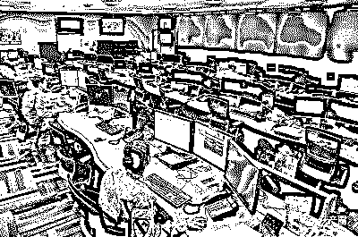
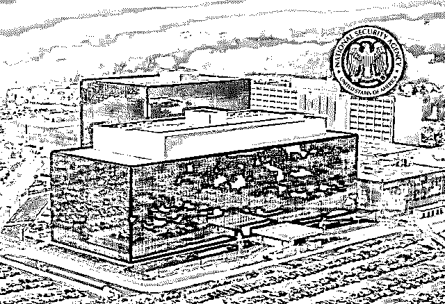
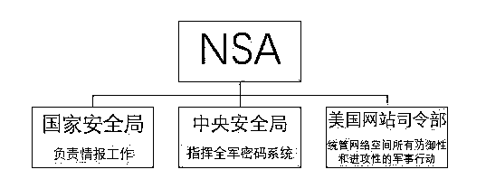
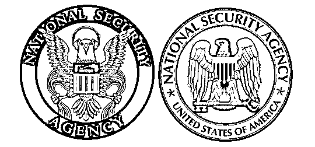
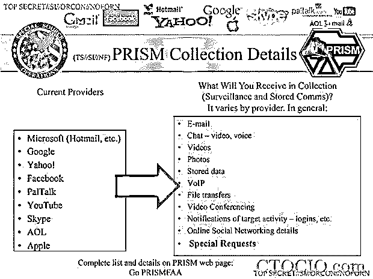
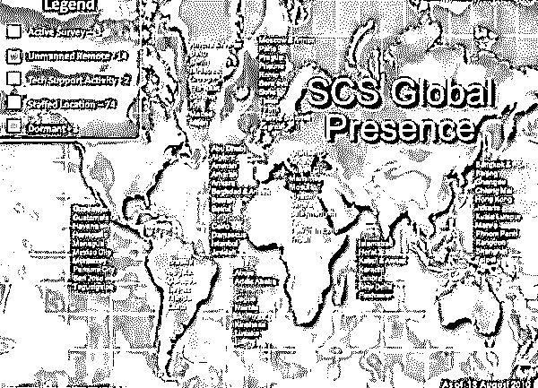
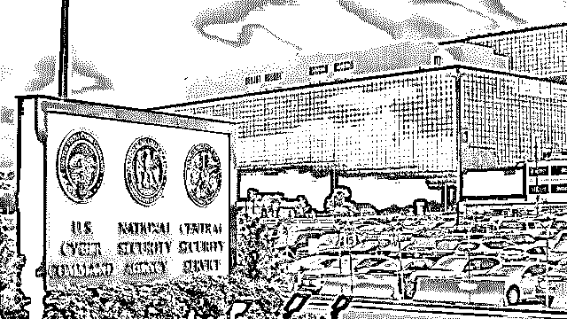
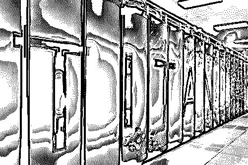
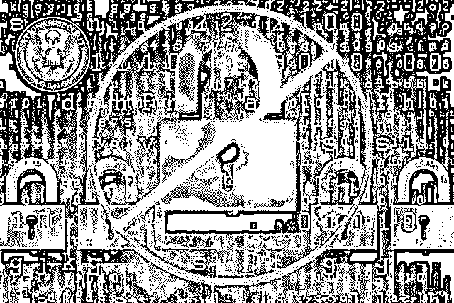

# 揭秘世界上最神秘的情报机构：监听的是整个地球！

> 原文：[`mp.weixin.qq.com/s?__biz=MzIyMDYwMTk0Mw==&mid=2247494981&idx=1&sn=406cfcd1ec4a3880890b1030b28bd4bf&chksm=97cb267da0bcaf6b947f5f8c3eee6706f123798c90efa57f839b6273b1284275bba349842eb7&scene=27#wechat_redirect`](http://mp.weixin.qq.com/s?__biz=MzIyMDYwMTk0Mw==&mid=2247494981&idx=1&sn=406cfcd1ec4a3880890b1030b28bd4bf&chksm=97cb267da0bcaf6b947f5f8c3eee6706f123798c90efa57f839b6273b1284275bba349842eb7&scene=27#wechat_redirect)

**点击上方蓝色字体免费订阅“灰产圈”**

导语

江湖上一直流传着情报界“四大门派”——克格勃（KGB），中情局（CIA），军情六局（MI6）和摩萨德（以色列情报及特别行动局）的传说，多少经典的荧幕故事都脱胎于“四大门派”之间的“恩怨情仇”，主角们传奇的经历引无数吃瓜群众向往之。

实际上还有一位山外之人，它手眼通天，功力更是超脱于四大门派，却低调、隐秘，今天我们就来说说这位主角。

“查无此局“

在巴尔的摩和华盛顿之间, 马里兰州一片森林的中心地带, 一座“情报之城” 藏身于米德堡的西边，它占地数百公顷，林立着数十座建筑物，数公里的道路穿插其中，这里就隐居着我们的主角——美国国家安全局（National Security Agency）。

1952 年 11 月 4 日, 美总统杜鲁门裁撤了武装部队安全局, 组建了国家安全局。新成立的国家安全局属机密单位，大权在握，享有超乎其他情报机构的地位。但它行事却异常低调，情报界人士戏称它的简称 NSA 为“查无此局” (No Such Agency)。

美国国家安全局（NSA）是“一套班子，三块牌子”。它虽然名义上是国防部下属的一个部门，但实际上则是一个直属于总统 、并为国家安全委员会提供情报的组织，在美国政府每天收到的秘密情报中，近 90%都是由 NSA 提供的，因此该局也一向有世界上最大的情报机构之称。

不同于美国中央情报局名声在外, NSA 在整个冷战时期都不为公众所知, 但其是它雇员更多, 预算甚至更高, 而斩获的情报也更多，可以说是美国保密等级最高、经费开支最大、雇员总数最多的超级情报机构，也是美国所有情报部门的中枢。

情报系统的数据向来不为人知, 自称“无可奉告局”的国家安全局更是如此。关于该局的预算规模, 外界仅能凭几点信息推算个大概。

在 2016 年, 国家情报局总监詹姆斯·克拉珀以国家情报计划的名义, 提交了 539 亿美元的预算申请, 而国防部以军事情报计划为由又为其申报了 179 亿美元的预算（也就是说 NSA 一家的预算就是全美 34 家情报机构的 3 倍之多！）。

除了预算，估算出国家安全局实际雇员人数也并非易事。据 2013 年美国预算草案透漏出的数据得知，NSA 拥有雇员约有 2.1 万人。仅就在编人数而言，NSA 几乎相当于美国其他 15 家情报机构人员的总和。

监听，一直是 NSA 的老本行。为了达到侦听世界的目的，NSA 不惜成本地将自己打造成世界上雇佣国别专家、人工智能专家、计算机工程师和数学家最多的情报单位。

在“9·11 事件”之后，美国国会通过《爱国者法案》，这个法案打着反恐的大旗，将监听范围予以扩展，覆盖了恐怖组织和极端组织。

虽然在“斯诺登事件”后，参议院在 2015 年通过了《美国自由法案》，但也仅对美国境内的信息收集进行了约束, 对 NSA 在国外开展的监视行动美国政府继续放任无视。这也让 NSA 的权力大到几乎可以摆脱任何规章的约束。

相比于官方局标，这个头戴耳机，爪扣电线的局标更加生动准确

监听整个地球

美国国家安全局的秘密一直被精心守护着, 小心翼翼地躲避着公众的好奇心, 但人算不如天算，最终这个秘密被爱德华·斯诺登同志“粗暴地”揭开了。

据斯诺登的资料曝光，NSA 是一个全球监视系统的主导者, 且是数据挖掘方面最领先的组织之一。该局拦截了大量的电话数据和电子邮件, 监视了“数千万美国人”。

为达成该目的, 它向 AT&T、威瑞森、贝尔南方(Bell South) 等美国大型电话运营商寻求合作, 向这些公司施压, 要求它们最大限度地转发途经美国的通信数据。

九大互联网 IT 巨头向 NSA 提供用户数据

监听器下无盟友，监控器前都平等，最亲密的盟友也没能躲过绰号“大耳朵” (big ears) 的“梯队系统”。数十个国家受到大规模监控, 法国、巴西、印度、德国等实行民主制的盟国也未能躲过美国的“隔墙有耳”。

比如, 美国始终监视着英国这个“最亲密”的盟友的通信——美国驻伦敦大使馆一直在收集着伦敦白厅街的数据，而白厅街是英国众多军政部门的所在地。

美国“监控门”事件引发“海啸”，华盛顿上千民众走向美国国会，对 NSA 的监控行为表示抗议。

2013 年 10 月, 欧洲乃至国际舞台的紧张氛围因一份 2006 年备忘录的曝光而升级。该备忘录明确提到, NSA 的情报部要求白宫、国务院、五角大楼等政府机构挖掘各自的通讯录, 向其提供外国政要的电话号码。

提供的政要电话号码进行了特殊处理，德国总理安格拉·默克尔、法国总统弗朗索瓦·奥朗德、巴西总统迪尔玛·罗塞夫、墨西哥总统培尼亚·涅托等 35 位政要受到了来自 NSA 的系统性监听。

默克尔总理对自己私人电话被窃听十余年一事深感震怒, 《南德意志报》一篇文章的标题——《好友冰凉的心》很能说明德国人心里的不是滋味。

默克尔是手机控，攻击德国总理的手机就像攻击德国政治心脏

根据斯诺登泄露的信息, 中国通信系统也受到美国的监视。NSA 曾渗透到中国大型科技公司的总部计算机系统, 并窃听其公司高层信息。2013 年 6 月, 中国大唐和中兴等公司发现，NSA 入侵他们的互联网路由器并访问了数千台电脑。

不久之后, 中国移动（7\. 35 亿用户）、中国联通（2\. 58 亿用户）和中国电信（1\. 72 亿用户）获悉, NSA 监听了他们的电话通信并窃取了短信数据。

一直以来, 中国常常被指责开展网络间谍活动, 而美国则公开宣称不搜集经济情报，俨然一副受害者形象, 而斯诺登事件及其后续一连串的曝光，使山姆大叔在国际社会上的信誉瞬间崩塌。

数字暗战

爱德华·斯诺登入侵了世界上最大的间谍系统, 并在两位严谨的职业记者协助下, 将窃取的信息公之于世，使得世人终于认识到了这个行动不受限制、透明度几乎为零的监控系统。

全世界人民一片惊愕, 他们没想到美国的监视规模竟是如此庞大, 更没想到自己也是目标之一。NSA 在国际通信传输基础设施上安装监听设备, 将经由网络传输的信息引向自己的存储站点, 收集互联网公司和电话运营商提供的用户信息。

人们发现监视项目无处不在, 它们吞噬着海量的数据和元数据, 然后加以存储、揉碎分析。

德国《明镜》周刊网站的短片显示，美国在全球约 80 个地点设有特殊情报搜集部，香港、北京、上海、成都与台北也在其中。

“大规模”和“无针对性” 数据收集, 也称为“钓鱼式” 数据采集，是指大量采集数据, 然后手动或自动搜索和检查可能相关或有用的信息。NSA 主要采取两种技术操作： 一是监控基础设施（上游监听系统）; 二是直接从运营商的服务器上收集数据（“棱镜” 监听系统）。

与上游监控系统相比, “棱镜” 计划更像是巨大的下游数据收集系统。它通过与联邦调查局合作, 进行实时监控和采集网络电话(IP) 语音信息。“棱镜” 监听计划直接从 9 家美国科技公司的服务器上收集数据。这些公司或是自愿或是被迫, 包括微软、雅虎、谷歌、脸书、网络聊天服务软件 PalTalk 、视频网络 YouTube、通信软件 Skype、美国在线和苹果公司。

所有的东西都可以是目标, 所有的手段都可以利用, 包括在最不起眼的产品上动手脚, 如魔兽世界或 Xbox Live 等网络游戏。NSA 可以访问联系人列表、通话记录、短信流、短信草稿, 以及 IOS、安卓、蓝莓等移动平台的定位数据。反正只有你没想到的，没有他们监控不到的。

除大规模监视方法外, 国家安全局还采取黑客手段, 开展“计算机网络刺探”，侵入并在运营商的计算机系统中植入恶意软件, 从而提取大量数据。

在这点上，比利时电信事件堪称教学案例。NSA 和英国情报部门联手， 以监视欧洲乃至全球时局为目标在比利时电信(Belgacom)的系统中植入恶意软件。2013 年 6 月, 这个恶意软件被识别出来，但此前，比利时电信公司对用户系统被入侵一事毫不知情，要知道，这家比利时最大电信运营商的用户包括欧盟委员会、欧洲议会、欧洲理事会等重要机构。

2014 年秋, 恶意软件已经感染了俄罗斯、沙特阿拉伯、墨西哥、爱尔兰和伊朗的企业、行政部门和研究机构。根据斯诺登泄露的文件, 美英情报部门使用了一种极其复杂的恶意软件——“雷金” (Regin)，“雷金” 伪装成微软软件, 对受感染的系统实施高级网络攻击并窃取数据。

霸权而偏执的 NSA 除了监听手机外，社交网络当然也不能放过。它每天兢兢业业地在全球范围内拦截近 50 亿个社交网络上的地理位置数据。

要知道，全球约有 69 亿移动手机用户, 约 30 亿人连接互联网。NSA 的机器人、存储器和分析软件面对如此庞杂的连接与通信, 需要处理的字节数量简直无法估量。

每天进行这么多的信号情报收集、数据挖掘,、监视、侦察、分析和反情报系统, 当然也需要越来越强大的计算机。于是，NSA 与能源部联合创建了一个研究中心———先进架构研究所。

自 2012 年以来, 这个研究所一直是具有惊人计算能力“泰坦” 超级计算机的所在地。不过在 2013 年, 中国超级计算机“天河二号” 打败“泰坦” 成为全球最快的超级计算机。

网络刺探，狩猎黑客，窃取数据，战场已经蔓延至网络空间，NSA 有一群逐渐深入“无声战争”战场的网络战士，为了打赢未来的数字战争，不断武装自我，希望控制第五个空间——网络空间。然后日子不再如过去一样容易, 斯诺登事件后，它再也无法在暗处悄然发展壮大。

斯诺登事件将作为一场危机被情报界的历史记录, 但也仅是其中的一场而已。

结尾

美国国家安全局身披坚硬的铠甲, 它是美国政府的武器, 其存在的必要性并未受到美国民众的质疑。自 1952 年成立至今，60 多年来，美国国家安全局为美国军政部门的决策提供了重要支撑。在此期间，NSA 参与了朝鲜、越南、阿富汗、伊拉克等地战争及打击“基地”组织、“伊斯兰国”组织等重大行动。

但这样一个权利滔天的情报机构如果失控会怎么样呢？且不说 NSA 的政治目的，就说它其实是由机器大军统治的，在 NSA 里人工智能优于人类智慧。随着 NSA 的发展壮大，“技术奇点”或许将不是一个空想。人类社会是否已做好接受这一事实的准备？

← 向右滑动与灰产圈互动交流 →

**阅读原文加入灰产圈高端社群**