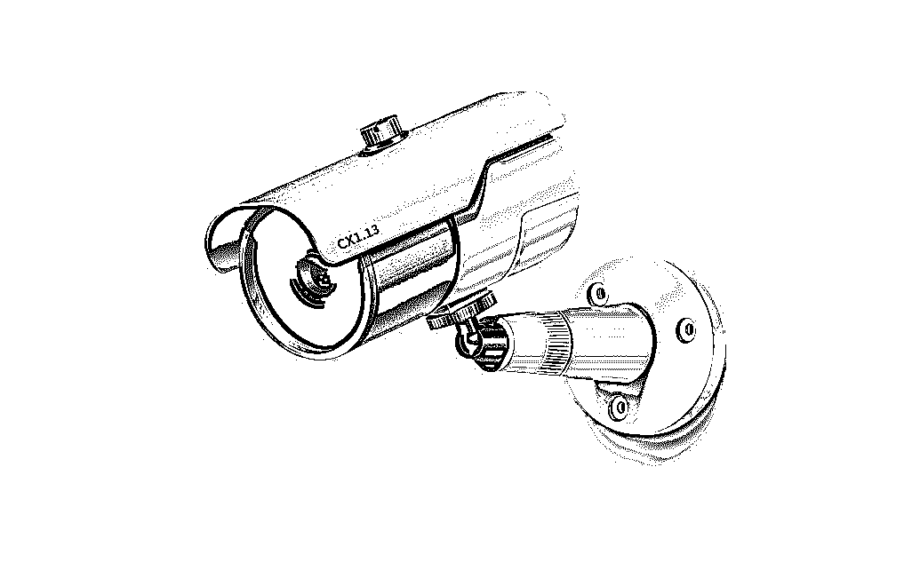
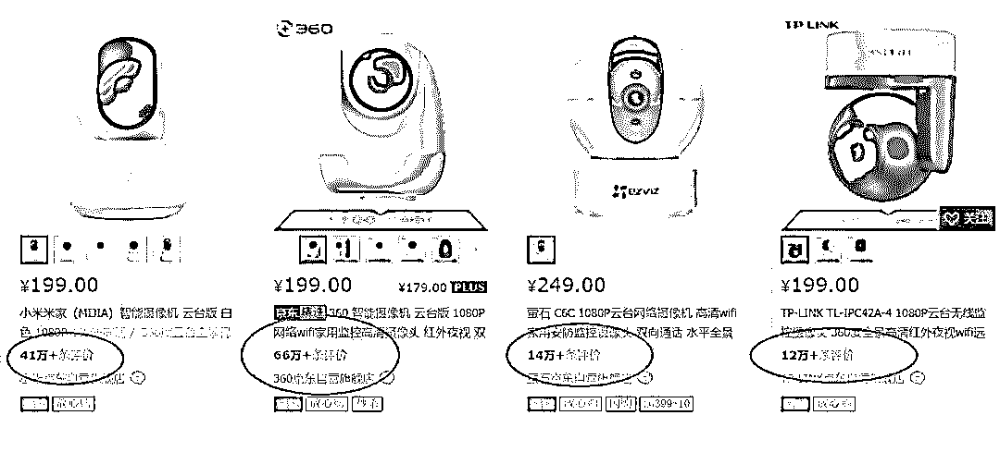
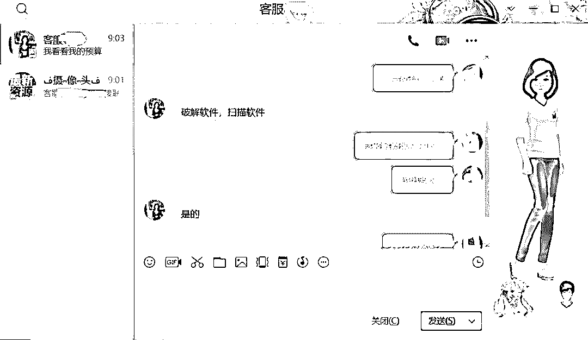
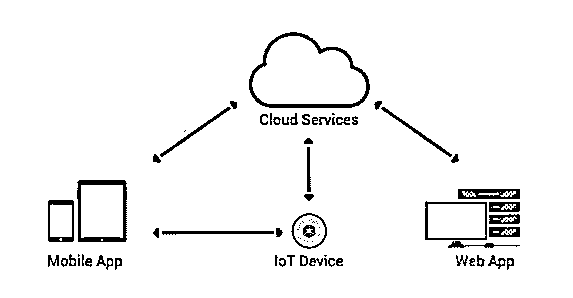
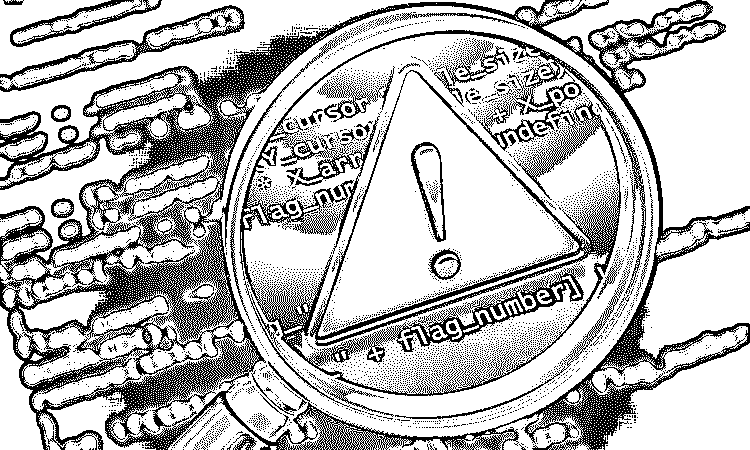

# 揭秘智能摄像头之下的“偷窥”灰色产业链，隐私何在？

> 原文：[`mp.weixin.qq.com/s?__biz=MzIyMDYwMTk0Mw==&mid=2247494697&idx=1&sn=44f4b323ae224e647b45e074d79a8467&chksm=97cb2711a0bcae0706ec85e1e4ce122ae53d7bab141f005a9705200f46529c9bd5cbaa44fa97&scene=27#wechat_redirect`](http://mp.weixin.qq.com/s?__biz=MzIyMDYwMTk0Mw==&mid=2247494697&idx=1&sn=44f4b323ae224e647b45e074d79a8467&chksm=97cb2711a0bcae0706ec85e1e4ce122ae53d7bab141f005a9705200f46529c9bd5cbaa44fa97&scene=27#wechat_redirect)

点击上方“灰产圈”关注我们~

**导语**

据质检部门统计，市面上的智能摄像头超过八成都存在安全隐患。

父母年级大了，独自在家安全吗？给孩子请的保姆是否尽心了？家里会不会遭贼？面对这些问题，只要在家安装个智能摄像头，再在手机上安一个相关 APP，就能随时随地查看家里的情况，实在是既简单又好用。

不过，据质检部门统计，市面上的智能摄像头超过八成都存在安全隐患，平时为房子“保驾护航”的智能监控摄像头，一不留神就会成为别人“偷窥”的帮凶。光鲜的宣传之下，一条完整的灰色产业链已经成型......

**繁荣市场下的“灰产”**

最近两年，随着物联网的加速进程，智能门锁、智能摄像头等智能安防设备作为智能家居的“入口”，早已成为“刚需”，进入千家万户。

统计数据表明，到 2020 年，全球智能安防市场规模高达 470 亿美元，其中购买智能家居的用户，有 60%则会通过智能手机连接智能摄像头来监控他们的房屋。

**父母年级大了，独自在家安全吗？**

**给孩子请的保姆是否尽心了？**

**家里会不会遭贼？**

面对这些问题，只要在家安装个智能摄像头，再在手机上安一个相关 APP，就能随时随地查看家里的情况，实在是既简单又好用。也难怪，某宝、某东上的相关产品如此火爆，种类繁多，鱼龙混杂。

图：某宝智能摄像头种类繁多

图：某东摄像头销量巨大

**不过，据质检部门统计，市面上的智能摄像头超过八成都存在安全隐患，平时为房子“保驾护航”的智能监控摄像头，一不留神就会成为别人“偷窥”的帮凶。** 

摄像头有这么多保密方式，比如：终端安全保障、信息传输保障、云平台数据加密等手段，还能不安全吗？

一开始我是不信的，直到亲身体验了一番，我才发现这是一条非常完善的产业链。只不过这次的智能摄像头“灰产”，比之前的 360 水滴直播更隐秘一些。

**“偷窥”的灰色产业链**

很难想象仅仅一个智能摄像头，会形成一条制造破解软件、售卖破解软件，再到售卖直播 APP、直播视频等完整的灰色产业链。

为了摸清是不是真有这么一条“产业链”，我决定先从人民群众“喜闻乐见”的某度开始，打开某度，搜索“摄像头破解”关键词，出现下面的一系列结果。

果然，还是原来的配方，还是原来的度娘，鉴于“某度”的口碑，就不多说了。随后，我根据以往的经验，从 QQ 寻找具体卖家，打开 QQ 查找页面，输入“摄像头”三个字，出来的商家还不少。

刚刚过完 20 周岁生日的 QQ 功能依然稳中有升。随便找到一个群加了进去，就有“客服”来兜售智能摄像头破解软件。

“客服”报价 150 到 200 元，真心要的话，量大还可以有优惠，真是一本万利啊。关键是这个软件，还能破解国外的摄像头。

我都没想到还能看到国外的“直播”，以为这就结束了么？还有相关的直播 APP 呢。 

图：直播 APP 截图

看图片右下角以及房间布置，应该是韩国的，“客服”还挺敬业。最后，客服 MM（不知道屏幕后面是不是一个抠脚大汉）还宣称，软件使用体验“犹如拥有上帝之眼”。

这还真是科技改变生活，是不是感觉人人都是“楚门”？

这种软件因何有市场？因为生活中，很多人类似“看”楚门一样，总喜欢“看”别人的生活，哪怕自己的生活一团糟。各种五花八门的直播平台，总是不缺看客。

竟然还有 668 个赞。

**鱼龙混杂的智能摄像头市场**

  

那么，这些家用智能摄像头是被怎么破解的呢？摄像头的 IP 地址是怎么落到别人手中的？为什么连同登录的密码也会一同泄露？

国家互联网应急中心高级工程师高胜表示，**用一些弱口令密码，做大范围的扫描即可。弱口令就是一些 user 或者 admin，许多消费者为了省事儿，根本没有修改出厂密码的意识。**

更夸张的是，除了家庭智能摄像头外，城市管理、交通监测的公共摄像头中，也大量存在使用弱口令便可以打开的隐患。

其实，这远不是摄像头第一次出事了。说到智能摄像头造成的安全事件，最有名的就要属去年十月 Mirai 病毒使得大半个美国互联网陷入瘫痪那次：黑客通过互联网控制了大量物联网设备，然后操纵这些“肉鸡”攻击了美国的多个知名网站，包括 Twitter、Paypal、Spotify 在内多个人们每天都用的网站被迫中断服务。

图：大半个美国互联网陷入瘫痪

事故原因调查表明，这些沦为“肉鸡”的物联网设备中有大量的 DVR（数字录像机，一般用来记录监控录像，用户可联网查看）和网络摄像头（通过 Wifi 来联网，用户可以使用 App 进行实时查看的摄像头）。

**这也从一个侧面显示**，******鱼龙混杂的智能摄像头市场是造成这种后果的重要因素之一，智能摄像头的门槛并不高，面对越来越热的市场，必然会涌入大量企业。很多厂商都没有十足的把握保证自己的数据绝对安全，商家对于隐私问题也只能是模棱两可的搪塞。**

360 曾经发布过一份《国内智能家庭摄像头安全状况评估报告》，在对国内近百个品牌的智能摄像头进行测试后发现，有近 8 成产品存在安全缺陷。

*   **传输未加密**：大部分摄像头采用 HTTPS 协议进行传输加密，但由于 API 接口配置不当，导致加密容易被破解。另外有一些摄像头使用 RTSP 协议传输，但是协议内容是明文传输的，这样只要把地址复制到一个支持 RTSP 协议的播放器内，就可以获得当前智能摄像头的界面。

*   **未存在人机识别机制**：在注册、找回密码等流程都需要人机识别机制来进行安全验证，但许多摄像头没有人机识别机制，或者人机识别机制存在于本地，导致用户密码可被强制修改。

*   **多数智能设备可横向控制：**在控制一个摄像头之后，通过逆向分析、网络活动分析等手段判断出控制设备的标识和指令，如果没有防重放参数就可以直播使用，然后根据一个或多个的设备控制标识预测出其它设备控制标识，从而横向控制大量智能设备。

*   **客户端没有安全加固**：大量摄像头 app 没有进行混淆、加固，可以被轻易的逆向分析出源代码。

*   **代码逻辑设备有缺陷**：一些代码设计缺陷也可能造成设备被控制，比如验证码生成，一些开发者为了节省资源，将生成机制放在本地，有的甚至可以直接看到验证码，有的则可以暴力破解。

*   **缺少远程更新机制：**设备有漏洞就需要更新来补上，但很多摄像头都没有远程固件更新机制等等

这些问题可能导致用户监控视频被泄露，或智能摄像头被恶意控制等种种危害。

**为智能摄像头安全漏洞打“补丁”**

面对这种情况，也不用杞人忧天，百亿级的市场，岂能让一些“老鼠屎”给坏了。

**首先**，厂商是堵住隐私安全漏洞的第一道关。厂商不能只为市场竞争，削减在恶意代码防护、云加密、弱口令校验、访问控制等方面的技术安全投入，要做到防患于未然，防止安全事故的“灰犀牛”事件发生。

**其次**，应该尽快出台在家庭视频监控领域的信息安全技术标准，通过技术关口挡住窥探隐私的“不法之眼”。

**第三**，消费者应当养成安全使用摄像头的习惯，包括阅读用户协议、安全设置密码并定期修改、摄像头安装远离隐私地带等。“扫描器”入侵摄像头的方法和暴力破解类似，如果密码仅仅是简单的数字组合，很容易就会被这些软件破解。 

最重要的是相关部门要严格法治，一方面严厉打击叫卖扫描软件的行为，另一方面严厉打击盗取、传播和贩卖家庭隐私的行为。以及严格取缔质检不合格的智能摄像头厂商。

只有堵住泄露隐私的黑洞，才能让人们真正放心享受到科技进步带来的红利，而不是在摄像头下出现众多的“楚门”。

**结尾**

通过对相关安全人员咨询了解到，国内的一些大公司生产的智能摄像头的安全系数足以应对各种漏洞，只要用户正确使用智能摄像头，及时更新“补丁”，并定时更改密码，“硬破解”不会有任何结果。

最后，赶紧回去看看家里的智能摄像头是不是正对着卧室？

灰产圈提示您：摄像头百十种，安全是首选。贪个小便宜，隐私恐泄露。

●[19 元，35 位女性私照曝光：你的隐私，正在被人窥探！](http://mp.weixin.qq.com/s?__biz=MzIyMDYwMTk0Mw==&mid=2247494192&idx=1&sn=32cf1136aa68c50e55da3872d87c539f&chksm=97cb2108a0bca81e8ecbe034377b002f539db6963fb71bca0b0acff1aed6ee9332470e108806&scene=21#wechat_redirect)

●[网络黑产如何倒卖个人隐私？](http://mp.weixin.qq.com/s?__biz=MzIyMDYwMTk0Mw==&mid=2247483699&idx=3&sn=fed5285869d3525f7249841558023f49&chksm=97c8ca0ba0bf431da0edb1f00adbbb9119b4245c2387eca133c714c42339c1cc1d52705061f2&scene=21#wechat_redirect)

●[个人隐私交易黑市大起底：是谁在盗贩公民信息？](http://mp.weixin.qq.com/s?__biz=MzIyMDYwMTk0Mw==&mid=2247492647&idx=1&sn=07b195ad56c8bb4c466c1ff6f3ee64d9&chksm=97cb2f1fa0bca609fe8344d8f16ed9d7fa417bbcfc3eed420d8d8ed3261c84ca5b227a665ab4&scene=21#wechat_redirect)

●[越同意，越放肆！99.9%的 App 正在窃取你的隐私！中国人隐私不值钱？](http://mp.weixin.qq.com/s?__biz=MzIyMDYwMTk0Mw==&mid=2247492844&idx=1&sn=1527f27b182845af79c5d46fc58755b9&chksm=97cb2fd4a0bca6c205dc4c8b6ce28a1570edcec0ace210cc4e542bacf55b2f27e221a97b478e&scene=21#wechat_redirect)

   

**点击加入 ****灰产圈 | 高端社群**