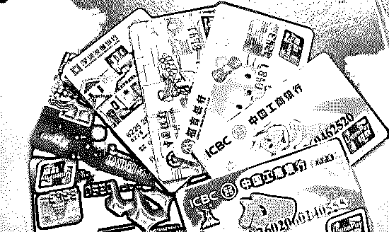
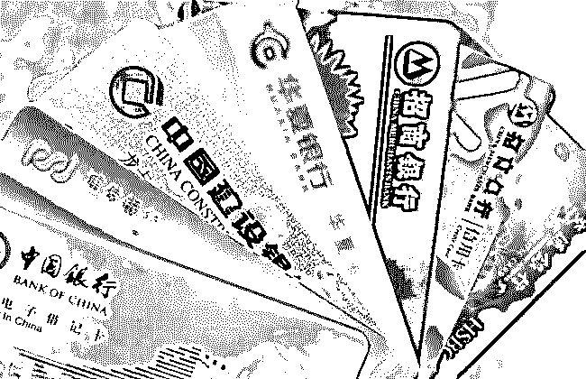
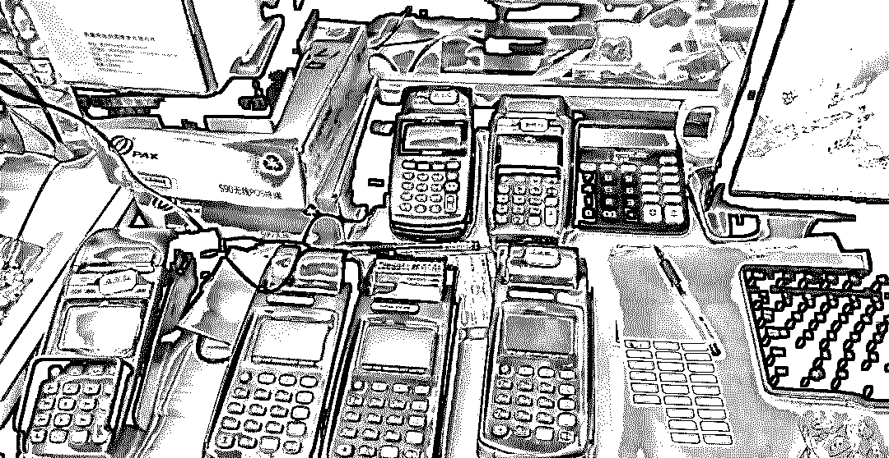
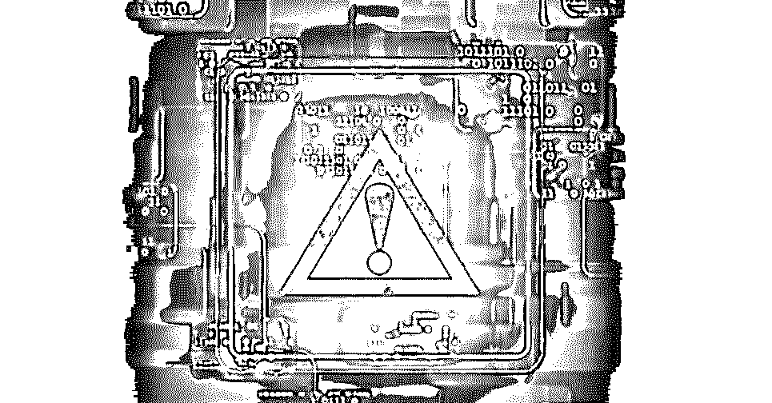
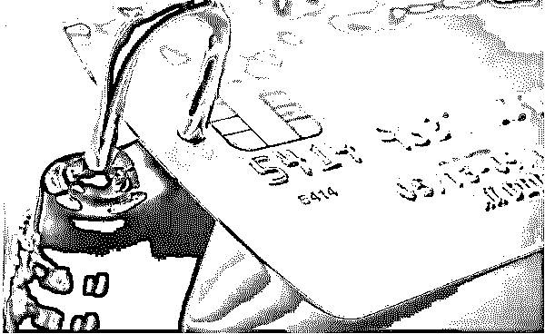
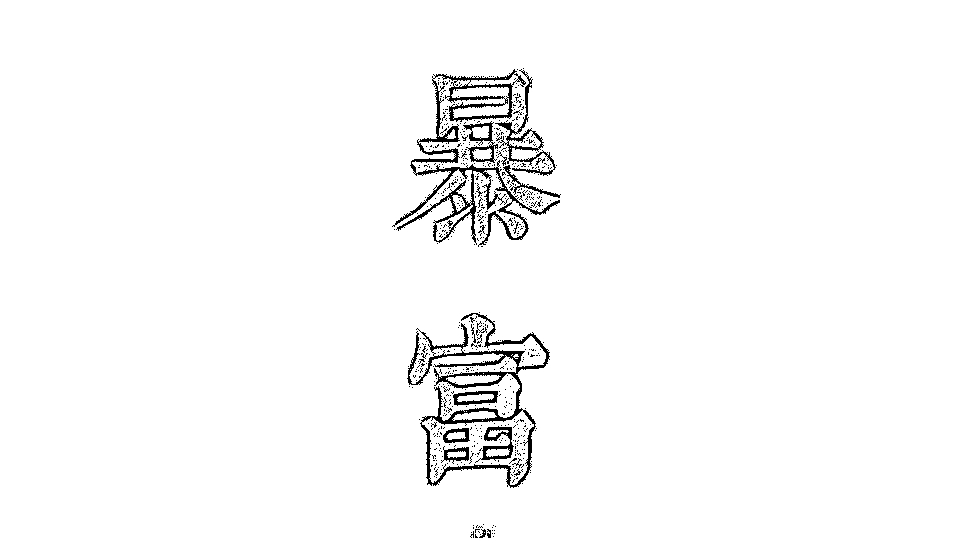

# 一群靠信用卡谋生的年轻人

> 原文：[`mp.weixin.qq.com/s?__biz=MzIyMDYwMTk0Mw==&mid=2247494618&idx=1&sn=714245df85718d02319a31a673a051c0&chksm=97cb20e2a0bca9f4388eb30e8085e70cc7d91dbe3b93205d15f3b0f0909ddba5bc4380a16fe7&scene=27#wechat_redirect`](http://mp.weixin.qq.com/s?__biz=MzIyMDYwMTk0Mw==&mid=2247494618&idx=1&sn=714245df85718d02319a31a673a051c0&chksm=97cb20e2a0bca9f4388eb30e8085e70cc7d91dbe3b93205d15f3b0f0909ddba5bc4380a16fe7&scene=27#wechat_redirect)

点击上方“灰产圈”关注我们~

导语

我们有些学员学会提额技术以后，就开始自己在报纸上挂广告了。

大家平常在报纸上看到这些有没有想过是怎么做的呢？呵呵，其实很简单，一层窗户纸捅破就没了，但没人告诉你，你永远不会知道！ ”

 kk 说道

“狩猎”篇

一群靠信用卡谋生的年轻人，平均年龄不超过 30 岁。

我们将各银行信用卡当做“狩猎”工具，通过 POS 机给信用卡刷出大量积分，或替人付账积攒积分，刷卡后兑换实物转卖。

我们是一个“系统”，有人出租自己的信用卡赚取租金，有人聚敛多人的信用卡刷出数千万积分赚取暴利。

我们与银行之间玩起“猫鼠游戏”。我们对信用卡的使用规则了然于胸，钻银行的“漏洞”。

做我们这一行也是有风险的，银行会通过内部数据监控异常信用卡，冻结其积分，停掉其 POS 机。

从法律上来说，对于规范套取信用卡积分的行为，目前存在法律灰色地带，所以我们这个行业就是个灰色行业，非常暴利！

我是理工科研究生毕业的，我有项特殊爱好：研究各个信用卡刷卡积分规则的“漏洞”，并从中赚钱，渐渐的我在这个行业有了名气，在信用卡江湖，有了名气就等于有了钱，可以说在当时，论技术在全国超过我的没几个。

不过搞的久了，也会出问题，就在 2014 年年底，我的很多信用卡里出现莫名欠款，从数十元到数十万元不等，这可不得了，我一直擦边，当时都按时还款了，绝对不可能出现欠款的情况，当时唯一的办法就是找银行内部人员了。

于是我找到了某银行的客户经理王某，他熟悉这些卡的扣款情况。这名某银行信用卡中心的客户经理于是和同事花费数月，调查了我这些卡的使用状况。结果是被他们发现我们的“虚假交易”赚取并出售积分，粗略估计获利上千万。

我终于明白了银行直接扣款的原因了，就是一种惩罚行为。不过我认为要惩罚，应通过司法手段，而不是像现在这样。在我们这个利益丛生的信息卡积分江湖，很多人都睁一只眼闭一只眼，但是我的金额太大，希望能和银行和解。

我们依靠刷信用卡发家的历史已有 10 多年了，在过往的日子里我们顶多会受到银行轻微惩罚，“一阵风过去，大家还是继续发财。”

不过这一切在近来发生了变化。

比如这次某银行将我们等人“刷”去的积分，变成信用卡账户欠款倒扣回去，否则我们去年起码还能多赚四五百万。

很多人可能会问我们是怎么做到的？其实很简单。

我有几十张某银行沃尔玛信用卡，但都不是我的，是通过各种关系租来的。这些卡给我带来巨额财富。

这些是 2012 年，某银行和沃尔玛联名推出的信用卡，该信用卡的积分，可在沃尔玛超市作现金使用；或在超市兑换成购物卡：每 20 万积分可兑换 1927.5 元的购物卡。

当时知道这个消息，我就嗅到赚钱的机会。假如手中有 5 张沃尔玛信用卡，一年能兑换约一万元的购物卡。再将购物卡打折出售，那将赚到暴利。

于是我发动身边的亲友，办理某银行沃尔玛信用卡。只要手中的卡越多，卡内的积分越多，便能兑换更多的购物卡，也能获利更多。

信用卡每消费 1 元，便有 1 分积分。我的卡透支额度只有 2 万元。但我的每张卡都刷有数千万积分。

之前的那位银行经理说我们进行“虚假交易”，其实我们没有“虚假交易”，都是真实的。我收来信用卡后，在网上联系各地“炒货”商家，用自己的信用卡替人付账。对方将资金打入我们的信用卡账户，由我们刷卡付账，以此获取积分。

比如说，某订票网站需要大量购买航空公司预付卡，每张卡 10 万元。我们通过为这家网站购买预付卡，每张卡给这家网站 500 元左右优惠，而我能获得大量积分。“这还不算最多的，有航空公司预付卡一张就是 100 万元。”

另外我们还帮超市炒货的“黄牛”付账。

超市有时会做活动，某个商品价格很低，于是就有“炒货黄牛”在超市大量购买，我们则为这些黄牛刷卡付账，并给黄牛折扣，这个付款过程又可积累积分。

我不会放过任何获得积分的机会。这样卡内很快就有几千万的积分。

为防止“恶意”兑换，某银行也设定门槛：一张信用卡一年最多只能兑换 20 万积分。但这并未拦住长期玩卡的我，很快我就发现了漏洞。

我发现，只要去某银行挂失、补办一张新卡，卡主名下的某银行积分仍可继续兑换沃尔玛购物卡。

替人购物，刷分，兑换购物卡，挂失，再兑换，挂失，再兑换……

理论上，可以无止境兑换下去。

从 2013 年以来，我们的数十张信用卡，每张卡最少兑换一两千万的积分，最多的一张卡兑换了 8000 多万积分，总共兑换的沃尔玛购物卡，价值达数百万元。

我拥有数十台 POS 机，信用卡变换着刷以赚取积分。

这些数千万积分的信用卡，意味着在一年多时间内，卡内的资金流最少达数千万元，在和银行的交涉中，银行要求提供这些刷卡积分的发票就可以免除扣款，但这些我们都没有发票。

因为有一部分积分是通过 POS 机‘刷’来的。

“POS 机”篇

什么是 POS 机？

POS 机是银联系统内的一种支付设备，供商户使用。刷卡消费后，钱款会转入商户账户。在国内，用 POS 机套现由来已久，只要做个信用卡的都很清楚。

按规定，向银行申请办理 POS 机，必须是商户，要提交法人身份证、营业执照、税务登记证，经银行考察核实，审批通过后，才会向其出售 POS 机。

但是，自从 POS 机由第三方公司代理后，很多代理商为了促销，对客户资格审查不严，以至个人都能申请到 POS 机。这些第三方支付公司的 POS 机，售价从百元至上千元不等。用身份证提交申请后，一般三个工作日就能到货。

我们申请了很多 POS 机，有来自各银行的，也有来自各第三方代理公司的。我有“一麻袋 U 盾”，每个 U 盾对应一台 POS 机，大约有上百台。

这些 POS 机连着我的银行账户。我在这些机器上刷信用卡，钱就转到自己的银行账户里。而后我再通过网银还款到信用卡，继续刷卡，以此循环。此过程并未有真实交易。

我的屋里摆满这些 POS 机，忙碌地刷分，这样可逃避银行监管。每台 POS 机一天刷卡消费都有额度，有的 20 万，有的 30 万。

而一张卡若在一台 POS 机上连续刷，会被银行追踪到，涉嫌虚假交易，从而暂停该 POS 机的使用。所以，我的信用卡，需要在几十台 POS 机变换着刷。

我们要通过 POS 机刷积分，也需支付手续费。行业不同，费率也不同，一般餐饮娱乐类行业为 1.25%，一般行业为 0.78%，大型超市则为 0.38%。

每笔手续费按照 7:2:1 的比例，7 成给信用卡所属的银行、2 成给 POS 机所属单位（第三方代理公司或银行）、1 成给中国银联。我们要刷积分，只能通过最低手续费的 POS 机才能赚钱，比如刷 0.38 费率的。

如果费率太高，我还能让第三方公司调码、套码，改为低费率机。

我的第一桶金是从转卖航空里程开始，两个多月赚了数十万元

当时感叹财富来得太快，如今我有宝马 X6、特斯拉两辆高级轿车，在招商银行享有贵宾室、私人银行等高端服务。“这样才能让亲友相信我的经济实力，放心将卡借我。”

我还找了几个合作伙伴，他们人脉广，能租借来很多信用卡，每张卡每月付 1200 元租金。我手中的沃尔玛某银行信用卡，一多半是合作伙伴借来的。

很多人问我这些都是谁教的，其实我都是自学成才，摸索出这条“生财之道”。

“漏洞”篇

10 年前，从天津大学理工科研究生毕业的我，第一份工作就是推销信用卡。从那时起，我开始了解信用卡，并成为“卡奴”。

刚毕业的我很快将信用卡刷爆，逐月还款的压力让我不断想办法赚钱，于是开始研究刷信用卡的技巧。

当时国内针对“信用卡套现”，国家尚未出台司法解释，我通过套现还款，养卡，逐渐了解信用卡的一些规则。

各航空公司和银行均有大量活动，我总能找到各种破解规则的办法。

虽然航空公司堵上了这个漏洞，但我发现，要获得航空里程并不难，用信用卡积分就能兑换，而信用卡积分又能通过 POS 机“刷”。我由此转向刷积分的生财之道。

在 2009 年 12 月前，信用卡套现尚未有明确法律约束，用 POS 机刷积分就更无人监管。

银行也只规定信用卡积分不允许给他人使用，但积分兑换成航空里程后，则能任意转让。

航空公司虽然在制定各种规则，弥补“漏洞”，但我都能找到破解办法。

比如中国国际航空公司规定，常旅客会员名下的航空里程，若要给他人兑换机票，需要通过审核，60 日才能生效。意思我就与票务公司合作，将那些经常乘坐飞机的“空中飞人”，早早地添加到航空公司审核名单中。这样给他们兑换机票时，就不用再等 60 天。

而南方航空公司规定，常旅客会员须有 3 次飞行记录以上，才有资格转让航空里程。我就安排信用卡主，一天在国内飞行四五次，达到航空公司的要求。

除了兑换航空里程，我发现，还有更多的信用卡积分活动，可以获得财富。

2013 年，某银行推出活动，储蓄卡向支付宝的余额宝充值能获得积分，一张储蓄卡最多可积 1 万分，100 万积分可兑换 800 元加油卡。

银行设计这个活动时，可能没想到一个人会每天申办 100 张储蓄卡。这 100 个储蓄账户一天循环向余额宝充值，就能获得这 100 万积分。

“3 个小时就能赚 800 元。”按照这种方法，几乎没有成本，就净赚 800 元，比上班强多了。

不过这个储蓄卡向余额宝充值获积分的活动，推出 2 个月后即停止，可能官方发现了这个漏洞。

“银行的活动是做不完的。”几乎每个银行的刷卡积分活动，我都能找到“漏洞”赢利。比如，有银行推出信用卡积分兑换星巴克咖啡。我当时一个月就刷出近万杯咖啡。“这些咖啡券就能换钱。”

我自己估算，这近几年仅靠信用卡刷分，获利有上千万元。

如今我已不亲自刷分，全由其徒弟完成。

“我现在收一个徒弟 10 万元，保证他一年赚 100 万。”因为我能交徒弟们如何利用信用卡积分去赚钱。

不过银行对信用卡套取积分有预警系统和专人监控，如果认定为积分兑换异常，这些积分则会被冻结或清零。

我一年玩银行 10 个月，也要被银行玩两个月。

以前最怕的就是积分被清零。”我们通过 POS 机刷卡也好，替别人付账刷卡也好，都有相应的手续费，去年我积累数千万航空里程被清零，一次损失就达数百万元。

其实对于我们这种刷积分行为，银行内部人员也知道，但一直没有合理相关法规进行约束。

2014 年 POS 机第三方代理大规模被处罚，因为发放套码机、向不符合条件的个人发放 POS 机，造成国内 POS 机市场混乱。一些人通过这些 POS 机“养卡”、“套现”非常普遍。

从去年年 3 月份以来，那些发放 POS 机的代理公司被处罚后，我们通过 POS 机刷积分也越来越难。

“原来一笔十万都能过去，现在一刷就会被封机、封卡。”以前，我们在代理公司那里申请到最低费率的 POS 机，刷一笔只需成本 0.38%。

“风控“篇

如今，POS 机审批越来越严格，不仅不再向个人开放，另外低费率机也监管得很严。

其实对于套现或套取积分，每家银行都有一套严密的预警系统，还会有专人监控。一旦有信用卡出现异常，马上后台就会报警，银行也会人工监测这些信用卡的刷卡记录。

这些风控措施一般都是基于大数据监控，由各家银行设定相应的指标来监测每张信用卡。一旦有信用卡出现异常现象，系统会自动报警，然后由人工重点盯防。如果被银行认定为积分兑换异常，这些积分则会被冻结或清零。

自 2013 年 1 月 1 日来，银行监控到多张沃尔玛信用卡用大量积分兑换购物券的情况，2014 年 7 月 15 日，银行对其中的二三百张某银行信用卡予以清算，将超兑的积分折合成款项，从信用卡账户中扣除。

这些有大量积分的信用卡银行判断为“虚假交易”产生，按照信用卡相关规定，银行有权扣回多兑换的积分价值。

我的这些信用卡只是某银行此次清算行动中的一部分。

> **虽然在 2009 年 12 月，最高法、最高检出台《关于办理妨害信用卡管理刑事案件具体应用法律若干问题的解释》，其中明确规定，使用 POS 机以虚构交易等方式向信用卡持卡人直接支付现金，数额在 100 万元以上的构成非法经营罪，数额在 500 万元以上则为“情节特别严重”，处五年以上有期徒刑。**

但要认定“虚假交易”取证很难，不可能去对每个 POS 机进行调查。

所以对银行直接从信用卡账户内扣款的做法，我当时认为，我们的行为是否违法银行说了不算，应通过司法机关解决。

最后和银行谈判的结果是银行首先让步，银行只要求我们等人偿还账户里扣款的 70%。“银行也考虑到我们等人刷积分所付出的成本。”银行也不想把事情闹得太僵。

我也考虑今后还要办理使用信用卡，不能和银行搞的太僵，便达成协议。

我们套积分来赚钱，是钻了银行和航空公司的“漏洞”。

结尾

以后，随着法律的完善，逐渐就没有空子可钻了，所以我们也正在转型，可能很多朋友没有信用卡或者没有接触过信用卡，其实，信用卡是我们普通老百姓获取资本成本最低的形式，无论你是创业还是上班，有了良好信用，就能获得大额信用卡，这样你就能短时间内具足理财创业的启动资金。

不过信用卡也是一把双刃剑，会玩的可以用它来不断生财赚钱，不会玩的因为贪心的缘故沦为卡奴。

在信用卡圈子里，如果你能够在办卡、提额、套利等环节占据一角，这辈子你也能够过得风生水起了

●[深度| 揭开重重迷雾，打开 “<em>套</em><em>现</em>”灰色产业的潘多拉魔盒：利欲熏心，<em>套</em>路重重！](http://mp.weixin.qq.com/s?__biz=MzIyMDYwMTk0Mw==&mid=2247489050&idx=1&sn=470dc89c01e4cba20a51cef1b5a21c40&chksm=97c8dd22a0bf543446473f665ea8a4d5a5088bf1ecdc786044d33f31486b8169c10fd910738e&scene=21#wechat_redirect)

●[支付宝发布年终“神反转”盘点：有人被<em>盗</em><em>刷</em>900 次？真相，究竟是什么？](http://mp.weixin.qq.com/s?__biz=MzIyMDYwMTk0Mw==&mid=2247494310&idx=1&sn=93c325d465f4bed00cdafaf77fa46253&chksm=97cb219ea0bca8883be930861573e9b32b95a05892114cf6f386e935ee00e0967cd0d412acd1&scene=21#wechat_redirect)

●[探秘银行卡<em>盗</em><em>刷</em>黑产："伪基站"群发，“木马”拦截，黑客“洗料”，“短信嗅探”，暗黑齐天，法力无边！](http://mp.weixin.qq.com/s?__biz=MzIyMDYwMTk0Mw==&mid=2247493780&idx=1&sn=288da1b308bc55276fcb623493cab254&chksm=97cb23aca0bcaaba3196e9c88e663091e18d0c1d91e2cdc6ac48cc858b2c4e48cf9f809b09a1&scene=21#wechat_redirect)

●[吓 skr 人：一夜清零，一无所有！GSM 劫持？短信嗅探？揭秘银行卡<em>盗</em><em>刷</em>灰色产业链！](http://mp.weixin.qq.com/s?__biz=MzIyMDYwMTk0Mw==&mid=2247492798&idx=1&sn=3de4adf3e559bde60f7b2b8d614a94ed&chksm=97cb2f86a0bca69049d22e974965dbbc09d9850f3abca5fc2aaf51feff4f9a1d173b6c0fd6de&scene=21#wechat_redirect)

   

**点击加入 ****灰产圈 | 高端社群**