# 深度|虚拟货币洗钱黑幕：几分钟转移资产，两年，9000 万美元！

> 原文：[`mp.weixin.qq.com/s?__biz=MzIyMDYwMTk0Mw==&mid=2247494513&idx=1&sn=3cacd15b4bcdc3c67a9130a715c31795&chksm=97cb2049a0bca95fe8dad4191bf8805fa407c3b167fd0d0c4a032e6749c7c6e41c01b89d0813&scene=27#wechat_redirect`](http://mp.weixin.qq.com/s?__biz=MzIyMDYwMTk0Mw==&mid=2247494513&idx=1&sn=3cacd15b4bcdc3c67a9130a715c31795&chksm=97cb2049a0bca95fe8dad4191bf8805fa407c3b167fd0d0c4a032e6749c7c6e41c01b89d0813&scene=27#wechat_redirect)

点击上方“灰产圈”关注我们~

导语

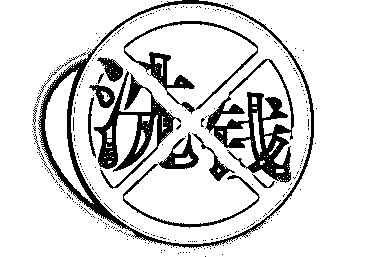

去年，美国一家专门研究区块链反洗钱的公司 CipherTrace 发布了一份数字加密货币反洗钱报告，数据显示在过去两年里，黑客将从交易所盗走的超过 12 亿美元赃款以及无法计数的线下赃款和赎金等数字加密货币通过交易所、洗钱服务提供商来洗白。

近年来，加密货币如比特币等出现了惊人的价格飙升，这不仅吸引了投资者，也吸引了投机分子与网络黑客。

仅仅在过去的两年中，一小撮极为聪明的犯罪分子就已经从各个交易所里盗走了价值 12 亿美元的加密货币。

交易所、赌博网站、廉价的区块链转账，让赃款可以快速地从黑到白，也让政府执法者难以追踪资产来源。

仅在 2018 年上半年中，加密货币犯罪就在 2017 年全年数量的基础上增长了 3 倍，这一趋势在未来还将继续扩大。

犯罪分子开始爱上比特币洗钱

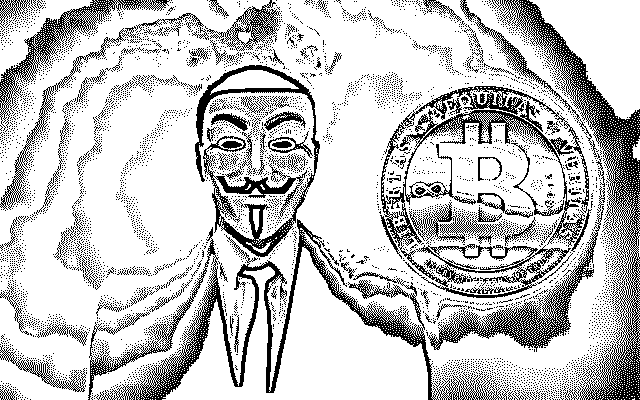

根据美国联邦调查局（FBI）的报告称，从 2015 年到 2017 年，与虚拟货币相关的案件增长了近 6 倍。

所有这些非法资金都被罪犯洗白了，只有这样才能帮助他们隐藏身份，避免身陷囹圄。

为恐怖主义大开方便之门

除了这些犯罪分子以外，我们还看到了有越来越多的恐怖主义融资和一些国家层面的犯罪活动也在使用加密货币，特别是比特币，多用来支付毒品以及武器。

罪犯分子往往都是新技术的早期使用者。因此 比特币和其他虚拟货币会引起他们的兴趣一点也不奇怪。

> **虚拟货币具有独特属性：加密货币交易不需要使用真实姓名、银行账号，这样犯罪分子就可以避开执法人员和其他调查人员的监控；犯罪分子可以在交易中使用假名，而且虚拟货币交易转账也不需要银行为其提供中介服务。**

此外，和真枪实弹抢银行不同的是，虚拟货币大盗们可以在毫不担心被抓住的情况下洗劫交易所。

全球监管机构重点关注虚拟货币洗钱行为

犯罪分子的青睐导致了虚拟货币盗窃与非法使用的大幅度增长，这已经引起了监管机构的注意。

世界各地的政府机构担心的不仅仅是虚拟货币盗窃与勒索对个人和企业造成的影响，还关注着虚拟货币会如何推动洗钱行为。

因为一旦加密货币从交易所中被盗出来，或者是从其他非法活动中却取得之后，网络犯罪分子需要将其重新注入到区块链系统中，清洗一番，然后才能将它们兑换出来用于现实世界之中。

对于通过区块链洗白的黑钱，执法者无能为力。

全球关注反洗钱

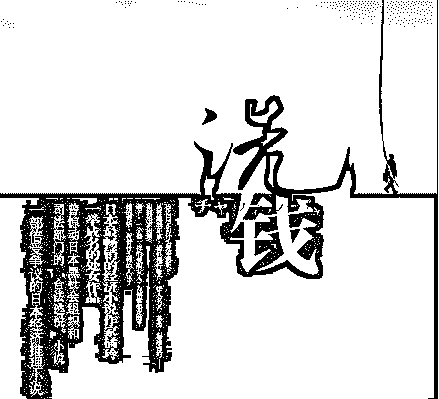

偷来的币必须洗干净才能用，引发全球关注反洗钱。

2018 年上半年被窃取的加密货币总数几乎是 2017 年全年总数的 3 倍，这些资金都需要被犯罪分子先清洗一番，以防止他们的身份被执法机构识破。

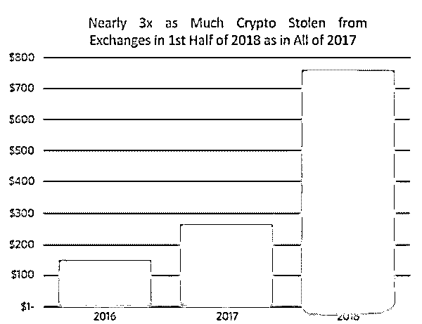

金融犯罪执法网络最近也表达了类似的担忧。过去的两年里出现了不少以加密货币计价的赎金支付，黑客也从交易所中窃取了价值 15 亿美元的加密货币。

> **美国财政部副部长托马斯•奥特(Thomas Ott)总结道：“我们已经看到了有数十亿美元的虚拟货币被用于可疑的活动。”**

美国特勤局(U.S. Secret Service)也在研究诸如门罗币和 Zcash 这样的加密货币是如何用于非法活动的，同时该机构还在敦促美国国会“考虑采取立法或监管行动”。

> **在 2018 年 6 月 20 日，特勤局宣布他们已经“在刑事调查过程中查获了价值 2800 多万美元的加密货币，其中有 12 笔 2015 年的查获款都是比特币形式。”**

该机构的副总干事在国会听证会上表示：

> “这是对美国是至关重要的，我们必须继续通过金融行动特别工作组等形式在国际范围推进对于数字货币的相关控制。我们还应该考虑采取更多的立法或监管行动，以此应对由匿名化加密货币带来的相关挑战，比如那些试图模糊区块链上的交易行为的服务以及使用搅拌器（mixer）和滚筒（tumblers）使资金进入加密货币矿池。”

美国政府的其他部门也在积极地寻求颁布新的法规对于加密货币进行约束。

> 在最近的一次国会听证会上，北卡罗来纳州的众议员罗伯特·皮滕格(Robert Pittenger)称非法使用加密货币是“美国国家安全面临的最大威胁之一”。

美国联邦调查局（FBI）指出，在 2017 年互联网犯罪中心收到的相关报告中涉及的虚拟货币价值已经达到了 5830 万美元。

这些虚拟货币通常被网络勒索者要求用于支付赎金，一般是以比特币的形式支付。

该机构还指出“以虚拟货币作为支付方式之所以经常被网络敲诈勒索所用，就是因为它给犯罪分子提供了额外的匿名保护。”

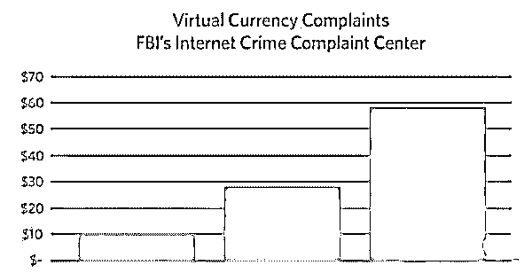

虚拟货币是怎么洗钱的？

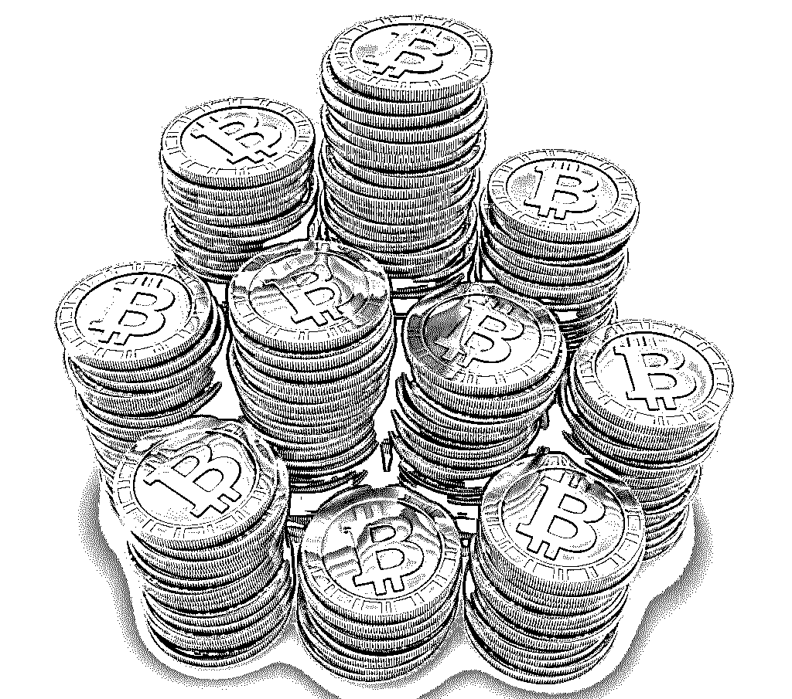

隐藏赃款的非法来源，即我们俗称的洗钱。

犯罪分子在洗钱方面也是下了大功夫，而且其技术与手段也是与时俱进。

加密货币时代的洗钱与黑手党时代可完全不同了，黑手党当年买下了多家洗衣店（洗钱 laundery 一词的来源），将赃款与合法的商业收益混在一起，以此来掩盖自己从组织卖淫活动和走私酒中获取的非法利润。

而随着越来越多加密货币大盗的出现，有越来越多的加密货币被恐怖分子、勒索者、身份窃贼、毒贩、军火商和人贩子所用，这开启了一个高科技虚拟洗钱新纪元。

不过不同于现金，想要把这种加密货币赃款洗干净过程稍微复杂一些。

**虚拟货币洗钱的第一步就是分流（Layering）。**

在传统的洗钱过程中，这一过程会涉及到将赃款用于购买昂贵的物品，如金条、汽车、珠宝或房地产，然后再把这些东西转售出去。

在虚拟世界里，这一过程涉及了将虚拟货币转移到加密货币系统中，通过使用搅拌器（mixers）、滚筒（tumblers）（注：Mixers 和 tumblers 是指用不同的地址和交易记录取出一组比特币然后返还另一组同等价值的比特币）以及区块链将其来回转移。

如何洗钱？

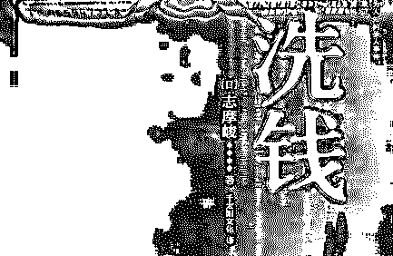

一转到新地址

首先，犯罪分子会将偷来的比特币转到由洗钱者拥有的地址上。这个地址仍然不够干净，因为它和受害者的地址有明显联系。

接下来洗钱者会把同样数额的比特币从其它用户那里转到犯罪分子手中的一个新的“干净”地址中。

不过洗钱者不会一次性把大额的虚拟货币转过去，因为这很容易引人注意，洗钱者会用小数额分多次将洗干净的虚拟货币转回去。

在洗钱中越是大额的虚拟货币越要小心谨慎，操作中会尽量延长每份之间的跨度。

这就意味着进入该系统的赃款越多，其转移的就越频繁，调查人员想要通过网络追查到路径的源头就越困难。

此外，虚拟货币的匿名特性也使得追踪这些赃款比最终现金要难得多。

值得注意的是，犯罪分子在转移这些虚拟货币赃款时会损失一个百分点，但只要最终这些资金变成合法的，这种损失也就是值得的。

二整合

洗钱的第二步就是整合，在将非法取得的资金注入加密货币系统之后，紧接着将其放在虚拟的壳中不断转移，犯罪分子离不受限制且相对安全地使用这笔不义之财又近了一步。

将这些赃款整合进主流的二级交易所、OTC 等加密货币金融体系后依然存在暴露的风险，因为参与加密货币交易活动的交易所与其他第三方会监控交易活动，并有可能发布可疑活动报告（Suspicious Activity Reports ），这就标志出了那些高风险交易。

虚拟货币洗钱五种模式详解

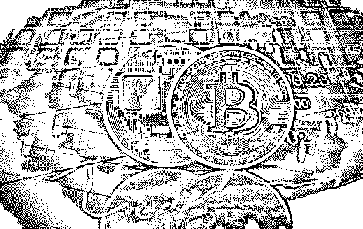

犯罪分子利用虚拟货币所具有的洗钱和恐怖融资风险，实施洗钱和恐怖融资的手段主要有以下五种方式：

一使用虚拟货币洗钱

虚拟货币的快捷性、不可撤销性及匿名性使虚拟货币成为犯罪分子青睐的洗钱手段。

网络犯罪分子和洗钱分子往往会利用诸如数字货币或电子货币的系统，这些系统会随着发行者的不同而具有不同程度的匿名性，而且通常提供及时结清，几乎不允许撤销支付；曾经被犯罪分子利用的系统包括（但不限于）电子黄金、自由美元、自由储备等。

二利用管理商和交易商洗钱

虚拟货币管理商和交易商在不同国家受到不同程度的监管。虚拟货币自身的国际性使侦测和调查犯罪收益面临挑战。

欧洲理事会网络犯罪全球项目和反洗钱与反恐融资措施评估专家委员会多次强调了这一问题。

事实上，以互联网为基础的支付服务提供商在反洗钱和反恐融资方面并未受到充分规制和监管，在运行层面存在薄弱的或根本不存在的监管控制，以及根本不存在的或不充分的制裁机制，对于国家和商家来说，均是一个重要的风险因素；对这些实体进行登记和监管所面临的困难之一便是即使存在登记和监管机制，也往往会存在登记国与运营国不一致的问题。

因此，在此模式下，犯罪分子会利用不同国家在规制和监管虚拟货币管理商与交易商方面的空白或差异之处而洗钱，虚拟货币管理商与交易商成为洗钱者利用的对象，但是并未故意直接参与洗钱。

另一种模式是管理商和交易商或其雇员成为洗钱的共犯，故意直接参与洗钱。

正如反洗钱金融行动特别工作组指出的那样，一些预付卡和互联网支付服务提供商或其雇员受犯罪分子控制，心甘情愿地或不计后果地协助犯罪分子实施洗钱和恐怖融资活动；

在此种情形下，诸如适当的测试的市场准入限制失效，或者无法适用于其管辖的实体。

总之，在此模式下，犯罪分子或者从法律上或商业模式上对虚拟货币管理商或交易商进行安排，要么选择在管理机制薄弱的国家设立管理商或交易商，要么选择利用位于管理机制薄弱的国家的管理商或交易商，从而达到利用其薄弱的监管机制实施洗钱的目的；或者与虚拟货币管理商或交易商共谋实施洗钱活动；或者利用虚拟货币交易商实现不同种虚拟货币间的多次转换，从而达到其隐瞒或掩饰非法资金来源和性质的目的。

三利用第三方注资

将点对点转账作为购买虚拟货币的资金来源，可能会允许第三方共犯为了清洗犯罪收益的目的而向虚拟货币账户注入资金。可能会使用钱骡为通过互联网清洗犯罪收益提供帮助。比如，钱骡银行账户收到来自其他网上银行账户的资金，然后或者将这些资金转移至其他账户，或者将这些资金取现，接下来利用诸如资金汇款系统或数字货币的另一手段将这些资金转移。钱骡为此取得佣金，这也是交易的一部分。值得注意的是，钱骡处理的资金可作为虚拟货币的资金来源。

事实上，第三方既可能心甘情愿地参与洗钱，也可能在毫不知情的情况下受到欺骗而充当了钱骡。招募毫不知情的钱骡通常采用的技巧是通过在招聘网站上登虚假就业岗位广告。这些岗位在界定职责时通常使用诸如“金融经理”或“在家工作”等字眼。

四利用虚拟货币的非面对面性质洗钱

大多数虚拟货币交易很少需要或完全不需要面对面的接触。这就使犯罪分子可能会将虚拟货币滥用于洗钱。这种滥用分为两种情形：

**一是犯罪分子控制了合法用户的账户，并用于从事交易。**

一方面，犯罪分子会破解合法用户的非虚拟货币账户，窃取其中资金，并用于向虚拟货币账户注入资金。正如反洗钱金融行动特别工作组报道的那样，在多起案件中，新支付方式工具被用于清洗源于身份盗窃的诈骗犯罪或通过计算机黑客或钓鱼方式盗窃银行账户、信用卡或借记卡中资金犯罪的非法收益；既然银行账户、信用卡或借记卡是以合法用户的名义持有的，那么犯罪分子就可以将其作为向预付卡或互联网支付服务账户提供资金的往来账户；

在此种情形下，新支付方式提供商既无法监测到交易事实上并非由合法用户发起的，又无法监测到任何可疑活动。另一方面，犯罪分子会破解合法用户的身份，并用于开立虚拟货币账户，然后将其作为清洗犯罪收益的中转账户。在一些案件中，犯罪分子利用窃取或虚假的身份开立新支付方式账户，并将其用作清洗非法收益的中转账户，或同时用于从事犯罪活动（如诈骗）和洗钱活动。

**二是利用新支付方式账户的非面对面性，主要是利用某些服务的匿名性从事洗钱。**

在有的国家，电子货币支付服务可以匿名使用。值得注意的是，电子货币在银行之外流通，因此远离银行监管系统。银行充当代理人，使资金进出电子支付系统，在某些情况下，充当了电子货币的发行方。但是，关于金融机构与虚拟货币之间交易的证据非常有限。事实上，越来越多的中央银行向用户发出了警告。与虚拟货币相反，电子货币（法定货币的数字形式）的使用当然在日益普及，但是这种形式的数字货币受到正式的金融监管系统的监管。

总之，与虚拟货币的非面对面性相关的洗钱类型可以分为两类：

一是利用某些虚拟货币自身所具有的匿名性，诸如比特币的去中心化虚拟货币自身具有较高匿名性，这主要是由于比特币地址和现实世界身份之间不存在联系；

二是利用可以向虚拟货币账户匿名注入资金的能力，无论是集中式虚拟货币，还是去中心化虚拟货币均可以匿名注入资金，这主要是由于交易关系的非面对面性以及可以由第三方承担注资的风险。

五
与其他洗钱方式结合洗钱

虚拟货币可与其他支付技术结合使用，特别是使用预付卡，将其作为资金来源，从而将多种洗钱方法并入清洗犯罪收益的过程中。互联网支付服务日益与各种新的以及传统的支付服务相联系，如今可以通过各种支付方式将资金转入或转出，包括现金、资金汇付企业（如西部联盟）、新支付方式、银行电汇、信用卡等。而且一些互联网支付服务提供商已开始向客户发行预付卡，允许客户通过全球范围的自动取款机网络取现。

和使用银行系统的传统洗钱机制有所不同，网络洗钱依靠各种类型的操作和金融服务提供商，包括银行转账、现金存取、电子货币、钱骡、资金汇付服务等。

因此，对于执法机构而言，侦测和追踪犯罪资金流动困难很多。通常由钱骡实施的现金操作往往会打破这种链条，钱骡有时还会紧接着使用传统的支付服务。如果各种支付服务与互联网支付服务相结合的话那么资金可以很快转换成几乎可以匿名转移至其他国家的电子货币。

虚拟货币洗钱行业巨大

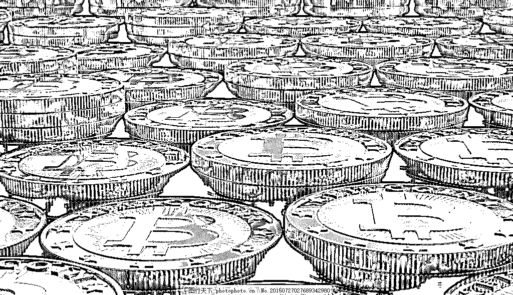

现在有不少团队和公司提供虚拟货币洗钱服务，在网上可以通过 mixer、tumbler、fogger、landries 等关键词检索到。

他们会从不同的客户手上收取资金，然后将他们混合在一起，再将混合后、洗白的资金还给客户。

这么做的目的就是要在区块链上把收款人和付款人的信息打乱，让人找不到来源和头绪。

这类洗钱服务一般会收取总额 1-3%的手续费。

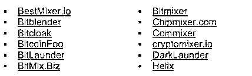

但是因为政府监管升级等原因，许多团队已经停止了这类服务，例如 Bitmixer 团队在 2017 年 7 月就终止了洗钱服务。

但是，CipherTrace 团队发现，这类服务正在通过社交网络等广告渠道宣传，以期获得更多新的客户来扩大收入。

虚拟货币洗钱服务需要服务方有大量的资金沉淀，例如有价值数百万美元的比特币或者其他虚拟货币，同时保持资金在不同的账户保存着。

在 2016 年和 2017 年，这些资金账户会组合在一起，多次转账从而隐藏收款人和付款人的信息。

到了 2017 年下半年和 2018 年上半年，洗钱服务开始对洗钱工具（虚拟货币）进行升级，使入金工具和出金工具脱离。

洗钱服务团队拿到黑钱之后会转入资金池，随后将资金池里的币转到交易所，之后在交易所的币之间周转，最后再用新的虚拟货币提走。

这种手段不仅可以降低转账成本，而且还可以利用国际交易所设置两道以上的国际查账障碍。

虚拟货币赌博也可以洗钱

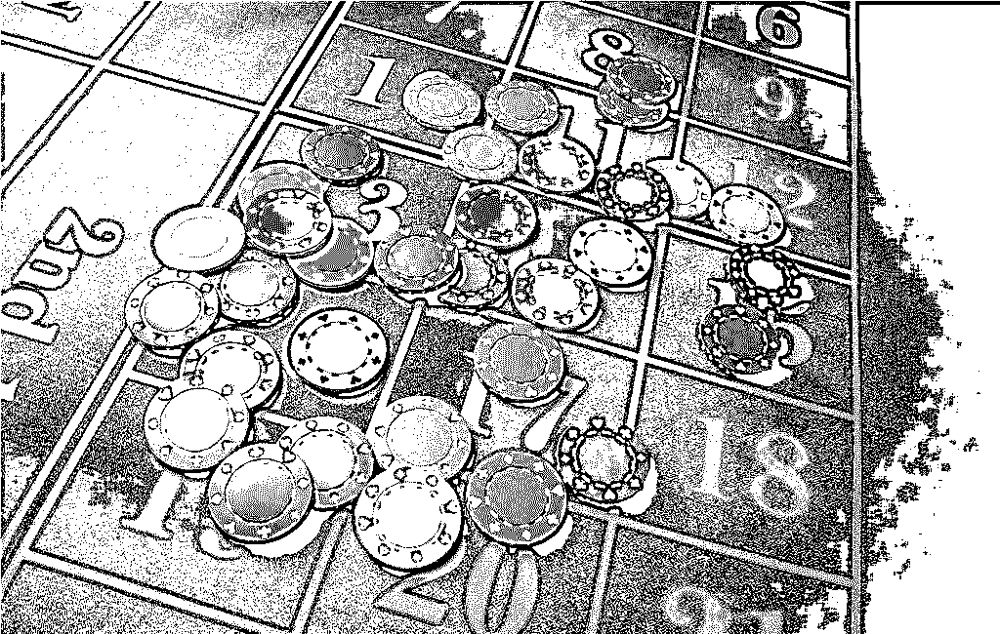

虚拟货币赌博也能实现洗钱，因此也越来越受洗钱者的欢迎。

现在全球有 100-200 家赌博网站可以用虚拟货币进行赌资支付。

犯罪分子在这些网站上开设账号，然后将资金转入账户，然后进行一些小额的赌博，有的甚至都不进行赌博的操作，随后提币到新的地址。

这样一来，执法者的追查路径就会断掉，效果和上面提到的差不多。

因为赌博网站都不需要求实名认证，不会进行 KYC，所以执法部门也很难知道到底是谁往赌博网站的账户里冲币、提币。

> **FinCEN 的凯文•奥康纳(Kevin O 'Connor)表示，加密货币交易所也必须纳入反洗钱控制的监管中，因为加密资产也可兑换成法定货币和其他金融资产。**

此外，当被问及离岸加密货币交易所和网络货币掉期交易平台 Shapeshift.io

的责任时，他的回答是，只要这些平台和美国客户打交道，他们就必须遵守美国的反洗钱规定。

美国财政部海外资产控制办公室（OFAC）发布了一份不允许美国公司与其进行商业活动的名单，名单中包括了个人、公司、网址、银行账户以及国家。OFAC 准备向这个列表中加入一些加密货币地址，进行关注。

> **FinCEN 曾经表示，交易所必须掌握自己的对手的情况，比如他们在哪些国家、他们是否已经在 OFAC 名单中。**

这个用意虽然很好，但是也涉及一堆问题，比如如何找到最好的技术工具与实践方式去甄别这些非法的交易活动。

结尾

虚拟货币相比于其他金融工具，对于洗钱者来说更便捷，他们不再需要找人用脏钱去购买黄金、购买实物然后再卖掉去换钱。

对于执法部门来说，发现洗钱行为也越来越困难，追寻资金源头和目的地也越来越难。

以前，FBI 的探员只要有了足够的情报，站在楼顶拿着望远镜就可以看到街头的人在换手资金。

但是在区块链上他们需要更专业的技术来打击网络犯罪，由此也产生了打击区块链金融犯罪的需求，执法部门需要“去-匿名化”的区块链技术来打击利用比特币、门罗币等虚拟货币的洗钱行为。

**如果你发现任何洗钱行为**

**请拨打 010-88092000 中国反洗钱监测分析中心进行举报！**

> **来源：**
> 
> ## **《两年洗钱 80 亿，交易所是黑客洗钱幕后推手还是受害者？》**
> 
> **《国际视域下网络洗钱犯罪防控策略研究》**

●[起底游戏、会员代充背后的洗钱之术，你可能是“帮凶”](http://mp.weixin.qq.com/s?__biz=MzIyMDYwMTk0Mw==&mid=2247494268&idx=2&sn=5abfed19e54ac11494fa97624cf56eb6&chksm=97cb2144a0bca852647c0286a33016db8cbfd920c9e45d983e4b0726a653ce99ec102aac5919&scene=21#wechat_redirect)

●[起底 Steam 背后黑色产业链&nbsp;:&nbsp;黑市、洗钱和诈骗，年产值十亿美金！](http://mp.weixin.qq.com/s?__biz=MzIyMDYwMTk0Mw==&mid=2247492432&idx=1&sn=8287cae2c3fe28530c4f274bff47523d&chksm=97cb2868a0bca17e129b1a7a177dab6e697b4530cffc47928ce2fdd00d6b8b6c5ec743112b44&scene=21#wechat_redirect)

●[致敬崔永元：揭开“阴阳合同”洗钱黑幕！](http://mp.weixin.qq.com/s?__biz=MzIyMDYwMTk0Mw==&mid=2247491935&idx=1&sn=53ad63947e9aab0b4e1fa91a9bfa6a13&chksm=97cb2a67a0bca371a8f2acfa5f5a1ad14808fb516e4d5a2139efd3614c431550c2170251ae7c&scene=21#wechat_redirect)

●[血洗比特币：从天堂跌到地狱！](http://mp.weixin.qq.com/s?__biz=MzIyMDYwMTk0Mw==&mid=2247494044&idx=1&sn=19da6025120f4c2495d9b61043054486&chksm=97cb22a4a0bcabb2ea09efabc3c2866801fc98b728214d6d35843037554e3eba5728617841f0&scene=21#wechat_redirect)

   

**点击加入 ****灰产圈 | 高端社群**