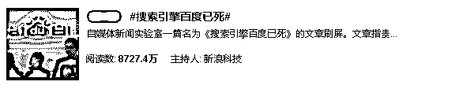
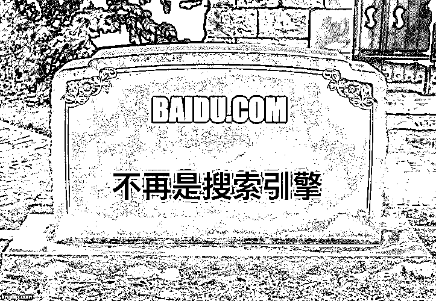
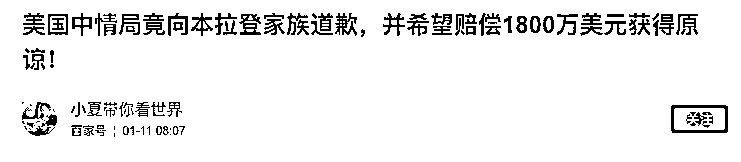
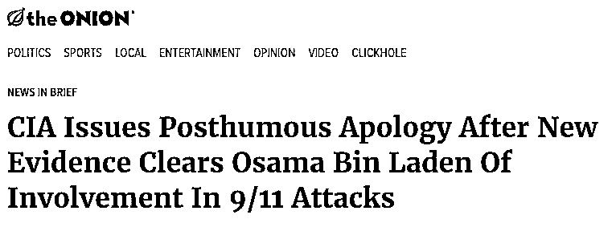
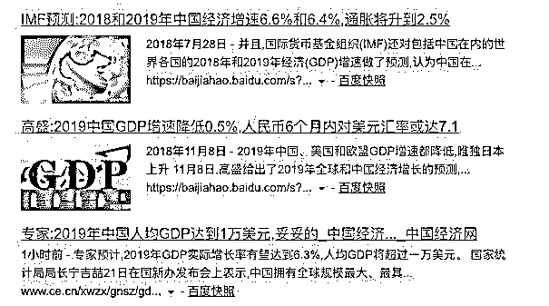
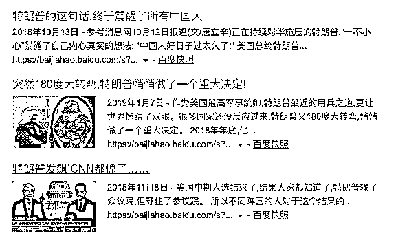
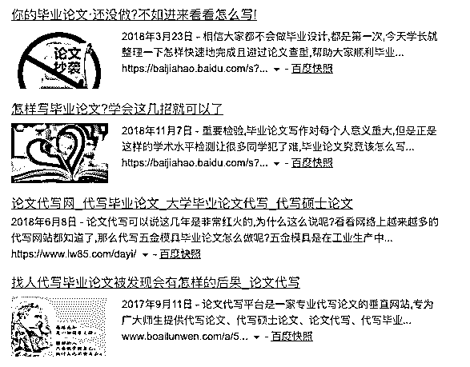
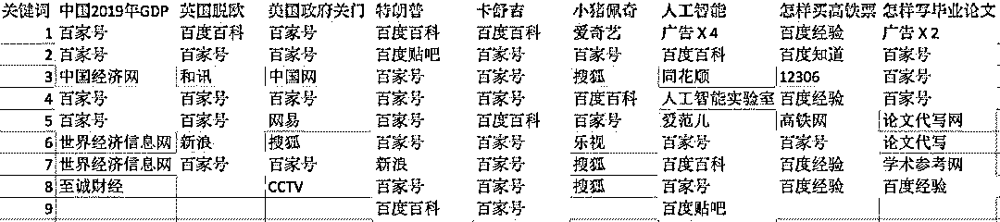
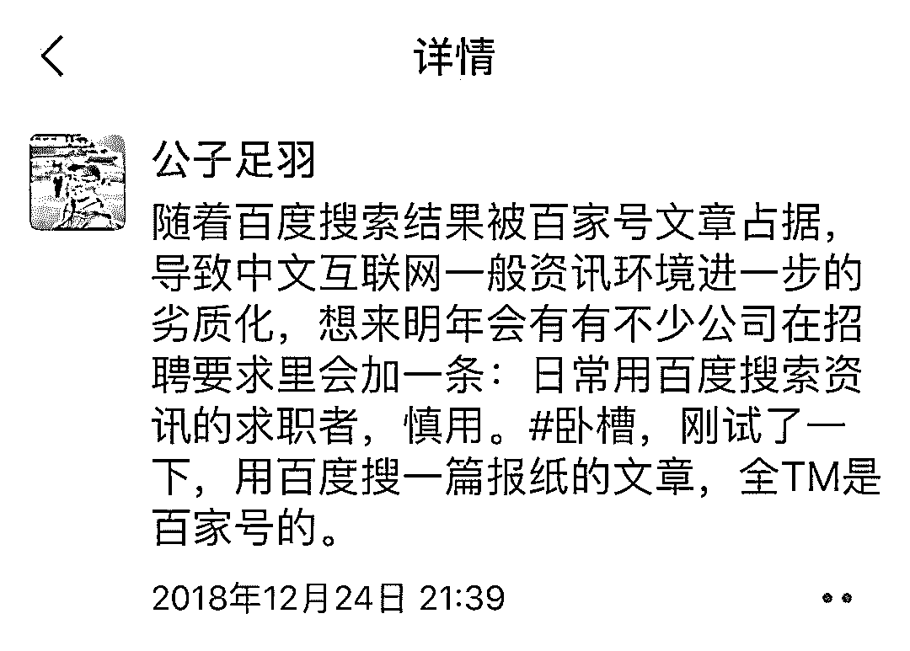

# 搜索引擎百度已死

> 原文：[`mp.weixin.qq.com/s?__biz=MzIyMDYwMTk0Mw==&mid=2247494486&idx=1&sn=e43469b4e6698a5476ec179aa5d43242&chksm=97cb206ea0bca9780efb27e89a5ee7b527bd6e40893fc1d762935584a63941bb841fdd4d4bd1&scene=27#wechat_redirect`](http://mp.weixin.qq.com/s?__biz=MzIyMDYwMTk0Mw==&mid=2247494486&idx=1&sn=e43469b4e6698a5476ec179aa5d43242&chksm=97cb206ea0bca9780efb27e89a5ee7b527bd6e40893fc1d762935584a63941bb841fdd4d4bd1&scene=27#wechat_redirect)

点击上方“灰产圈”关注我们~

最近几天一篇文章上了微博热门#搜索引擎百度已死#

引发了 1.3 万人的讨论和 8727.4 万的阅读量

灰产圈找到文章原创作者：新闻实验室，了解情况。

以下为经授权转载的文章内容，请各位看官慢慢欣赏！

**行业**

互联网｜搜索引擎

**作者：方可成**

最近半年使用过百度的朋友，可能会注意到一个现象：**你在第一页看到的搜索结果，基本上有一半以上会指向百度自家产品，尤其频繁出现的是“百家号”。**

百家号是百度的自媒体平台，刚推出的时候曾经主打过优质作者和高品质内容，后来几经调整，现在成了一个以营销号为主体的内容平台——内容包罗万象，数量很大，质量堪忧。

随手举一个例子。昨天有朋友在微信上给我发来一篇百家号的文章，问我是真是假——

该文声称，美国中情局承认本·拉登和 911 事件无关，向其家族致歉。我搜索发现，这样的惊天新闻，原来是来自专门生产讽刺性假新闻的洋葱新闻。

目前，这篇刊登在百家号上的假新闻已经获得了超过 40 万的阅读量。

百家号的信息质量可见一斑。而百度正通过搜索框，不断地将人们的流量导向百家号。

如果你搜索最近的新闻，比如“英国脱欧”，第一页会出现 7 条结果，**第 1 条是百度百科，第 2、4、5、7 条全是百家号的文章，**只有两条导向百度以外的网站——第 3 条是和讯，第 6 条是新浪。

搜索“美国政府关门”，第一页的 8 条结果中**有****一半是百家号，其中包括第 1 条和第 2 条。**

中国 2019 年的 GDP 数据昨天公布，我现在（北京时间 1 月 22 日上午 10 点）搜索“中国 2019 年 GDP”，**第 1、2、4、5 条结果全是百家号，其中没有一条能告诉我最新的数据，**只有第 3 条中国经济网的结果是我要找的。

顺便说一句，为了排除可能的个性化算法，我是利用 Chrome 的隐身模式在登出百度帐号的情况下搜索的。

如果我们搜索重要的人物呢？比如特朗普。你会发现，第 1 页的结果分别是：百度百科、百度贴吧、百家号、百家号、百家号、百家号、新浪、百家号、百度百科。

这么多百家号的内容是什么呢？大家看标题体会一下。

再换一个人试试。搜索一下卡舒吉，去年被杀害的沙特记者、《时代》周刊年度人物。结果，**第 1 页全是百度自家的内容**：第 1、5 条是百度百科，其余全是百家号。

再来搜搜别的，比如“小猪佩奇”。第 1 条是百度家的爱奇艺，第 2 条是百家号，第 3 条是搜狐，第 4 条是百度百科，第 5 条是百家号。

搜索“人工智能”，先是一连 4 条广告，然后是百度百科，中间出现了三个其他网站（同花顺、人工智能实验室、爱范儿），然后是百家号、百度百科、百家号、百度贴吧。

如果我们想用百度解决日常生活中的问题，结果会怎样？比如搜索“怎样买高铁票”，前两条结果分别是：百度经验、百度知道，然后才是 12306 官网，然后是百度经验、高铁网、百家号、百度经验、百度经验。

如果我们想学习呢？试试搜索“怎样写毕业论文”，猜猜搜索结果是怎样？一上来就是两条论文代写广告，然后是百家号、百家号、百家号，然后是两个论文代写网。

**也就是说，你要么来看百家号，要么去找论文代写。**

总结一下我的实验结果，黄色背景是百度自家内容或广告：

一年前的百度不是这样，五年前、十年前的百度更不是这样。那时百度虽然也有各种各样的问题，但起码，它真的是一个搜索引擎，真的是你探索中文互联网的入口。你问它问题，真的能得到一些比较满意的回答。

但现在，**它已经可以改名为“百家号站内搜索”了。**

百度何以堕落如此？我们可以找到一些外部因素。由于近些年来**中国互联网愈演愈烈的分割和封闭趋势**，微信公号、微博、淘宝这些重要的平台都不向百度开放，我们能够从搜索引擎上找到的东西本来就是残缺的。

但最重要的，还是百度自身**饮鸩止渴的商业决策**。基本上，百度已经不打算好好做一个搜索引擎了，它只想做一个营销号平台，把希望来搜索内容的人全都变为自家的流量，然后变现。

这当然不是什么可持续的商业模式。当人们发现在这里找不到想找的东西，只会越来越少地使用它。百度的这个策略给我的感觉，就像在末日来临前拼命挥霍光财产。

在一家科技媒体工作的朋友足羽在朋友圈预测：2019 年会有不少公司在招聘要求里加一条“**日常用百度搜索资讯的求职者慎用**”。

作为搜索引擎的百度已死。Baidu.com 已经不是你寻找中文互联网内容的地方，而是百度自家的站内搜索；它将你引向的不是中文互联网中的优质精神食粮，而是囤积在自家的腐臭变质内容。

写到这里，很是悲哀：**偌大的中文互联网竟已堕落到如此境地，连一个搜索引擎都没有了。**

罢了。

●[开扒百度贴吧“戒赌吧”，看完刷新你的三观——触目惊心的赌徒日常](http://mp.weixin.qq.com/s?__biz=MzIyMDYwMTk0Mw==&mid=2247491415&idx=1&sn=b058a341a7218857c40a305ca2be3425&chksm=97c8d46fa0bf5d79f722f9fc56d9f8db634b689fc21f9f0b285c14f21d79b855ae28010d90e1&scene=21#wechat_redirect)

●[黑客雇佣市场｜带你走进“暗网”](http://mp.weixin.qq.com/s?__biz=MzIyMDYwMTk0Mw==&mid=2247494101&idx=1&sn=102a64dddf60d7e24490902d8255e598&chksm=97cb22eda0bcabfbcb73e54f8b9d02d9e4f04ec06038732e953a52c0ce5feebd5ab9673bfc22&scene=21#wechat_redirect)

●[真相调查|&nbsp;门罗币背后“暗网”世界：匿名，黑暗，暴利！](http://mp.weixin.qq.com/s?__biz=MzIyMDYwMTk0Mw==&mid=2247492562&idx=1&sn=6a29d8061a964e7ed31acc38e8a37db8&chksm=97cb28eaa0bca1fc7f162f825cb4229ee7802c115a841e9c06d6c8c9d7525ddff50d2d7430e4&scene=21#wechat_redirect)

●[深度调查|揭开“网络黑色产业链”的真实面纱，揭秘地下社工数据库的黑暗“艺术”！](http://mp.weixin.qq.com/s?__biz=MzIyMDYwMTk0Mw==&mid=2247489489&idx=1&sn=933747e2bd832aac617c9fa7b903dc3d&chksm=97c8dce9a0bf55ff0607a073861d66950a7f8231d5b46a0f9694c61dba15221d808c1b81a6ce&scene=21#wechat_redirect)

   

**点击加入 ****灰产圈 | 高端社群**