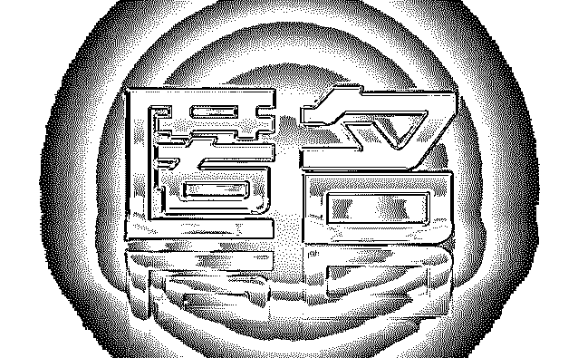
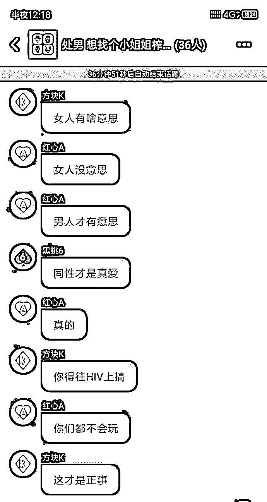
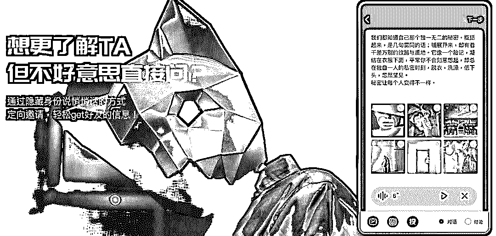
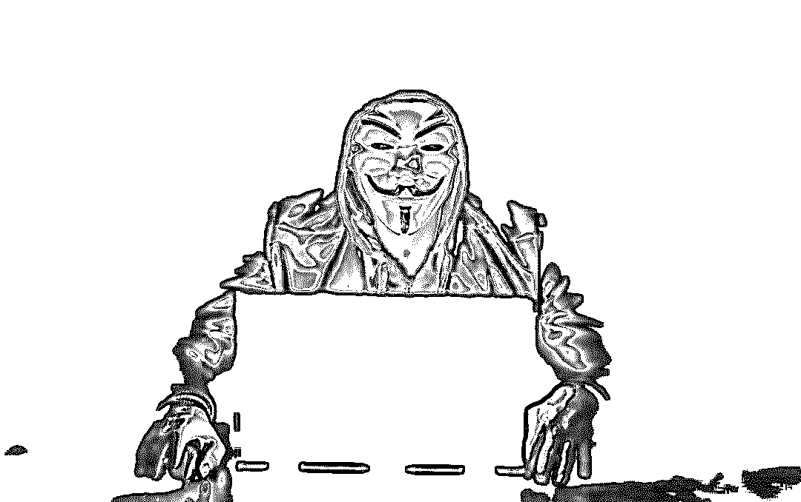

# 马桶 MT：被质疑是披着熟人羊皮的“暗网”？

> 原文：[`mp.weixin.qq.com/s?__biz=MzIyMDYwMTk0Mw==&mid=2247494433&idx=1&sn=a82d9aea53403d8b0d99c007c2aed6d8&chksm=97cb2019a0bca90f00296fb3cb749a72161eb9b13e9bada6fce076cf9b7363cedd7275586873&scene=27#wechat_redirect`](http://mp.weixin.qq.com/s?__biz=MzIyMDYwMTk0Mw==&mid=2247494433&idx=1&sn=a82d9aea53403d8b0d99c007c2aed6d8&chksm=97cb2019a0bca90f00296fb3cb749a72161eb9b13e9bada6fce076cf9b7363cedd7275586873&scene=27#wechat_redirect)

点击上方“灰产圈”关注我们~

导语

这是个完全匿名的聊天工具，不能加好友，不支持直接 1 对 1 聊天；

所有聊天都有通过话题发起，然后建立一个匿名群聊；

所有的群聊都是 1 小时后自动解散；

核心功能，匿名聊天+阅后即焚，服务器和本地不会有任何聊天存档；

马桶不会故意留存用户关系，只可关注，但是不能直接发起聊天，所有聊天好友必须临时从其它平台发起；

这款聊天软件解决了，私密话题聊天场景的问题，类似“借一步说话”对于一些敏感话题和交易很有用。

因此，知乎网友 Tiry 认为马桶 MT“会在两性、暗网交易、政治话题、隐私八卦等群体很有市场”，认为其是中国版深网聊天工具。如果不被强制监管，可能会在小众市场火起来。

匿名性很可能滋生的是阴暗

比如在暗网访问者通过浏览器的加密和反追踪技术，完全匿名地发送加密信息，很可能是抱着不可告人的目的。

比如，进行犯罪活动，例如贩卖毒品、武器、洗钱、走私品、毒品及违禁药品，暗杀；分享敏感（例如：维基解密，揭发政府或大企业内幕）或者盗版的文件；窃取电子商务网站用户数据库后，对个人信用卡信息进行贩卖；制作及出售色情影片、暴力影片；伪造身份证件、护照，策划犯罪活动。

在比特币（BitCoin）等不记名虚拟货币出现之后，暗网的交易活动变得更加简单：一切交易都可以通过虚拟货币转入匿名账户，而避免了从银行系统转账后被警方跟踪的风险。

**而在马桶 MT 是否会出现类似场景？**

目前下定论可能为时过早。另外，马桶 MT 采用手机号注册登陆的方式，意味着可以被找到，这与暗网并不相同。

但不可否认，仅仅上线一天，马桶 MT 就出现不少“涉黄”信息。其平台上的灰色服务、约炮信息、黄色信息已然接踵而至，下图为知乎用户在体验产品中偶然发现的相关信息。

**图片来源知乎**

匿名社交 Or 约炮神器？

不少用户甚至认为这款软件更大可能是以一款约炮软件成名，毕竟微信不久前下架了漂流瓶功能。

另一些用户则对马桶 MT 强制获取通讯录权限大为不解，毕竟一个完全匿名不允许加好友的软件却强制要求访问通讯录的确让人不舒服。

知乎网友**宣宝宝**体验过 MT 后表示很迷茫

“完全匿名；请求访问通讯录；没有好友关系；没有性别区分；可创建或加入附近的聊天群组，群组创建一小时后解散；可发红包消息；听说服务器不存，内容不受监管。

有点搞不懂王欣做这个的意义，噱头？但是这个寒冬，恐怕还是支棱不起来啊。”

另外一些用户则质疑私密程度到底有多高？法规>用户 OR 用户>法规？会不会像阅后即焚一样成为第二个绅士聚集地？销毁的信息是否在服务器是否有备份？

## **其他知乎用户也纷纷表达了质疑：**

**知乎网友风骚女主播（这个名字也是很……）**

> 我先把疑问抛出来：加密强度是否足够；假如真的防监管，大张旗鼓做出来找死？为什么要用 mt 而不是现有的类似于 telegram，tor 这些应用呢？这问题最根本的原因就是你在中国宣扬匿名，隐私，你这不是送人头么？我深度怀疑王欣在监狱里面有人了，迫不及待想回去团圆

**知乎匿名用户**

> 妹子的数量决定了产品最终的成败。
> 
> 这款 APP，进去后都完全分不清性别，这就让很多人丧失了方向，找聊天的对象都找不着，这个匿名的意义也就不存在了。
> 
> 还是以蒙面舞会为例，大家都穿同样的衣服，同样的打扮，同样的道具，只能靠行为举止去判断一个人，当面具揭开那一幕，你之前有多大的幻想，可能此刻就有多大的毁灭。

**知乎网友郭柯华**

> 官网的介绍：马桶 MT 是一个人脉暗网，是朋友圈的影子，所有微信上看不到的听不到的，甚至是被删除的内容都可能出现在这里。
> 
> 主要功能就是以匿名的身份发消息、聊天，这些信息又会在特定时间消失（阅后即焚）。
> 
> 简而言之就是匿名的朋友圈+聊天软件。
> 
> 按照官网的自我介绍，这是人脉的暗网，朋友圈的影子。还是把自己定位成了熟人社交的软件，打探熟人之间的秘密。
> 
> 老实讲，就算匿名，只要你敢说，看的人照样能猜出你是谁，形同虚设，生活里的秘密你敢问，知道这事的闺蜜就那么几个；工作里的事你敢问，能涉及到这个项目的人也就那么几个。问的人是准备撕破脸还是准备辞职？要撕破脸的人直接微信说完拉黑，或者现实生活里碰面吵一架；要辞职的人更会理性的处理这些问题，知道利害关系的人更知道什么话该说什么话不该说，不论是否匿名，因为只有不说最安全。
> 
> 于是，问的人不会在这样的场合问，说的也不会在这样的场合说。处于利害关系的考虑，熟人就干不出这样的事。
> 
> 那么如果这是一款面向陌生人的社交软件，大家相互之间吐槽一些身边的事情，围观的人看个乐呵。这和看微博（或陌陌）并没有差异，只要关注自己的喜好加上算法的推荐，就能完美解决。如果是两性之间的需求，成了老司机的软件，那么免不了还是会被封杀；如果要来一发，更好用的替代软件很多；如果熟人来一发，微信直接说就好了，这个软件成不了刚需，反而用这个软件更容易被你对象发现。国外很多类似的匿名软件充斥着大量晒生殖器的照片，这在国内根本不可能出现。
> 
> 而且软件当中不支持加好友、群聊 1 小时后会自动解散。想象一下这个场景，和某个人或者几个人聊的投机，大家下一步做的事情就是，“我们加个微信吧！”（手动微笑）这简直是在给微信导流。
> 
> 所以，匿名提问和阅后即焚只是痒点创新，甚至都已经算不上创新，其他诸如陌陌、探探等软件稍微做一下功能补充，就能完美复制。微信的“时刻视频”就是向阅后即焚阶段的一个过度。
> 
> 从用户人群这个角度来看，不论是熟人还是陌生人都没有使用这个软件的必要，软件的噱头也只剩下“前快播 CEO 王欣”，除此之外，没有任何能打动用户需求的地方。

最后

**套用一位网友的脑洞：**

新注册的用户看不到任何话题和推荐的人，提示“快去邀请你想邀请的人吧”。

我想邀请老板，问问他为什么不涨工资？当软件只有我和老板的时候，这不就自爆了啊！

再邀请一下身边的亲戚，问他为什么每次都要催婚？我妈知道了一定会把我骂的狗血喷头啊！

最后邀请一下陌生人，问他愿意不愿意来一发？我为什么不去用陌陌啊！我手动邀请的人难道不知道我是谁嘛！哪里来的陌生人和匿名啊！

fine，你下载了吗？

**来源：雷锋网**

●[昨天，我的手机收到了一条霸占全屏的匿名“信息”......](http://mp.weixin.qq.com/s?__biz=MzIyMDYwMTk0Mw==&mid=2247493554&idx=2&sn=564a384077125530ad9f7cc552cd091d&chksm=97cb2c8aa0bca59c31ba816f26e1c41b4b2f05bcc890148ad723ed0d28a1a9311ae2ade80312&scene=21#wechat_redirect)

●[黑客雇佣市场｜带你走进“暗网”](http://mp.weixin.qq.com/s?__biz=MzIyMDYwMTk0Mw==&mid=2247494101&idx=1&sn=102a64dddf60d7e24490902d8255e598&chksm=97cb22eda0bcabfbcb73e54f8b9d02d9e4f04ec06038732e953a52c0ce5feebd5ab9673bfc22&scene=21#wechat_redirect)

●[传说中很黄很暴力的暗网，被黑客灭掉了一半……](http://mp.weixin.qq.com/s?__biz=MzIyMDYwMTk0Mw==&mid=2247493987&idx=2&sn=3c6777cf3651cf548bf551847b51553c&chksm=97cb225ba0bcab4d62141d39caf1515258b4faa7041e32a4a8d5b1d453c71adec4ae3f0c4102&scene=21#wechat_redirect)

●[真相调查|&nbsp;门罗币背后“暗网”世界：匿名，黑暗，暴利！](http://mp.weixin.qq.com/s?__biz=MzIyMDYwMTk0Mw==&mid=2247492562&idx=1&sn=6a29d8061a964e7ed31acc38e8a37db8&chksm=97cb28eaa0bca1fc7f162f825cb4229ee7802c115a841e9c06d6c8c9d7525ddff50d2d7430e4&scene=21#wechat_redirect)

   

**点击加入 ****灰产圈 | 高端社群**