# 深度 |“陈静”替父代言卖酒：“卖茶女”“蜂蜜霞”女团覆灭记！

> 原文：[`mp.weixin.qq.com/s?__biz=MzIyMDYwMTk0Mw==&mid=2247494376&idx=1&sn=a2ac042a5cecdc429fe96c3e1ee5fade&chksm=97cb21d0a0bca8c6aab0eda5591bc1371fa1574106f407ba0f20a0a022836fc83a42b91c40e1&scene=27#wechat_redirect`](http://mp.weixin.qq.com/s?__biz=MzIyMDYwMTk0Mw==&mid=2247494376&idx=1&sn=a2ac042a5cecdc429fe96c3e1ee5fade&chksm=97cb21d0a0bca8c6aab0eda5591bc1371fa1574106f407ba0f20a0a022836fc83a42b91c40e1&scene=27#wechat_redirect)

**点击上方蓝色字体“灰产圈”关注并置顶本公众号**

**“我们只卖纯粮食酒。24 岁大学生，放弃高薪工作，只为父亲好酒代言！”**

不久前，一则大学生辞职回家为父亲卖白酒的广告，突然出现在了不少网页的广告位。

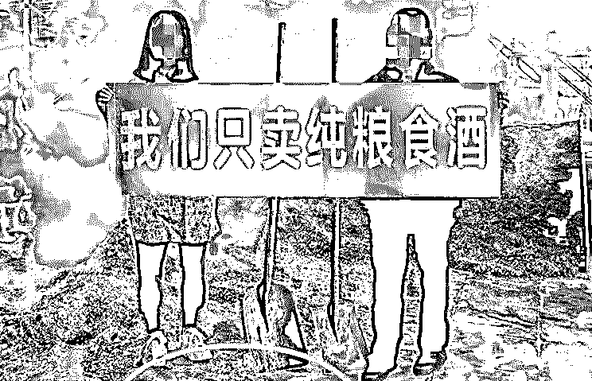

广告文案抛弃老套路，字字掷地有声，为品质担保。广告画风淳朴，产品生产者手持红色横幅出镜代言，打了一张“感情牌”，而网上类似这样的广告还真不少：

“我们全家发誓，这酒有点贵，但真的好喝。”

“我们对天发誓，和 1500 元的酒一样好喝。”

“我们对天发誓，比 1500 元的某台酒还要好喝。”

言语之间“对标茅台酒”，让人错以为是茅台的官方广告。

广告方用了一篇文章介绍了女主人公“陈静”回到家乡，从父亲手中继承酒糟埋藏酒工艺的事迹。

但近期，设计该广告的酒业公司正式被相关监管部门处罚**4.5 万！**高于广告费**5 倍**。

经仁怀市市场监管局对**“陈静替父代言卖酒”**一事的调查，广告涉嫌虚假宣传，**因该内容和模式被进一步模仿学习，**造成一定负面影响。原处 3 倍处罚，调高至 5 倍。

这件事为什么不能做？

1

**故事营销，虚假广告背后的套路**

陈静：“26 岁，遵义茅台镇人，父亲今年 66 岁。毕业于杭州 xxx 大学，毕业后有一个目标，那就是励志靠自己的努力替父亲卖酒”。

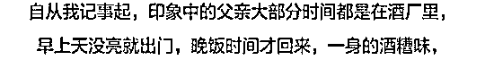

广告介绍了父亲跟着爷爷认真学习和钻研酿酒手艺，以及自己回乡继承手艺的决定，通过对自家酿造工艺的渲染，推广酒的品质。

不知真假的消费者，或是被宣扬的“高品质”吸引，或是感动于人物的励志故事，不少人掏钱买了该产品。

仔细看，文案中其实出现不少错别字，比如“高薪”写成“高新”，“立志”写成“励志”，不少人便怀疑她的大学生身份。

而这个事情，经公众号「原酒公社官微」四次发文发酵之后，不仅在白酒圈里引起广泛讨论，也让此类**虚假广告背后的套路及漏洞**得到更多曝光（本文图片来自「原酒公社官微」公众号）。

**漏洞 1：陈静和父亲年龄存有不同版本**

陈静年龄在推广文案里的说法不一，既有 24 岁也有 26 岁的描述。

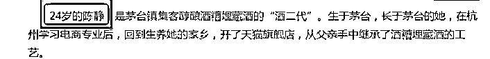

**漏洞 2：宣传自家酒糟酿酒工艺特别**

“将白酒埋藏在酒糟里，微生物聚集，使酒的口感更加醇香”。官方店铺中展示了产品的制作细节，不过截止写稿前，相关图片在 x 宝已经看不到。

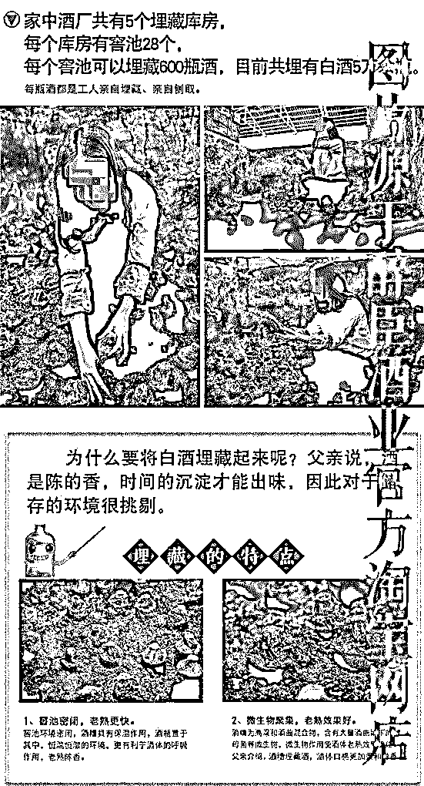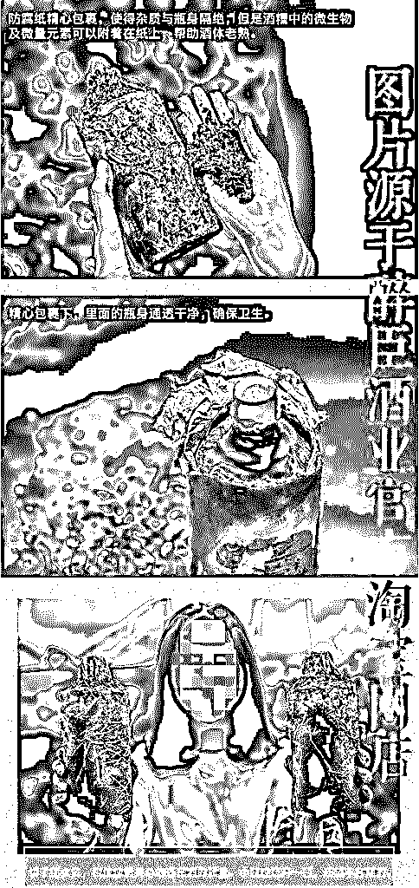

酒糟酿酒是不是真的如传言中说得那么好？对此，公众号「原酒公社官微」也给了相应的说法。

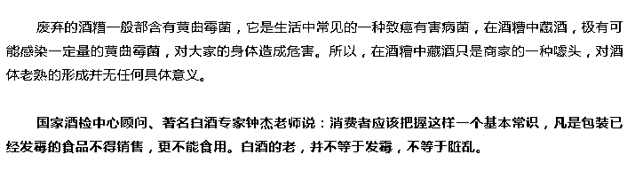

**漏洞 3：套路被模仿，P 图痕迹明显**

大概是因为广告模式还挺吸引人，不少人也纷纷模仿，一样的背景，一样的横幅，蹭了一波行业热度。

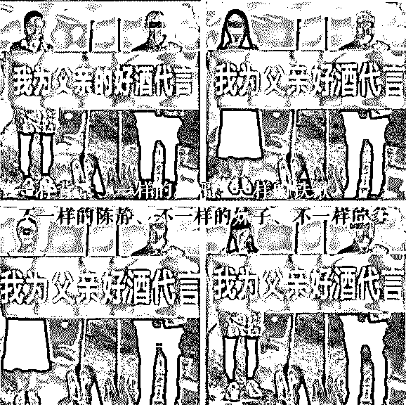

广告文案也如出一辙，只不过换了人物名字，李琴、李舒、蒋 xx……甚至还出现爷孙出镜代言。

一样的酿酒世家，一样只卖纯粮食酒，主人公一律是 24-27 岁。

仁怀市市场监管局立案调查，公布了幕后真相：

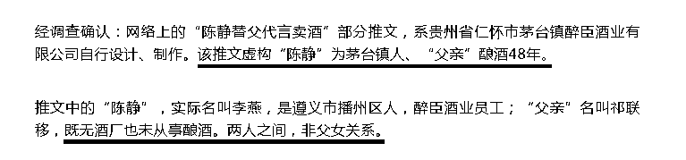

△图片来源：公众号「防骗大数据」

“陈静替父代言卖酒”，**假的。**

2

**发布虚假广告，或被处罚百万**

因为消费者对酒的品鉴能力不同，上述这些看起来“真实”的广告推广，还是欺骗了不少消费者。

据公众号「原酒公社官微」，消费者在购买后遇到**“付款没收到产品”“白酒产地并非对外宣传的茅台镇”**等情况。

讲情怀可以理解，但虚构故事骗取消费者的同情心，以达到销售目的，《广告法》并不会纵容此类行为。

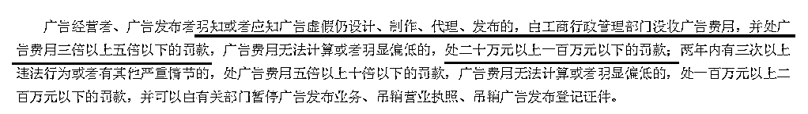

“明知或者应知广告虚假仍设计、制作、代理、发布的，处广告费用**三倍以上五倍以下**的罚款。两年内有三次以上行为，最低处**一百万元以上二百万元以下**罚款。”

其实，利用消费者同情心打感情牌，或是宣传厂家“秉持初心”，产品纯天然，货真价实，绝不坑人等套路，以达到销售目的类似案例，还真不少。

前有无良商家营造的**“苹果滞销，帮帮我们”的滞销大爷，**后有**放弃安稳生活，回乡创业卖蜂蜜的“杨霞”。**

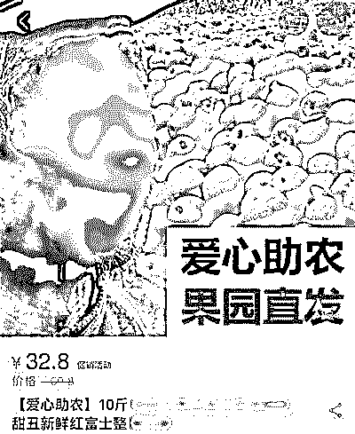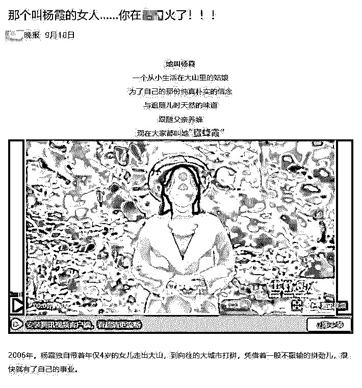

△左图来源：人民日报，右图来源：防骗大数据

滞销大爷是 P 的，在 xxx 地方火了的女人“杨霞”，也是假的。人民日报曾发文《被滥用的“滞销大爷” ，你上当了吗？》，痛斥“悲情营销”。

煽情、悲苦、励志，商家编造故事营销，用户没有深究便很难分辨其中真假。

而这些案例背后**还有一些平台参与其中。**

3

**自媒体平台发布虚假广告，共收 9 千费用**

这次的“陈静为父代言卖酒”事件，除了策划编造故事被罚 4.5 万的酒业，还有不少自媒体平台卷入其中。

今日头条、360、百度……赫然在列，而该涉事企业为多家平台共支付了 9000 元广告费。

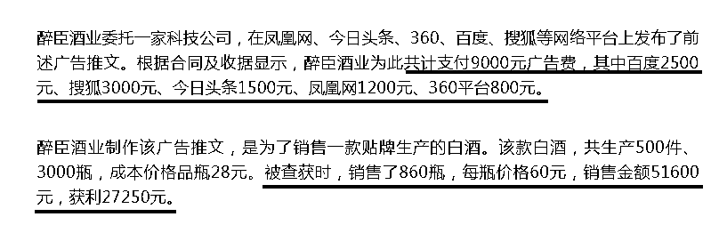

△图片来源：防骗大数据

“针对前述为醉臣酒业发布虚假广告推文的平台，根据管理权限，仁怀市委宣传部网络监管部门，**已按程序向上级汇报。**”

“原酒公社官微”揭秘销售骗局的几篇文章，曾收到涉事企业几次投诉，还收到了对方的律师函。

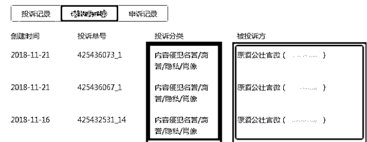

不过据“原酒公社官微”PO 出的截图，腾讯经过审核，认为该投诉不符合法定处理条件，**驳回了对方的投诉。**

近日，针对“自媒体平台存虚假营销”的情况，银保监会再次发文提醒，不要轻信，转发未经核实的消息，避免冲动消费。

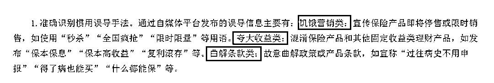

△图片来源：中国保险监督管理委员会官网

对接广告的新媒体人来说，不是什么广告都能接！

不能鉴定是否虚假的，不要接！

升学、考试、培训等内容，不作出明示或者暗示的保证性承诺！危险！

**年关将至，记得转告亲朋好友，购买年节礼品**

**谨防虚假广告，****不相信，****不上当**

**不冲动购买！**

— end —

●[深度&nbsp;|&nbsp;继“卖茶女”后最火女团“蜂蜜霞”：那个叫杨霞的女人，你在全国火了&nbsp;!](http://mp.weixin.qq.com/s?__biz=MzIyMDYwMTk0Mw==&mid=2247494073&idx=1&sn=ce739ce52401637f97303fc931420fe9&chksm=97cb2281a0bcab9704b0427156dc6a46808e6c5c354fcd2eea2a3c42f7a0643e63f1702f6437&scene=21#wechat_redirect)

●[深度&nbsp;|&nbsp;"恶意注册账号"黑产全揭秘：刷粉，炒信，薅羊毛，卖茶，卖蜜，还荐股！](http://mp.weixin.qq.com/s?__biz=MzIyMDYwMTk0Mw==&mid=2247494095&idx=1&sn=10e63105fd74b13e3755de7f89318bf9&chksm=97cb22f7a0bcabe1ab4e56c886ff1872b24a889e75a6e5afe9ece48d6c471fe217bf4e3a2c33&scene=21#wechat_redirect)

●[色即是空：大型情景剧《武夷山小妹卖茶记》](http://mp.weixin.qq.com/s?__biz=MzIyMDYwMTk0Mw==&mid=2247491301&idx=1&sn=7a1ec924a57e5f703311e7281fef2a67&chksm=97c8d5dda0bf5ccba06528a5d584b07237c5338c7f8de9838302c4fefae18f66afd253c477b8&scene=21#wechat_redirect)

●[灰产哥与卖茶小妹“王小芬”&nbsp;的故事-解密年流水一个亿的茶叶产业链](http://mp.weixin.qq.com/s?__biz=MzIyMDYwMTk0Mw==&mid=2247487095&idx=1&sn=08e5b4d96a3f6bacaa918dd524afb5cb&chksm=97c8c54fa0bf4c593c668f782978a98f51513367a567625b1877f9e00b425c9ef9e0e67bf642&scene=21#wechat_redirect)

   

**点击加入 ****灰产圈 | 高端社群**