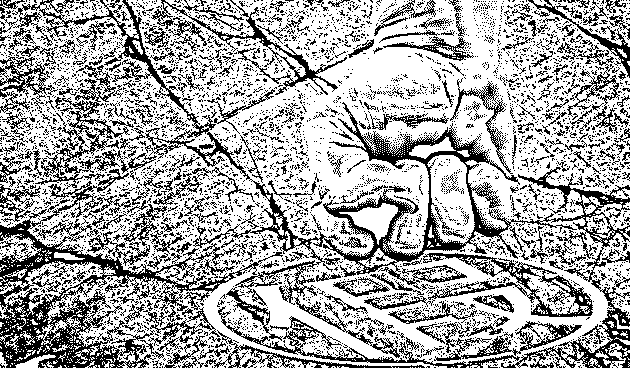
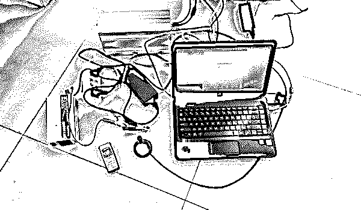
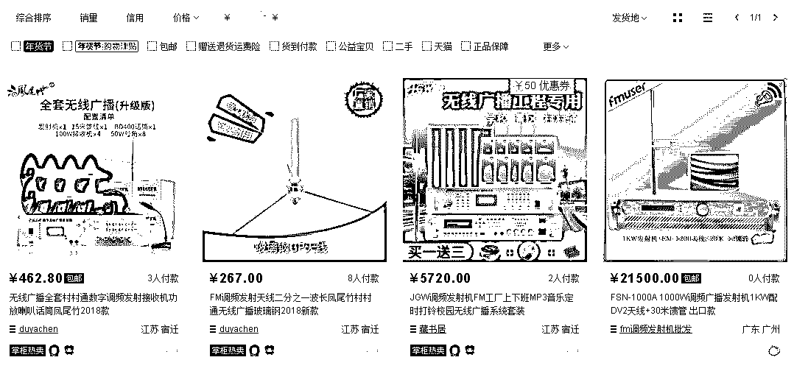
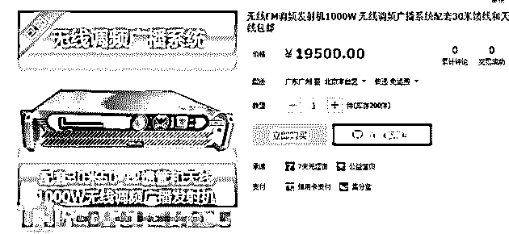
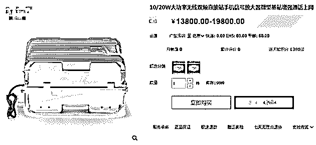
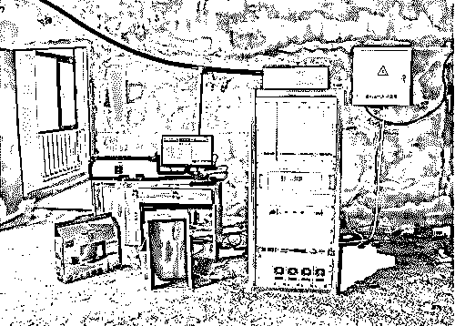
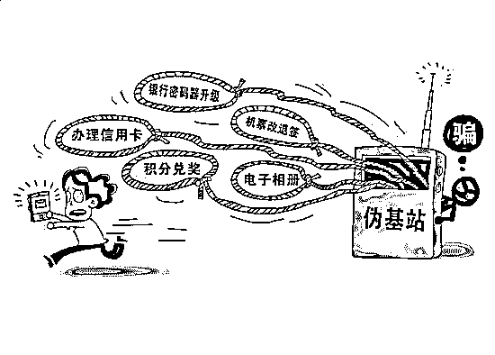

# 探秘“黑广播”“伪基站”：机长耳机中播放着壮阳药广告，无法与地面联系！

> 原文：[`mp.weixin.qq.com/s?__biz=MzIyMDYwMTk0Mw==&mid=2247494363&idx=1&sn=f9f9e17b1d6e530aa9ca07a4dbada421&chksm=97cb21e3a0bca8f5915e881c967ae1625c87fc51be31a034a9b059056f00d2e4ae6d3713d232&scene=27#wechat_redirect`](http://mp.weixin.qq.com/s?__biz=MzIyMDYwMTk0Mw==&mid=2247494363&idx=1&sn=f9f9e17b1d6e530aa9ca07a4dbada421&chksm=97cb21e3a0bca8f5915e881c967ae1625c87fc51be31a034a9b059056f00d2e4ae6d3713d232&scene=27#wechat_redirect)

**点击上方蓝色字体“灰产圈”关注并置顶本公众号**

导语

无论你是什么年纪，也无论你从事哪个领域的工作，你很有可能在无意中听到过某个电台突然变成了推销假药或保健品的电台；

而很大程度上你也收到过诸如“您的积分满足兑换现金礼包××元的条件”“您的手机银行已过期，请登录管理网站 xxxxxx 激活升级”“我的微信：xxxxxx，我是个卖高仿的。

我也承认这是个拉客的软文……”“JJ 棋牌代理——全新代理模式”之类的诈骗或垃圾短信。

而这些假药广告和诈骗、垃圾短信轻则影响心情、损失钱财，重则倾家荡产，甚至对人的身体健康产生威胁，它们的罪魁祸首就是“黑广播”和“伪基站”这些非法无线电发射设备。

揭秘“黑广播”和“伪基站”

**图片来源：摄图网**

> 1 月 10 日，工信部网站发布《无线电发射设备销售备案实施办法（暂行）》（以下简称《办法》），明确了市场上的经营主体销售无线电发射设备进行备案的实施标准，同时建立了销售备案信息平台，企业可以全程网上快捷办理和自动核验，而公众也可以实时查询备案数据，这似乎是对“黑广播”“伪基站”等非法无线电发射设备经销商的重大打击。

**那么，什么是“黑广播”“伪基站”？它们有什么特点？它们的设备是从哪里来的？**

对我们普通人而言，它们有哪些危害？我们又应当如何避免呢？

## 藏在双肩背包里的“伪基站” 打击难

“黑广播”是指未经批准设置、非法占用无线调频广播频率的无线电发射电台，播放内容多以虚假医药广告为主，严重扰乱广播电视秩序，危害国家安全。

中国社科院数量经济与技术经济研究所信息化与网络经济室助理研究员 KK 告诉我们，“黑广播”一般由发射设备、天线、远程控制器、定时器、U 盘等设备组成，通常被放置在一个隐秘的场所，无人值守，通过电脑远程控制来循环播放虚假信息。

近年来，不法分子的作案手段越来越隐蔽，欺骗性越来越强。在发射时间上，“黑广播”从最初的 24 小时不间断播放，变为晚间或凌晨播放，有的只在节假日播放。

在安装位置上，由最初的出租房向电梯间、水塔房、广告牌等转移。在发射方式上，不断更换发射频率，盗用合法广播频率进行插播。

在设置手段上，通过设置无线报警器和远程开关机装置，将发射天线伪装隐藏，甚至将设备安装在铁笼子里，用钢筋全部焊接封闭并固定在地面上。

“伪基站”不是正规合法的基站，被违法犯罪人员操纵，其设备是未取得电信设备进网许可和无线电发射设备型号核准的非法无线电通信设备。

KK 告诉我们，“伪基站”一般由主机、笔记本电脑、短信群发器、短信发信机等设备组成，伪基站运行时用户手机信号被强制连接到“伪基站”上，因此，“伪基站”通过伪装成运营商的基站来发送诈骗、广告推销等短信息。

从体积上来看，“伪基站”越来越呈小型化、轻量化趋势，它组装简单，轻便易携，通常可以放置在汽车、摩托车、电瓶车等各种交通工具内，甚至藏匿于双肩背包、拉杆箱、外卖箱中，流动性极强，在一个地方发射完信号后，可以快速撤离，因此也给案件的查处带来极大困难。

一本万利的“伪基站”设备哪儿来的

“黑广播”和“伪基站”作为非法的无线电发射设备，国家是严禁生产和使用的，但是由于其生产技术的公开，事实上，很多渠道都可以购买到相关的组装设备零部件。

“‘黑广播’和‘伪基站’相关设备组装门槛较低，具备一定电路和通信知识的人就可以通过零部件进行组装，网络上也有一些自制电台和自制基站的教程，同时，为了逃避监管和便于从事违法活动，这些提供厂商多以小作坊的形式存在。”

KK 向我们透露，当前“黑广播”和“伪基站”的生产方、销售方、使用方相互勾结，已经形成了一条完整的地下黑色产业链。

我们在淘宝网站以“1000w 调频广播发射机”“基站”等关键词进行搜索，出来不少出售相关产品的商家，售价从几千到几万元不等。这些工具一旦被不法分子利用，极有可能组装成“黑广播”或“伪基站”，向公众传播非法内容。

据我们了解，以“伪基站”为例，购买者一次性购机后，不需要再支付任何费用，而与之相对应的是，“伪基站”发送垃圾短信的报价从每天数百元到上万元不等，利润远远高于成本，这也是导致不法分子被发现后宁愿丢弃设备逃脱的重要原因。

## **“黑广播”和“伪基站”危害着公共安全和公众身体健康**

目前来看，“黑广播”主要通过提供虚假信息对普通公众带来一些负面影响，而这些“黑广播”一般都是假药、非法保健品之类的广告，不能辨别信息真假的听众如果听信了虚假广告购买了相关产品，有可能会对身体健康造成一定的危害。

而除了播出虚假医疗广告外，“黑广播”还会对民航通信、军事通讯以及一些正规电台的频率产生干扰，扰乱正常的广播秩序，给无线电管理带来挑战，同时也影响了社会稳定和国家安全。

> **据媒体此前报道，2014 年 3 月，奥凯航空的航班在天津机场上空与运行中心联系时，不断受到不明噪音干扰，机长和地面指挥人员无法互相听清。经降噪处理，发现机长耳机中的杂音竟是壮阳药广告。**
> 
> **经查，干扰源是未经无线电管理部门批准的“黑广播”，由此可见“黑广播”对航空安全的威胁不容小觑。**

“伪基站”的危害主要在于“伪”，它通过发送垃圾信息、诈骗短信成为社会一大公害，更是早已成为不争的事实。

通过窃取用户信息，“伪基站”埋藏极大安全隐患；在被强制接入“伪基站”期间，用户无法进行正常通信；盗用运营商频率资源，干扰合法的网络信号，引发网络拥塞，破坏干扰正常通讯；更为令人气愤的是，“伪基站”滥发虚假信息、非法商业广告，甚至盗用银行、政府部门等公共单位的名义发送诈骗短信，而普通用户对此往往难辨真伪，就此造成重大财产损失的不在少数。

据不完全统计，每年通过伪基站发送的诈骗、赌博、推销、中奖等短信近千亿条。

我们注意到，《全国首份伪基站短信治理报告》显示，70.2%的“伪基站”诈骗短信冒充运营商诱导用户点击恶意网址；19.4%的诈骗短信冒充银行实施诈骗；4.6%的诈骗短信内容为欺骗用户订低价机票，诱骗回拨电话进行诈骗。

打击“黑广播”“伪基站”出重拳

我们注意到，1 月 3 日，工信部无线电管理局发布了“无线电行政执法十大典型案例”，其中不乏“黑广播”和“伪基站”的案例。

事实上，也正是由于“黑广播”“伪基站”屡禁不止，所以国家才一次次出台相关政策加强对无线电发射设备的监管。

> **去年 4 月份，国务院打击治理电信网络新型违法犯罪工作部际联席会议办公室印发《关于开展集中打击“伪基站”违法犯罪专项行动的通知》《关于开展打击治理“黑广播”违法犯罪和集中整治违规设置使用调频广播电台专项行动的通知》，决定从 2018 年 5 月 1 日至 2018 年 12 月 31 日在全国范围内开展打击“伪基站”“黑广播”违法犯罪活动和集中整治违规设置使用调频广播电台专项行动。 **

> **而刚刚进入 2019 年，工信部又出台了《办法》，明确了实施销售备案的依据和适用范围、管理机构、备案主体、备案内容、操作流程等内容，提出建立全国统一的无线电发射设备销售备案信息平台，并规定了监督检查要求。**
> 
> **KK 认为，《办法》通过加强无线电发射设备管理、规范无线电发射设备销售备案，可以从源头上精准打击非法无线电发射设备黑色产业链，可以在一定程度上有效打击和遏制“黑广播”和“伪基站”。**

结尾

我们普通人或多或少在生活中都可能会收到“伪基站”发送的信息，对于如何尽量避免受到损害，KK 表示，关键在于提高防范意识，面对莫名其妙的“好事”信息一定要留神，保持警惕。

在收到一些典型伪基站发送的信息如“积分兑换礼品”“积分换话费”“幸运中奖”“恭喜”“红包”等方面信息时，建议慎重处理，不要轻易点开附带链接或者拨打电话，最好直接删除。

除此之外，我们注意到，业内人士还提醒大家，要留意手机信号的突然消失，此时可能就是“伪基站”群发短信之时，用户对此时发送的短信要多加注意，切莫中了诈骗短信的圈套；

其次，通过安装拦截软件，利用技术手段识别伪基站发来的诈骗短信；另外，用户还可以改用安全性更强的手机，远离诈骗短信。

我们注意到，工信部网站公布了全国各省、自治区、直辖市无线电管理机构干扰投诉联系方式，广大公众发现“黑广播”“伪基站”可拨打各地电话举报。

| 省份 | 联系方式 |
| 北京 | 010-63345208 |
| 天津 | 022-60261666 |
| 河北 | 0311-87800631 |
| 山西 | 0351-5625393 |
| 内蒙古 | 0471-4193547 |
| 辽宁 | 024-88663355 |
| 吉林 | 0431-87075044 |
| 黑龙江 | 0451-963927 |
| 上海 | 021-64456669 |
| 江苏 | 025-83268140 |
| 浙江 | 0571-967206 |
| 安徽 | 0551-62871783 |
| 福建 | 12345（便民热线） |
| 江西 | 0791-88169539 |
| 山东 | 0531-86425891 |
| 河南 | 0371-65509823 |
| 湖北 | 027-88230053 |
| 湖南 | 0731-88955569 |
| 广东 | 020-83132744 |
| 广西 | 0771-2182195 |
| 海南 | 0898-65383127 |
| 重庆 | 023-67710578 |
| 四川 | 028-86626918 |
| 贵州 | 0851-85253674 |
| 云南 | 0871-63518308 |
| 西藏 | 0891-6325457 |
| 陕西 | 029-63915482 |
| 甘肃 | 0931-7826008 |
| 青海 | 0971-8460061 |
| 宁夏 | 0951-964888 |
| 新疆 | 0991-4680388 |

**来源：每日经济新闻**

●[探秘银行卡盗刷黑产："伪基站"群发，“木马”拦截，黑客“洗料”，“短信嗅探”，暗黑齐天，法力无边！](http://mp.weixin.qq.com/s?__biz=MzIyMDYwMTk0Mw==&mid=2247493780&idx=1&sn=288da1b308bc55276fcb623493cab254&chksm=97cb23aca0bcaaba3196e9c88e663091e18d0c1d91e2cdc6ac48cc858b2c4e48cf9f809b09a1&scene=21#wechat_redirect)

●[黑产揭秘：利用伪基站钓鱼一共分几步？](http://mp.weixin.qq.com/s?__biz=MzIyMDYwMTk0Mw==&mid=2247486801&idx=3&sn=290bd290549b65e91937bdfc0f625409&chksm=97c8c669a0bf4f7f0141230b66e3f954d217801f41e8c975a94e78e6271adaa84e10757c40b2&scene=21#wechat_redirect)

●[揭秘：短信拦截木马背后的黑色产业](http://mp.weixin.qq.com/s?__biz=MzIyMDYwMTk0Mw==&mid=2247488575&idx=1&sn=74d932d8cadf4c21b3761109f46ce30d&chksm=97c8df07a0bf5611069e46703bb002e611ee1f36bea1a9fd7a32831a94876afdb73e09ec292c&scene=21#wechat_redirect)

●[吓 skr 人：一夜清零，一无所有！GSM 劫持？短信嗅探？揭秘银行卡盗刷灰色产业链！](http://mp.weixin.qq.com/s?__biz=MzIyMDYwMTk0Mw==&mid=2247492798&idx=1&sn=3de4adf3e559bde60f7b2b8d614a94ed&chksm=97cb2f86a0bca69049d22e974965dbbc09d9850f3abca5fc2aaf51feff4f9a1d173b6c0fd6de&scene=21#wechat_redirect)

   

**点击加入 ****灰产圈 | 高端社群**