# 个人信息黑产深度揭秘：手机位置 300 元！全家信息 100 元！手机定位 1000 元！财产损失 915 亿！

> 原文：[`mp.weixin.qq.com/s?__biz=MzIyMDYwMTk0Mw==&mid=2247494357&idx=1&sn=9c943d0f3b5b83bb6e55b106b38489f8&chksm=97cb21eda0bca8fb9ae8d7d3bfb4e995a43b6082ad0fe3264cecf57587877579c25e9e2fb857&scene=27#wechat_redirect`](http://mp.weixin.qq.com/s?__biz=MzIyMDYwMTk0Mw==&mid=2247494357&idx=1&sn=9c943d0f3b5b83bb6e55b106b38489f8&chksm=97cb21eda0bca8fb9ae8d7d3bfb4e995a43b6082ad0fe3264cecf57587877579c25e9e2fb857&scene=27#wechat_redirect)

**点击上方蓝色字体“灰产圈”关注并置顶本公众号**

导语

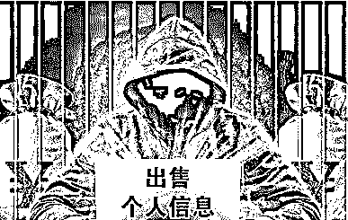

“黑产历史由来已久，个人消费大数据属于个人信息类其中的一部分。随着消费信贷崛起，个人消费大数据在很多应用场景下可以被利用，近年来也被黑产炒的很热。

根据业内人士反馈，行业里面还有一条不成文的规矩，就是你永远接触不到真正的买家和真正的卖家，所有的流程基本上都是过了好几手，黑产数据太庞大，可能超过了很多人的想象。

上个月，针对网上“12306 平台疑似旅客信息泄漏，低价出售 410 万旅客信息”一事，2018 年 12 月 28 日晚，“中国铁路”官方微博发布消息回应称：“网传信息不实，铁路 12306 网站未发生用户信息泄露。”

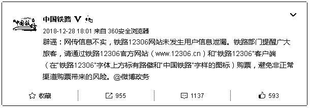

我们注意到，12306 网站购票账户包括身份证号、银行账号、手机号码、邮箱等公民个人信息。

而在网络上，通过 QQ、微信、贴吧等渠道贩卖上述信息的案例亦屡见不鲜。这些以个人信息为“商品”的交易，其源头从何而来？

以案释法，追根溯源

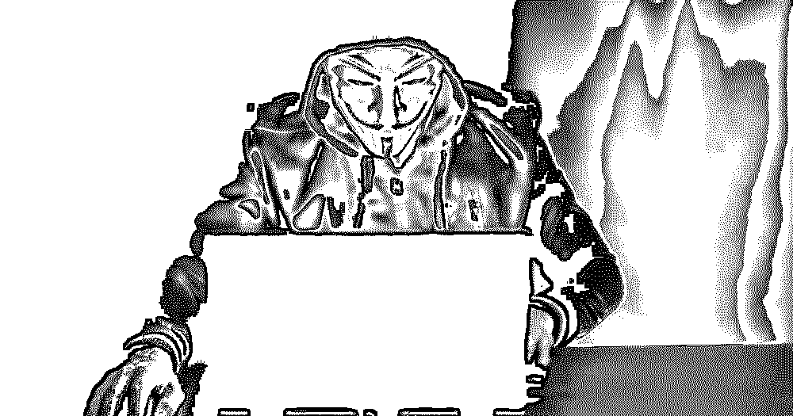

2019 年 1 月 2 日，我们在中国裁判文书网检索到近五年共 50 份判决书后发现，在侵犯公民个人信息的案件中，犯罪嫌疑人盗取公民个人信息的主要渠

道有三：

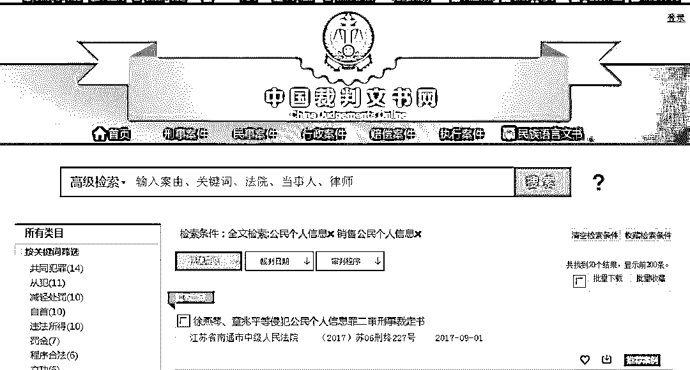

**中国裁判文书网关于“销售公民个人信息检索页面”**

> **通过网络廉价购买大量信息二次倒卖**
> 
> **利用职务之便盗取信息**
> 
> **利用黑客技术攻入计算机系统**

“二道贩子”：从网络购买大量信息后“批发”赚差价

我们以“侵犯公民个人信息罪”、“12306 网站”为关键词在中国裁判文书网上共检索到 19 份判决书，多数犯罪嫌疑人从上家低价“批发”大量未经细分处理的 12306 网站用户信息后，再分类进行二次出售获利。

一数据倒卖

在四川省剑阁县人民法院 2018 年 8 月 4 日发布的一审判决书中，被告人周亮即从网上出售 12306 数据的“上线”处购买了大量数据，内容有公民注册邮箱、姓名、身份证号、手机号和密码信息，并伙同他人将数据分类处理后再出售。周亮因犯侵犯公民个人信息罪，被判处有期徒刑一年，缓刑一年，并处罚金 10000 元。

一职务犯罪

我们注意到，在上述 19 份判决书中，仅一份提及了信息源头：2018 年 2 月 9 日，江西省余干县人民法院审理的一起案件中，江苏滨海县公安局交警大队八滩中队辅警李某舟利用工作便利，偷偷使用同事的数字证书进入“全国综合查询平台”、“全国人口信息查询平台”、“全国车辆管理信息查询平台”获取公民身份信息及车辆信息 140 万条，并出售给他人非法获利 240616 元。经李某舟之手流出的信息后被“黄牛”用来在 12306 网站注册账号帮他人抢票，并从中获利。

倒卖个人信息赚取差价，是侵犯公民个人信息案件中最常见的非法获利方式。许多不法分子通过 QQ、微信等方式在网络上联系，确定价格并批量出售、倒卖公民个人信息。

我们发现，此类案件通常涉及的信息量巨大，购买成本则相对较低，给了嫌疑人赚取差价的空间。

三

信息倒卖

在鸡西市鸡冠区人民法院 2018 年的一起判决中，被告人陈海波通过 QQ 购买了大量个人信息进行倒卖。

2013 年，陈海波曾因犯侵犯公民个人信息罪被成都市金牛区人民法院判处拘役四个月。出狱后几年，他又“重操旧业”，于 2017 年 3 月起联系“下线”李某，出售自己从网络上购买的大量公民个人信息，包括姓名、住址、联系方式等。

经过公安机关的排查，在陈海波的硬盘、U 盘中发现的公民个人信息共有 87.4 万条之多。通过自己和李某的多次交易，陈海波手中掌握的公民个人信息共使他非法获利多达 18.3 万余元。

在二次倒卖公民个人信息的案件中，被贩卖的公民信息常常被作为“下线”的购买者用于其他不法用途，例如：非法营销、网络诈骗等。

在山东省莱芜市中级人民法院 2018 年 6 月二审裁定的一起判决中，被告人蒋志波从一个专门从事倒卖公民个人信息的 QQ 群中购买了大量来源于购物平台的公民个人信息，包括姓名、电话等基础信息，并将这些信息和自己之前收集过的危房业主、交通事故信息打包二次出售给了此案中另一名嫌疑人林泽超。

蒋志波供述称，他购入信息的价格仅为 10 元/万条，折算下来，每十条的价格仅一分钱。他说，因为这些信息获取的时间较早，“进价”就相对便宜一些。通过出售这些信息，蒋志波累计赚取了 10650 元。

买卖“成交”后，这些公民个人信息被林泽超用于从事网络诈骗、微商等业务。

监守自盗：辅警盗用民警数字证书盗取公民信息

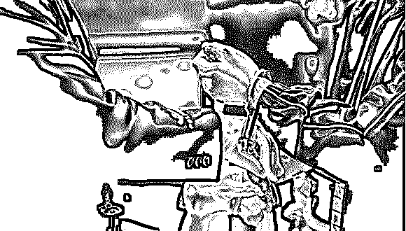

裁判文书显示，在不少案件中，嫌疑人供职于通信公司、车辆管理机构、公安局等要害部门，通过获取权限，直接盗取了大量公民个人信息用于非法牟利。

湖北麻城市中级人民法院 2018 年二审的一起判决中，被告人孙立飞通过华为公司业务员肖某购买了大量包含用户姓名、电话号码和移动积分在内的移动用户个人信息资料，并将其中 50 万条信息以 5 万元的价格并出售给开设公司、盗取移动用户积分的李少辉。

随后，李少辉在南昌市注册创办了一家网络公司，从 2016 年 9 月开始，指派公司话务员冒充移动公司客服骗取用户移动积分，兑换成电子券牟利。

从 2016 年 10 月 23 日到 2016 年 11 月 24 日，仅用了一个月，这家公司的成单量就达到 2500 多单，12 月的成单量近 4000 单。

为规避一些用户的屏蔽，李少辉与同案被告人何建福购买了 80 多部手机和大量电话卡，一旦被屏蔽就立刻换号。

“每天下班前，话务员都会把已兑换的积分打成清单，客户资料上还会有标记，‘2’就是打过两遍电话，‘3’就是打了三遍”，该公司话务员何建福说。

事实上，员工们也曾对公司的业务产生过怀疑。话务员张瑛曾发现一些用户反映没有收到积分兑换礼品，充值话费也没有到账，还有一些员工在微信群里提出公司存在诈骗嫌疑。可是，由于福利待遇还不错，张瑛并没有选择离开。

最终，截至李少辉归案，他的公司共骗取移动用户积分逾三千万分。

除此之外，我们还发现了多起辅警盗用民警数字证书盗取公安内网公民信息的案例。

在淄博市张店区人民法院 2017 年 4 月 24 日的一起判决中，被告人詹耿彬就是一名在东莞市公安局大朗分局刑警大队工作的辅警。

作为伏击组辅警内勤，詹耿彬平时便可以经常接触公安内网。利用伏击组民警梁某平时放在单位抽屉里的数字证书，詹耿彬动起了歪脑筋。通过公安内网，詹耿彬可以直接获取公民身份信息、出入境信息、护照照片、户籍照片等个人信息。

在发现了这一“致富手段”后，詹耿彬便堂而皇之在 QQ 上声称出售“一手信息”。通过一段时间的交易，他积累起了 5 名“下线”，经常与他们达成交易，每天动辄盗取 1000 条左右的公民个人信息。

詹耿彬出售公民个人信息一条的价格是 1.7 元至 5 元不等，他的下线却将这些信息加价数倍之多。同案被告张学鹏出售从詹耿彬处购买的护照信息，一条的价格在 10 到 15 元，共获利 5 万元左右。

技术手段：黑客入侵中小学学籍管理系统网站

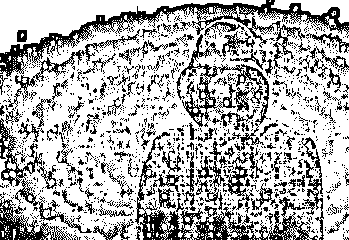

除了从内部盗取信息，一些精通计算机的犯罪嫌疑人也能通过技术手段从外部直接盗取数据库里的公民个人信息。

在上海市浦东新区人民法院 2018 年的一起判决中，被告人王某某通过黑客手段入侵了上海世基投资顾问有限公司等金融公司网站，被告人牟某某则通过黑客手段入侵了安徽省中小学学籍管理系统网站。

2014 年到 2017 年间，受雇于一家荐股公司的王某某结识了一些网络黑客，其中包括同案被告牟某某。2017 年 2 月开始，王某某开始指使包括牟某某在内的两名黑客入侵了世基公司的网站，查看并获取了上万组该公司的用户数据，并出售给中鑫公司上海分公司。

经世基公司方面证实，该公司被入侵的服务器位于浦东新区灵山路世基分公司机房内，服务器上没有客户数据，入侵者系通过远程互联网控制服务器，并通过内网 IP 获取了内网其他电脑上保存的客户信息。

盗取信息的过程中，王某某向两名黑客支付了 51 万元“工资”。得手后，王某某再将信息出售给中鑫公司上海分公司和瑜广公司等“下游”，每一次动辄收入四五万元。

而对被告牟某某而言，受雇于王某某并非唯一的“业务”。2017 年 6 月初，有人在 QQ 上找到他，提供了安徽省中小学学籍管理系统的权限，并让牟某某攻击渗透该网站。

牟某某从学籍管理系统获取了 600 多万条包含学生姓名、身份证、籍贯、家长姓名、联系电话等信息的数据，按地市分类导出。

在黑客技术之外，购买“扫号”软件并用大量数据进行“撞库”的手段也出现在近年来一些重大侵犯公民个人信息案件中。

江苏省仪征市人民法院 2018 年的一起判决中，被告人王群便通过“撞库”成功获取了他人 QQ 用户名及密码，用于销售获利。

在王群的非法牟利链条中，他所购买的“扫号”软件由同案被告李陈龙编写，用途是获取他人的 QQ 邮箱账号和密码。随后，王群又从软件销售者林佐楼处购买，并将此前购买的 500 多万组邮箱账号密码数据导入软件运行，采取对 QQ 软件数据库“撞库”手段，获取了大量 QQ 邮箱用户的个人信息。

通过销售撞库获取的 QQ 账号和密码，王群累计获利 41.8 万余元。而销售方林佐楼通过售卖非法软件，销售额高达 40.5 万余元，个人获利 9.4 万余元。编写软件并出售的李陈龙，非法获利则为 3.4 万余元。

一条个人信息可以卖多少钱？

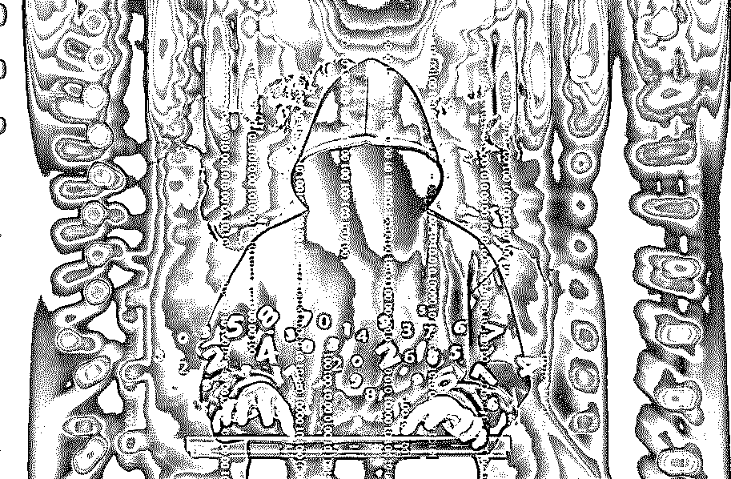

在侵犯公民个人信息的刑事案件中，犯罪分子盗取信息的种类、用途五花八门。

我们从中国裁判文书网搜索到 2013 年至 2018 年 64 起通过 QQ、微信倒卖或直接盗取公民个人信息的案例中，共有 168 名被告人因侵犯公民个人信息获刑，非法获利者少的上千元，多则达近百万元。

在这些以个人信息作为新的“商业资源”的案例中，一条个人信息的价格会因其来源、品类和转手次数等多种因素而相差悬殊。

价格最低的单价仅 1 分钱，而卖价最高的系定位他人手机号位置，单次收费超千元。

**“倒卖者”赚差价：低价批发，最低单价仅 1 分钱**

我们发现，在多起犯罪嫌疑人倒卖信息的案件中，起售信息数量至少以十万条为单位，每条信息的单价最低为 0.01 元/条，最高则为 2 到 5 元/条。

在齐齐哈尔农垦区人民法院 2017 年的一起判决中，被告人崔文虎便是一名从上线低价购买公民个人信息、随后以高价卖出的倒卖信息者。从 2015 年 5 月开始，崔文虎在一年半的时间里先后倒卖 6 次公民个人信息，累计获利近 10000 元。

第一批购买的户籍信息、住宿信息 4300 余条共花费了崔文虎 2000 元，单价每条不到 0.5 元，当他转手卖出这批信息时，加上的差价则为 5000 余元，每条的售价也不过 1 元出头。此后，崔文虎多次作案，到案时，他所售卖的信息总数已有上万条之多。

比起崔文虎，在天津市和平区人民法院 2018 年的一起判决中，被告人陈小龙贩卖的信息数量更大，其单价也相对更低。

2015 年国庆节前后，平时以开黑出租为业的陈小龙开始在电脑上买卖公民个人信息。陈小龙自己并没有获取公民信息的“一手渠道”，一旦有买家通过 QQ 找到他购买，他就会在专门买卖公民信息的 QQ 群里寻找对应的卖家，并将这名卖家发来的信息样本转发给买家，在卖家的基础上加价三到四百元。

2016 年 2 月，第一次交易时，陈小龙共出售了 13000 多条信息，并且有了第一个“下线”张某。彼时，他出售这些信息的价格一共只有两千多元。

由此，陈小龙在前后一年多的时间里，共获取了上百万条公民个人信息，包括基础的姓名、电话号码、身份信息等。在后面的 6 次交易中，陈小龙贩卖的信息少则 8000 多条，多则达到 26 万余条。不过，每一次交易的信息单价并不高，一条信息的价格以分计。

最终，法院认定，在前后总共七次交易中，陈小龙共非法获利 7200 元，经他手中出售的公民个人信息则有约 38 万条。陈小龙因犯侵犯公民个人信息罪，被判处有期徒刑四年六个月，并处罚金 20000 元。

辅警坚守自盗：一手车辆信息每条 7 至 8 元

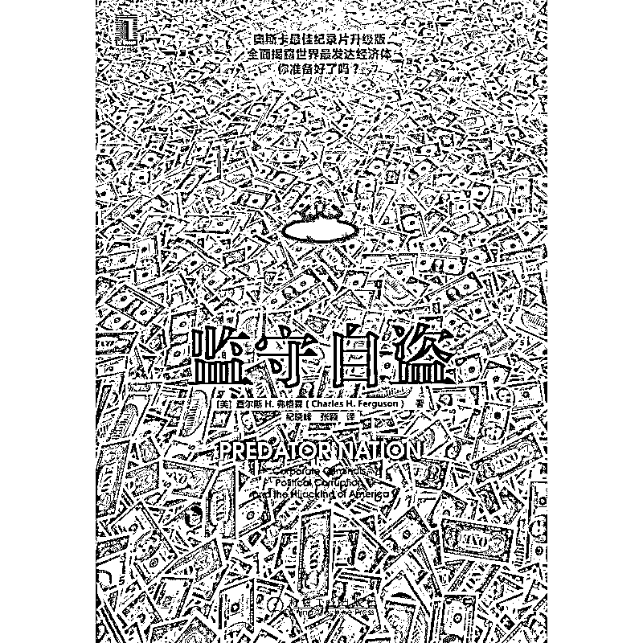

相比起倒卖二手信息的犯罪分子来说，一些“监守自盗”的信息倒卖者往往能直接获取更加详细、多样化的公民信息。

在此类案例中，倒卖信息者出售信息的价格也更高——比起“二次倒卖”每条几分钱的售价，“一手信息”的价格动辄十几元每条，所涉及的公民信息也更加“全面，包括身份证、车辆信息、交通肇事、犯罪记录等”。

在湖北省黄冈市中级人民法院 2018 年 6 月 12 日一起二审裁定中，多名在不同地区交警大队、车管所、公安局担任协警、工作人员的嫌疑人利用职务便利，盗取并出售了公安内网中大量公民信息。

此案中，被告人李进和师丽娜作为“中间人”扮演了关键角色。通过联系在公安局、车管所等单位工作的协警、民警，2016 年起两人建立起了从公安机关获取车档信息、公民信息，再转手进行售卖的关系网。

获取信息的过程中，李进通常会以每条十几元到几十元的价格对前来购买信息的“下线”收取“查询费”。与此同时，他付给“上线”即负责查询的民警的查询费则为每条 3 到 5 元。而李进的下线，则进一步将从李进处购得的信息加价 15 元一条，继续出售。

这起大型案件中，涉案的协警、公安局工作人员多达 9 人。作为“中间人”的李进，利用公民信息非法牟利数额高达 24 万余元。

我们发现，在此类盗取信息并直接出售的案件中，作案人员多为协警、辅警，手法则多为盗用民警数字证书登录公安内网。被直接出售的信息，多为公民个人车辆信息，包括车牌号、车主、身份证号、肇事记录等。

在宜昌市中级人民法院 2018 年 6 月 21 日作出的一份二审判决中，同样是发生在交警部门的大型窝案，江西省南丰县、石城县两地的交警大队均发现有 5 名辅警盗用民警数字证书，盗取并贩卖公民个人信息。

通过在公安综合信息网查询公民个人车辆信息，此案多名被告将显示公民信息的页面一一拍照后传给“下线”，售价每条在 7 到 8 元不等。截至案发，盗取的公民个人车辆信息共有 2.5 万余条，被告人违法获利共计人民币近 20 万元。

公司团队作案：分类标价，定位他人手机号单次上千元

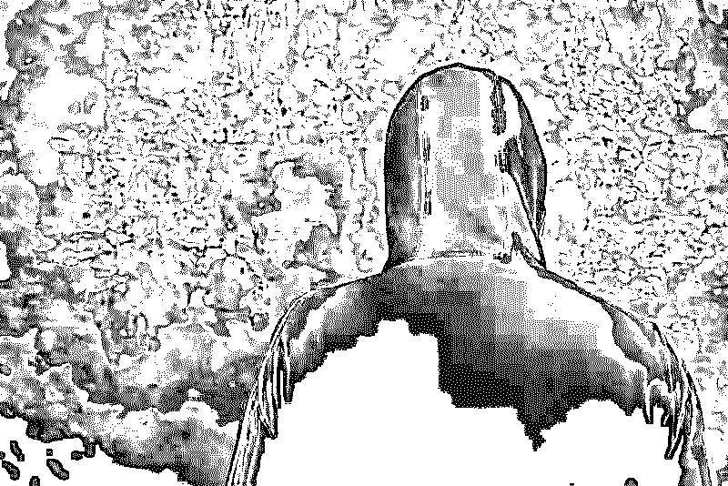

在一些有组织地出售、利用公民个人信息的案件中，犯罪嫌疑人的手段上升为利用公司团队作案。

在山东省兰陵县人民法院 2018 年一起判决中，被告人全行开设了一家专门倒卖公民个人信息的无证“公司”。

“没有名字，没有注册，以我的名字装的宽带，用我老婆名字和房东签的合同”，全行如是交代。

在雇佣多名员工后，这家“公司”通过 QQ、微信等方式每天寻找个人信息的买家，累计获利近 9 万元。不过，全行的“公司”因其本人有所顾虑，一直只以贩卖公民电话号码为业，并未涉及其他业务。

在一些出售公民个人信息的嫌疑人看来，获取并出售牟利的个人信息需要被进一步分类，“细化”利用。以此方式出售的公民个人信息，因其性质和用途的区别而有了不同的价位，有的信息单条甚至被卖到几百元。

湖北省保康县人民法院 2017 年的一起判决中，开设商务咨询公司的张旭光和其“上线”、以出售公民个人信息为业的杨道运组成了上下游产业链。

张旭光开设的“咨询公司”，其业务实质上是帮助他人跟踪调查、查询个人信息。

对于做单笔生意的张旭光来说，查询航班信息、定位手机号、网吧信息、火车信息等每一单业务都能让他收入几百元到上千元不等。仅在一次定位两人手机号位置的生意中，张旭光就收到了 1000 多元。

与此同时，张旭光从上线购买信息的价格也不低，每一次的价格至少也在几十元到一百元。在处理一起“包月定位”业务时，张旭光付给上线的价格高达 1800 元。

作为张旭光的“上线”之一，杨道运自 2016 年起便开始做起了提供公民个人信息的生意。比起张旭光，杨道运的“道行”还要更深一些。

在杨道运“进货”的交易中，他和上家有着专门的交易用语。其中，“包打通”的意思就是客户提供出身份证号，杨道运可以据此查到身份证号名下可以打通的手机号，而非长期关机停机状态。

而“顺丰淘宝”的意思则是客户提供手机号后，杨道运负责提供手机号对应的顺丰或淘宝收货地址。“三网机主包验证”，指的则是查询客户提供手机号的机主信息。

在卖家价格的基础上加了一部分后，杨道运的分类定价十分清楚：手机位置 300 元，全家信息 100 元，个人轨迹 400 元，“顺丰”130 到 150 元。

最终，法院判决张旭光犯侵犯公民个人信息罪，判处有期徒刑一年，并处罚金人民币 1 万元；杨道运犯侵犯公民个人信息罪，判处有期徒刑十个月，并处罚金人民币 5000 元。

“黑产”是如何窃取数据的？

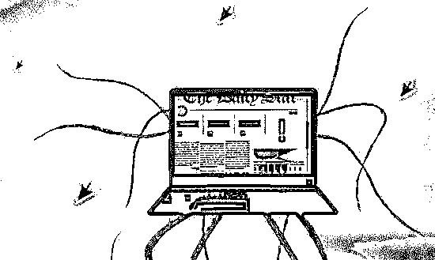

几个月前，绍兴越城公安就侦破了一起特大流量劫持案，北京瑞智华胜公司涉嫌非法窃取用户个人信息 30 亿条，全国 96 家互联网公司都曾被非法“打劫”过，其中还不乏涉及 BAT、京东、新浪和今日头条等知名大厂。

一开始瑞智华胜通过竞标，以合作方式为运营商提供营销服务。初期目的达到，获取远程登录权限后，就偷偷在运营商系统上做手脚，装上了能采集用户 cookie 信息的木马和插件，达到清洗、采集用户 cookie 还有访问记录等目的。

（cookie 意指储存在用户本地终端上的数据，比如账号和密码。

等同于用户账号的登录凭证，有了 cookie 后，无需再次输入账号密码，就可登录用户的账号，随意获取家庭信息、购物开房记录等。）

在掌握了用户 cookie，将数据导出存放到境外服务器。用户账号全然透明，无丝毫隐私安全可言，他们就能进一步地为所欲为，操控账户做任何事。

而这一次的行业“地震”，则是因为警方发现近期有很多电信诈骗利用了网格照片。（网格照片是指公安身份查询接口返回的高清网纹身份证照片。）而照片流出的源头是因为某些公司通过正规接口获取网格照片后，进行本地缓存，等成为巨大的黑产数据“缓存库”后，再进行转手售卖，最终为“电信诈骗”所利用。

“黑产”的危害知多少

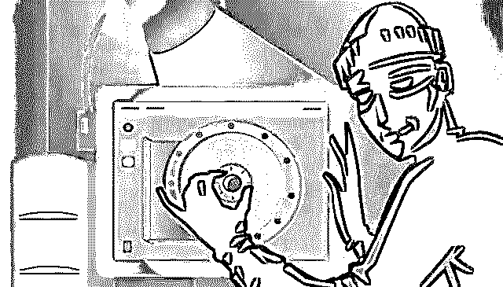

在中国网络通讯行业发展繁荣的今天，用户隐私数据一直被黑产垂涎，虎视眈眈。

17 年上市刚满一年的瑞智华胜，通过操纵账户进行微博、抖音、公众号等平台的加粉、刷量，年盈利过千万！

而国内电信诈骗则以年均 20%~30%的速度快速增长，因垃圾短信、诈骗信息、信息泄露等造成的财产损失预估 915 亿元，受害网民高达 6.88 亿！

据不完全统计，2017 年我国黑产的从业人员在百万级以上，每年造成的损失达千亿元级规模。

而“黑产”的发源，地下黑市的猖狂，背后其实也有业界自身的推波助澜，任其兴风作浪。

某数据公司 CEO 表示，国内数据市场群魔乱舞，一派荒蛮。“我尽量保证数据获取合法，而友商们全都从地下低价购买数据，出售的时候打价格战，我们根本毫无竞争力可言。”

“劣币驱良币”式的行业竞争氛围，让数据违法交易陷入屡禁不止的恶性循环，再次造成更多用户数据信息蒙受损害。

结尾

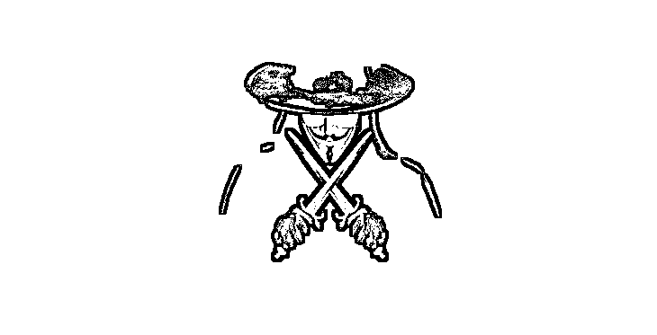

黑产团伙能够被绳之以法，确实为人拍手叫好，但以上描述的个人信息和数据泄露案件，仅仅是揪出了数据行业黑色产业链的冰山一角，还有些公司深藏在利益的暗涌之下，蓄势出动。为了让更多人有所警惕和防备，下面整理了五大法则，仅供大家参考：

*   拥有有夸大、不实成分的中奖信息，掉馅饼式的电话短信，谨记需要核实；

*   需要输入个人信息的红包千万别碰；

*   不随意扫描连接公共场所开放的 wifi 及二维码；

*   各支付平台密码最好不要重复；

*   手机信号中断应及时联系运营商，欠费除外。

作为数据小白的普通用户们，虽然不能与“黑产”正面斗智斗勇，但至少要了解点相关信息，培养信息安全保护意识，防范自身信息被盗。

●[网络黑产如何倒卖个人隐私？](http://mp.weixin.qq.com/s?__biz=MzIyMDYwMTk0Mw==&mid=2247483699&idx=3&sn=fed5285869d3525f7249841558023f49&chksm=97c8ca0ba0bf431da0edb1f00adbbb9119b4245c2387eca133c714c42339c1cc1d52705061f2&scene=21#wechat_redirect)

●[越同意，越放肆！99.9%的 App 正在窃取你的隐私！中国人隐私不值钱？](http://mp.weixin.qq.com/s?__biz=MzIyMDYwMTk0Mw==&mid=2247492844&idx=1&sn=1527f27b182845af79c5d46fc58755b9&chksm=97cb2fd4a0bca6c205dc4c8b6ce28a1570edcec0ace210cc4e542bacf55b2f27e221a97b478e&scene=21#wechat_redirect)

●[个人隐私交易黑市大起底：是谁在盗贩公民信息？](http://mp.weixin.qq.com/s?__biz=MzIyMDYwMTk0Mw==&mid=2247492647&idx=1&sn=07b195ad56c8bb4c466c1ff6f3ee64d9&chksm=97cb2f1fa0bca609fe8344d8f16ed9d7fa417bbcfc3eed420d8d8ed3261c84ca5b227a665ab4&scene=21#wechat_redirect)

●[19 元，35 位女性私照曝光：你的隐私，正在被人窥探！](http://mp.weixin.qq.com/s?__biz=MzIyMDYwMTk0Mw==&mid=2247494192&idx=1&sn=32cf1136aa68c50e55da3872d87c539f&chksm=97cb2108a0bca81e8ecbe034377b002f539db6963fb71bca0b0acff1aed6ee9332470e108806&scene=21#wechat_redirect)

   

**点击加入 ****灰产圈 | 高端社群**