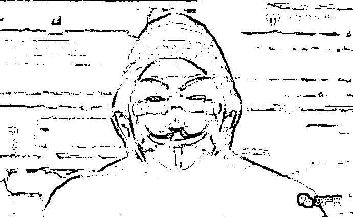
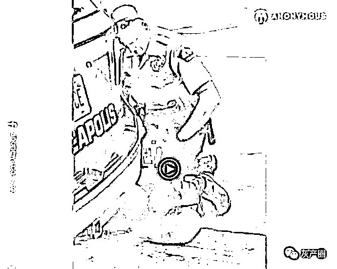

# 特朗普“危”！黑客组织“匿名者”揭露其贩卖儿童，还涉嫌强奸？

> 原文：[`mp.weixin.qq.com/s?__biz=MzIyMDYwMTk0Mw==&mid=2247499257&idx=1&sn=a86b5c54e8c34fe593452c96b53b7163&chksm=97cb36c1a0bcbfd7f1d02aa65f2c2a655d138bad64ed94e81d6d4208df3dd8b0b9940c00a414&scene=27#wechat_redirect`](http://mp.weixin.qq.com/s?__biz=MzIyMDYwMTk0Mw==&mid=2247499257&idx=1&sn=a86b5c54e8c34fe593452c96b53b7163&chksm=97cb36c1a0bcbfd7f1d02aa65f2c2a655d138bad64ed94e81d6d4208df3dd8b0b9940c00a414&scene=27#wechat_redirect)

**点击上方蓝色字体免费订阅“灰产圈”**

> 大家好，我代表 Anonymous 向 Minneapolis 警察局发出如下声明……

这是黑客组织”匿名者”的视频宣言的开头。

5 月 27 日的美国，街道上正拥挤着大量游行的抗议者。由 George Floyd 致死事件（George Floyd 在被捕期间遭白人警察“压颈”超过 8 分钟，最终致死）引发的大规模抗议示威活动，愈演愈烈。

5 月 28 日，赫赫有名的黑客组织“匿名者”正式入局。其在 Facebook 页面上发布了一段视频，公开指责美国警方有“可怕的暴力和腐败记录”。

视频里说到：“George Folyd 因暴力执法丧命，引发了全美的抗议游行活动。但是他的死亡只是冰山一角，还有很多引人注目的相似案件，在过去的二十年，Minnesota 有 193 人被警察杀害。”

聚焦美国警察的暴力行为，黑人的种族暴乱的背景下，据 CNN 报道，至少 16 个州的 25 个城市实施宵禁，约有十几个州动用国民警卫队。而在骚乱最为严重的城市之一洛杉矶，多家商店被抢，警察发射橡皮弹、用警棍驱散示威者，数百人已被逮捕。

与此同时，”匿名者“的视频在 Facebook 上被浏览了数百万次。

[`v.qq.com/iframe/preview.html?width=500&height=375&auto=0&vid=e0975m7be4m`](https://v.qq.com/iframe/preview.html?width=500&height=375&auto=0&vid=e0975m7be4m)

视频里，穿着连帽衫戴着面具的黑客说道：

> 大家好
> 
> 我代表 Anonymous 向 Minneapolis 警察局发出如下声明
> 
> 警察暴力执法是美国社会常见问题
> 
> 影响着美国所有的地区
> 
> Minneapolis 是暴力执法最严重的
> 
> 有严重的暴力执法和贪腐记录
> 
> 本周 George Folyd 因暴力执法丧命
> 
> 引发了全美的抗议游行活动
> 
> 但是他的死亡只是冰山一角
> 
> 还有很多引人注目的相似案件
> 
> 在过去的二十年
> 
> Minnesota 有 193 人被警察杀害
> 
> 近年来
> 
> 此类事件在该区域频发
> 
> 包括 Jamar Clark 、Philando Castile、Justine Damond、Thruman Blevins、Brian Quinones 等人的死亡
> 
> 这些仅仅是登上新闻头条的案件
> 
> 案件中警察被证实说谎
> 
> 但是在绝大多数警察执法致死案件中
> 
> 只有活着的警察可以讲述整个过程
> 
> 循环还在继续，没有一个凶手因为他们的行为被法律严惩
> 
> 这种悲剧持续了太长时间
> 
> 现在人们已经受够了
> 
> 警察执法时无视人类的生命
> 
> 所有的证据显示 Floyd 完全配合警察执法
> 
> 调查显示警察执法过程中存在暴力犯罪
> 
> 对 Floyd 暴力执法的两名警察 Derek Chauvin 和 Tou Thao
> 
> 他们曾遭到工作中过度使用枪支和暴力执法的投诉
> 
> StarTribune 报道称：Chauvin 要对 Floyd 的死负直接责任
> 
> 他工作中多次枪杀嫌疑犯
> 
> 视频中显示，现场四名警察
> 
> 一名负责驱散人群
> 
> 三名负责控制 Floyd
> 
> 围观者曾警告警察 Floyd 快死了
> 
> 但是现场警察对 Floyd 的情况漠不关心
> 
> 你可能会解雇这些警察来挽回颜面
> 
> 并宽恕警察此类行为
> 
> 如果不是警察内部或其他执法部门的鼓励
> 
> 但是警察如果杀人或者犯罪应也应当追究责任
> 
> 否则，他们会为所欲为
> 
> 你可能会说他们只是害群之马
> 
> 那些在发生暴力执法时袖手旁观的警察呢？
> 
> 还有和你们一样不起诉这些罪犯的警局呢？
> 
> 他们也是他们曾宣誓保护公民中的一员
> 
> 我们受够了被这样一个充满暴力和腐败的组织保护
> 
> 通过这些年来的各种事件
> 
> 越来越多的人认识到他们不是来保护我们的
> 
> 相反
> 
> 你们是来压迫我们，完成统治阶级罪犯的意志
> 
> 为统治阶级维持秩序
> 
> 而不为被统治者提供保护
> 
> 事实上
> 
> 你们是精英阶层用来继续他们全球压迫体系的手段
> 
> 这个世界终于意识到了这一点
> 
> 每一次看到无辜人的鲜血，人们越来越愤怒
> 
> 这些警察必须面对法律的裁决
> 
> Chauvin 必须面对谋杀指控
> 
> 不幸的是
> 
> 我们不相信你们腐败的组织会带来正义的裁决
> 
> 所以我们会向世界曝光你们的恶行
> 
> 敬请期待

以下为中文翻译版，翻译@Genie 姬妮

[`v.qq.com/iframe/preview.html?width=500&height=375&auto=0&vid=c09745zwc1z`](https://v.qq.com/iframe/preview.html?width=500&height=375&auto=0&vid=c09745zwc1z)

本文作者：kirazhou 来源：FreeBuf.COM

← 向右滑动与灰产圈互动交流 →

**点击****阅读原文****加入灰产圈高端社群**

