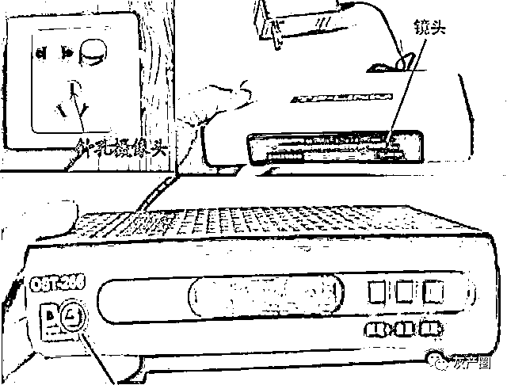

# N 号房事件后韩国 KBS 又曝女厕偷拍，这条黑产链已席卷中日韩三国！

> 原文：[`mp.weixin.qq.com/s?__biz=MzIyMDYwMTk0Mw==&mid=2247499311&idx=1&sn=7ce7ec2a2180d648e6f67e34cb1eb67d&chksm=97cb3517a0bcbc0133b4547b3555bd31263ed4fe1a0d057d1637b6b65868b561d0b425f5c086&scene=27#wechat_redirect`](http://mp.weixin.qq.com/s?__biz=MzIyMDYwMTk0Mw==&mid=2247499311&idx=1&sn=7ce7ec2a2180d648e6f67e34cb1eb67d&chksm=97cb3517a0bcbc0133b4547b3555bd31263ed4fe1a0d057d1637b6b65868b561d0b425f5c086&scene=27#wechat_redirect)

**点击上方蓝色字体免费订阅“灰产圈”**

1

酒店、民宿、出租房、商场卫生间、换衣间、美容院、地铁公交车，所有你可能露出身体隐私部位的场所，都有可能被一个针孔大小的摄像头一秒不落地看着。

它们就像一个个黑洞洞的枪口对你瞄准、射击，你却毫无防备，甚至伤口流血了，你都是最后知道的。

2

近日，韩媒报道 KBS 大楼一位导演向公司报案称“研究楼女洗手间好像有偷拍”，警方随即展开调查，在现场搜出了隐形摄像头。该卫生间位置特殊，为一档综艺的演出人员和女艺人使用。

第二天，嫌疑人 A 主动投案，警方对他进行第一次调查后便让其回家了。相关人士说，为确认事实关系，A 某安装的摄像机等物证要先经过司法鉴定，再决定如何处理嫌犯。

过去几个月，韩国女性的日子太难了。

不久前的 N 号房事件中爆出：2600 万韩国青壮老少男性，有超过 26 万人在观看、分享非法色情视频和照片。

也许和你面对面相谈甚欢的男性好友、彬彬有礼的师长同事，就可能正在高度参与着性犯罪，甚至自己也参与了偷拍淫秽视频图像，在网络上分享。

像李胜利、N 号房博士这样的幕后控制者纵然可怕，但比起他们，最让韩国女性绝望的是在地铁上对着女孩的胸口、裙底的随手一拍、在酒店试衣间里装下隐形摄像头、在各个社交平台传播无成本偷拍资源的普通人。

3

变态的偷拍、性犯罪，一直都是韩国社会的痼疾。

韩国网络性暴力咨询中心负责人徐承熙表示，韩国社会仍存在“性侵文化”，媒体和大众文化默许性暴力，还批评是受害女性不知检点。

韩国强奸犯罪率常年高居世界前几位，被多国政府和媒体描述成“性犯罪频发”的国家。官方数据显示，韩国性犯罪的比例非常高，几个主要城市的性犯罪比例几乎达到全部犯罪案件比例的 70%。

韩国性犯罪如此猖獗，和法律长期未予以相应重视，受害者和愤慨者势单力薄有关。未成年人在这种文化潜移默化的影响下长大，也学会了拿起手机偷拍，他们第一个目标，就是自己的妈妈。

韩国 MBC 曾报道韩国小学生之间流传的一股诡异风潮——“偷拍妈妈”。

妈妈的小腿、内裤、胸口、睡熟时裸露的大腿和臀部，被自己的孩子拍下发到网上，以求出名。

前段时间，中国小学生拍摄的在家中衣衫不整、正在洗澡的妈妈也出现在国内的视频平台上，不论他们是有意还是无意，总之还是妈妈要承受最大的伤害。

4

为什么韩国会这样？是韩国男人太变态吗？其实不止韩国，包括中国和日本在内，这三个文化背景相似的东亚国家，偷拍现象都非常猖獗。

“如果有来生，我希望自己能变成一条路。”一位日本男子这样说着，也这样做了，他躺倒在大街上的下水道里，从凌晨 3 点开始，透过网格状井盖偷窥女孩裙底，同时拍照留念。

几个小时后，他才被人发现。日本的偷拍也和韩国一样不分年龄收入和职业。仅在东京，近几年被警方抓获的男性偷拍者就以年均 20%的速度增长。

最后，是中国。

2014 年央视播出过一期节目叫《谁动了我的隐私》，曝光偷拍产业链。制造偷拍工具、售卖、安装、整理剪辑、传播销售，一条完整的产业链被揪出水面。

任何一个人通过网络就能买到性能良好的针孔摄像头，只要你有电脑，就能随意浏览观看、传播偷拍的图像、视频。

2018 年，北京一位李先生在朋友的推荐下观看了一段酒店性爱视频。“尽兴”了几分钟后李先生突然发现，视频中的男女主角，正是自己和女友。此时，这段视频已经被播放了四万余次。

山东青岛一位房东赵某在卫生间安装摄像头，偷拍女租客洗澡，他数次调整摄像头，确保最佳观看角度，不料调整中自己的面部也被拍到，租客意外发现摄像头后，他才终于被警方抓获。

这样的案例在近几年的新闻报道中屡见不鲜。盗录他人的隐私，很多人觉得没什么，但实际上，它是让每一个人的最为隐晦、最具羞耻感的一面，成为公共的果树，随手可摘，受害者则可能要和伤害共度一生。

5

偷拍犯罪成本极低，网络又把恶的一面数百万倍地扩大，欲望和暴利的双重满足，犯罪绝不亏本。如此社会环境，我们只能警示年轻女性、未成年女孩出门要时时心怀警惕、全副武装吗？这还不够。

男性和女性，两个界限分明的概念和群体，从来都不可分割。当女性的尊严被压抑、隐私安全得不到保障时，男性也无法独善其身。

在韩国，近些年适龄女性的结婚意愿越来越低。

去年韩国统计厅数据显示，20 至 29 岁的韩国人中，未婚率达 91.3%，超过日本的 79.7%，2018 年韩国生育率仅为 0.98，意味着平均每个女性生育的子女数量不到 1 人，这里面有多少女性曾经遭遇，或曾看到亲人、朋友遭遇过偷拍、性犯罪？我们不得而知。

6

也许你会说，偷拍泛滥和相关的性犯罪只是多米诺骨牌阵中的几张，还有更为深刻和难以改变的原因造成那样的结果，但它的恶劣确实让整个社会秩序变得更糟糕了。

**所以，我们必须做点什么了，**

**不论是男人还是女人。**

**因为保护他人，**

**最终也会保护到自己，**

**毕竟，**

**谁也不想看到自己成为被偷拍视频的主角，**

**不是吗？**

**最后，欢迎分享 和 [ 在看 ] ！**

← 向右滑动与灰产圈互动交流 →

**点击****阅读原文****加入灰产圈高端社群**

